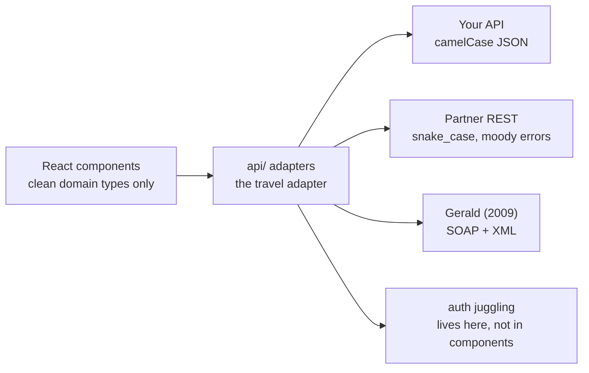
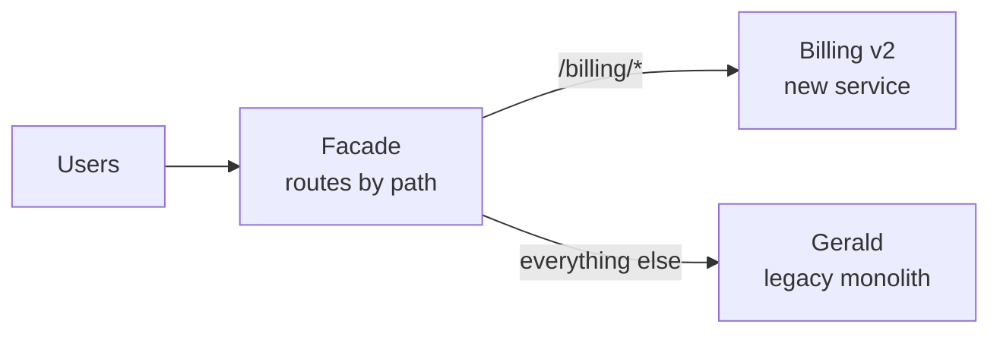

export const meta = {
  slug: 'anti-corruption-layer',
  title: 'Anti-Corruption Layer: Protecting Your Domain',
  tier: 'advanced',
  order: 28,
  summary:
    'The translation boundary between your clean domain and the messy outside world: adapters and translators in DDD, a normalization layer between your React SPA and legacy APIs, and the strangler-fig migration that retires the legacy for good.',
  estimatedMinutes: 15,
  difficulty: 4,
  topics: ['ddd', 'microservices'],
};

## Why this matters

Your React app talks to three backends. Yours: clean camelCase JSON, sensible errors. A
partner's: snake_case, error shapes that change by endpoint, and one route that returns
XML "for historical reasons." And Gerald — the billing server from 2009 that speaks
SOAP, authenticates with a session cookie plus a custom header, and thinks JSON is a
fad.

Without a boundary, Gerald's worldview leaks into your components. Your checkout page
learns what a SOAP fault is. Your profile screen handles snake_case. Then the partner
renames a field and three unrelated screens break — because the outside world's model
was living inside your house the whole time.

The fix is a bouncer at the door: a layer whose entire job is translating the messy
outside into your clean inside. The DDD books call it an **anti-corruption layer**.
This lesson covers both halves: the original backend pattern, and the frontend version
— because your SPA needs one just as badly.

🎥 **Learn more:** [Can an "Anti-Corruption Layer" save your bad software architecture?](https://www.youtube.com/watch?v=_oAYFR-hexg) — Software Developer Diaries. Shows how an ACL keeps a messy legacy system from infecting your clean model.

## The idea, from DDD

In *Domain-Driven Design*, Eric Evans describes the situation every large system hits:
your bounded context has a clean model, and it must talk to another system with a
different model — a legacy monolith, a third-party API, another team's context. If you
let the foreign model in, it corrupts your language, your invariants, your sanity.

The anti-corruption layer sits between the two as a **translation boundary**: a set of
adapters, translators, and facades that convert the other system's concepts into yours
(and back), so your domain never learns the foreign vocabulary. Your code talks to the
ACL in its own language; the ACL does the awkward small talk with the neighbor.
(Bounded contexts get the full treatment in [the domain-driven-design lesson](#/lesson/domain-driven-design) — here we
take the boundary as given and focus on the layer that guards it.)

The analogy for this whole lesson: **the universal travel adapter.** Your devices —
phone, laptop — speak one clean language: USB-C, 5 volts, your domain model. The wall
sockets of the world do not: different prongs, different voltages, and Gerald's socket
sparks a little when you plug in. You don't rewire your laptop for every country. You
carry an adapter, and the adapter absorbs the weirdness. Your components are the
laptop. The ACL is the adapter. Gerald is the socket.

🎥 **Learn more:** [Exposing the not-so-secret practices of the cult of DDD -  Chris Klug - NDC Oslo 2025](https://www.youtube.com/watch?v=A7WcjoMMp7c) — NDC Conferences. An NDC talk unpacking Evans' strategic patterns, ACL included, without the jargon.

## The adapter in a React SPA

Here's the concrete shape. Your app gets an `api/` (or `adapters/`) directory, and a
rule with teeth: **components may never touch raw API responses.** Every external
system gets one adapter module, and every adapter returns only your domain types:

- **snake_case becomes camelCase.** The partner's `user_name` becomes your `userName` —
  once, at the boundary, not in seventeen components.
- **XML becomes typed objects.** Gerald's SOAP envelope gets parsed and validated in one
  place; your checkout sees a `PaymentResult`, not angle brackets.
- **Bizarre auth becomes one token flow.** The session-cookie-plus-custom-header dance
  lives in the adapter; components just call `billing.charge(...)` and get a promise.
- **Moody errors become one AppError.** Five different failure shapes become one error
  type your UI can actually render.

```ts
// api/billing.adapter.ts — the travel adapter for Gerald
import type { PaymentResult } from '../domain/billing';

export async function charge(amountCents: number): Promise<PaymentResult> {
  const soap = await geraldClient.post(buildSoapEnvelope(amountCents)); // XML, cookies, the works
  const parsed = parseSoapFaultsAndAll(soap); // the ugliness lives HERE
  return {
    paymentId: parsed.TransactionID,        // SCREAMING_SNAKE becomes camelCase
    status: mapGeraldStatus(parsed.Status), // Gerald's "OK-7" becomes 'succeeded'
    chargedAt: new Date(parsed.ts),
  };
}
// Components import charge() and PaymentResult — never the SOAP.
```

The mapping, stated plainly: the adapter module is the travel adapter, your domain
types are the laptop's USB-C, and each external API is a country's wall socket. New
country, new adapter — never rewire the laptop.



Watch one request make the trip:

<PacketFlow
  stages={["React component", "ACL adapter"]}
  servers={["Your API", "Partner REST", "Gerald (SOAP/XML)"]}
  requestLabel="GET"
  duration={6}
/>

The dots tell the story: the component speaks one language to the adapter, and the
adapter speaks three dialects downstream. When Gerald changes his envelope format next
quarter, exactly one file cares.

🎥 **Learn more:** [Typescript Design Patterns - Adapter Pattern](https://www.youtube.com/watch?v=YrsEnlkjve8) — Choice Specs. A TypeScript adapter walkthrough — the same translation trick an ACL uses at the boundary.

## The strangler fig: evicting Gerald one floor at a time

Adapters protect you, but they're a holding pattern — you're still paying Gerald's
rent. The endgame is replacing the legacy system without the fabled Big Rewrite, and
Martin Fowler gave the pattern its name: the **strangler fig**. A strangler fig is a
vine that grows around a host tree, gradually taking over until the host can be removed
and the fig stands on its own.

The migration version: put a **facade** (a dumb proxy) in front of the legacy system.
Route everything through it. Then, seam by seam, build new services behind the facade
and flip routes over — one endpoint, one capability at a time — until nothing reaches
the legacy system anymore. Then retire it. The everyday version: renovating a hotel
floor by floor while guests keep sleeping in it. Nobody checks out during construction.

The ACL is what makes the strangling safe: the new services expose your clean model,
and the ACL keeps translating for the legacy routes until each one is strangled. The
adapter you built for Gerald becomes the thing that lets you fire Gerald.

Step through the four stages:

<StepThrough
  title="Strangling Gerald, in four stages"
  nodes={[
    { id: "users", label: "Users", x: 60, y: 150, w: 70 },
    { id: "facade", label: "Facade\n(routes by path)", x: 185, y: 150, w: 110 },
    { id: "gerald", label: "Gerald\nlegacy", x: 330, y: 100, w: 100 },
    { id: "newsvc", label: "Billing v2\nnew service", x: 330, y: 210, w: 110 },
  ]}
  edges={[
    { from: "users", to: "facade" },
    { from: "facade", to: "gerald" },
    { from: "facade", to: "newsvc" },
  ]}
  steps={[
    {
      title: "Facade goes in front",
      caption: "Every request now passes through the facade — a dumb proxy at first. Nothing behaves differently yet, but you've created the seam: one place where routing decisions will live.",
      highlight: ["users", "facade", "gerald"],
    },
    {
      title: "Carve the first seam",
      caption: "Billing v2 goes live behind the facade for /billing/* only. The ACL translates between the new clean model and anything still on Gerald. One endpoint strangled; the hotel's first floor is renovated.",
      highlight: ["facade", "newsvc", "gerald"],
    },
    {
      title: "Strangle steadily",
      caption: "Endpoint by endpoint, capability by capability. Each migration shrinks Gerald and grows the new services — and each is independently reversible, because the facade can route back. No big-bang cutover, no 3 a.m. flag day.",
      highlight: ["facade", "newsvc"],
    },
    {
      title: "Retire Gerald",
      caption: "The last route flips. Gerald is decommissioned, his adapter code deleted, and the facade thins into a normal API layer. The fig stands on its own; the host tree is gone.",
      highlight: ["users", "facade", "newsvc"],
    },
  ]}
/>



Two practical notes. First, strangling takes months, and that's fine — the pattern's
whole point is that value ships at every step, unlike the rewrite that delivers nothing
for a year and then explodes. Second, keep the facade dumb early. The moment it
accumulates business logic, you've built a new monolith inside the proxy — that logic
belongs in the services behind it.

🎥 **Learn more:** [Hans-Peter Grahsl&Gunnar Morling - Dissecting our Legacy: The Strangler Fig Pattern with ...](https://www.youtube.com/watch?v=rl06nAIdIhQ) — Devoxx. Shows the strangler fig pattern in action against a real legacy system.

## Failure modes (read before you build one)

Advanced tier means the sharp edges, so here they are:

**The translation tax.** Every adapter does real work — parsing XML, mapping fields,
juggling auth — and at 10,000 requests per second, "just a little parsing" is a line
item on somebody's capacity plan. Measure it. Cache translated responses where the
source data changes slowly (partner catalog data: yes; payment authorizations:
absolutely not), and keep the hot path's translation boring and fast.

**The dumping ground.** An ACL with no owner becomes the junk drawer: "just put the
hack in the adapter." One adapter per external system, one owner per adapter — and a
rule: if the translation needs business logic, that logic belongs in the domain, not
the adapter.

**The leak.** "Just this once, I'll pass the raw response through." The once becomes a
pattern, and suddenly your components speak Gerald's dialect again. The rule from the
SPA section has teeth for a reason: components import domain types, full stop.

**Two adapters, one truth.** When two ACLs translate the same external concept
differently — the web adapter's `status` and the mobile adapter's `status` disagreeing
— you've corrupted yourself. Share the translation or share the domain type; never
maintain two.

🎥 **Learn more:** [Domain-Driven Design | Modeling Complex Enterprise Business Applications | Uplatz](https://www.youtube.com/watch?v=0j2fXqXq4rk) — Uplatz. Catalogs common DDD implementation mistakes — the overengineering warning to read first.

## Takeaways

1. An anti-corruption layer is a translation boundary: adapters and translators convert
   a foreign system's model into yours, so your domain never learns its vocabulary.
2. In a React SPA, the ACL is an `api/` adapters layer: components import only clean
   domain types; snake_case, XML, and bizarre auth get normalized at the boundary.
3. The strangler-fig pattern retires legacy systems without a big rewrite: facade in
   front, carve seams one endpoint at a time, retire the host when nothing routes to it.
4. The ACL makes strangling safe — new services speak your model while the ACL
   translates for legacy routes — and it shrinks as the legacy dies.
5. Watch the failure modes: measure the translation tax at scale, give every adapter an
   owner, never leak raw responses "just this once," and keep one translation per
   concept.

<Quiz
  lessonSlug="anti-corruption-layer"
  questions={[
    {
      question: "What is an anti-corruption layer?",
      options: [
        "A firewall rule that blocks legacy traffic",
        "A translation boundary that keeps another system's model from leaking into yours",
        "A database migration tool for old schemas",
        "A second cache in front of a slow API",
      ],
      correctIndex: 1,
    },
    {
      question:
        "Your React app consumes a partner API that returns snake_case, inconsistent error shapes, and XML on one endpoint. Where does the lesson put the normalization?",
      options: [
        "In each component, right where the data is used",
        "In the CSS, via naming conventions",
        "Nowhere — components should adapt to each API's native shape",
        "In an adapters layer at the boundary, so components only see clean domain types",
      ],
      correctIndex: 3,
    },
    {
      question: "In a strangler-fig migration, what goes in front of the legacy system first?",
      options: [
        "A facade/proxy that routes requests, so new services can take over seam by seam",
        "A complete rewrite, deployed in one cutover",
        "A second copy of the legacy system for load",
        "A firewall that blocks all legacy traffic",
      ],
      correctIndex: 0,
    },
    {
      question: "What is the failure mode of an ACL that becomes a dumping ground?",
      options: [
        "It gets too fast and starves the backend of work",
        "It automatically rewrites the legacy system",
        "One adapter per external system collapses into a god object nobody owns and everyone fears changing",
        "It encrypts data the domain can no longer read",
      ],
      correctIndex: 2,
    },
    {
      question: "Gerald the billing server finally retires. What happens to the ACL?",
      options: [
        "It must be kept forever as a monument",
        "It shrinks: the translation code for Gerald is deleted and the facade thins into a normal API layer",
        "It gets promoted to handle all frontend state",
        "It is merged into the database schema",
      ],
      correctIndex: 1,
    },
  ]}
/>

---

## Go deeper

Want to keep pulling this thread? These talks and tutorials go further than we did here:

- [The Anti-corruption layer, Gateway Aggregation and Gateway Routing patterns](https://chrisreddington.com/video/anti-corruption-layer-and-gateway-patterns/) — Peter Piper, Architecting for the Cloud, One Pattern at a Time (~10 min). How to translate legacy contracts into clean domain models.
- [The Anti-Corruption Layer — Modernization Series 5/5](https://www.youtube.com/watch?v=CPWOo-_GNJI) — Robert (Aqweeva), YouTube tutorial. Keeping legacy vocabulary from leaking into your domain model.
- [Domain Driven Design: What You Need To Know](https://www.youtube.com/watch?v=4rhzdZIDX_k) — Alex Hyett, YouTube tutorial (~8–10 min). Where the ACL sits inside bounded contexts and context maps.
- [DDD and Microservices: At Last, Some Boundaries!](https://www.youtube.com/watch?v=sFCgXH7DwxM) — Eric Evans, GOTO Berlin 2015, InfoQ (2015). The DDD book's own author walks through anti-corruption layers as "adapters" that translate an external model into your internal domain model — from the person who coined the pattern.

## Sources & further reading

- Eric Evans, *Domain-Driven Design: Tackling Complexity in the Heart of Software* (Addison-Wesley, 2003) — the anti-corruption layer pattern: translation between bounded contexts.
- Vaughn Vernon, *Implementing Domain-Driven Design* (Addison-Wesley, 2013) — implementing ACLs with adapters, translators, and facades in real codebases.
- Martin Fowler, "StranglerFigApplication" (martinfowler.com) — the strangler-fig pattern for incremental legacy replacement.
