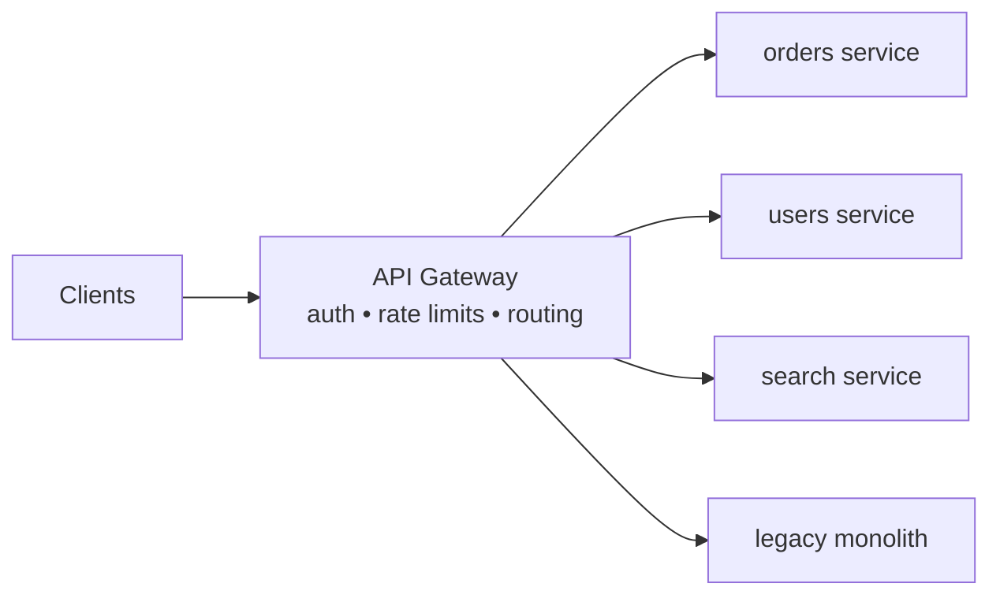
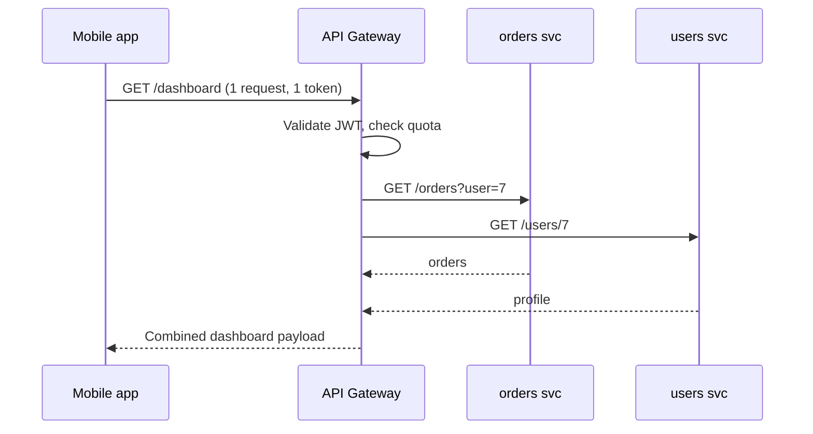
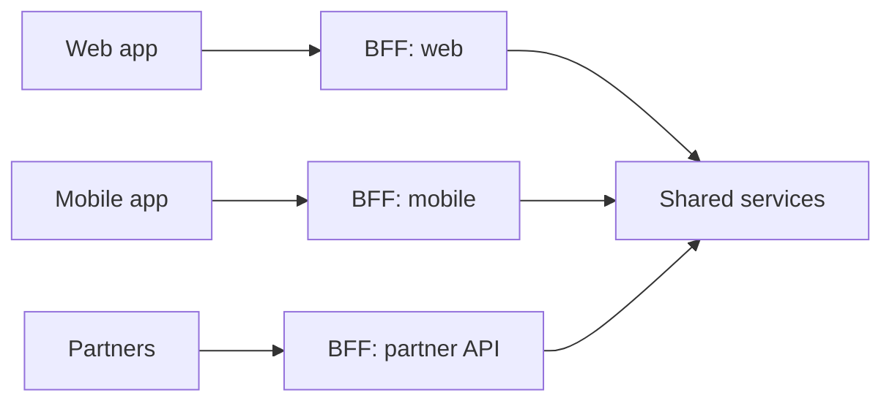

export const meta = {
  slug: 'api-gateways',
  title: 'API Gateways',
  tier: 'intermediate',
  order: 13,
  summary:
    'The front door of your system: routing, authentication, rate limiting, and request shaping — and how gateways differ from plain reverse proxies.',
  estimatedMinutes: 15,
};

## Why this matters

The moment you have more than a couple of services, clients face an annoying question: *who
do I talk to?* Dozens of service addresses, each with its own auth scheme, its own rate
limits, its own quirks. An **API gateway** answers by being the single front door: one
address, one auth story, one place where cross-cutting concerns live. Every request passes
through it; every service behind it stays focused on business logic instead of reinventing
TLS termination for the ninth time.

Think of a **hotel front desk**. Guests don't wander the halls knocking on the kitchen,
housekeeping, and accounting doors. They talk to the concierge, who routes each request to
the right department, verifies who's asking, and handles the boring-but-critical stuff
(keys, billing, wake-up calls). Your API gateway is the concierge; your microservices are
the departments happily ignoring the lobby chaos.

## Gateway vs. reverse proxy vs. load balancer

These get conflated constantly, so let's be precise:

- **Load balancer** — distributes traffic across instances of the *same* service. (See
  *Load Balancers*.)
- **Reverse proxy** — forwards requests to backends, terminates TLS, maybe caches. One
  step up: it can route by path, but it's fundamentally a traffic cop.
- **API gateway** — a reverse proxy with opinions: authentication, rate limiting, request
  transformation, API composition, and observability, usually configured per-route or
  per-API. **Kong**, **AWS API Gateway**, **Apigee**, and **Envoy**-based setups live here.

The line is blurry — a reverse proxy with enough plugins *becomes* a gateway — but the
intent differs: a gateway owns the **API contract** with the outside world.

## What lives in the gateway

**Authentication & authorization.** The gateway validates tokens (JWTs, API keys, OAuth
flows) once, then forwards the request with the caller's identity attached — often as
headers the inner services trust. Your eleven microservices never each implement "is this
token expired" again. (Famous last words, but it's the goal.)

**Rate limiting & quotas.** Per-API-key or per-user throttles live naturally here — it's
the one place that sees *all* traffic. Stripe-style tiered quotas ("10,000 requests/day on
the free tier") are a gateway config, not application code. (See *Rate Limiting* for the
algorithms.)

**Request shaping.** The gateway translates between the outside world's needs and your
services' reality: REST in, gRPC out; aggregating three service calls into one client
response (reducing chatty mobile round trips); stripping internal fields you never meant to
expose. (That last one has caused real CVEs. The gateway is your last line of defense
against accidentally serializing `is_admin`.)

**Observability.** One choke point means one place to log every request, measure latency
percentiles, and trace calls across services. When the 3 AM page arrives, the gateway's
dashboards are where you start.

## The BFF pattern

One gateway rarely fits all clients. A mobile app wants tiny, aggregated payloads; a web
app wants something richer; partner integrations want stability above all. The **Backend
for Frontend (BFF)** pattern gives each client type its own gateway layer, each optimized
for that client's needs — all fronting the same services. It's more gateways to run, but
each one is simpler and changes for the right reasons.

## The honest trade-offs

A gateway is a **single point of control** and therefore a **single point of failure**.
If it goes down, everything behind it is unreachable — so it must be deployed redundantly
across zones, with health checks and fast failover. It also adds latency (one more hop,
usually single-digit milliseconds) and can become a **bottleneck of ownership**: when every
team needs a route change and one platform team owns the gateway config, you've built a very
expensive ticket queue. Good gateway platforms solve this with self-service config and
GitOps workflows.

There's also a philosophical split: **centralized gateways** (one team, one config) vs.
**sidecar/decentralized** approaches where each service owns its edge via something like
Envoy. Large orgs often end up with both — a thin edge gateway for auth and DDoS
protection, plus per-service sidecars for fine-grained policy.

## Takeaways

1. A gateway is the single front door: one address, one auth story, one home for cross-cutting concerns.
2. Auth, rate limiting, request shaping, and observability belong in the gateway — not reimplemented in every service.
3. The BFF pattern tailors the edge per client type instead of forcing one contract on everyone.
4. It's a single point of failure and a potential ownership bottleneck — deploy it redundantly and make its config self-service.

<Quiz
  lessonSlug="api-gateways"
  questions={[
    {
      question: "How does an API gateway differ from a plain load balancer?",
      options: [
        "A gateway only works with HTTP/2",
        "A load balancer distributes traffic across instances of the same service; a gateway routes between different services and adds auth, rate limiting, and request shaping",
        "A gateway replaces the need for DNS",
        "There is no difference — the terms are interchangeable",
      ],
      correctIndex: 1,
    },
    {
      question: "In the gateway pattern, where is a client's JWT typically validated?",
      options: [
        "In each microservice independently",
        "Once at the gateway, which forwards the caller's identity to inner services",
        "In the database, via a stored procedure",
        "By the client itself before sending the request",
      ],
      correctIndex: 1,
    },
    {
      question: "What is the BFF (Backend for Frontend) pattern?",
      options: [
        "A testing strategy where backends test frontends",
        "Giving each client type (web, mobile, partners) its own tailored gateway layer over shared services",
        "Running the backend and frontend in the same process",
        "A database replication strategy",
      ],
      correctIndex: 1,
    },
    {
      question: "What is the main availability risk of an API gateway?",
      options: [
        "It makes individual services slower to deploy",
        "It is a single point of failure — if it goes down, everything behind it is unreachable",
        "It prevents the use of caching",
        "It forces all services to use the same programming language",
      ],
      correctIndex: 1,
    },
  ]}
/>

---

## Sources & further reading

- Phil Calçado, "Pattern: Backends For Frontends" (SoundCloud / ThoughtWorks, 2015) — the original BFF write-up.
- Kong documentation, "What is an API gateway?" — gateway vs. proxy vs. load balancer distinctions.
- AWS documentation, "Amazon API Gateway" — throttling, usage plans, and request/response mapping in practice.
- Envoy proxy documentation — the data-plane powering many modern gateway architectures.
