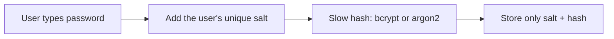
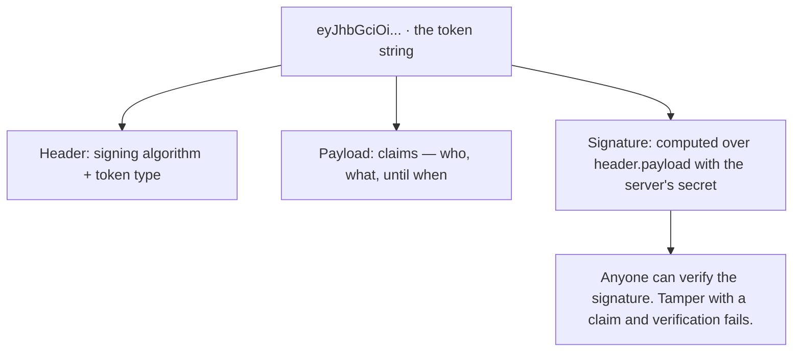
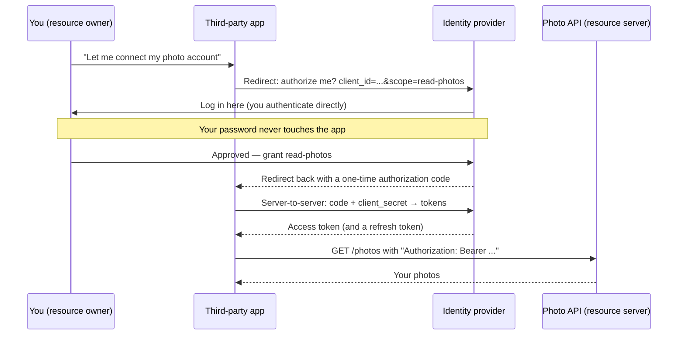
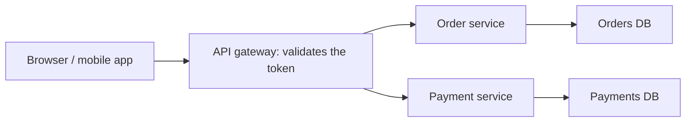

export const meta = {
  slug: 'authn-authz',
  title: 'AuthN & AuthZ: Who Are You, What Can You Do?',
  tier: 'intermediate',
  order: 8,
  summary:
    'From passwords to JWTs to OAuth2 — how systems verify who you are (authentication) and decide what you are allowed to do (authorization).',
  estimatedMinutes: 16,
};

## Why this matters

Sooner or later you will design an API that someone else's app calls on behalf of a user —
"log in with your account," a dashboard pulling from three services, a mobile app hitting
your backend. The moment identity crosses a network boundary, two questions start following
every request around: *who is this?* and *are they allowed to do that?* Get the first one
wrong and strangers walk in. Get the second one wrong and a logged-in user reads someone
else's invoices. Both mistakes show up in breach headlines, and both are avoidable once you
see the shape of the problem.

## One concert venue, two jobs

This lesson's running analogy: a big concert venue. Getting inside takes two separate
operations, run by two different crews, and confusing them is the root of half the auth bugs
you'll ever see.

**Authentication (authN) is the ID check at the door.** "Who are you?" The bouncer looks at
your ticket, your photo ID, maybe your face — and decides whether you are really the person
the ticket says you are. That's it. The bouncer doesn't care which stage you want to see.
AuthN answers one question: *are you who you claim to be?*

**Authorization (authZ) is the wristband system.** Once you're in, a different crew looks at
your wristband and decides where you're allowed to go: general admission stays on the lawn,
VIP gets the front section, and the laminated "ALL ACCESS" badge gets backstage. The
wristband crew doesn't re-check your ID — they trust the door did its job. AuthZ answers a
different question: *now that we know who you are, what are you allowed to do?*

Say the mapping out loud, because interviewers love it: the ID check at the door is
authentication, the wristband zones are authorization. A valid ticket (authN) never implied
backstage access (authZ). When a system checks your login and then lets you read another
tenant's data, somebody skipped the wristband crew.

## Passwords: store them like you expect a breach

Every auth story starts the same way: a user hands you a secret — a password — and you have
to verify it later without keeping a copy lying around. Because you should plan for the day
someone steals your database. (They steal databases the way concert venues lose wristbands:
constantly, and usually quietly.)

So the rule is absolute: **never store passwords in plaintext.** If a breach leaks your user
table, plaintext passwords hand the attacker every user's credentials — including the ones
people reused on their bank accounts. Instead you store a one-way *hash* of the password,
salted per user:

- A **salt** is a random value, unique per user, mixed into the password before hashing. It
  defeats rainbow tables — precomputed dictionaries of common passwords — because the
  attacker would need a separate table for every salt. Store the salt next to the hash;
  it's not a secret, it's a fingerprint.
- Use a password-hashing algorithm that's deliberately *slow*: **bcrypt** or **argon2**.
  Normal hashes (SHA-256) are built for speed — a GPU can try billions of guesses per
  second. bcrypt has an adjustable cost factor, and argon2 (the winner of the 2015 Password
  Hashing Competition) is also *memory-hard*, which makes custom cracking hardware much less
  effective. Slowness is the feature: a login taking 200 milliseconds is invisible to a
  human and brutal to a brute-force attack.

The practical recipe, the one OWASP's cheat sheet endorses: on signup, generate a random
salt, hash `salt + password` with argon2id (or bcrypt with a cost factor around 10–12),
store both. On login, re-hash what the user typed with the stored salt and compare. If the
hashes match, the bouncer nods them through. You never learn the password, and neither does
anyone who steals your disk.

## Sessions vs tokens: two ways to remember a face

Once the bouncer has checked the ID, how does the venue remember you for the rest of the
night? There are two classic answers, and the trade-off between them is one of those
intermediate-level judgments that keeps showing up in real systems.

<VsToggle
  title="Sessions vs tokens: how the venue remembers you"
  a={{
    label: "Sessions",
    title: "The venue keeps a guest list",
    points: [
      "After login, the server creates a session record and hands the browser an opaque session ID in a cookie",
      "Every request: look the ID up in the session store (usually Redis) — one extra lookup per request",
      "Revoking access is trivial: delete the session row and the cookie stops working",
      "The store becomes shared state — it has to be fast, replicated, and sized for your traffic",
    ],
    note: "Stateful, revocable, and simple — the default for classic server-rendered apps.",
  }}
  b={{
    label: "Tokens (JWT)",
    title: "You carry your own stamp",
    points: [
      "After login, the server signs a token (a JWT) and hands it to the client — no server-side record",
      "Every request: verify the signature locally, no store lookup — horizontally scalable by default",
      "Revoking access is the hard part: the token is valid until it expires, no matter what you do",
      "Tokens are bigger than session IDs and ride along on every request — keep them small",
    ],
    note: "Stateless and scalable — the default for APIs and mobile apps. Expiry is your revocation plan.",
  }}
/>

The trade-off is honest, not ideological: sessions buy you easy revocation at the cost of a
lookup and shared state; tokens buy you stateless scale at the cost of "you can't take back
a stamp." In practice, most token systems split the difference with **short-lived access
tokens** (minutes) plus **long-lived refresh tokens** the client trades in for new ones.
Kill the refresh token and the access token dies on its own within minutes. It's the
wristband that dissolves at midnight — the venue doesn't need a guest list if every pass
self-destructs.

## JWT: a stamped hand, in three parts

A JSON Web Token is just the stamped-hand idea written in JSON. Three base64url-encoded
chunks, joined by dots:

The payload carries **claims** — small assertions like `sub` (the subject: user 42),
`exp` (expiry timestamp), `iat` (issued at), `iss` (issuer), `aud` (audience). The
signature (say, HMAC-SHA256 of `header.payload` with a secret only the server knows) is
what makes it trustworthy: the server re-computes the signature on every request, and if a
single character was changed, it won't match.

Two things about JWTs bite people again and again:

1. **Signed is not encrypted.** Anyone who holds the token can base64-decode the payload
   and read it. Never put secrets, passwords, or anything sensitive in the claims. (The
   stamp is visible to everyone; it just can't be forged.)
2. **Verification is only as good as your key hygiene.** If the signing secret leaks, the
   attacker can mint their own valid tokens. Rotate secrets, and for tokens that cross
   organizational boundaries prefer asymmetric signing (RS256): the issuer signs with a
   private key, and verifiers only need the public one.

This is the spec to know by name: RFC 7519 defines the JWT format, and you'll see its claim
names (`exp`, `sub`, `aud`) in half the auth libraries you ever touch.

## OAuth2: letting someone in without handing over the keys

Now the harder problem: a user wants a *third-party app* to act on their behalf — "let this
photo-printing app read my cloud photos" — without giving the app their password. OAuth 2.0
(RFC 6749) is the protocol the entire internet settled on for exactly this. Here's the
flow that matters, the **authorization code flow**, in venue terms: you tell the door your
friend is allowed in; the door hands your friend a one-time claim ticket; your friend trades
the ticket at the office — staff-only, behind the scenes — for a wristband.

Why the two-step dance with the code? Because the access token is the valuable thing, and
the code crosses through the browser — the noisy front channel. The code is short-lived,
single-use, and worthless on its own. The actual exchange happens **server-to-server**,
where the app proves its identity with a `client_secret` the browser never sees. Stealing
the code gets you nothing; you still need the secret and the back channel.

Two practical notes you'll need in real work:

- **Scopes** are the wristband zones of OAuth2: `read-photos` vs `write-photos` vs
  `delete-everything`. Ask for the minimum your app needs — users notice, and so do
  security reviewers.
- **PKCE** (pronounced "pixie") is the modern fix for apps that can't keep a secret — mobile
  and single-page apps. The app generates a one-time secret per login attempt and proves
  possession of it during the code exchange. If you're building a public client, PKCE isn't
  optional anymore.

## OIDC: OAuth2 learns to answer "who are you?"

Strictly speaking, OAuth2 is an *authorization* framework: it hands out wristbands, but it
never formally answers "who's wearing this one?" OpenID Connect (OIDC) is a thin identity
layer on top of OAuth2 that fixes that. After the authorization code flow, the identity
provider also returns an **ID token** — a JWT whose claims describe the user (`sub`, name,
email). "Log in with your account" buttons are OIDC under the hood: OAuth2 got the app
permission, OIDC told the app who granted it. One protocol for the wristband, one claim set
for the ID check — the venue analogy holds all the way down.

## RBAC vs ABAC: who gets which wristband

Once identity is settled, somebody has to run the wristband crew. The two standard models:

- **RBAC (role-based access control):** permissions attach to *roles*, users get roles.
  Staff, VIP, General Admission. GitHub's repo roles (admin / write / read) are textbook
  RBAC: easy to audit, easy to explain, and occasionally too coarse — "VIP" either gets
  backstage or it doesn't.
- **ABAC (attribute-based access control):** permissions attach to *policies over
  attributes* of the user, the resource, and the environment. "Anyone with
  department=finance AND clearance≥2, on a company device, during business hours, may read
  this report." AWS IAM policies are ABAC in spirit. Far more expressive — and far easier
  to misconfigure into a policy nobody can fully audit.

The honest intermediate take: start with RBAC — roles are the wristbands everyone
understands. Reach for ABAC when "VIP or not" stops being expressive enough, and accept
that you're trading simplicity for a policy engine you'll need to test like code. Because
it *is* code.

## Where auth lives when you have fifty services

In a microservices world, you don't want every service re-checking IDs at its own little
door — fifty bouncers, fifty chances to get it wrong. The standard shape is to check once,
at the edge:

The **API gateway** terminates auth: it validates the JWT (signature, expiry, audience),
rejects bad tokens with a 401, and forwards the request downstream with the caller's
identity attached — typically as headers or a signed internal token carrying the claims.
Downstream services then do *authorization*: the order service checks the wristband claims
("is this user allowed to read order 42?") without re-validating the signature. AuthN once
at the edge, authZ everywhere, each service owning its own wristband rules.

One caveat worth its weight: never trust identity claims that arrive from the *client*
directly — only the ones your gateway validated and stamped. A service that accepts a
`X-User-Is-Admin: true` header from the open internet has fired its bouncer and hired a
sign that says "admins this way."

## Takeaways

1. Authentication answers *who are you?* (the ID check at the door); authorization answers
   *what may you do?* (the wristband zones). A valid identity never implies permission.
2. Never store plaintext passwords. Salt each one, hash it with a deliberately slow
   algorithm — bcrypt or argon2 — and plan as if your database will leak.
3. Sessions are stateful and easy to revoke; JWTs are stateless and easy to scale, but
   revocation is the hard part. Short-lived access tokens plus refresh tokens split the
   difference.
4. A JWT is header, payload, and signature — signed, not encrypted. Verify the signature
   every time, keep secrets out of the claims, and guard the signing keys.
5. OAuth2's authorization code flow keeps the valuable tokens on a server-to-server back
   channel; OIDC adds an ID token so the app also learns *who* logged in. Ask for minimal
   scopes, use PKCE for public clients.
6. Start with RBAC; reach for ABAC when roles stop being expressive enough. Check authN
   once at the API gateway, enforce authZ in every service — and never trust a claim the
   client handed you itself.

<Quiz
  lessonSlug="authn-authz"
  questions={[
    {
      question: "In the concert-venue analogy, checking a guest's photo ID at the door is an example of...",
      options: [
        "Authorization — it decides which stage they may visit",
        "Encryption — it scrambles their identity for privacy",
        "Authentication — it verifies they are who they claim to be",
        "Auditing — it records their visit for later review",
      ],
      correctIndex: 2,
    },
    {
      question: "Why is revoking access harder with JWTs than with server-side sessions?",
      options: [
        "There is no central record to delete — a signed token stays valid until it expires",
        "JWT signatures cannot be recomputed after login",
        "Session cookies are encrypted but JWTs are not",
        "JWTs are stored in the database, which is slower to update",
      ],
      correctIndex: 0,
    },
    {
      question: "In the OAuth2 authorization code flow, what does the third-party app exchange — server-to-server, with its client secret — to get the access token?",
      options: [
        "The user's password",
        "The ID token from OpenID Connect",
        "A refresh token it generated itself",
        "The short-lived, single-use authorization code",
      ],
      correctIndex: 3,
    },
    {
      question: "Your system needs a rule like 'finance staff may read this report only on company devices during business hours.' Which access model fits best?",
      options: [
        "RBAC — assign everyone a finance role and be done",
        "ABAC — the decision depends on attributes of the user, device, and environment",
        "OAuth2 scopes — they already cover time-of-day restrictions",
        "Password salting — it protects the report at rest",
      ],
      correctIndex: 1,
    },
  ]}
/>

---

## Sources & further reading

- RFC 7519, "JSON Web Token (JWT)," IETF, May 2015 — the token format: header, payload, signature, and registered claims.
- RFC 6749, "The OAuth 2.0 Authorization Framework," IETF, October 2012 — authorization code flow, scopes, tokens, and refresh tokens.
- OpenID Foundation, "OpenID Connect Core 1.0," 2014 — the identity layer on OAuth2: ID tokens and the `sub` claim.
- OWASP, "Authentication Cheat Sheet," OWASP Cheat Sheet Series — password storage, session management, and credential hygiene in practice.
