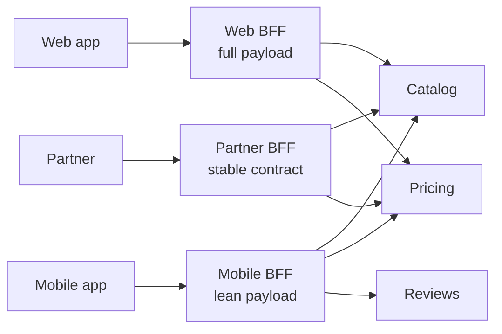
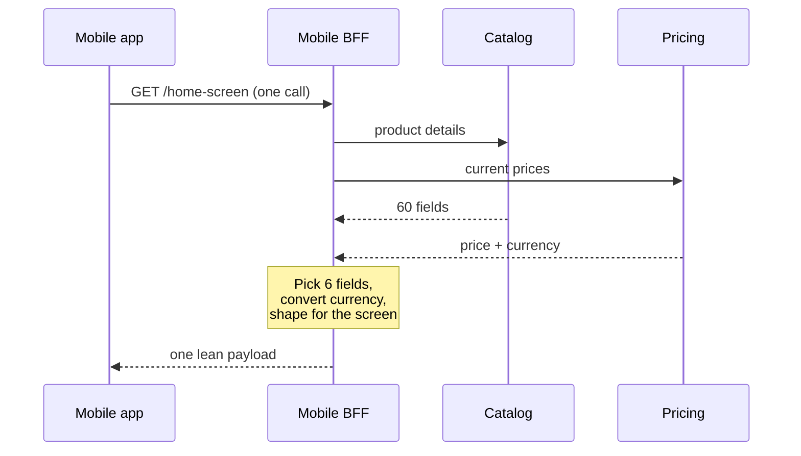

export const meta = {
  slug: 'bff-backend-for-frontend',
  title: 'BFF: One API Per Client',
  tier: 'intermediate',
  order: 16,
  summary:
    "Why one generic API fails web, mobile, and partners differently — and how a backend-for-frontend per client type fixes payload size, chattiness, and release coupling, plus the sprawl pitfalls to avoid.",
  estimatedMinutes: 12,
};

## Why this matters

Your web team ships a dashboard that needs forty fields. Your mobile team needs six
fields over a shaky 3G connection. Your partner's integration needs a rock-stable
contract that never changes. All three hit the same `/api/everything` endpoint —
and somebody's experience is suffering right now. The backend-for-frontend pattern
is the industry's answer: stop serving every client from one generic API, and give
each client type a backend shaped exactly for it.

## The hotel concierge

This lesson's running analogy: a grand hotel with three kinds of guests. The
**business traveler** wants everything in one envelope, fast, before her taxi
leaves. The **family** wants the full brochure — pool hours, kids' menus, all of
it. The **travel agent** wants a contract that never, ever changes wording. One
concierge desk can't serve all three well, so the hotel puts a **concierge on each
floor**, trained for that floor's guests. Every concierge calls the same hotel
services — kitchen, housekeeping, spa — but each packages the answers in the shape
their guests need.

Mapping, stated plainly:

- Each **concierge** is a **BFF** — a backend owned by one frontend team, serving
  one client type.
- The **hotel services** (kitchen, housekeeping, spa) are your **downstream
  microservices** — catalog, pricing, reviews, identity.
- The **guests** are your clients: web app, mobile app, third-party partners.
- The **one-desk-fits-all lobby** is the generic API this pattern replaces.

## Why one generic API fails three clients

The lobby desk starts innocent: one API, every client calls it, no duplication.
Then the clients' needs diverge, and the single API gets pulled in three
directions at once:

**Payload size.** The mobile app shows six fields on a phone screen; the endpoint
returns sixty "just in case." On a flaky connection, every extra kilobyte is
battery, parse time, and a user staring at a spinner. The web dashboard genuinely
wants all sixty. One payload can't be both lean and complete.

**Screen real estate.** A desktop shows forty rows with filters; a watch shows
three. The API that returns "everything, you figure it out" pushes presentation
work onto the weakest device — the one least able to afford it.

**Network conditions.** The web app sits on office Wi-Fi and can afford eight
chatty round trips to assemble a page. The mobile app on a subway can't. An API
designed for chatty composition punishes the client with the worst network —
exactly backwards.

**Release coupling.** The web team needs a new field *today*; the backend team
ships monthly. Worse: the web team wants to *delete* a field, but Android v3.2
still reads it, so the field lives forever. Every client becomes a veto on every
change. SoundCloud hit this wall with a monolithic mobile API that blocked three
platform teams — it's why Phil Calçado named the pattern in the first place.

The lobby desk ends up as a 400-dish menu where nobody can remove a dish because
*someone* might still order it.

## The pattern: a concierge per floor

A **backend for frontend** is a thin server-side layer per client type — a web
BFF, a mobile BFF, a partner BFF — each owned by the frontend team that consumes
it. The BFF's job is aggregation and translation: it fans out to the downstream
services, then collapses their responses into **one screen-shaped payload** the
client can render without further calls.



Notice what's shared and what isn't. The downstream services stay generic and
reusable — the kitchen still just cooks. The per-client shaping lives in the
BFF layer, where the team that feels the pain owns the code. The mobile team
adds a field to *their* BFF on Tuesday without asking the backend team for a
release train. That ownership flip is the real point: as Calçado put it, the BFF
isn't an API *used by* the application — it's *part of* the application.

Watch the mobile concierge work a single request:

<PacketFlow
  stages={["Mobile app", "Mobile BFF"]}
  servers={["Catalog", "Pricing", "Reviews"]}
  requestLabel="GET"
  duration={5}
/>

One call leaves the phone. The BFF fans out to three services in the datacenter
— where bandwidth is free and latency is microseconds — then hands the phone one
lean, screen-shaped response. The chattiness moved to where chattiness is cheap.

Here's the same idea as a conversation:



Compare the two shapes of the world:

<VsToggle
  title="One generic API vs a BFF per client"
  a={{
    label: "Generic API",
    title: "One lobby desk for every guest",
    points: [
      "Single contract: every client gets the same 60-field payload",
      "Mobile pays for data it never shows; web waits on fields it needs now",
      "Any field change needs every client's sign-off — releases couple together",
    ],
    note: "Simple on day one. A 400-dish menu by year two.",
  }}
  b={{
    label: "Per-client BFF",
    title: "A concierge on each floor",
    points: [
      "Each client gets a payload shaped for its screen and network",
      "The mobile team ships BFF changes without waiting on the backend team",
      "Downstream services stay generic; per-client quirks live in the BFF",
    ],
    note: "More services to run — the price of the pattern.",
  }}
/>

## Where BFFs sit

A BFF is not an API gateway and it's not a microservice. The gateway (there's a
whole lesson on API gateways) handles cross-cutting concerns for *everyone*:
auth, rate limiting, TLS termination. The BFF sits *behind* the gateway and
*in front of* the domain services, and it knows things a gateway never should —
what the home screen looks like, which six fields the phone needs, how prices
get formatted for this client.

```
client → API gateway (auth, rate limits) → BFF (shaping, aggregation) → domain services
```

Keep that layering honest and the architecture stays legible: the gateway
protects, the BFF translates, the services compute.

## Pitfalls: when the concierge starts running the hotel

The pattern works — and then, if you're not watching, it works a little too
well. Three classic failure modes:

**BFF sprawl: N concierges become N hotels.** You start with a mobile BFF. Then
a web BFF, a partner BFF, a smart-TV BFF, a watch BFF. Each one quietly grows
its own copy of the same logic — five slightly different implementations of
"get the user profile." SoundCloud lived this: with about five BFFs in
production, the duplicated profile-fetching was the smell that told them a
`UserProfileService` was missing from their domain model. The fix isn't fewer
BFFs; it's noticing when duplication across BFFs means a shared concept belongs
*downstream*, in a real service, instead of being copy-pasted across five
concierges.

**Business logic leaks into the BFF.** This is the big one. The concierge's job
is translation and aggregation — not deciding the menu. The day your mobile BFF
starts computing discount eligibility or enforcing refund policy, you've built a
second, hidden business-logic layer that no domain expert reviews and every
other BFF will eventually contradict. Rule of thumb: if the logic would need to
be identical in two BFFs, it doesn't belong in either — push it down into the
domain service and let the BFFs call it.

**Ownership confusion.** A BFF owned by the frontend team that uses it thrives;
a BFF owned by *nobody in particular* rots. The pattern only delivers its
release-independence payoff when the team feeling the pain can change the code.
If your mobile BFF requires a ticket to the platform team and a two-week wait,
you've rebuilt the lobby desk with extra steps.

## Takeaways

1. **One generic API fails clients differently:** mobile drowns in payload it
   can't show, chatty composition punishes the worst network, and shared fields
   couple every client's releases together.
2. **A BFF is a thin backend per client type** — web BFF, mobile BFF, partner
   BFF — that fans out to downstream services and returns one screen-shaped
   payload.
3. **Ownership is the point.** The BFF belongs to the frontend team that
   consumes it, so that team ships UI-driven API changes without waiting on a
   backend release train.
4. **BFFs sit behind the gateway, in front of domain services.** The gateway
   protects, the BFF translates, the services compute — keep the layering
   honest.
5. **Watch for sprawl, leaks, and orphans.** Duplicated logic across BFFs
   belongs downstream as a real service; business rules belong in domain
   services, never in the BFF; and a BFF nobody owns is the lobby desk with
   extra steps.

<Quiz
  lessonSlug="bff-backend-for-frontend"
  questions={[
    {
      question:
        "Your mobile app calls an endpoint that returns 60 fields, but the screen shows 6. What's the core problem the BFF pattern solves here?",
      options: [
        "The database is too slow at returning 60 fields",
        "The phone downloads, parses, and pays battery for 54 fields it never shows — a generic payload shaped for nobody in particular",
        "The API needs more fields, not fewer",
        "The mobile app should cache the extra fields for later",
      ],
      correctIndex: 1,
    },
    {
      question:
        "The web team wants to add a field to their screens today, but the backend team ships monthly. How does a web BFF help?",
      options: [
        "The web team owns their BFF, so they can add the field to their own layer immediately and fan out to existing services",
        "It doesn't — BFFs still require backend team approval for every change",
        "It forces the backend team to ship weekly instead",
        "It removes the need for the downstream services entirely",
      ],
      correctIndex: 0,
    },
    {
      question: "Where does a BFF sit in the request path?",
      options: [
        "In front of the API gateway, handling TLS termination for all clients",
        "Inside the database, as a stored procedure",
        "On the client device, as part of the mobile SDK",
        "Behind the API gateway and in front of the domain services — translating and aggregating between them",
      ],
      correctIndex: 3,
    },
    {
      question:
        "Your mobile BFF and web BFF both implement discount-eligibility rules, and they've started disagreeing. What went wrong, and what's the fix?",
      options: [
        "BFF sprawl — delete one of the BFFs",
        "The gateway is misconfigured; add rate limiting",
        "Business logic leaked into the BFF layer; move the rules down into a shared domain service that both BFFs call",
        "Nothing went wrong — BFFs are supposed to each own business rules",
      ],
      correctIndex: 2,
    },
    {
      question:
        "SoundCloud ran about five BFFs and found the same user-profile fetching logic duplicated across all of them. What did that duplication signal?",
      options: [
        "A missing domain concept — the fix was a shared UserProfileService downstream, not more copies in the BFFs",
        "That they needed even more BFFs to spread the load",
        "That BFFs should never share any code",
        "That the BFF pattern had failed and they should return to one generic API",
      ],
      correctIndex: 0,
    },
  ]}
/>

---

## Sources & further reading

- Phil Calçado, "The Back-end for Front-end Pattern (BFF)" (philcalcado.com, 2015) — the original pattern write-up from SoundCloud: one backend per user experience, and the discovery that the BFF is part of the application.
- Sam Newman, *Building Microservices* (O'Reilly, 2015) — the BFF as a dedicated aggregation layer per client, distinct from the general-purpose API gateway.
- ThoughtWorks Technology Radar — the BFF pattern's assessment as a technique for decoupling frontend teams from shared backends.
