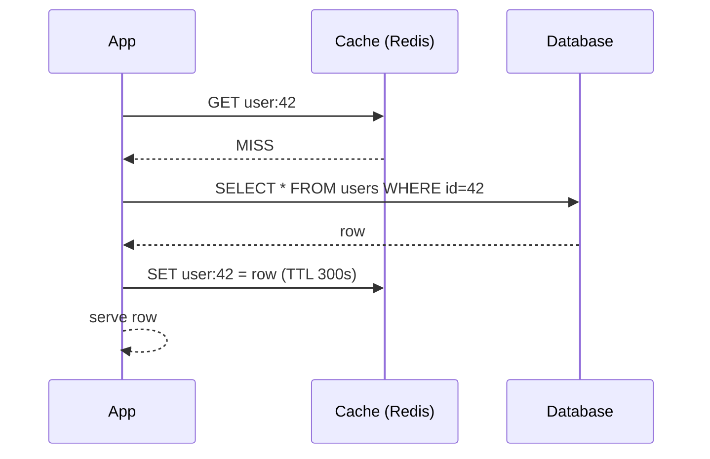
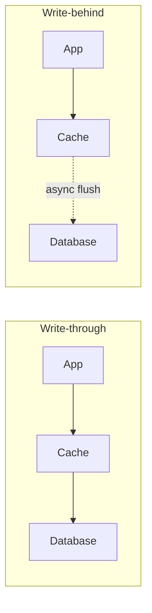
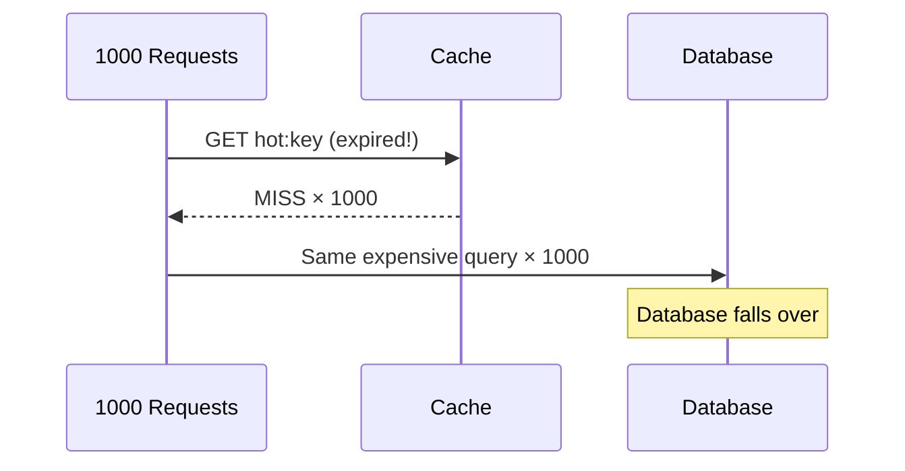

export const meta = {
  slug: 'caching-strategies',
  title: 'Caching Strategies',
  tier: 'intermediate',
  order: 11,
  summary:
    'Cache-aside, read-through, write-through, and write-behind: where caches live, how data gets in and out, and how to survive eviction, TTLs, and stampedes.',
  estimatedMinutes: 18,
  difficulty: 3,
  topics: ['caching', 'performance'],
};

## Why this matters

Almost every performance win in backend engineering is secretly a caching win. When a
homepage loads in 40 milliseconds instead of 400, when a Black Friday sale doesn't melt the
database, when an API serves a million identical requests without breaking a sweat — there is
almost always a cache doing the heavy lifting. Caching is the best bang-for-buck
optimization in backend engineering — and also one of the easiest to get subtly wrong.

Think of a cache like a **chef's mise en place** — the little bowls of chopped ingredients
sitting within arm's reach. The walk-in freezer (your database) holds everything, but walking
back and forth to it for every single order would bring the kitchen to its knees. The
ingredients you use constantly live right next to the stove. Caching is mise en place for
data: keep the hot stuff close.

🎥 **Learn more:** [Why Is Your App Slow? Redis & Caching Explained | C# Cache-Aside](https://www.youtube.com/watch?v=TQPUHnuXWcY) — Backend Developer. A café analogy shows what repeated DB reads cost — and what caching saves.

## The core trade-off

A cache buys you **speed** and **reduced load** in exchange for **staleness** and
**complexity**. There are only two hard problems in computer science, as the old joke goes —
cache invalidation, naming things, and off-by-one errors. (The joke itself contains an
off-by-one error. You're welcome.) Every strategy below is a different answer to one
question: *when this data changes, who is responsible for making the cache agree?*

🎥 **Learn more:** [How One Cache Turns 200ms Into 1ms — Caching Strategies Explained](https://www.youtube.com/watch?v=hk50ZQuZGgQ) — prahack. The 200ms-to-1ms win, then the catch: a second copy drifts out of date.

## Cache-aside (lazy loading)

The most common pattern. Your application checks the cache first; on a miss, it loads from
the database and stores the result in the cache for next time.

The beauty: the cache only ever holds data something actually asked for — no wasted memory.
The danger: the first request after a deploy (or a cache flush) hits the database hard, and
your application code now owns all the invalidation logic. Most teams using **Memcached** or
**Redis** start here.

<VsToggle
  title="Cache-aside read path: hit vs miss"
  a={{
    label: "Cache hit",
    title: "Served from Redis in ~1 ms",
    points: [
      "The app checks the cache first — and key user:42 is right there",
      "No database query, no round trip, no waiting",
      "Hot keys stay warm because frequent misses re-populate them right after expiry",
    ],
    note: "The happy path — design so this is 90%+ of your reads.",
  }}
  b={{
    label: "Cache miss",
    title: "The full database round trip",
    points: [
      "The app finds nothing in the cache for user:42",
      "It loads the row from the database, then SETs it back into the cache with a 300s TTL",
      "The first request after a deploy or flush hammers the database — the thundering herd",
    ],
    note: "Design for this path — it is where the outages hide.",
  }}
/>

🎥 **Learn more:** [A Step-by-Step Guide for the Cache-Aside Pattern + Stampede Protection](https://www.youtube.com/watch?v=CVQz0E33ft4) — Milan Jovanović. An established educator walks cache-aside through implementation, pros and cons included.

## Read-through and write-through

In **read-through**, the cache itself knows how to load from the database on a miss — your
application only ever talks to the cache. In **write-through**, every write goes to the cache
*and* the database synchronously, so the cache stays fresh on the write path. The price:
every write waits on both. And even so, concurrent reads racing a write — or a partial
failure between the two writes — can still surface briefly stale data.

**Write-behind** (write-back) flips the trade: the write lands in the cache and returns
immediately; the database is updated asynchronously. Writes feel instant, but if the
cache node dies before the flush, that write is gone forever. Databases like **Cassandra**
*look* like write-behind at a glance, but they aren't: every write is appended to a durable
commit log *synchronously*, and the write is only acknowledged once it's safe on disk.
Cassandra's write path is *not* write-behind — durability is synchronous; the async part is
only compaction, the background merging of SSTables. Application caches rarely have that
safety net, so they should avoid write-behind unless you can afford to lose recent
writes.

🎥 **Learn more:** [System Design Part 3: Caching Layer](https://www.youtube.com/watch?v=yf1VvSXUANI) — Sketch Mind. Dedicated chapters contrast read-through vs write-through, and the freshness each one buys.

## Eviction: when the mise en place overflows

Memory is finite, so caches evict. The classics:

- **LRU** (least recently used) — evict whatever hasn't been touched in the longest. Great
  default; **Redis** and **Memcached** both offer it.
- **LFU** (least frequently used) — evict the least popular. Better when a few hot keys
  dominate, worse when access patterns shift suddenly.
- **TTL** (time to live) — don't even wait for pressure; expire entries after N seconds.
  Simple, predictable, and the reason your "new profile picture" takes five minutes to show up.

TTL deserves special respect: it is the *dumbest* invalidation strategy and therefore the
most reliable. Short TTLs mean fresher data and more database load; long TTLs mean the
reverse. Picking a TTL is picking where you live on that line — there is no universal right
answer, only the one your users will tolerate.

🎥 **Learn more:** [Ep. 21: Cache Eviction Explained in Detail](https://www.youtube.com/watch?v=vAqFJp_eaGI) — Systemic Stack English. Compares FIFO, LRU, and LFU with workload trade-offs — exactly this subtopic.

## The thundering herd

Here's the failure mode that pages people at 3 AM. A popular key expires (or the cache
restarts). A thousand requests arrive at once, *all* miss, and *all* stampede the database
with the same expensive query. The database, which was happily idle a moment ago, falls over.

Defenses, from simplest to fanciest:

1. **Request coalescing / single-flight** — only the first request hits the database; the
   rest wait for its result. Many cache libraries do this automatically.
2. **Probabilistic early expiration** — refresh keys *before* they expire, with a little
   randomness so they don't all refresh at once.
3. **Stale-while-revalidate** — serve the slightly-old value immediately and refresh in the
   background. Users get speed *and* freshness, eventually.

🎥 **Learn more:** [Hot Keys & Cache Stampedes Explained | Prevent Database Meltdowns | System Design](https://www.youtube.com/watch?v=-q_Ku081_SI) — Tejav Academy. A dedicated stampede explainer: warming, stale-while-revalidate, and request coalescing.

## Where caches live

Caching isn't one layer — it's a stack. Browser caches, [**CDN** edge caches](#/lesson/cdns) (next lesson!),
application caches like Redis, database query caches, even CPU caches. Each layer trades a
different amount of staleness for a different amount of speed. When debugging "why is this
slow," walk the stack top-down: the fix is usually a missing layer, not a faster database.

🎥 **Learn more:** [Caching at Different Levels: Client, CDN, Redis & DB | System Design](https://www.youtube.com/watch?v=ZIDjSV1RZBU) — InfraWithDipankar. Walks the four layers — client, CDN, Redis, database — and when each one goes wrong.

## Takeaways

1. Cache-aside is the default starting pattern: lazy, simple, and your app owns invalidation.
2. Write-through keeps the cache fresh at the cost of write latency; write-behind is fast but can lose data.
3. TTLs are the most reliable invalidation strategy — dumb beats clever.
4. Plan for the thundering herd *before* your hottest key expires: coalesce, pre-refresh, or serve stale.

<Quiz
  lessonSlug="caching-strategies"
  questions={[
    {
      question: "In the cache-aside pattern, what happens on a cache miss?",
      options: [
        "The request is dropped and the client retries with a cache-bypass header",
        "The cache serves a placeholder while a background job loads the row",
        "The application loads the row from the database, SETs it into the cache, then serves it",
        "The cache itself fetches the row from the database and returns it",
      ],
      correctIndex: 2,
    },
    {
      question: "What is the main risk of the write-behind strategy?",
      options: [
        "Unflushed writes are lost if the cache fails before the database is updated",
        "Reads slow down because every read must verify the cache against the database",
        "The database receives every write twice, once from the cache and once from the app",
        "Hit ratios collapse because write-behind entries are never allowed to expire",
      ],
      correctIndex: 0,
    },
    {
      question: "A 'thundering herd' (cache stampede) happens when...",
      options: [
        "Too many cache nodes join the cluster in the same minute",
        "Eviction deletes keys faster than the application can rewrite them",
        "Two regional caches disagree and clients see conflicting values",
        "A popular key expires and hundreds of requests hit the database with the same query at once",
      ],
      correctIndex: 3,
    },
    {
      question: "Which of these is a defense against the thundering herd, as described in the lesson?",
      options: [
        "Raising every TTL to the maximum the cache allows",
        "Coalescing requests: only the first request queries the database while the others wait",
        "Turning the cache off entirely during traffic spikes",
        "Switching the eviction policy from LRU to LFU",
      ],
      correctIndex: 1,
    },
  ]}
/>

---

## Go deeper

Want to keep pulling this thread? These talks and tutorials go further than we did here:

- [Caching in System Design: Redis, Strategies, Clustering & Real-World Patterns](https://www.youtube.com/watch?v=kgcMinYM0GE) — Bagherani, YouTube tutorial (~27 min). Cache-aside, write-through, write-behind, and stampede control in Redis.
- [Caching Explained — Cache Hits, TTL, Eviction & Redis](https://www.youtube.com/watch?v=s8j53j7arIE) — System Design From Zero, YouTube tutorial (~8 min). Hits, misses, TTL, and LRU — the essentials in eight minutes.
- [Caching Explained: Client-Side, CDN, and Server-Side](https://www.youtube.com/watch?v=ZS_8BfDGxvg) — System Design HLD, YouTube tutorial. Multi-layer caching and the freshness-versus-invalidation trade-off.
- [Redis Course – In-Memory Database Tutorial](https://www.youtube.com/watch?v=XCsS_NVAa1g) — freeCodeCamp.org (~1.5h). Data structures, transactions, Pub/Sub, Lua scripting, security, benchmarking — the toolkit behind the strategies.
- [System Design Course – APIs, Databases, Caching, CDNs, Load Balancing & Production Infra](https://www.youtube.com/watch?v=C842vFY5kRo) — freeCodeCamp.org (~2h 05m). The caching chapter covers where caches sit, eviction, and invalidation trade-offs.

## Sources & further reading

- Martin Kleppmann, *Designing Data-Intensive Applications* (O'Reilly, 2017), Ch. 12 — "A cache often contains an aggregation of data" and caches as derived data.
- Redis documentation, "Eviction policies" — LRU/LFU variants in practice.
- Marc Brooker (AWS), "DynamoDB and caching" / AWS Architecture Blog posts on request coalescing and DAX.
- Rajesh Nishtala et al., "Scaling Memcache at Facebook" (NSDI 2013) — cache consistency and thundering-herd mitigation at massive scale.
