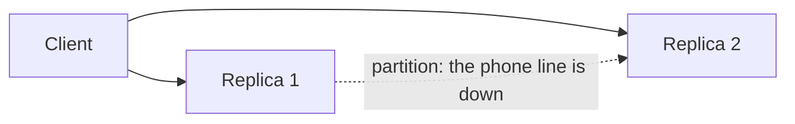
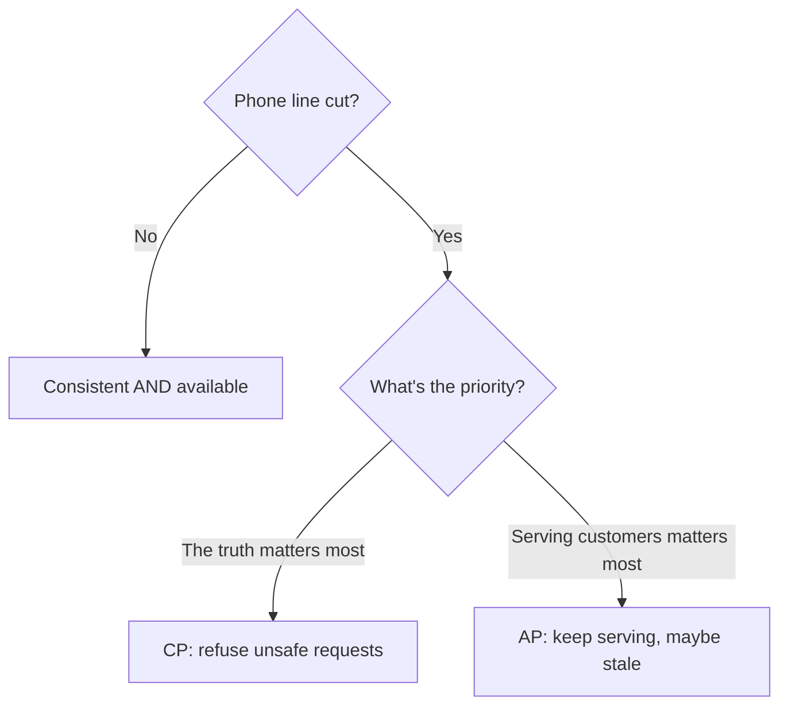
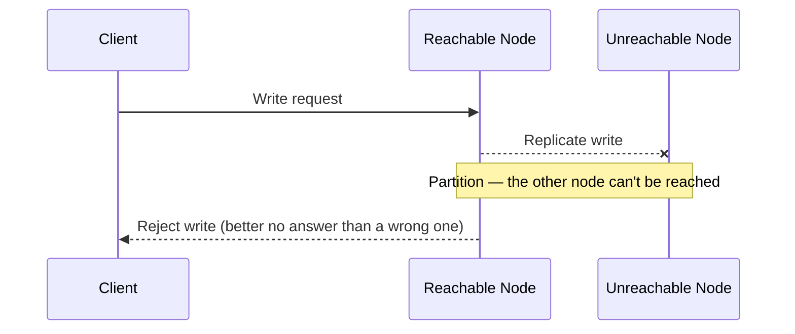

export const meta = {
  slug: 'cap-theorem',
  title: 'The CAP Theorem',
  tier: 'beginner',
  order: 4,
  summary:
    'Why a distributed data store can only pick two of consistency, availability, and partition tolerance — and what that trade-off means in practice.',
  estimatedMinutes: 12,
};

## Why this matters

Sooner or later you'll read an outage postmortem or a database marketing page that says
something like "we chose availability over consistency during the incident." The CAP theorem is
what gives that sentence meaning. It's the single most quoted idea in distributed systems —
you'll hear it in interviews, design reviews, and conference talks. Half the people who
mention it get it slightly wrong. (Not you. Not after this lesson.)

## Picture a restaurant chain

This lesson's running analogy: you run a tiny restaurant chain with **two diners** across town,
sharing one menu. Let's define the CAP properties in diner terms:

- **Consistency (C)** — Both diners' menu boards always show the same specials. If the lunch
  special changes, every customer at every diner sees the update at the same time. Nobody
  orders a dish that was cancelled ten minutes ago.
- **Availability (A)** — Every diner always seats every customer and takes every order, no
  exceptions. Nobody is turned away or told to "come back later."
- **Partition tolerance (P)** — The system keeps working even if the phone line between the two
  diners is cut and they can't talk to each other.

And here's the thing about that phone line: **it will get cut.** Cables get chewed, switches
die, packets vanish into the void. In the world of networks, the gremlins always strike
eventually — usually at 2 a.m., usually right before your launch. A partition is simply two
servers that are both alive, both serving customers, but unable to reach each other:

## The theorem, precisely

> In the presence of a network partition, a distributed system must choose between consistency
> and availability. It cannot provide both.

Why? Go back to the diners. The phone line is cut. A customer at Diner 1 orders the new lunch
special. Diner 2 has no idea the special changed — its menu board is stale. Now a customer at
Diner 2 asks "what's the special?"

You have exactly two options, and they are both a little awkward:

1. **Diner 2 answers with the old special** (stale data) — that's *availability*: everyone gets
   served, but not everyone gets the truth.
2. **Diner 2 refuses to answer** until it can confirm the menu — that's *consistency*: no one
   gets a wrong answer, but someone gets no answer at all.

There is no third option where the diner serves the correct special without talking to Diner 1.
That's the whole theorem. It's less a deep mathematical mystery and more a very obvious
dilemma — dressed up in academic clothes.

Because partitions are inevitable, the "P" in CAP is really non-negotiable for a distributed
system — so the practical question is: during a partition, are you **CP** or **AP**?

| Choice | During a partition | Example systems |
| --- | --- | --- |
| **CP** | Reject or block requests it can't guarantee are consistent | ZooKeeper, etcd, HBase |
| **AP** | Keep serving requests, possibly with stale or conflicting data | Cassandra, DynamoDB, Riak |

A CP system would rather close the kitchen than serve the wrong special:

## The thing everyone gets wrong

Here is the misconception to watch for at parties: CAP does **not** say a system must
permanently pick only two of three, like some kind of loyalty program. When the phone line is
working — which is most of the time — a system can be both consistent and available. The
trade-off only bites **during a partition**. It's a fire-escape plan, not a personality type.

This is also why later models like **PACELC** extended CAP: they ask "and even when there's no
partition, are you trading consistency for latency?" Because the gremlins are always in the
details.

## Takeaways

1. Partitions are a fact of life, not an edge case — the gremlins always strike eventually, so
   design for them explicitly.
2. During a partition you must choose: serve everyone with possibly stale data (AP), or serve
   only what you can guarantee is correct (CP).
3. "Consistency" here means **linearizability** — a much stronger guarantee than the "C" in
   ACID. Same word, different level of commitment.
4. Most real systems are tunable (e.g., Cassandra's quorum reads/writes) rather than strictly
   CP or AP — CAP is a lens for reasoning, not a rigid checklist.

<Quiz
  lessonSlug="cap-theorem"
  questions={[
    {
      question: "The phone line between your two diners is cut. A CP system will...",
      options: [
        "Keep seating customers and serving whatever's on the board, stale or not",
        "Refuse requests it can't guarantee are correct until it can reach the other diner",
        "Shut down both diners permanently",
        "Invent new specials on the spot and hope for the best",
      ],
      correctIndex: 1,
    },
    {
      question: "What is a 'partition' in the context of the CAP theorem?",
      options: [
        "A logical division of a database's rows across servers",
        "Two nodes that are both alive and reachable by clients, but unable to reach each other",
        "A firewall rule blocking client traffic",
        "A scheduled maintenance window",
      ],
      correctIndex: 1,
    },
    {
      question: "When there is NO network partition, a distributed system can be...",
      options: [
        "Only consistent, never available",
        "Both consistent and available at the same time",
        "Only available, never consistent",
        "Neither — the theorem forbids it",
      ],
      correctIndex: 1,
    },
    {
      question: "Which of these is an example of an AP system, as described in the lesson?",
      options: ["ZooKeeper", "etcd", "Cassandra", "HBase"],
      correctIndex: 2,
    },
  ]}
/>

---

## Sources & further reading

- Eric A. Brewer, "Towards Robust Distributed Systems" (PODC 2000 keynote) — the original CAP conjecture.
- Seth Gilbert & Nancy Lynch, "Brewer's Conjecture and the Feasibility of Consistent, Available, Partition-Tolerant Web Services," *ACM SIGACT News* 33(2), 2002 — the formal proof.
- Daniel J. Abadi, "Consistency Tradeoffs in Modern Distributed Database System Design," *IEEE Computer* 45(2), 2012 — introduces the PACELC extension.
- Martin Kleppmann, *Designing Data-Intensive Applications* (O'Reilly, 2017), Ch. 9 — linearizability and consistency in practice.
