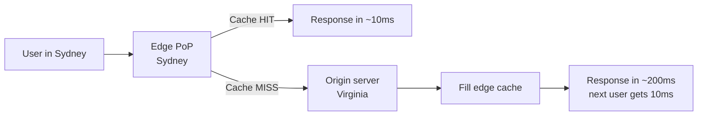
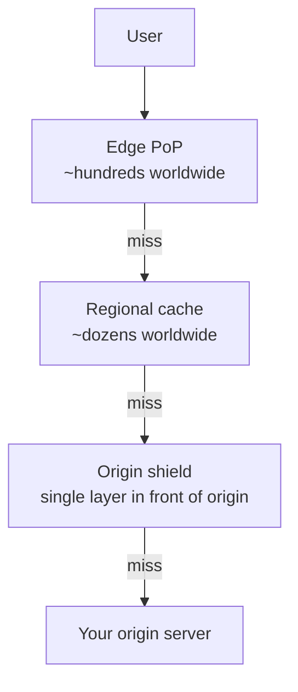

export const meta = {
  slug: 'cdns',
  title: 'Content Delivery Networks',
  tier: 'intermediate',
  order: 12,
  summary:
    'How CDNs put your content on every continent: edge PoPs, cache hierarchies, TTLs and purging, origin shields, and accelerating dynamic content.',
  estimatedMinutes: 15,
  difficulty: 2,
  topics: ['caching', 'networking', 'scaling'],
};

## Why this matters

The speed of light is not a suggestion — it's a hard limit. A user in Sydney requesting a
file from a server in Virginia waits roughly 200 milliseconds *just for the round trip*,
before your server does a single useful thing. No amount of code optimization fixes physics.
A **CDN (Content Delivery Network)** fixes it the only way physics allows: by moving the
content closer to the user. Netflix, YouTube, and every fast website you've ever used lean on
this trick.

Picture a popular restaurant chain. The flagship kitchen in one city makes an incredible
sauce — but shipping every serving across the country would be slow and expensive. So the
chain opens **regional kitchens** that keep the sauce ready to go. Diners everywhere get the
same dish, fast. A CDN is a network of regional kitchens for your bytes: hundreds of edge
locations (Points of Presence, or **PoPs**) that cache your content near your users.

<VideoCard videoId="9254n-FM97M" title="What is a CDN? - #Cloudbits Episode 2" source="Cloudflare Developers" description="Opens with the distance problem, then shows how CDNs cut latency, absorb traffic spikes, and shield origins." />

## The request path

The first user in a region pays the full round trip; everyone after them gets the cached
copy. The metric that runs the whole business is the **cache hit ratio**: the fraction of
requests served from the edge without touching your origin. Static assets (images, video,
JS bundles) routinely hit 95%+; personalized API responses might be near 0%.

<VsToggle
  title="One request from Sydney, two possible journeys"
  a={{
    label: "Edge hit — Sydney PoP",
    title: "~10 ms: served from the edge",
    points: [
      "The request lands at the Sydney Point of Presence",
      "The bytes are already cached there — the origin is never involved",
      "Origin bill for this request: zero",
    ],
    note: "Static assets routinely hit 95%+ cache hit ratios — this is the common case.",
  }}
  b={{
    label: "Edge miss — Virginia origin",
    title: "~200 ms: cross-Pacific round trip",
    points: [
      "The Sydney PoP has no copy, so the request travels to the origin in Virginia",
      "The origin serves the bytes and fills the edge cache on the way back",
      "The next Sydney user gets the 10 ms path instead",
    ],
    note: "The first user in a region always pays the full round trip.",
  }}
/>

<CdnFlow />

<VideoCard videoId="1fMJKA7Cm0s" title="Content Delivery Networks (CDN) explained in TWO minutes" source="Ptolémé" description="Visual two-minute walk through DNS routing, the nearest edge server, cache hit versus miss, and origin fetch." />

## The cache hierarchy

Large CDNs don't have just one layer. A typical setup:

Each layer shields the one below it. The **origin shield** is the unsung hero: a single
caching layer that collapses duplicate misses from many edges into one request to your
origin. Without it, a cache flush across 300 edges means 300 simultaneous requests to your
origin — the thundering herd's globe-trotting cousin (see *Caching Strategies*).

<VideoCard videoId="HGAyuf0WIEQ" title="CDNs Explained — How Content Delivery Networks Make Websites Faster" source="NetWorks" description="Explains PoPs, edge versus regional caches, and origin shielding for collapsing many edge misses into one origin request." />

## TTLs, purging, and versioning

Everything cached at the edge eventually goes stale, and CDNs manage that with the same
tools you already know: **TTLs** and **purging**. Purge ("invalidate this URL everywhere,
now") sounds perfect until you learn it can take seconds to minutes to propagate to every
PoP — during a security incident, those seconds feel very long.

The industry's favorite dodge is **content versioning**: never change a file in place;
instead, ship `app.v2.js` alongside `app.v1.js` and update the reference. Immutable assets
get year-long TTLs and never need purging. Your HTML (short TTL, or uncached) points at the
new filenames. Stop mutating files in place and a whole class of staleness bugs simply
disappears.

<VideoCard videoId="gi9SclyWAA0" title="Cache Invalidation: Why Is It So Hard? The #1 Caching Problem" source="TechingEasy" description="Compares TTL expiry, explicit invalidation, and versioned cache keys with the trade-offs of each approach." />

## Dynamic content acceleration

"What about content that *can't* be cached — personalized pages, API responses?" CDNs still
help, through the boring magic of better networking:

- **Persistent, warm connections** between edge and origin (no TCP/TLS handshake per request).
- **Smarter routing** — the CDN's private backbone often beats the public internet's
  meandering path. (Your packets take the highway; everyone else takes side streets.)
- **TLS termination at the edge** — the expensive handshake happens close to the user.

**Cloudflare**, **CloudFront**, **Fastly**, and **Akamai** all sell this. Nobody will ever
thank you for the 80 milliseconds you shaved off their API call, but the conversion-rate
graphs will.

<VideoCard videoId="Uu0f1HRg7aY" title="Content Delivery Network (CDN) Basics by CDNetworks" source="Web Acceleration Channel - by CDNetworks" description="CDNetworks engineers walk through the techniques used to accelerate dynamic, non-cacheable content across the network." />

## Picking and configuring

A few practical trade-offs worth knowing:

- **Pull vs. push**: in *pull* (origin pull) the CDN fetches from your origin on miss —
  simplest, and what most sites use. In *push*, you upload content to the CDN's storage
  directly — better for huge files (video libraries) where you don't want origins involved.
- **Anycast routing**: your domain resolves to one IP advertised from every PoP; BGP
  routing sends each user to the nearest one. This is why one DNS answer serves the planet.
- **Cost model**: you pay mostly for egress bandwidth and requests. A misconfigured cache
  (low hit ratio) doesn't just hurt latency — it shows up on the invoice, twice.

<VideoCard videoId="mPDpSwvYafo" title="How to implement a CDN" source="Contabo" description="Walks through choosing a provider, pointing DNS at it, and tuning Cloudflare caching, compression, and SSL settings." />

## Takeaways

1. CDNs beat the speed of light by moving content to edge PoPs near users; the cache hit ratio is the metric that matters.
2. Layer the caches — edge, regional, origin shield — so misses don't stampede your origin.
3. Version static assets immutably instead of purging; purge is slower and scarier than it looks.
4. Even uncacheable dynamic content gets faster through warm connections and better routing.

<Quiz
  lessonSlug="cdns"
  questions={[
    {
      question: "What is a CDN's primary answer to the latency imposed by the speed of light?",
      options: [
        "Compressing content more aggressively",
        "Moving cached copies of content to edge PoPs near users",
        "Upgrading the origin server's CPU",
        "Reducing the number of HTTP requests per page",
      ],
      correctIndex: 1,
    },
    {
      question: "What does an 'origin shield' do?",
      options: [
        "Collapses duplicate cache misses from many edges into a single request to the origin",
        "Automatically scales the origin server up and down",
        "Blocks DDoS attacks at the network edge",
        "Encrypts traffic between the user and the edge",
      ],
      correctIndex: 0,
    },
    {
      question: "Why do teams version static assets (app.v2.js) instead of overwriting app.js?",
      options: [
        "Versioned files compress better",
        "CDNs refuse to cache files without version numbers",
        "Browsers require version numbers to parse JavaScript",
        "Immutable versioned files can use very long TTLs and never need purging",
      ],
      correctIndex: 3,
    },
    {
      question: "How does a CDN speed up dynamic, uncacheable content?",
      options: [
        "It cannot help at all with dynamic content",
        "By converting dynamic pages into static HTML",
        "Through warm persistent connections, smarter routing, and TLS termination at the edge",
        "By caching it anyway and hoping nobody notices",
      ],
      correctIndex: 2,
    },
  ]}
/>

---

## Go deeper

Want to keep pulling this thread? These talks and tutorials go further than we did here:

- [Content Delivery Networks (CDN) in Cloud Systems Design](https://www.youtube.com/watch?v=wVO5LO-aZNM) — SystemsArchitect.io, YouTube tutorial. PoPs, anycast, cache keys, purge, and origin shields.
- [What Is A CDN? How Does It Work?](https://www.youtube.com/watch?v=RI9np1LWzqw) — ByteByteGo. Multi-tier caching, purge APIs, request coalescing, and recovery.
- [Why Distance Doesn't Matter (CDNs)](https://www.youtube.com/watch?v=M3rK2tZj8QM) — Neural Download (~7 min). A fast primer: PoPs, hits and misses, invalidation, DNS routing.
- [System Design Course – APIs, Databases, Caching, CDNs, Load Balancing & Production Infra](https://www.youtube.com/watch?v=C842vFY5kRo) — freeCodeCamp.org (~2h 05m). Dedicated CDN coverage inside a full system-design course.
- [System Design for Beginners Course](https://www.youtube.com/watch?v=m8Icp_Cid5o) — freeCodeCamp.org, taught by Gaurav Sen (~1h 25m). Watch the CDN chapter (~0:41:55) — CDNs inside a real live-streaming pipeline.

## Sources & further reading

- Cloudflare Learning Center, "What is a CDN?" and "How CDN caching works" — the clearest vendor-neutral explainer set.
- AWS documentation, "Amazon CloudFront" — origin shields, cache behaviors, invalidation.
- Fastly engineering blog — edge computing and purging at scale (notably "Instant Purge" internals).
- Erik Nygren, Ramesh K. Sitaraman & Jennifer Sun, "The Akamai Network: A Platform for High-Performance Internet Applications," *ACM SIGOPS Operating Systems Review*, 2010 — the academic view of CDN architecture.
