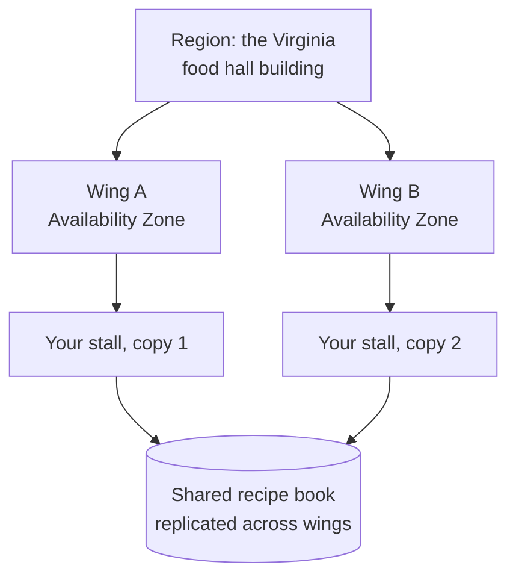
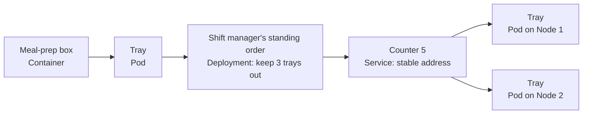
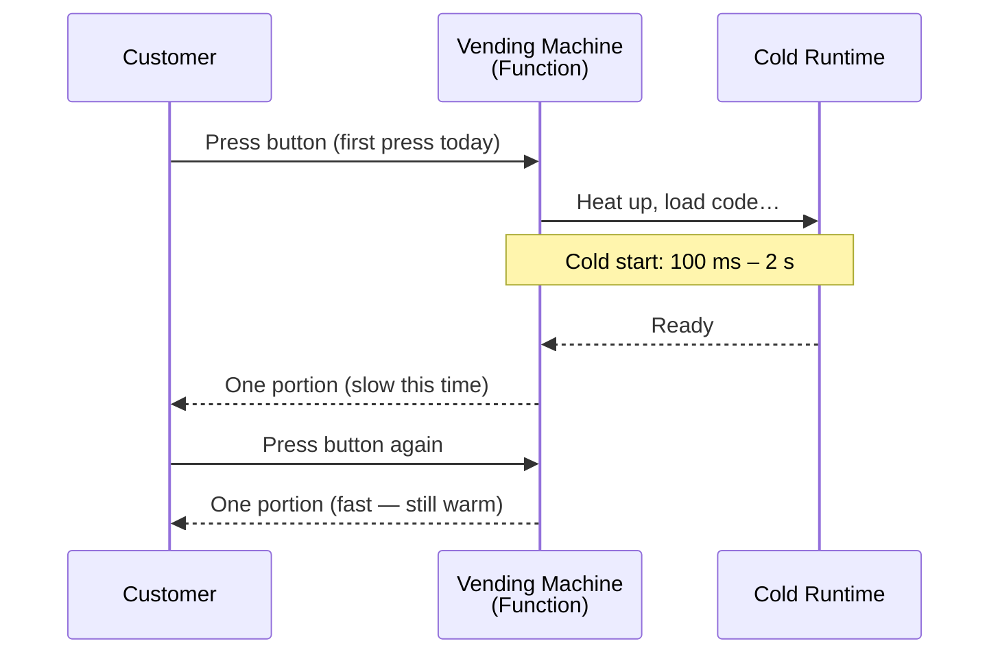

export const meta = {
  slug: 'cloud-native-architecture',
  title: "Cloud-Native Architecture: Building for Someone Else's Computer",
  tier: 'intermediate',
  order: 13,
  summary:
    "Regions and availability zones, managed services vs self-hosting, Kubernetes essentials, serverless cold starts, the 12-factor rules, and the bill at the end — how to build on someone else's computer without getting burned.",
  estimatedMinutes: 18,
  difficulty: 3,
  topics: ['cloud', 'architecture'],
};

## Why this matters

Your app runs fine on your laptop. Now it has to survive a datacenter fire, a Black
Friday traffic spike, and a 2 a.m. page — and you don't own a single server. The cloud
isn't magic; it's someone else's computer, rented by the hour, and building *for* it is
a different discipline than building *on* it. Engineers who treat the cloud like a
bigger laptop get the same app with a bigger bill. Engineers who design for it get
failure isolation, elastic scale, and services they never have to patch at midnight.

<VideoCard videoId="UlDfNC3I15k" title="Getting Started with Cloud Native Infrastructure: Do's, Don'ts, and Lessons from the Ground" source="Microsoft Developer" description="Covers what cloud native means and why teams need it, with do's and don'ts." />

## The food hall

This lesson's running analogy: you used to own your whole restaurant building —
the land, the plumbing, the wiring, the 2 a.m. plumbing emergencies. That's **on-prem**.
Now you've moved into a giant **food hall** run by a landlord (AWS, Google Cloud,
Azure). The landlord owns the building, the power grid, the fire suppression, the
security guards. You rent a stall and cook. You stopped worrying about the building;
you started worrying about your menu, your throughput, and your rent.

Mapping, stated plainly:

- The **landlord** is your cloud provider.
- A **food hall building in one city** is a **region** — a separate geographic site.
- The **fire-isolated kitchen wings** inside it are **availability zones** — independent
  failure domains with their own power and network.
- The **stall equipment the hall rents you** (dishwashers, ice machines) are **managed
  services** — someone else operates them, you just use them.
- Your **monthly invoice** is the part of the cloud everyone discovers last.

The whole game of cloud-native architecture is deciding, for every piece of your
system, whether the landlord handles it or you do — and designing your stall so it
doesn't care which wing it's in.

<VideoCard videoId="rv4LlmLmVWk" title="Microservices explained - the What, Why and How?" source="TechWorld with Nana" description="Explains microservices vs monoliths, tradeoffs, and how services communicate." />

## Regions and availability zones: plan for the fire

Here's the first hard truth of the food hall: buildings catch fire. Disks die, fiber
gets cut by a backhoe, a bad deploy takes down a whole wing. The cloud's answer isn't
"it won't happen" — it's **failure isolation**, drawn on the map.

A **region** is one food hall building in one city: `us-east-1` (Virginia),
`eu-west-1` (Ireland). Regions are far apart on purpose — a hurricane that hits
Virginia doesn't touch Ireland. Traffic between regions rides the cloud provider's own private backbone — not the public internet — but distance still makes it slow, and every gigabyte crossing a region boundary is metered.

Inside one building, the hall is divided into **availability zones**: separate kitchen
wings with fire doors between them, each with its own power feed, cooling, and
network uplinks. A flood in Wing A doesn't reach Wing B. AZs sit close together —
single-digit millisecond latency — so your stalls can chat across wings cheaply.

The rule that falls out of this: **never run your whole service in one wing.** Put
copies of your app in at least two AZs. When Wing A goes dark, Wing B keeps serving
lunch and nobody outside the building notices.

Two honest footnotes. First, "the cloud is down" headlines almost always mean *one
region* had a bad day — often `us-east-1`, which hosts an embarrassing share of the
internet. Multi-region deployment is the answer, and it's expensive enough that most
companies start multi-AZ and earn multi-region later. Second, AZs aren't free:
traffic *between* wings is metered, and a chatty architecture can rack up a real
line item just talking to itself. We'll come back to the bill.

<VideoCard videoId="UFiHrikA6dc" title="AWS Global Architecture Explained: Multi-Region, Multi-AZ & EKS Clusters" source="MrKnowledgeShare" description="Shows multi-AZ and multi-region AWS design with failover drills and RTO/RPO basics." />

## Managed services vs self-hosting: whose dishwasher is it?

The food hall rents you dishwashers. You could also haul in your own dishwasher,
plumb it yourself, and fix it when it breaks at midnight. That choice — **managed
service vs self-hosting** — is the central economic decision of cloud architecture,
and it repeats for every layer: databases (RDS vs your own Postgres on a VM),
queues (SQS vs your own RabbitMQ), even the servers themselves.

<VsToggle
  title="Whose dishwasher is it?"
  a={{
    label: "Managed",
    title: "Rent the hall's dishwasher (RDS, SQS, …)",
    points: [
      "No patching, backups, or failover drills — the landlord's staff handles it",
      "You pay more per unit of work; the convenience is priced in",
      "Less control: fixed versions, fixed knobs, fixed limits",
    ],
    note: "Default choice for most teams. Boring is a feature.",
  }}
  b={{
    label: "Self-hosted",
    title: "Haul in your own dishwasher (your Postgres on VMs)",
    points: [
      "Full control: any version, any tuning, any extension",
      "Cheaper per unit at serious scale — no landlord markup",
      "You own the 2 a.m. page when the pump dies",
    ],
    note: "Worth it when the bill or the control matters more than your sleep.",
  }}
/>

The trade-off is never purely technical. A five-person startup should almost never
self-host its database — the team's scarcest resource is attention, and a managed
database buys it back. A company spending seven figures a year on a managed database
with a dedicated platform team might claw back real money by self-hosting. Same
dishwasher, different math.

One rule of thumb from the trenches: **start managed, earn self-hosted.** It's easy
to migrate off a managed service when the bill justifies it; it's miserable to
migrate *onto* operational maturity you never built. The landlord's dishwasher is
the default for a reason.

<VideoCard videoId="QtoMOgR2Ti4" title="🚀 SaaS vs Self-Hosted vs Hybrid: How to Choose the Right Deployment Model?" source="DataMuscle" description="Compares SaaS, self-hosted, and hybrid models with a practical decision framework for choosing." />

## Containers and Kubernetes: the shift manager

Your stall's kitchen works because everything arrives in **standardized meal-prep
boxes**: same size, same lids, stackable, and they work in any wing of any hall.
That's a **container** — your app plus its dependencies, packed into one portable
unit that runs identically anywhere. "Works on my machine" dies the day you
containerize, because the box *is* the machine.

Kubernetes is the hall's **shift manager**, and you only need four of its words to
follow any conversation about it:

- A **pod** is a *tray* carrying one or more boxes that must be served together —
  your app container plus, say, a little sidecar container that ships its logs. The
  tray is the unit that gets placed, moved, and replaced.
- A **deployment** is the shift manager's standing order: "keep 3 trays of this
  menu on the counter at all times." A tray drops? The manager puts a fresh one out.
  New menu version? The manager swaps trays one at a time so lunch never stops —
  that's a rolling update.
- A **service** is the *fixed counter number*. Customers order at "Counter 5";
  trays come and go behind it, but Counter 5 never moves. That's service discovery:
  a stable address in front of disposable pods.
- A **node** is just a counter — one of the landlord's machines the trays sit on.

That's genuinely the whole mental model. Everything else in Kubernetes —
namespaces, ingress, config maps — is details you can learn when you need them.
If someone at a whiteboard starts drowning you in YAML, ask them which of these
four things they're configuring. There's always an answer.

<VideoCard videoId="s_o8dwzRlu4" title="Kubernetes Crash Course for Absolute Beginners" source="TechWorld with Nana" description="Nana draws the shift manager&#x27;s org chart — pods, nodes, and the control plane — then runs a live demo to show the crew in action." />

## Serverless: the vending machine

In the back of the food hall there's a **vending machine** that cooks. Nobody staffs
it. You press the button, it makes exactly one portion, and you pay per portion.
Nobody pays for it to sit there idle. That's **serverless** (functions like AWS
Lambda): code that runs only when an event arrives, billed by the millisecond,
scaled to zero when idle.

The catch is the first press of the day. The machine is cold — it has to heat up,
load your code, warm its runtime — before it can cook. That warm-up is the
**cold start**: typically tens of milliseconds to a couple of seconds of extra
latency on the first invocation after idle. After that it's hot and fast, until it
idles long enough to cool down again.

So serverless is a spectacular fit for **spiky, event-driven work**: thumbnails
generated when a photo is uploaded, a webhook handler that fires a few times an
hour, a nightly report. It's a misfit for a **constantly-busy, latency-sensitive
API** — if the machine never idles, you're paying per-portion prices for
all-you-can-eat traffic, and the cold starts land exactly on your most
latency-sensitive users. It's also a misfit for long jobs (functions get killed
after ~15 minutes) and for anything needing a persistent connection. The vending
machine is brilliant; it is not a restaurant.

And the industry's favorite punchline applies: "serverless" still runs on servers.
They're just the landlord's servers, and you're not allowed to see them.

<VideoCard videoId="hCCMri3jFAo" title="Defining Serverless Architecture | Crash Course" source="MSFTImagine" description="Breaks down serverless architecture, loose coupling, and autoscaling through simple demos." />

## The 12-factor rules: how to be a good tenant

In 2011, Adam Wiggins wrote down how Heroku's best tenants behaved — twelve
rules for apps that live on someone else's computer. The full list is worth a
read, but three of the factors do most of the work, and you've already met two
of them:

1. **Stateless processes.** Your stall keeps no private memories — same rule as
   the food trucks in the scaling lesson. The shift manager can kill and replace
   trays at any moment, so anything worth remembering (sessions, carts, uploads)
   lives in a **backing service** outside the tray. A twelve-factor app treats its
   database, cache, and queue as *attached resources*, reachable by a URL — the
   recipe book lives outside the trucks, never inside them.
2. **Config in the environment.** The supplier's phone number goes on the
   whiteboard (environment variables), not tattooed on your arm (hardcoded in
   the repo). Same code, different config per wing, per region, per stage —
   and secrets never touch version control.
3. **Disposability.** Trays must start fast and shut down gracefully. The shift
   manager *will* move your trays — during deploys, during scale-down, when a
   wing has a bad day. Fast startup keeps deploys snappy; graceful shutdown
   (finish the in-flight request, then die) keeps customers from noticing.

The through-line: the cloud *will* kill your processes, move them, and multiply
them without asking. Twelve-factor is the art of not minding.

<VideoCard videoId="2_fcv3-XfN4" title="27. The Twelve-Factor App" source="Sriniously" description="Walks through all twelve factors, their history, and a live deployment demo." />

## The bill: pay-as-you-go and the invoice nobody ordered

Here's the part of the cloud everyone discovers last: the meter is always
running. **Pay-as-you-go** means you rent the stall by the minute — glorious when
traffic spikes at noon and vanishes at midnight (the shift manager sends trays
home; the vending machine goes dark), terrifying when someone leaves the ovens
on. Every cloud engineer has a story about the invoice that arrived on the 1st
while nobody admitted to ordering anything. Forgotten test environments, an
oversized database running since March, cross-wing chatter billed by the
gigabyte — the meter doesn't care that you forgot.

**FinOps** is the discipline of actually reading the meter: tag every resource
with its owner, set budgets with alerts, shut down what the night shift doesn't
need, and buy **reserved capacity** for the load you know is always there (your
base lunch rush, prepaid at a discount) while letting the spikes stay on-demand.
The mindset shift is real: on-prem, the expensive mistake was *under*-provisioning
(the site goes down); in the cloud, the expensive mistake is *over*-provisioning
(the site stays up and the invoice quietly doubles).

Watch one request travel through everything you've just learned:

<StepThrough
  title="One request through the food hall"
  nodes={[
    { id: "client", label: "Customer", x: 70, y: 150 },
    { id: "lb", label: "Load Balancer", x: 200, y: 150 },
    { id: "pods", label: "Trays (pods)", x: 330, y: 150 },
    { id: "db", label: "Managed DB", x: 330, y: 250 },
    { id: "bill", label: "The meter", x: 200, y: 250 },
  ]}
  edges={[
    { from: "client", to: "lb" },
    { from: "lb", to: "pods" },
    { from: "pods", to: "db" },
  ]}
  steps={[
    {
      title: "The customer walks into the nearest building",
      caption:
        "DNS routes the request to the closest region — the Virginia food hall, not the Ireland one. Geography is latency.",
      highlight: ["client"],
    },
    {
      title: "The host checks which wing is healthy",
      caption:
        "The load balancer spreads the request across availability zones and skips any wing that's having a bad day. This is the failure isolation you paid for.",
      highlight: ["lb"],
    },
    {
      title: "A tray takes the order",
      caption:
        "The request lands on one pod replica behind the service's fixed counter number. The tray is stateless — it remembers nothing about this customer.",
      highlight: ["pods"],
    },
    {
      title: "State lives outside the tray",
      caption:
        "The pod reads and writes through the managed database — a backing service with its own replication across wings. Kill the tray; the data doesn't care.",
      highlight: ["pods", "db"],
    },
    {
      title: "The meter ticks",
      caption:
        "Every hop was billed: the load balancer's hour, the tray's seconds, the database's I/O, the cross-wing chatter. Somewhere, FinOps is watching.",
      highlight: ["bill"],
    },
  ]}
/>

<VideoCard videoId="lsbgc8bE3lo" title="Cloud Billing with FinOps: Tips, Mistakes and Surprises" source="FinOps Weekly" description="FinOps specialist unpacks cloud billing surprises, invoice reconciliation, and cost accountability." />

## Takeaways

1. **Regions are buildings; availability zones are fire-isolated wings.** Deploy
   across at least two AZs so one wing's bad day isn't your outage. Multi-region
   is the expensive upgrade you earn later.
2. **Managed vs self-hosted is an attention trade-off**, not just a cost one.
   Start managed and earn self-hosted: it's easy to take over the dishwasher when
   the bill justifies it, miserable to build operational maturity from scratch.
3. **Kubernetes in four words:** pod (a tray of containers), deployment (the
   standing order to keep N trays out), service (the fixed counter number),
   node (the counter itself). Everything else is details.
4. **Serverless fits spiky, event-driven work** — and misfits always-on,
   latency-sensitive APIs, long jobs, and persistent connections. Budget for cold
   starts on the first press of the day.
5. **Twelve-factor's big three:** keep processes stateless, put config in the
   environment, and design for disposability — treating databases and queues as
   attached backing services. The cloud will kill your processes; design so you
   don't mind.
6. **The meter is always running.** Pay-as-you-go rewards workloads that scale
   to zero and punishes forgotten ones. Tag everything, alert on budgets, and
   reserve capacity for the load you know is coming.

<Quiz
  lessonSlug="cloud-native-architecture"
  questions={[
    {
      question:
        "A flood takes out one availability zone in your region, but your service stays up. What did you most likely do right?",
      options: [
        "You ran copies of your app across at least two AZs, so the surviving wing kept serving traffic",
        "You used serverless functions, which are immune to datacenter failures",
        "You deployed to multiple regions on different continents",
        "You kept all your servers in the cheapest AZ to save money",
      ],
      correctIndex: 0,
    },
    {
      question:
        "Your five-person startup needs a database. Following this lesson's rule of thumb, what should you choose?",
      options: [
        "Skip the database entirely and keep state in the app processes",
        "Run the database on the same machine as the app to avoid network latency",
        "Self-host Postgres on VMs — it's cheaper per unit and you keep full control",
        "A managed database service — your scarcest resource is attention, and the landlord handles patching, backups, and failover",
      ],
      correctIndex: 3,
    },
    {
      question: "In the Kubernetes mental model from this lesson, what is a Service?",
      options: [
        "One of the landlord's machines that the trays sit on",
        "A tray carrying one or more containers that must be served together",
        "The fixed counter number — a stable address in front of disposable pods",
        "The shift manager's standing order to keep N trays on the counter",
      ],
      correctIndex: 2,
    },
    {
      question:
        "Your API serves steady, latency-sensitive traffic 24/7. Why is serverless likely a misfit here?",
      options: [
        "Serverless only works for batch jobs that run once a night",
        "Serverless functions can't talk to databases at all",
        "You'd pay per-portion prices for all-you-can-eat traffic, and cold starts would hit your most latency-sensitive requests",
        "Serverless functions can't scale past ten concurrent requests",
      ],
      correctIndex: 2,
    },
    {
      question:
        "Which of these is NOT one of the twelve-factor rules emphasized in this lesson?",
      options: [
        "Keep processes stateless and share-nothing",
        "Treat backing services as attached resources reachable by URL",
        "Store config in the environment, not in the code",
        "Write all application code in twelve separate files",
      ],
      correctIndex: 3,
    },
    {
      question:
        "Your cloud invoice doubled even though traffic stayed flat. Which FinOps practice would have caught this earliest?",
      options: [
        "Prepaying for reserved capacity equal to your peak traffic",
        "Tagging resources by owner with budget alerts, so the forgotten test environment pages someone before the 1st",
        "Moving everything to the most expensive region for better latency",
        "Turning off autoscaling so capacity never changes",
      ],
      correctIndex: 1,
    },
  ]}
/>

---

## Go deeper

Want to keep pulling this thread? These talks and tutorials go further than we did here:

- [Keynote: KubeCon Opening Keynote](https://www.youtube.com/watch?v=07jq-5VbBVQ) — Kelsey Hightower (Google), KubeCon + CloudNativeCon. Kubernetes as a means, not an end; managed versus self-hosted.
- [Learn how to Leverage Kubernetes to Support 12 Factor for Enterprise Apps](https://www.youtube.com/watch?v=Se77gdPd-Bk) — Brad Topol & Michael Elder (IBM), KubeCon EU 2019. The 12-factor methodology mapped onto Kubernetes primitives.
- [The Future of Serverless • Nick Coult • GOTO 2025](https://www.youtube.com/watch?v=5sZR5X7noi0) — GOTO Conferences. Serverless fundamentals: events, cold starts, and cost.
- [Learn Kubernetes in 6 Hours – Full Course with Real-World Project](https://www.youtube.com/watch?v=_4uQI4ihGVU) — freeCodeCamp.org (~6h). Control plane and workers, Gateway API, cert-manager, Prometheus/Grafana observability — the cloud-native stack.
- [Serverless and Microservices with C# – Scalable Cloud Applications with Azure and .NET Aspire](https://www.youtube.com/watch?v=xHUwGx-ZlTM) — freeCodeCamp.org (~5h). Serverless architecture and microservice patterns running on someone else's computer.

## Sources & further reading

- Amazon Web Services, *AWS Well-Architected Framework* — the five pillars (operational excellence, security, reliability, performance efficiency, cost optimization) and the multi-AZ/multi-region reliability guidance.
- Adam Wiggins, "The Twelve-Factor App" (12factor.net, 2011) — the twelve rules for apps built to run on someone else's platform, including stateless processes, config, and backing services.
- Cloud Native Computing Foundation, "CNCF Cloud Native Definition" — what "cloud native" means: containers, dynamic orchestration, and microservices-style architecture.
- FinOps Foundation, *FinOps Framework* (finops.org) — the operating model for cloud cost accountability: tagging, budgets, and matching commitment discounts to steady-state load.
