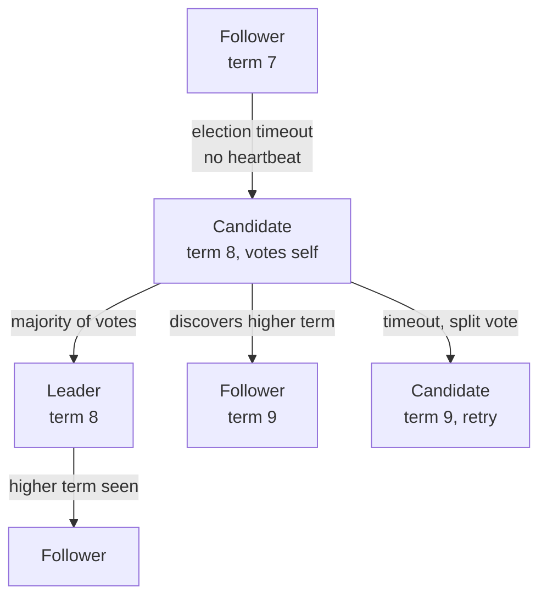
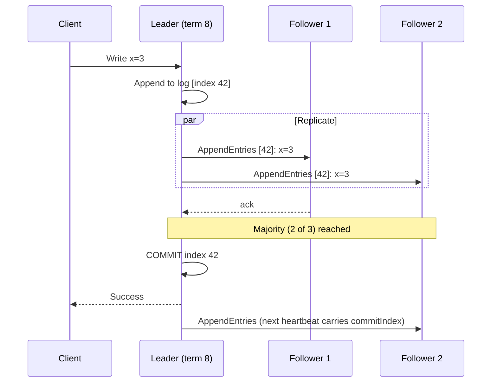

export const meta = {
  slug: 'consensus-raft',
  title: 'Consensus with Raft',
  tier: 'advanced',
  order: 23,
  summary:
    'How a cluster of unreliable machines agrees on one truth: Raft leader election, log replication, commit rules, and the failure scenarios that keep it honest.',
  estimatedMinutes: 22,
};

## Why this matters

Every system you've met so far assumed *someone* is in charge — a leader to replicate
from, a primary to fail over to. But who decides who's in charge when machines can crash,
networks can split, and nobody has a global view? That problem is **consensus**, and it's
the load-bearing wall under etcd, Consul, Kubernetes' control plane, and every serious
distributed database's metadata layer. **Raft** (Ongaro & Ousterhout, 2014) is the
consensus algorithm designed to be *understandable* — which, given that its predecessor
Paxos has a reputation as "the algorithm nobody fully understands," is saying something.

Analogy: a **committee electing a chairperson**. The committee needs exactly one chair at a
time — two chairs issuing contradictory orders is worse than none. Members vote, the chair
sends regular "I'm still here" heartbeats, and if the heartbeats stop, someone calls for a
new election. Raft is this committee with the bylaws written very, very carefully — because
the failure mode isn't an awkward meeting, it's two leaders and a corrupted database.

## The three roles and the heartbeat

Every server is always in exactly one state: **leader**, **follower**, or **candidate**.
Time is divided into **terms** (numbered eras, like "term 7"). The rules:

- The leader sends **heartbeats** (empty AppendEntries RPCs) to all followers, typically
  every ~50–100 ms.
- If a follower hears nothing for its **election timeout** (randomized, typically
  150–300 ms), it becomes a candidate, increments the term, votes for itself, and asks
  everyone else for a vote.
- A candidate that wins a **majority** of votes (⌊n/2⌋ + 1) becomes leader for the term.

The randomization of election timeouts is the quiet genius: if two followers time out
simultaneously and both become candidates, they split the vote and *both* fail — then
randomized timeouts make it overwhelmingly likely that one retries first and wins cleanly.
Deterministic timeouts would livelock forever, like two people repeatedly saying "no, you
go first" in a doorway.

<StepThrough
  title="Raft: losing a leader"
  nodes={[
    { id: "n1", label: "N1", x: 70, y: 150 },
    { id: "n2", label: "N2", x: 155, y: 150 },
    { id: "n3", label: "N3 · leader", x: 240, y: 150 },
    { id: "n4", label: "N4", x: 325, y: 150 },
    { id: "n5", label: "N5", x: 410, y: 150 },
  ]}
  steps={[
    {
      title: "Steady state: heartbeats",
      caption: "N3 is leader for term 7. Every ~50–100 ms it sends empty AppendEntries heartbeats to all followers, resetting their election timers.",
      highlight: ["n3"],
    },
    {
      title: "The leader crashes",
      caption: "N3 goes silent mid-term. Followers stop receiving heartbeats — but each one's election timer keeps ticking.",
      highlight: [],
    },
    {
      title: "Election timeouts fire — randomly",
      caption: "Timers are randomized (150–300 ms), so N1 times out first instead of everyone firing at once. That randomization is the quiet genius.",
      highlight: ["n1"],
    },
    {
      title: "N1 campaigns for votes",
      caption: "N1 becomes a candidate, increments to term 8, votes for itself, and asks N2, N4, and N5 for their votes.",
      highlight: ["n1", "n2", "n4", "n5"],
    },
    {
      title: "A new leader is elected",
      caption: "N1 wins a majority — 3 of 5 votes — and becomes leader for term 8. Heartbeats resume, and the cluster is healthy again.",
      highlight: ["n1"],
    },
  ]}
/>

## Log replication: the actual work

Election just picks who's in charge. The point of consensus is agreeing on a **log** — an
ordered sequence of commands every node applies identically. The leader accepts client
writes, appends them to its log, and replicates via AppendEntries RPCs:

The **commit rule** is everything: an entry is committed once a *majority* has it. A
committed entry will survive any future election — Raft's election rules guarantee the new
leader's log contains all committed entries (a candidate's log must be at least as
up-to-date as a majority's, or it can't win). This is the safety property the whole
algorithm exists to provide.

## The numbers that matter

Back-of-envelope math for a typical 5-node etcd cluster:

- **Fault tolerance**: a majority of 5 is 3, so the cluster survives **2 simultaneous
  failures** (⌊5/2⌋ = 2). General rule: 2F+1 nodes tolerate F failures. This is why
  production consensus clusters are 3 or 5 nodes — 7 buys you a third failure at the cost
  of slower quorums, and even numbers (4, 6) tolerate the *same* failures as the odd number
  below them while being slower. Never run 2 or 4.
- **Write latency**: a commit needs one round trip to the fastest majority. With 10 ms
  inter-node RTT, expect ~10–20 ms commit latency *minimum* — consensus is not free, and
  this is why you don't put Raft on your hot request path.
- **Election time**: roughly one election timeout (150–300 ms) to notice the leader is
  gone, plus a round trip to campaign. Budget ~0.5 s of unavailability per leader failure.
  During that window, writes block — reads can be served stale by followers, or linearly
  via the leader (etcd's default *linearizable* reads go through the leader's quorum
  check; opt-in *serializable* reads are served stale by any member).
- **Throughput**: a single leader serializes all writes through its log. etcd handles
  ~10k writes/sec on decent hardware — plenty for metadata and config, laughable for a
  product database. Consensus is for *control planes*, not data planes.

## Failure scenarios (the exam questions)

**Split brain that isn't**: a network partition splits 5 nodes into 3+2. The side with 3
elects a leader and keeps committing; the side with 2 can't reach majority, so its would-be
leader's writes never commit and clients get errors. No divergence, ever. The minority
partition *stops* rather than going rogue. Compare with the AP systems from your CAP lesson
and notice the price being paid: availability.

**The slow follower**: one follower's disk is dying, so its acks crawl. The leader only
needs a majority — with 5 nodes, the two slowest nodes are simply *not on the critical
path*. This is the deep reason odd-numbered quorums degrade gracefully: you always have
slack for the stragglers.

**Leader with a stale term**: a partitioned old leader (term 8) reconnects and tries to
send heartbeats. Everyone is on term 9; the higher term wins, and the old leader
immediately steps down to follower. Terms are the algorithm's monotonic clock — they make
"who's boss" unambiguous even across partitions and crashes.

## When not to use it

Raft gives you linearizable consensus at the cost of write latency, a single-writer
bottleneck, and operational care (quorum loss = full outage; back up your etcd). If you
need *coordination* (locks, leader election, config) — use it, via etcd/Consul, don't
hand-roll it. If you need *throughput* (product data at 100k writes/sec) — you want
partitioned datastores with weaker consistency, not consensus. And never, ever implement
Raft yourself for production unless implementing Raft *is* your product.

## Takeaways

1. Raft = leader election (majority vote, randomized timeouts) + log replication (commit on majority ack).
2. 2F+1 nodes tolerate F failures; even node counts buy nothing — run 3 or 5.
3. Commits cost one majority round trip (~RTT); elections cost ~one timeout (~0.5 s of write unavailability).
4. The minority partition halts rather than diverging — that's the safety guarantee you're paying for.

<Quiz
  lessonSlug="consensus-raft"
  questions={[
    {
      question: "In Raft, when is a log entry considered committed?",
      options: [
        "As soon as the leader appends it to its own log",
        "Once a majority of cluster nodes have replicated it",
        "Once all nodes have acknowledged it",
        "After the election timeout elapses",
      ],
      correctIndex: 1,
    },
    {
      question: "Why are Raft election timeouts randomized (150–300 ms) rather than fixed?",
      options: [
        "To reduce network bandwidth usage",
        "To prevent split votes from livelocking when multiple candidates start elections simultaneously",
        "To make the algorithm harder for attackers to predict",
        "Randomization is required for the log replication step",
      ],
      correctIndex: 1,
    },
    {
      question: "A 5-node Raft cluster splits 3/2 in a network partition. What happens?",
      options: [
        "Both sides elect leaders and continue accepting writes, diverging",
        "The 3-node side keeps working; the 2-node side cannot reach majority and stops committing writes",
        "The cluster shuts down entirely until the partition heals",
        "The 2-node side takes over because it has less contention",
      ],
      correctIndex: 1,
    },
    {
      question: "Why is running Raft with 4 nodes worse than 3?",
      options: [
        "4 nodes cannot form a quorum at all",
        "Both tolerate 1 failure, but 4 needs 3 acks per commit instead of 2 — slower with no extra safety",
        "Raft requires a prime number of nodes",
        "4 nodes double the election timeout",
      ],
      correctIndex: 1,
    },
  ]}
/>

---

## Sources & further reading

- Diego Ongaro & John Ousterhout, "In Search of an Understandable Consensus Algorithm" (USENIX ATC 2014, pp. 305–319) — the Raft paper itself. The extended version (tech report, raft.github.io/raft.pdf) adds the full safety proofs.
- The Raft interactive visualization at raft.github.io — watch elections and log replication play out.
- etcd documentation, "Operations guide" — quorum math, defragmentation, and disaster recovery in production.
- Martin Kleppmann, *Designing Data-Intensive Applications* (O'Reilly, 2017), Ch. 9 — consensus, total order broadcast, and why you shouldn't hand-roll it.
