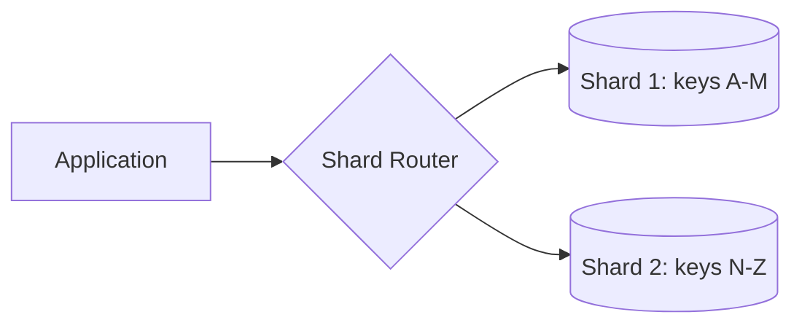
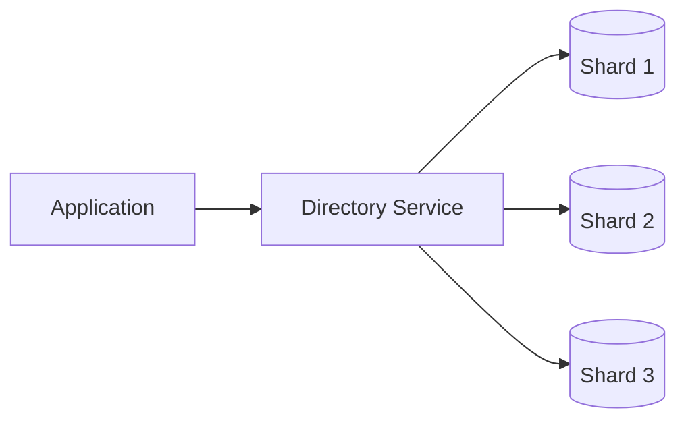
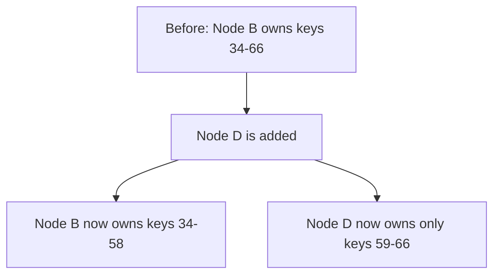
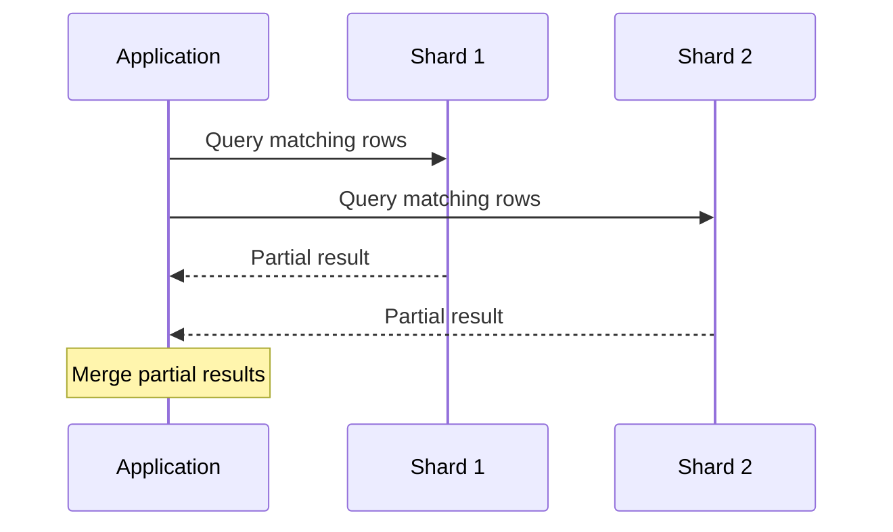

export const meta = {
  slug: 'data-partitioning',
  title: 'Data Partitioning (Sharding)',
  tier: 'intermediate',
  order: 3,
  summary:
    'Splitting a dataset across multiple machines so no single node has to hold — or serve — all of it.',
  estimatedMinutes: 18,
};

## Why this matters

A single database server has finite CPU, memory, and disk. Once a dataset or its query load
outgrows one machine, you need **partitioning** (also called **sharding**): splitting rows across
multiple servers so each one only owns a slice of the whole.

## Partitioning strategies

- **Range-based** — partition by a key range (e.g., users A–M on shard 1, N–Z on shard 2).
  Simple and supports efficient range scans, but can create hot spots if data or traffic is
  unevenly distributed across the key space.
- **Hash-based** — hash the partition key and use the hash to pick a shard. Spreads load evenly,
  but makes range queries expensive (they must fan out to every shard).
- **Directory-based** — a lookup service maps each key (or key range) to a shard, decoupling the
  mapping from a formula. Flexible and rebalance-friendly, but the lookup service becomes a
  critical dependency.
- **Consistent hashing** — arranges shards and keys on a hash ring so that adding or removing a
  shard only remaps a small fraction of keys, instead of reshuffling everything (see the Load
  Balancers lesson for the same technique applied to routing).

A range-based router sends each request straight to the shard that owns its key range:

Directory-based partitioning moves that mapping out of a formula and into its own service, which
can be repointed without touching clients:

And consistent hashing's payoff is that adding a node only steals a slice of keys from its
neighbor — every other shard is untouched:

## The hard part: cross-shard operations

Sharding buys horizontal scale at a real cost:

1. **Joins** across shards require the application (or a query fan-out layer) to do work the
   database used to do for you.
2. **Transactions** that touch multiple shards need distributed transaction protocols (e.g.,
   two-phase commit) or must be avoided by design.
3. **Rebalancing** — adding a new shard means moving data, ideally with a strategy (like
   consistent hashing) that minimizes how much has to move.
4. **Hot shards** — a popular key (a celebrity user, a viral post) can overload a single shard
   even if the overall hashing is "even" on average.

A join or scatter-gather query has to fan out to every shard that might hold a match, then merge
the results back in the application:

## Picking a partition key

The partition key decides your access pattern. A good partition key:

- Matches the dimension most queries filter on (e.g., `user_id` for a per-user timeline service).
- Has high cardinality, to spread data and load evenly.
- Avoids creating monotonically increasing hot keys (e.g., raw timestamps) that concentrate
  writes on one shard at a time.

## Takeaways

1. Partition when a single node can no longer hold the data or serve the load — not before.
2. The partition key is the most consequential decision in a sharded system's design.
3. Consistent hashing is the recurring trick for minimizing data movement when the cluster
   resizes, whether you're sharding a database or routing to a cache fleet.

<Quiz
  lessonSlug="data-partitioning"
  questions={[
    {
      question: "Which partitioning strategy makes range queries expensive because they must fan out to every shard?",
      options: ["Range-based", "Hash-based", "Directory-based", "None of the above"],
      correctIndex: 1,
    },
    {
      question: "What makes a partition key a *good* choice, according to the lesson?",
      options: [
        "It has low cardinality so fewer shards are needed",
        "It matches the query pattern, has high cardinality, and avoids monotonically increasing hot keys",
        "It is always the database's auto-incrementing primary key",
        "It should be a raw timestamp to keep writes ordered",
      ],
      correctIndex: 1,
    },
    {
      question: "What technique minimizes data movement when a sharded cluster is resized?",
      options: [
        "Directory-based lookup with a single central server",
        "Range-based partitioning by alphabetical order",
        "Consistent hashing",
        "Two-phase commit",
      ],
      correctIndex: 2,
    },
  ]}
/>

---

## Sources & further reading

- Martin Kleppmann, *Designing Data-Intensive Applications* (O'Reilly, 2017), Ch. 6 — partitioning strategies, rebalancing, and request routing.
- Giuseppe DeCandia et al., "Dynamo: Amazon's Highly Available Key-value Store," *SOSP 2007* — consistent hashing and partitioning in a production store.
- David Karger et al., "Consistent Hashing and Random Trees," *STOC 1997* — the ring-based hashing technique.
- Jim Gray & Andreas Reuter, *Transaction Processing: Concepts and Techniques* (Morgan Kaufmann, 1992) — distributed transactions and two-phase commit.
