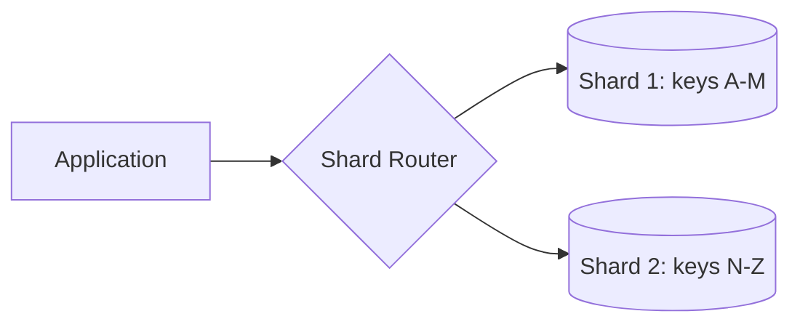
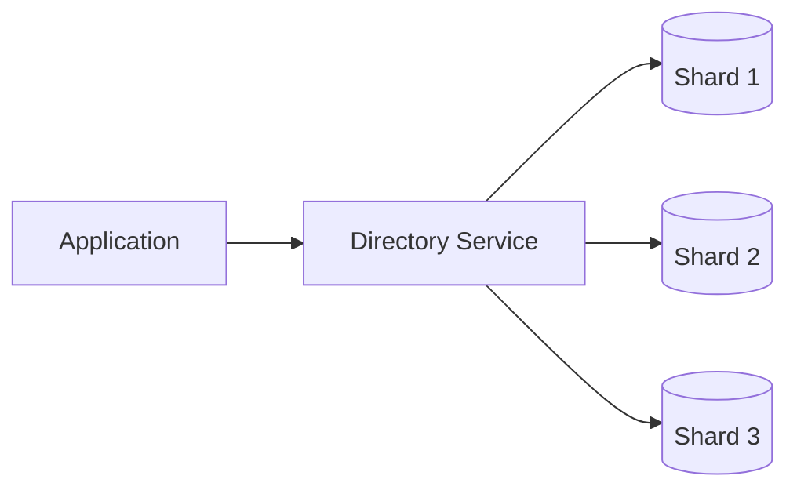
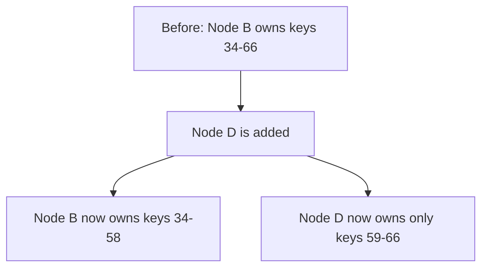
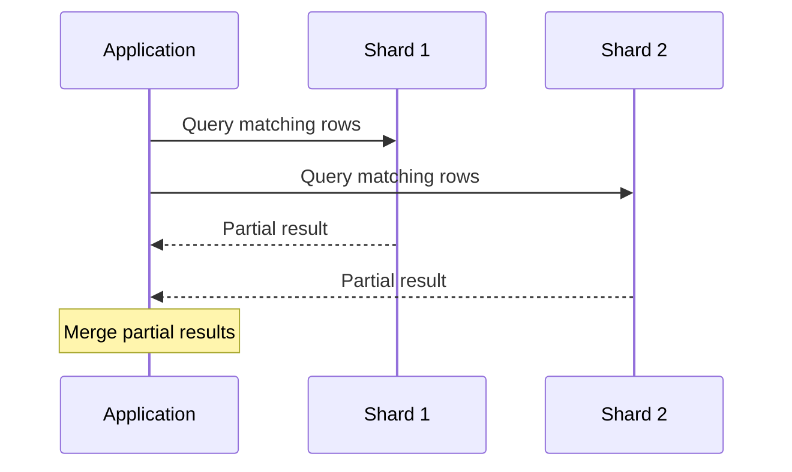

export const meta = {
  slug: 'data-partitioning',
  title: 'Data Partitioning (Sharding)',
  tier: 'intermediate',
  order: 7,
  summary:
    'Splitting a dataset across multiple machines so no single node has to hold — or serve — all of it.',
  estimatedMinutes: 18,
  difficulty: 4,
  topics: ['databases', 'scaling', 'sharding'],
};

## Why this matters

There is a scale at which "just buy a bigger database server" stops being a plan and becomes
a fantasy. CPU, RAM, and disk on one machine are finite — and at some point the cost curve of
bigger boxes goes vertical. Every database that serves the modern internet got there by doing
the same thing: **partitioning** (also called **sharding**) — splitting the dataset across
many machines so each one only holds and serves a slice of the whole. This is how your social
feed, your order history, and your photo library all survive having billions of rows. The
question is never *whether* to shard at scale; it's *how*, and which pain you're willing to
accept.

🎥 **Learn more:** [Database Optimization in System Design | Replication, CAP Theorem, Partitioning & Sharding Explained](https://www.youtube.com/watch?v=jTe6Q78uzQA) — Web Detailed by Mohi. Explains why databases become bottlenecks and how partitioning and sharding unlock performance at scale.

## Picture a library system

Our analogy: a beloved city library that got *too* popular. The central branch is overflowing —
shelves groaning, lines out the door. The city opens branch libraries and splits the
collection across them. Every book lives at exactly one branch. Now, how do patrons find their
books? That question is the entire lesson.

🎥 **Learn more:** [Sharding, Partitioning & Indexing in Database| System Design | Episode 09](https://www.youtube.com/watch?v=Ws2vMYZgN84) — The Tech Intern. Builds intuition with everyday pictures like a phone book at two counters, then walks range vs hash sharding.

## Partitioning strategies

- **Range-based** — branch 1 holds authors A–M, branch 2 holds N–Z. Simple, and browsing
  authors alphabetically (a range scan) is fast. But if everyone suddenly wants the new
  releases shelved at branch 2, branch 1 sits empty while branch 2 melts down. That's a
  **hot spot**.
- **Hash-based** — hash the book's ID and let the hash decide the branch. Books scatter
  evenly, so load balances beautifully — but "show me all books by this author" now requires
  calling *every* branch and merging the answers.
- **Directory-based** — a central card catalog maps each book to its branch. Moving books
  between branches is just a catalog update — wonderfully flexible — but if the card catalog
  burns down, nobody can find anything. The catalog is a critical dependency (and a single
  point of failure).
- **Consistent hashing** — arrange branches and books on a ring so that adding or removing a
  branch only moves a small slice of books, instead of re-shelving the entire city. (You met
  this one in the Load Balancers lesson, where it routed *requests*; here it routes *data*.)

Each strategy is a trade-off, and real systems pick their poison deliberately. Cassandra
leans on consistent hashing plus tunable replication; MongoDB's sharding is range/hash-based
with a config server acting as the directory; DynamoDB hashes partition keys and rebalances
behind the scenes. Same toolbox, different choices.

A range-based router sends each request straight to the shard that owns its key range:

Directory-based partitioning moves the mapping out of a formula and into its own service,
which can be repointed without touching clients:

And consistent hashing's payoff: adding a node only steals a slice of keys from its neighbor —
every other shard is untouched:

<HashRingPlayground />

🎥 **Learn more:** [Why One Database Is Never Enough — Partitioning Deep Dive (DDIA Ch. 6)](https://www.youtube.com/watch?v=ds-v2gIvTpo) — Savant Space. Compares key-range vs hash partitioning, hot spots, and consistent hashing for rebalancing, straight from DDIA.

## The hard part: cross-shard operations

Sharding buys horizontal scale at a real price. The library is bigger now, but some things
got harder:

1. **Joins** across shards — "all orders joined with all users" — now require the application
   (or a query fan-out layer) to do work the database used to do for you.
2. **Transactions** spanning shards need distributed transaction protocols (e.g., two-phase
   commit) or must be avoided by design. Many teams choose avoidance and model their data so
   cross-shard writes simply never happen.
3. **Rebalancing** — adding a new shard means moving data. With consistent hashing you move a
   slice; without it, you re-shelve the whole library. Schedule it off-hours and bring
   snacks. The advanced treatment — virtual nodes, live resharding, and hot-key surgery — is in [the sharding-strategies lesson](#/lesson/sharding-strategies).
4. **Hot shards** — a celebrity's profile, a viral post: one key can get a million times the
   traffic of the average. Even a "perfectly even" hash can't save you from popularity. Teams
   handle this with caching, key splitting (the celebrity gets `celebrity_1`…`celebrity_N`
   keys), or moving hot data aside.

A scatter-gather query fans out to every shard that might hold a match, then merges the
partial results back in the application:

🎥 **Learn more:** [System Design | Sharding | Database Sharding & Partitioning: A Senior Engineer's Guide to Scaling](https://www.youtube.com/watch?v=OP2qdmAEmYE) — CS AI Think Tinker Learn. Covers 2PC cost, cross-shard writes, and rebalancing in a deep sharding walkthrough.

## Picking a partition key

The partition key is the single most consequential decision in a sharded design — it's the
rule that decides where everything lives. A good partition key:

- **Matches your access pattern** — shard by the dimension most queries filter on
  (e.g., `user_id` for a per-user timeline service, so each user's data sits together).
- **Has high cardinality** — many distinct values, spreading data and load evenly.
- **Avoids monotonically increasing hot keys** — a raw timestamp shard key funnels *all*
  of today's writes onto one shard. That shard will remember it.

Get this wrong and no amount of servers fixes it: the classic failure is sharding by
`country_code` and discovering that one country's traffic equals everyone else's combined.
Congratulations, you've built a single point of overload with extra steps.

🎥 **Learn more:** [What Is a Partition Key? Routing, Pruning, Hot Partitions, and How to Choose One](https://www.youtube.com/watch?v=fQc2AkDiPXE) — Kandi Brian. Walks through hash, range, and composite keys, hot partitions, and how cardinality shapes a good choice.

## Takeaways

1. Partition when one node can no longer hold the data or serve the load — not before.
   Sharding adds real operational complexity, and premature sharding is a tax you pay every
   day.
2. The partition key is the most consequential decision in the design; it should match your
   queries, spread load evenly, and dodge hot keys.
3. Every strategy trades something: range gives you scans but risks hot spots, hash gives you
   balance but punishes range queries, directory gives you flexibility but adds a critical
   dependency, and consistent hashing minimizes the pain of resizing.
4. Cross-shard joins and transactions are the tax you pay for horizontal scale — design your
   data model to keep them rare.

<Quiz
  lessonSlug="data-partitioning"
  questions={[
    {
      question: "Which partitioning strategy makes range queries expensive because they must fan out to every shard?",
      options: ["Range-based", "Hash-based", "Directory-based", "None of the above"],
      correctIndex: 1,
    },
    {
      question: "What is the main risk of the directory-based (card catalog) strategy?",
      options: [
        "Range queries become impossible",
        "The directory service becomes a critical dependency — if it fails, nobody can find anything",
        "Data can never be rebalanced",
        "It only works for alphabetical keys",
      ],
      correctIndex: 1,
    },
    {
      question: "What makes a partition key a *good* choice, according to the lesson?",
      options: [
        "It has low cardinality so fewer shards are needed",
        "It matches the query pattern, has high cardinality, and avoids monotonically increasing hot keys",
        "It is always the database's auto-incrementing primary key",
        "It should be a raw timestamp to keep writes ordered",
      ],
      correctIndex: 1,
    },
    {
      question: "What technique minimizes data movement when a sharded cluster is resized?",
      options: [
        "Directory-based lookup with a single central server",
        "Range-based partitioning by alphabetical order",
        "Consistent hashing",
        "Two-phase commit",
      ],
      correctIndex: 2,
    },
    {
      question: "Why does a viral post create a 'hot shard' even when hashing is even on average?",
      options: [
        "Hashing breaks down under high load",
        "One key gets a wildly disproportionate share of traffic, overloading whichever shard owns it",
        "The shard router stops working",
        "Two-phase commit blocks the shard",
      ],
      correctIndex: 1,
    },
  ]}
/>

---

## Go deeper

Want to keep pulling this thread? These talks and tutorials go further than we did here:

- [What is Database Sharding?](https://www.youtube.com/watch?v=XP98YCr-iXQ) — Anton Putra (Senior SWE, Juniper Networks), YouTube tutorial (~9 min). Range, hash, directory, and geo strategies, plus shard-key choice.
- [Database Sharding Explained](https://www.youtube.com/watch?v=DKzS7i2zD5k) — System Design From Zero, YouTube tutorial (~6 min). Hot shards, cross-shard queries, rebalancing, and key pitfalls.
- [Database Sharding — When One Machine Is Not Enough](https://www.youtube.com/watch?v=lkoIT6cuOqc) — The Architecture Round, YouTube tutorial (~17 min). Hot keys, salting, and rebalancing without brownouts.

## Sources & further reading

- Martin Kleppmann, *Designing Data-Intensive Applications* (O'Reilly, 2017), Ch. 6 — partitioning strategies, rebalancing, and request routing.
- Giuseppe DeCandia et al., "Dynamo: Amazon's Highly Available Key-value Store," *SOSP 2007* — consistent hashing and partitioning in a production store.
- David Karger et al., "Consistent Hashing and Random Trees," *STOC 1997* — the ring-based hashing technique.
- Jim Gray & Andreas Reuter, *Transaction Processing: Concepts and Techniques* (Morgan Kaufmann, 1992) — distributed transactions and two-phase commit.
