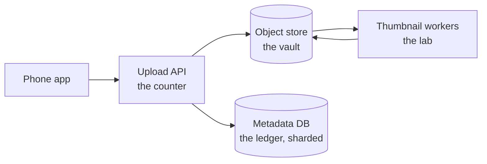
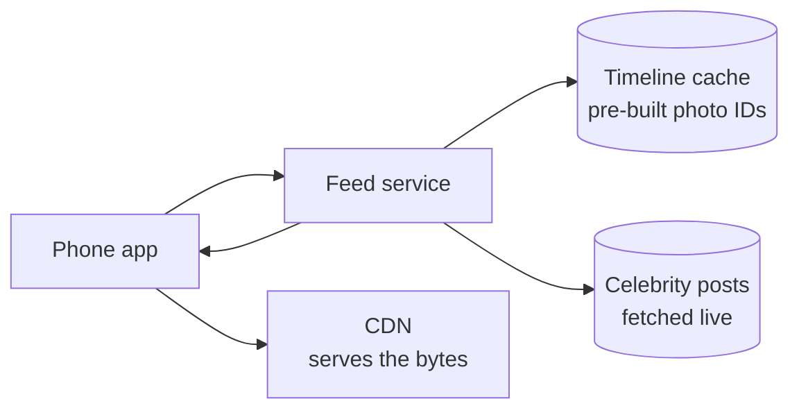

export const meta = {
  slug: 'design-instagram',
  title: 'Design Instagram: A Photo-Sharing System',
  tier: 'advanced',
  order: 29,
  summary:
    'The capstone case study: upload pipelines, sharded metadata, CDNs, and the fan-out problem behind a feed that serves a billion photos.',
  estimatedMinutes: 20,
};

## Why this matters

This is the capstone — the lesson where everything in the course finally shares one roof.
It's also the single most-asked system design interview question in the industry: *design
Instagram*. Interviewers love it because there is no single right answer, only a series of
good decisions under pressure. The trick isn't knowing every technology; it's showing a
clean thought process: scope the problem, do the math, design the write path, design the
read path, and name the hard part before they do. That's exactly how this lesson is
structured — think of it as a rehearsal with the answers included.

## Step one: clarify the scope

Every strong interview answer starts the same way: by narrowing the problem before touching
a whiteboard. Say this out loud:

- **Functional scope:** users upload photos, users view a home feed of photos from people
  they follow, users follow and unfollow each other. That's it.
- **Non-functional scope:** massive scale (hundreds of millions of daily users), low feed
  latency, and photos that must never be lost once uploaded.
- **Out of scope:** stories, reels, DMs, ads, comments. Naming what you're *not* building
  is half the interview — it shows you can bound a problem.

## Back-of-the-envelope math

Interviewers watch your arithmetic the way driving examiners watch your mirrors. State your
assumptions, keep the math simple, and round aggressively:

- Assume **100M photo uploads per day** and an average stored photo of **~500KB** after
  compression. That's `100M × 500KB ≈ 50TB` of new photo bytes every day — before
  thumbnails. Generate a few resized variants per photo and you're writing on the order of
  **100TB+ per day**, which compounds to **tens of petabytes per year**. That number is the
  whole storage strategy: you don't keep this on application servers.
- Reads dwarf writes. Assume a **100:1 read-to-write ratio** — each photo viewed many
  times — and you need roughly **5PB/day of read bandwidth**. Nobody serves that from
  origin servers; this is where the CDN earns its keep (you know this from the CDNs
  lesson).
- The feed is the hot path. Every one of those daily users opens the app and expects
  their feed *now*. Whatever you design, a feed load should be a cache lookup, not a
  computation.

The math has already told you the shape of the system: cheap durable byte storage for
writes, a CDN absorbing nearly all reads, and a feed path engineered for sub-100ms
responses. Summarized as the capacity plan you'd sketch on the whiteboard:

| Resource | Back-of-envelope | Drives the decision |
| --- | --- | --- |
| Photo bytes written | ~50TB/day (100M × 500KB), more with variants | Object storage, never the DB |
| Photo bytes stored | Tens of petabytes/year | Multi-region replication, lifecycle tiers |
| Photo bytes read | ~5PB/day at 100:1 read:write | CDN absorbs nearly all of it |
| Feed reads | One cache lookup per app open | Timeline cache, not computation |

Now let's build it.

## The upload pipeline: the photo lab

This lesson's running analogy is an old-school **photo printing lab**. You drop a roll of
film at the counter, the clerk hands you a claim ticket *immediately*, and you leave.
Behind the counter, the real work happens out of sight: the negatives go into the archive
vault, the lab prints your photos in standard sizes, and the order gets logged in the
ledger. The counter never makes you wait for the developing.

Map it onto the system and the design almost draws itself:

- **The counter** is the **upload API**. The phone app POSTs the photo; the API stores
  the bytes and returns a photo ID right away. It never blocks on image processing.
- **The vault** is **object storage** (think Amazon S3). Photo bytes are big, immutable
  blobs — they don't belong in a database, they belong in a store built for exactly
  this: write once, read many, replicate across regions, eleven nines of durability.
- **The lab** is a pool of **async workers**. A queue of "photo uploaded" events feeds
  workers that generate thumbnails (feed-size, profile-size, story-size), so the app can
  serve the right size for every screen without resizing on the fly.
- **The ledger** is the **metadata database**: photo ID, owner, timestamp, and a pointer
  to the bytes in object storage. Small, structured, queryable — sharded, which we'll get
  to.

Why async? Resizing images burns CPU. Doing it synchronously makes every upload slow,
couples your API to your image pipeline's worst day, and turns one failed thumbnail into
a failed upload. Async means the user gets their claim ticket in milliseconds, and a
failed thumbnail job just retries invisibly.

<PacketFlow
  stages={["Phone app", "Upload API", "Object store"]}
  servers={["Thumbnail workers", "Metadata writer", "CDN edge"]}
  requestLabel="photo"
  duration={5}
/>

Watch one photo's journey: the phone hands it to the API, the API drops the bytes into
object storage and returns immediately — then the photo fans out to the thumbnail
workers, the metadata writer, and CDN prefetch, all without the user waiting.

## Metadata: the ledger, sharded

Here's a decision the math forces on you: photo bytes and photo metadata get *different*
storage, because they have different shapes and different query patterns. The bytes are
large, immutable, and fetched by ID — object storage. The metadata is tiny, structured,
and queried by owner and time ("show me Maya's latest 20 photos") — a database.

But one database won't hold the metadata for billions of photos, so you shard it — the
Sharding Strategies lesson, applied. Shard by photo ID or by user ID; either way, each
shard owns a slice of the ledger and queries for one user's photos hit one shard. This
isn't hypothetical: Instagram's engineering team has written about running sharded
PostgreSQL in production, with photo IDs generated to encode the shard they live on.
The pattern is the point, not the vendor: **the ledger must be partitionable by the
key you query by**, or your most common read becomes a scatter-gather across every
shard.

## Delivery: the prints go to the corner store

When a user scrolls their feed, the actual photo bytes don't come from your servers —
they come from a **CDN**, the way a photo lab distributes finished prints to corner
stores instead of making every customer drive to the central lab. The phone app gets
signed CDN URLs from the feed response and fetches bytes from the nearest edge PoP.
Popular photos hit 95%+ edge cache ratios (you did this math in the CDNs lesson); the
origin object store only serves the first fetch per region. That 5PB/day of read
bandwidth? The CDN absorbs nearly all of it, and your origin bill stays sane.

## The feed: the newspaper routes

Now the hard part — and the part interviewers are really testing. Extend the analogy:
the feed is a **newspaper delivery route**. There are two ways to get the morning paper
to subscribers.

**Fan-out on write (push)** is the paperboy: when Maya posts a photo, the feed service
stuffs her photo ID into the pre-built home timeline of *every follower*. Reading a
feed is then trivially cheap — one lookup of your own timeline. But the write cost
scales with follower count: a post to 1,000 followers is 1,000 timeline writes.

**Fan-in on read (pull)** is the newsstand: timelines are assembled at request time by
gathering recent posts from everyone you follow and merge-sorting them. Writing a post
costs almost nothing; reading costs scale with how many people *you* follow.

And then there's the **celebrity problem** — the interviewer's favorite trap, sometimes
called the Justin Bieber problem. A user with 100 million followers posts a photo.
Under pure push, that's **100 million timeline writes for a single post** — write
amplification so extreme it can melt the feed service. Under pure pull, every one of
those 100 million followers pays merge-sort cost on every feed load instead.

The production answer is a **hybrid**: push for ordinary users (where fan-out is
cheap), and treat high-follower accounts specially — their posts are fetched at read
time and merged into the pre-built timeline. You pay the pull cost only for the tiny
fraction of accounts that would break push, and everyone else gets the cheap pre-built
read. Twitter's timeline architecture famously works this way, and the reasoning
transfers directly.

<StepThrough
  title="Feed generation: push, pull, and the celebrity"
  nodes={[
    { id: "author", label: "Author posts", x: 120, y: 50, w: 110 },
    { id: "svc", label: "Feed service", x: 360, y: 50, w: 110 },
    { id: "t1", label: "Timeline A", x: 90, y: 165, w: 100 },
    { id: "t2", label: "Timeline B", x: 240, y: 165, w: 100 },
    { id: "t3", label: "Timeline C", x: 390, y: 165, w: 100 },
    { id: "cache", label: "Timeline cache", x: 240, y: 255, w: 130 },
  ]}
  edges={[
    { from: "author", to: "svc" },
    { from: "svc", to: "t1" },
    { from: "svc", to: "t2" },
    { from: "svc", to: "t3" },
    { from: "t1", to: "cache" },
    { from: "t2", to: "cache" },
    { from: "t3", to: "cache" },
  ]}
  steps={[
    {
      title: "Push: stuff the photo into every follower's timeline",
      caption: "Maya posts. The feed service writes her photo ID into the pre-built home timeline of each follower — one write per follower. Reading is then a single cheap lookup.",
      highlight: ["author", "svc", "t1", "t2", "t3"],
    },
    {
      title: "Reads stay fast: timelines live in cache",
      caption: "Timelines are just lists of photo IDs, kept hot in a cache like Redis. A feed load is a cache read — the photo bytes themselves come from the CDN. This is the Caching Strategies lesson earning its keep.",
      highlight: ["t1", "cache"],
    },
    {
      title: "The celebrity problem: one post, 100M writes",
      caption: "Now a celebrity with 100 million followers posts. Pure push demands ~100M timeline writes for a single photo — write amplification that can overwhelm the feed service.",
      highlight: ["author", "svc"],
    },
    {
      title: "Hybrid: pull the celebrities, push everyone else",
      caption: "High-follower accounts are fetched at read time and merged into the pre-built timeline. Ordinary users keep the cheap push path; only the accounts that would break push pay the pull cost.",
      highlight: ["author", "t1", "t2", "t3", "cache"],
    },
  ]}
/>

Notice the separation the whole design keeps returning to: the feed service deals in
**IDs** (tiny, cacheable, mergeable), while the **bytes** flow through the CDN. That
split — metadata path vs byte path — is the single most important architectural line in
the system. Every time the design gets confusing, ask "is this about IDs or about
bytes?" and it gets clear again.

## The follow graph: the other database

Photos aren't the only thing that needs sharding — the **follow graph** does too.
Follows are edges (follower → followee), and at Instagram scale there are hundreds
of billions of them. They live in a sharded store of their own, because the query
patterns differ from photo metadata: "who does Maya follow?" (fan-out reads walk
*out* from a user) and "does Alex follow Maya?" (a single indexed lookup on a
profile view) shard naturally by follower, while "who follows the celebrity?"
shards by followee and gets paginated — nobody renders a 100M-row follower list in
one response.

The follow graph is also where the celebrity problem quietly lives a second life:
the feed service needs the follower list to do fan-out on write, so that read must
be fast and paginated, not a full table scan wearing a nice query. In the interview,
mentioning the follow graph as a separate sharded concern — distinct from both
photo bytes and photo metadata — is what separates a good answer from a great one.

## Serving the right size: variants and signed URLs

One more detail the lab analogy covers nicely: the lab prints your photo in several
standard sizes, and the counter hands you the right one for the frame you bought.
The feed response doesn't contain photo bytes — it contains a set of CDN URLs, one
per variant (thumbnail, feed-size, full-resolution). The phone app picks the variant
for the screen it's rendering: a 100-pixel avatar never downloads the 4K original.

For private accounts, those URLs are **signed** — they carry an expiry timestamp
and a signature, so a leaked URL stops working after an hour instead of living on
the internet forever. The CDN verifies the signature at the edge without ever
calling your API. Access control, enforced where the bytes actually flow.

## Edge cases: what breaks at a billion photos

The design above is the happy path. The interview points come from naming what breaks:

- **Hot shards.** If you shard metadata by user ID, the celebrity's shard becomes a
  furnace — every one of their posts lands on the same shard, and every fan's read
  hammers it. Sharding by photo ID spreads a celebrity's photos evenly across shards
  instead. The shard key must survive your most lopsided user.
- **The thundering herd.** A photo goes viral and a million phones request the same
  CDN URL within a minute — the classic stampede from the Caching Strategies lesson.
  The CDN's edge cache absorbs it, but the *first* fetch per PoP still hits origin.
  Request coalescing at the edge (one origin fetch per PoP per object) is what keeps
  that first fetch from becoming a million of them.
- **Duplicate uploads.** The user taps "post" twice, or the app retries on a flaky
  connection. Without an **idempotency key** (a client-generated upload ID the API
  dedupes on), one photo becomes two ledger entries pointing at two vault objects.
  Cheap to prevent, embarrassing to fix after the fact.
- **Deletes and the CDN.** A user deletes a photo; the object store drops it, the
  ledger drops the row — but the CDN edge still serves the cached copy until it
  expires. Deletes need **cache invalidation or short TTLs** on the byte path, and
  you should say which one you picked and why.
- **Feed staleness is a feature.** Your post doesn't appear in every follower's
  timeline in the same millisecond, and nobody cares. The feed is *allowed* to be
  eventually consistent — which is precisely why the push path can be async and the
  whole design holds together. Know which parts of your system are allowed to lag;
  it buys you enormous architectural freedom.

## What you'd say in the interview

Walk it back in one minute: scope to upload, feed, follow; 100M uploads/day means
tens of petabytes a year in object storage, so bytes never touch the database;
metadata goes to a sharded DB keyed by the query pattern; the CDN absorbs the 100:1
read amplification; thumbnails are async so uploads feel instant; and the feed is a
hybrid — fan-out on write for normal users, fan-in on read for celebrities, timelines
cached as ID lists. Then name the trade-off you didn't take: pure push melts on
celebrities, pure pull makes every read expensive, and your hybrid is the deliberate
middle. That's a passing answer.

## Takeaways

1. **Scope first, then math, then design.** The back-of-the-envelope (100M uploads/day,
   ~50TB/day of photo bytes, 100:1 read ratio) dictates the architecture before a single
   component is chosen.
2. **Bytes and metadata get different storage.** Immutable blobs go to object storage;
   small, queryable records go to a sharded database partitioned by your query key.
3. **Uploads return fast because the slow work is async.** The API stores bytes and
   hands back an ID; thumbnail workers process the queue behind the counter.
4. **The feed is a fan-out problem.** Push (fan-out on write) makes reads cheap but
   breaks on celebrities; pull (fan-in on read) makes writes cheap but reads expensive.
   The hybrid — push for most, pull for celebrities, timelines cached as ID lists with
   bytes on the CDN — is the production answer.

<Quiz
  lessonSlug="design-instagram"
  questions={[
    {
      question: "Why does the design store photo metadata in a sharded database instead of alongside the photo bytes in object storage?",
      options: [
        "Object storage cannot hold more than a few terabytes, so metadata needs its own home",
        "Databases are always faster than object storage for every kind of read",
        "Metadata is small, structured, and queried by owner and time — while photo bytes are large, immutable blobs fetched by ID, so each gets storage optimized for its own shape",
        "Sharded databases automatically generate thumbnails, which object storage cannot do",
      ],
      correctIndex: 2,
    },
    {
      question: "Using the lesson's back-of-the-envelope math — 100M uploads/day at ~500KB per photo — roughly how much new photo storage is needed per day, before thumbnails?",
      options: [
        "About 5TB per day",
        "About 50TB per day",
        "About 500TB per day",
        "About 5PB per day",
      ],
      correctIndex: 1,
    },
    {
      question: "Under pure fan-out on write, a celebrity with 100 million followers posts one photo. What happens?",
      options: [
        "The system must perform roughly 100M timeline writes for that single post — write amplification that can overwhelm the feed service",
        "Each follower's phone downloads the photo 100M times",
        "The object store must replicate the photo to 100M regions",
        "Nothing special — the CDN absorbs the extra writes",
      ],
      correctIndex: 0,
    },
    {
      question: "Why are thumbnails generated asynchronously, after the upload API has already responded?",
      options: [
        "Thumbnail workers can only run at night when traffic is low",
        "The object store refuses to store more than one size per photo",
        "The metadata database must be updated before any image processing can begin",
        "So the user isn't left waiting on CPU-heavy image processing — the upload feels instant, and a failed thumbnail job can retry invisibly",
      ],
      correctIndex: 3,
    },
  ]}
/>

---

## Sources & further reading

- Instagram Engineering, "Sharding & IDs at Instagram" (2012) — how Instagram sharded
  PostgreSQL in production, with photo IDs generated to encode their shard.
- Amazon S3 documentation — object storage semantics: write-once blobs, eleven nines of
  durability, and the read-many model the upload pipeline relies on.
- Martin Kleppmann, *Designing Data-Intensive Applications* (O'Reilly, 2017), Ch. 5
  (Replication) — the write-vs-read work trade-off as it applies to derived views and
  followers.
