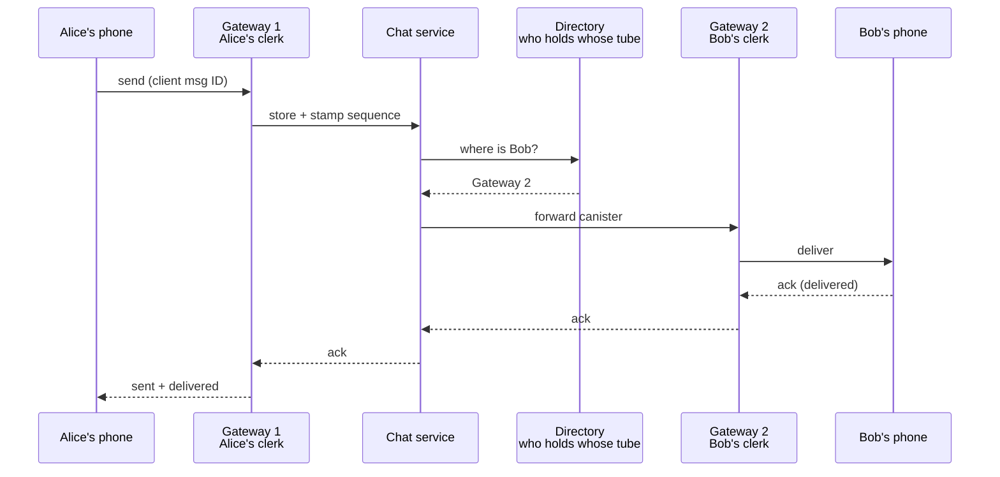
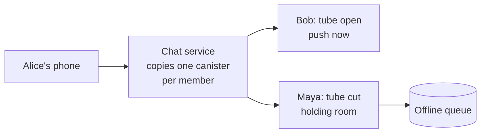

export const meta = {
  slug: 'designing-chat-at-scale',
  title: 'Designing Chat at Scale: Messaging Like WhatsApp',
  tier: 'advanced',
  order: 33,
  summary:
    'The realtime interview classic: persistent connections, per-conversation ordering, delivery receipts, presence, and group fan-out at WhatsApp scale — and what end-to-end encryption takes away from the server.',
  estimatedMinutes: 22,
  difficulty: 4,
  topics: ['system design', 'messaging', 'interview'],
};

## Why this matters

Two triggers. First, the interview: "design WhatsApp" is one of the most-asked system
design questions in the industry, and it punishes hand-waving harder than most. Say "we'll
use WebSockets" and the interviewer nods; fail to explain what happens to two million open
sockets when a server dies, and the nodding stops.

Second, the page you will get at 2 a.m. if you build it wrong: your shiny new chat app
launches, a million phones open it at once, and every one of them asks "which of my
contacts are online right now?" Your presence service — the thing that was supposed to be
a cute green dot — melts your database with a fan-out storm, and the database takes the
message pipeline down with it. This lesson is how you avoid both the failed interview and
the page.

The running analogy for the whole lesson: an old-fashioned **pneumatic-tube post
office**, staffed by clerks who never sleep. Customers keep a tube open to the post office
at all times; clerks fire canisters back and forth through the tubes. Every technical term
gets mapped onto this post office, out loud, as we go. And watch out for the network
gremlins — they love chewing through tubes, and the whole design assumes they will.

<VideoCard videoId="4-8fV_O_FzI" title="Design a Chat System — Real Interview Explanation | System Design" source="CodeGreedy" description="Walks through why realtime chat is a hard problem: latency, availability, fault tolerance, WebSockets and queues at scale." />

## Step one: clarify the scope

- **Functional scope:** 1:1 messaging, group messaging, delivery receipts
  (sent/delivered/read), presence (online/last-seen), media attachments, offline delivery.
- **Non-functional scope:** billions of users, tens of billions of messages a day,
  sub-second delivery, phones with dying batteries on flaky networks.
- **Out of scope:** voice/video calls, stories/status, payments. Naming what you're
  *not* building is half the interview — it shows you can bound a problem.

<VideoCard videoId="vvhC64hQZMk" title="WHATSAPP System Design: Chat Messaging Systems for Interviews" source="Gaurav Sen" description="Walks the WhatsApp interview starting with requirement setting before any architecture." />

## Back-of-the-envelope math

Interviewers watch your arithmetic the way driving examiners watch your mirrors. State
your assumptions, keep the math simple, and round aggressively:

- Assume **2B users** with ~10% connected at any moment: **200M open connections**. If
  one server holds ~2M connections — WhatsApp's Erlang engineers demonstrated 2M per
  box in 2012 (the talk's deck documents a 2.8M-connection run), which we'll come back to — that's on the order of **100 gateway servers**
  for the connection layer. The connection layer is cheap; it's the fan-out that costs.
- Messages: tens of billions a day. WhatsApp publicly reported **64 billion messages
  processed in a single day** back in 2014, and the user base has roughly quadrupled since.
  At ~1KB per text message envelope, that's tens of terabytes a day of message flow —
  trivial next to Instagram's photo bytes. Chat is not a bandwidth problem; it's a
  connection-count and fan-out problem.
- Presence: the hidden multiplier. If the average user has **200 contacts** and presence
  changes fan out to all of them, one "came online" event is 200 writes. A billion daily
  presence flaps is 200 billion writes — for green dots. This is why presence gets its
  own section, and its own cautionary tale.

<VideoCard videoId="rFoky1Ez4Ds" title="🚀 Back-of-the-Envelope Estimation (System Design) #systemdesign  #bandwidth #coding #tech " source="Java Treasure Tech" description="Teaches traffic, QPS, storage, and bandwidth estimation with a worked example, mirroring the section's Fermi math." />

## The realtime channel: picking your tube

Back to the post office. A customer could walk up to the counter, ask "any mail for me?",
get told no, walk away, and come back thirty seconds later. That's **long-polling**: the
client sends an HTTP request and the server holds it open until a message arrives or a
timeout hits, then the client immediately asks again. It works through the grumpiest
corporate proxies, but every message pays for a full HTTP request/response cycle —
headers and all — and there's always a gap between "response received" and "next request
sent" where a message sits waiting.

**Server-sent events** are a tube that only blows one way: the server can push to the
client over HTTP, but the client can't send anything back through it. Fine for a news
ticker; useless as your only chat channel, because you still need a second channel to
send messages up.

**WebSockets** (RFC 6455, 2011) are the real pneumatic tube: one TCP connection, opened
with an HTTP upgrade handshake, then kept open for full-duplex traffic in both directions
with only a couple of bytes of framing per message. The tube stays open; canisters fly
both ways whenever anyone has something to send. This is the production choice for chat,
and the choice this lesson assumes from here on.

Precise definition underneath the analogy: a WebSocket is a persistent, full-duplex TCP
connection initiated by an HTTP Upgrade handshake, after which either side can send framed
messages with minimal overhead. Long-polling emulates push with repeated half-duplex
requests; SSE gives you server-to-client push only. The analogy builds the intuition; the
definition is what you keep.

<VideoCard videoId="IIhXKoomoNY" title="Polling vs Server-Sent Events (SSE) vs WebSockets | System Design with Microsoft SWE" source="Mayank Joshi" description="Compares polling, long polling, SSE and WebSockets with protocol details and a tradeoff table for choosing." />

## Holding two million tubes: connection management

Each open tube needs a clerk holding the other end. In the system, that's the
**gateway** (or connection) server: a fleet of machines whose only job is holding
persistent connections and shuttling canisters. WhatsApp's team built theirs on
**Erlang** — a language designed for telephone switches, where "millions of simultaneous
calls that must never drop" is the original job description. Engineer Rick Reed's 2012
Erlang Factory talk describes pushing past **2 million connections on a single
server** — the talk's deck documents a 2.8M-connection run — after tuning the BEAM virtual machine and the FreeBSD kernel underneath it. One
Erlang process per connection — processes so cheap they make threads look extravagant —
plus hot code loading, so you can deploy without hanging up anyone's tube. The chat
server itself grew out of ejabberd, heavily customized: protocol, auth, offline
messaging, all reworked.

Three problems fall out of this, and interviewers love all three:

**Where does a reconnecting client land?** A phone's tube gets chewed through by the
gremlins — tunnels, elevators, dead zones. When the client reconnects, it may land on a
different gateway. So you need a **directory**: a mapping of user → current gateway
server, updated on every connect and disconnect. Routing a message means consulting the
directory, then forwarding the canister to the right clerk. Sticky routing (hashing the
user ID to a gateway) reduces directory lookups, but the directory is still the source of
truth, because servers die and clients roam.

**How do you know a tube is dead?** TCP won't tell you promptly — a phone that drove
into a tunnel looks exactly like a phone with nothing to say. So the client and server
trade **heartbeats**: tiny "still here" pings. The clerk taps the tube every so often;
silence means the tube is gone. The interval is a three-way tug of war: short heartbeats
detect dead peers fast but wake the phone's radio constantly (a radio waking from sleep
burns a disproportionate burst of battery — the tail-energy problem), while long
heartbeats save battery but leave dead tubes occupying clerk time and delay offline
detection. Tens of seconds to a few minutes is the usual compromise; there is no free
setting, only a chosen pain.

**What happens when a clerk's whole desk collapses?** A gateway server dies with two
million tubes open. Two million phones notice the silence and reconnect at once — the
**reconnect storm**. The directory must absorb two million re-registrations, and the
surviving gateways must absorb the connections. Mitigations: clients reconnect with
jittered backoff (never all at once — the gremlins chew, but the herd must not
stampede), and gateways shed load by refusing new connections gracefully when saturated,
letting clients try the next gateway.

<VideoCard videoId="vXJsJ52vwAA" title="How to scale WebSockets to millions of connections" source="Ably Realtime" description="Explains vertical and horizontal scaling patterns for millions of stateful persistent connections in production." />

## The message flow: send, store, push

Watch one canister's journey through the post office:

1. **Send.** Alice's phone drops a canister into her tube with a client-generated message
   ID. The ID is hers — if the gremlins eat the acknowledgement, her phone resends the
   same canister with the *same* ID rather than inventing a new one. (This is the
   idempotency key from the Idempotency lesson, wearing a post-office uniform.)
2. **Store.** The chat service writes the message to durable storage *before* attempting
   delivery, and stamps it with a per-conversation sequence number. Store first, route
   second — a crash between "received" and "stored" is a lost message, and lost messages
   are the unforgivable sin of a chat system.
3. **Push.** The service consults the directory, finds Bob's gateway, and forwards. If
   Bob's tube is open, his clerk fires the canister down it immediately. If not, the
   canister goes to the overnight holding room — the offline queue — which we'll get to.

The acks climb back up the same path: Bob's phone acks to his gateway (delivered), the
service records it, Alice's gateway tells her phone. Two grey ticks, then blue — each
tick is an acknowledgement crossing a specific boundary.

<VideoCard videoId="Uh1TvVMkhw4" title="System Design: Design WhatsApp" source="TechGik" description="Follows one message sender to receiver: persistent connections, durable storage, queues, acks, offline sync and retries." />

## Ordering: the numbered pigeonholes

Canisters don't always arrive in the order they were sent. Alice's "on my way" and "bring
snacks" can take different paths — or her phone can resend one after a gremlin attack —
and arrive reversed. The post office solves this with numbered pigeonholes: the chat
service stamps every message in a conversation with a **sequence number**, and Bob's
phone slots incoming canisters into pigeonhole order, holding a #5 that arrives before #4
for a beat rather than displaying them out of order.

The design decision that matters: the *server* is the sequencer, not the clients. In a
1:1 chat either side could number its own messages, but in a group chat five people type
at once and nobody's clock agrees with anybody else's. One authority — the chat service —
hands out the numbers, and every client renders in that order. Clock skew between phones
becomes irrelevant, because wall-clock time is never the ordering mechanism. The failure
mode this prevents is subtle but maddening: without server sequencing, two group members
see the same argument in different orders, and both are sure the other is lying.

<VideoCard videoId="_UTcNPgzqJ4" title="Kafka Explained — It's Not a Queue" source="The Hot Path" description="Shows the partition is the unit of ordering: guaranteed within one partition, nowhere else, and what breaks it." />

## Delivery semantics: what the ticks really promise

The ticks are a contract, so state it precisely:

- **Sent** (one tick): the server has durably stored your message. It exists beyond your
  phone now.
- **Delivered** (two ticks): it reached Bob's device. Not his eyes — his device.
- **Read** (blue): Bob opened the conversation. (And yes, the read receipt that starts
  arguments is just an ack with a fancier name.)

Now the advanced question: can the system promise **exactly-once** delivery? No — not
over an unreliable network, and this is worth saying plainly in an interview because it
sounds wrong until you think about it. The sender can never distinguish "my message was
lost" from "my acknowledgement was lost," so it must retry; a retried message may
therefore arrive twice. The production answer is **at-least-once delivery plus
idempotent handling**: the client-generated message ID from the send step lets every
layer dedupe — the server drops a second canister with an ID it has already stored, and
Bob's phone drops a second display of an ID it has already rendered. Duplicates become
impossible to *observe*, which is the only kind of exactly-once that exists. (Kleppmann's
*Designing Data-Intensive Applications* develops this argument in full; the short version
is that "exactly-once" always means "effectively-once through deduping.")

Failure modes to name: the ack that arrives after the client gave up and resent (handled
by the ID dedupe), the message stored but never pushed because the directory entry was
stale (the gateway that died without deregistering — heartbeats bound this window), and
the read receipt for a message the recipient's phone never rendered (a client bug, but
your server design can't prevent it — only the client can).

<VideoCard videoId="JeCOqpfomJs" title="Message Queue System Design | Kafka, Partitions, DLQ & Delivery Semantics" source="Scale Tales" description="Explains at-most-once, at-least-once and exactly-once delivery semantics with acks, retries and idempotency context." />

## Presence: the chalkboard that nearly killed the post office

Here's the 2 a.m. page, reconstructed. The post office keeps a giant chalkboard by the
door: *who is standing at a counter right now.* Every customer glances at it — "is Maya
here?" — and every time someone walks in or out, a clerk updates the board and shouts
the change to everyone who might care.

The naive implementation: each "came online" event fans out a presence update to all of
the user's contacts. With 200 contacts each, a million users opening the app in the
morning is 200 million presence writes before anyone has sent a single message. And "last
seen" is worse — it's a write on *every* disconnect, and phones disconnect constantly.
The gremlins chew tubes all day; each chew is a presence flap.

The chalkboard nearly bankrupts the post office, so you ration it:

- **Push presence only to people who are looking.** A contact sees your green dot only
  if they have your chat open (or you theirs). The fan-out set shrinks from "all
  contacts" to "active conversations."
- **Sample, don't stream.** "Last seen" doesn't need second precision; update it on
  meaningful transitions, and let clients cache it.
- **Separate the chalkboard from the canisters.** Presence rides its own lightweight
  path — its own service, its own storage — so a presence storm degrades green dots, not
  message delivery. The page at 2 a.m. happened because presence shared a database with
  the message pipeline; the fix is a bulkhead (you know this pattern from the Resilience
  Patterns lesson).

The interview line: "presence is a fan-out problem disguised as a status string, and
I'll isolate it from the message path."

<VideoCard videoId="UCFsENcAFi8" title="System Design: WhatsApp" source="Mukul Raina" description="Deep-dive by a Microsoft engineer on presence at scale: heartbeats, subscriber notification, batching, and approximate status." />

## Group chats: one canister, many tubes

Group messaging is fan-out, plain and simple. Alice sends one canister to the post
office; the clerk copies it into every member's tube. The cost of a group message grows
with the member count: a thousand-member group turns one send into a thousand
deliveries. This is why sane systems cap group size — WhatsApp's is on the order of a
thousand members — because unbounded fan-out is how one enthusiastic group melts a
gateway.

Two details separate the good answers:

- **Ordering across writers** is why the server sequences (previous section). Five
  people typing at once, one numbering authority.
- **Membership changes are messages too.** "Maya joined" and "Omar left" are system
  events stamped with sequence numbers like everything else, so a client that missed the
  "Omar left" event doesn't keep showing Omar as a member forever. State changes ride the
  same ordered stream as chat messages — one mechanism, not two.

<VideoCard videoId="4Kz2w1i50ME" title="A Reconnection Window Duplicated Messages for 15 Minutes — Design WhatsApp" source="TheCodeForge" description="Covers group chat fan-out, including when write fan-out breaks down at large group sizes." />

## Offline delivery: the overnight holding room

When Bob's tube is cut — phone off, app killed, gremlin activity — his canisters wait in
the **overnight holding room**: a per-user [offline queue](#/lesson/message-queues) on the server. The moment Bob
reconnects, his phone asks "anything for me?" and drains the queue in sequence-number
order, acking as it goes. Only acked messages leave the room.

Two design decisions:

- **The queue is per recipient, not per conversation.** Bob might owe messages from
  twelve conversations; one drain pulls all of them, with per-conversation order
  preserved by the sequence numbers.
- **The room has a closing time.** Undelivered messages can't pile up forever — storage
  is finite, and a phone number abandoned for a year shouldn't hold mail indefinitely.
  WhatsApp's security whitepaper documents a 30-day cap: undelivered messages are
  deleted after 30 days. Pick your TTL, state it, and move on; the interviewer wants to
  hear that you thought about unbounded growth, not the exact number.

The failure mode: Bob reconnects, drains 500 queued messages, and his phone dies at
message 312. On the next reconnect he asks again from his last acked sequence number —
the server replays from 313, and his client's idempotency dedupe swallows any overlap.
At-least-once plus dedupe, all the way down.

<VideoCard videoId="q-rQ6zQKSJs" title="Master scalable notification system architecture: core pipelines, async fan-out, and idempotency" source="Tech" description="Designs a push-notification pipeline with durable queues, per-channel dispatch, retries, and idempotency at scale." />

## Media: canisters too fat for the tubes

A photo is a canister too fat for the pneumatic tube. The post office handles it the way
the Instagram lesson's photo lab did: Alice's phone uploads the bytes to **blob storage**
first (the freight depot), and the chat message itself carries only a small envelope — a
content hash, a thumbnail, and a pointer to the depot. Bob's phone fetches the bytes from
the depot (via CDN) after the message arrives.

The split from the Instagram lesson returns: the chat pipeline deals in tiny envelopes;
the byte pipeline deals in blobs. Media never flows through the gateway servers' tubes —
that would clog the very connections whose whole job is staying light and fast. Uploads
and downloads are plain HTTPS to the depot; only the *notification* ("there's a photo for
you, here's where to get it") rides the realtime channel.

<VideoCard videoId="C2IuZsY73Kw" title="How WhatsApp Sends Photos & Videos | Complete System Explained | Part 3" source="Learn With Manoj" description="Explains WhatsApp's media pipeline: chunked uploads, encrypted blobs, media servers, and CDN-based delivery." />

## End-to-end encryption: sealed envelopes

Now seal every canister in an envelope the clerks are not allowed to open. That's
**end-to-end encryption**: Alice's phone encrypts the message with Bob's public key (via
the Signal Protocol — the X3DH handshake plus the Double Ratchet, which WhatsApp adopted
across all its clients in April 2016 with Open Whisper Systems), and only Bob's phone
holds the private key. The post office can read the address label — sender, recipient,
message ID, timestamp — but never the letter inside.

This is a privacy triumph with sharp architectural teeth. Say them out loud, because
interviewers ask:

- **The server routes on metadata, and metadata is all it gets.** Sender ID, recipient
  ID, message ID, timestamp, message size. E2EE hides content, not the fact of
  communication. Anyone telling you E2EE makes the server blind is overselling it — the
  address labels are still legible.
- **No server-side search of message content.** "Find the message where Maya sent the
  address" can't run on the server anymore; it runs on the phone, over the locally
  stored plaintext. Server search indexes become client search indexes.
- **No server-side content moderation or scanning.** The spam filter that used to read
  messages now gets only metadata and behavioral signals. This is a product trade-off
  wearing an architecture costume, and it's worth naming as one.
- **Key distribution still needs the server.** For Alice to encrypt to Bob the first
  time, she needs his public keys — the server acts as a **key bulletin board**
  (identity key plus signed prekeys, in Signal terms). Which means the server must be
  trusted to hand out the *right* keys — a malicious bulletin board could substitute its
  own. That's why apps show safety numbers and QR codes: out-of-band key verification,
  the human check on the bulletin board's honesty.
- **Group chats use sender keys.** Each member generates a per-group sender key and
  distributes it to the others through pairwise encrypted channels; the server then fans
  out one ciphertext per message instead of re-encrypting per recipient. The server's job
  doesn't change — copy the sealed canister to every tube — it just can't peek.

The sealed envelope doesn't change the post office's *routing*; it changes what the post
office is *allowed to know*. Every feature that used to read the letters — search,
moderation, server-side media decisions based on content — moves to the endpoints or
dies. That's the real cost of E2EE, and naming it is the advanced answer.

<VideoCard videoId="ihz2WA1Tvbo" title="How Signal Uses End-to-End Encryption | The Signal Protocol Explained" source="Lexorithm" description="Covers the Signal protocol's X3DH key agreement, double ratchet, and forward secrecy in messaging." />

## Edge cases: what breaks at two billion users

- **The thundering herd of reconnects.** A datacenter blip drops ten million tubes at
  once; ten million phones retry immediately. Jittered exponential backoff on the client
  plus graceful load shedding on the gateways ("I'm full, try the next one") turns a
  stampede into a queue.
- **The directory split-brain.** Two gateways both believe they hold Bob's tube — one
  stale, one fresh. Messages race to the dead tube and pile in its holding room while Bob
  stares at an empty chat. Fix: directory entries carry a generation number, and delivery
  to a stale generation gets bounced back for re-routing. Stale reads are bounded by the
  heartbeat interval that detects the dead gateway.
- **Replay past the dedupe window.** Idempotency dedupe needs a bounded memory of seen
  IDs; an attacker replaying a very old message ID might slip past the window. Bound the
  window generously, and treat E2EE replay protection (the Double Ratchet already rejects
  replays) as the backstop for encrypted chats.
- **Presence flapping at scale.** A user on a train goes through ten tunnels in ten
  minutes: ten "online/offline" transitions, each fanning out. Dampen it — don't
  broadcast "offline" until the tube has been silent past a grace period, and coalesce
  rapid flaps into one update.
- **The 1,000-member group at midnight.** Someone drops a message into the biggest
  group at peak hour: one send, a thousand pushes, and every recipient's phone lights
  up. Rate-limit group sends per sender, and cap the fan-out work a single message can
  trigger on one gateway.

<VideoCard videoId="5Kn32cIWPSY" title="Building WhatsApp with Jean Lee" source="The Pragmatic Engineer" description="WhatsApp engineer #19 shares scaling lessons: Erlang processes, lean teams, and simplicity at billions of users." />

## What you'd say in the interview

Walk it back in one minute: scope to 1:1, groups, receipts, presence, media; WebSockets
for the realtime channel because you need full-duplex push with minimal framing; gateway
servers hold the persistent connections (WhatsApp proved ~2M per box on Erlang, with 2.8M documented in the talk's deck); a
directory maps users to gateways for routing across reconnects; the chat service stores
first, stamps a per-conversation sequence number, then pushes — offline messages wait in
a per-user queue with a TTL; delivery is at-least-once with client message IDs for
dedupe, because exactly-once is impossible over an unreliable network; presence is a
fan-out problem on its own isolated path, or it pages you at 2 a.m.; media rides the blob
store, not the realtime channel; and E2EE means the server routes sealed envelopes on
metadata alone — no server search, no server moderation, keys via a bulletin board with
out-of-band verification. Then name your trade-off: heartbeats are a three-way tug
between detection speed, battery, and server load, and you picked a number on purpose.

<VideoCard videoId="cr6p0n0N-VA" title="Design Whatsapp: System Design Interview w/ a Ex-Meta Senior Manager" source="Hello Interview" description="Step-by-step mock-interview walkthrough of designing WhatsApp by a former Meta senior manager." />

## Takeaways

1. **Chat is a connection-count and fan-out problem, not a bandwidth problem.** Tens of
   billions of small messages a day; the expensive parts are holding hundreds of
   millions of persistent connections and copying each message to every recipient.
2. **WebSockets win the realtime channel** because chat needs full-duplex server push
   with minimal per-message overhead; long-polling pays HTTP request/response tax on
   every message, and SSE only pushes one way.
3. **Gateways hold tubes; the directory routes canisters; the service sequences.**
   Connection state, routing state, and ordering authority are three separate concerns —
   split them, and reconnect storms, stale routes, and out-of-order groups each get a
   clean answer.
4. **Store first, sequence on the server, deliver at-least-once with dedupe.** The
   server stamps per-conversation sequence numbers so every client renders one true
   order; client-generated message IDs make redelivery invisible. Exactly-once is not on
   the menu over an unreliable network.
5. **Presence is a fan-out problem disguised as a green dot.** Isolate it from the
   message path, push it only to watchers, and dampen flaps — or the chalkboard takes
   down the post office.
6. **E2EE seals the envelopes but leaves the address labels.** The server still routes
   on sender, recipient, and message ID; content-dependent features (server search,
   server moderation) move to the endpoints or disappear, and key distribution becomes
   the thing you must get right.

<Quiz
  lessonSlug="designing-chat-at-scale"
  questions={[
    {
      question: "Why does the lesson choose WebSockets over long-polling for the chat channel?",
      options: [
        "Long-polling is banned by RFC 6455, which reserves polling for file downloads only",
        "Chat needs full-duplex server push with minimal per-message overhead — long-polling pays a full HTTP request/response cycle per message and leaves a gap between polls, while SSE can only push one way",
        "Long-polling cannot work over HTTPS, so it is unusable for encrypted chat apps",
        "WebSocket connections never drop, so the gateway fleet needs no reconnection logic",
      ],
      correctIndex: 1,
    },
    {
      question: "Alice's 'on my way' and 'bring snacks' arrive at Bob's phone in reverse order. What fixes the display order?",
      options: [
        "The per-conversation sequence number stamped by the chat service — the single ordering authority — letting Bob's phone slot messages into pigeonhole order",
        "The client-generated message ID, which also encrypts the message content",
        "The heartbeat interval, which forces the network to deliver packets in order",
        "The directory lookup, which re-sorts messages by sender before forwarding",
      ],
      correctIndex: 0,
    },
    {
      question: "What caused the 2 a.m. page in the lesson's presence story?",
      options: [
        "End-to-end encryption prevented the server from reading presence updates, so they queued forever",
        "The WebSocket gateways ran out of memory because presence updates are larger than chat messages",
        "The offline message queue filled up with presence updates and blocked real messages",
        "Every 'came online' event fanned out a presence update to all of the user's contacts — with ~200 contacts each, a million app-opens became hundreds of millions of writes that melted the shared database",
      ],
      correctIndex: 3,
    },
    {
      question: "Under end-to-end encryption, what can the chat server still see and route on?",
      options: [
        "Nothing at all — E2EE makes the server completely blind, including to who is talking to whom",
        "Only the message size, because sender and recipient identities are also encrypted",
        "The envelope metadata: sender ID, recipient ID, message ID, timestamp, and size — the address label on a sealed envelope. Content-dependent features like server-side search move to the endpoints",
        "The full message text, since the server holds a copy of every private key for recovery",
      ],
      correctIndex: 2,
    },
    {
      question: "Why does the lesson prescribe at-least-once delivery plus idempotent handling instead of exactly-once?",
      options: [
        "Idempotency keys are only needed for payments, so chat systems skip them and accept duplicates",
        "Exactly-once doubles the server count, and the budget only covers at-least-once",
        "Exactly-once requires WebSockets, which the lesson rejected for the realtime channel",
        "Exactly-once is impossible over an unreliable network — the sender cannot tell a lost message from a lost acknowledgement, so it must retry; client-generated message IDs let every layer dedupe, making duplicates unobservable",
      ],
      correctIndex: 3,
    },
  ]}
/>

---

## Go deeper

Want to keep pulling this thread? These talks and tutorials go further than we did here:

- [Scaling to Millions of Simultaneous Connections: Rick Reed](https://www.youtube.com/watch?v=wDk6l3tPBuw) — Rick Reed (WhatsApp), Erlang Factory SF Bay Area 2012 (~45 min). The classic WhatsApp talk the lesson cites — the primary source behind its connection math.
- [How WhatsApp Handles Millions of Messages | System Design](https://www.youtube.com/watch?v=ctkknHdnxrc) — System Design channel, YouTube (~47 min). WebSockets, connection registry, ordering, presence, and group fan-out end to end.
- [WhatsApp handles 3 MILLION TCP Connections Per Server! How do they do it?](https://www.youtube.com/watch?v=vQ5o4wPvUXg) — Hussein Nasser, The Backend Engineering Show. How one server holds millions of persistent chat connections.
- [WHATSAPP System Design: Chat Messaging Systems for Interviews](https://www.youtube.com/watch?v=vvhC64hQZMk) — Gaurav Sen. This lesson's exact problem, chapter by chapter: jump to 21:00 for consistent hashing, 21:55 for message queues, and 23:05 for messaging idempotency and ordering.

## Sources & further reading

- Fette & Melnikov, RFC 6455, "The WebSocket Protocol," IETF, 2011 — the persistent
  full-duplex connection the realtime channel is built on.
- Rick Reed (WhatsApp), "Scaling to Millions of Simultaneous Connections," Erlang Factory
  SF Bay, 2012 — the 2M-connections-per-server result (the deck documents a 2.8M-connection
  run), BEAM/FreeBSD tuning, and the
  one-process-per-connection model behind WhatsApp's gateway layer.
- WhatsApp Blog, "end-to-end encryption" (April 2016) — the completion announcement for
  default E2EE across all WhatsApp communication, built with Open Whisper Systems'
  Signal Protocol (partnership announced November 2014).
- Signal Protocol documentation (signal.org/docs) — the X3DH handshake and Double
  Ratchet construction underneath WhatsApp's sealed envelopes, including sender keys for
  groups.
- Martin Kleppmann, *Designing Data-Intensive Applications* (O'Reilly, 2017), Ch. 11
  (Stream Processing) — why exactly-once delivery is unachievable over unreliable
  networks and how idempotent handling makes redelivery unobservable.
- WhatsApp Security Whitepaper — documents the 30-day deletion cap on undelivered
  messages and the server's role as a directory for public identity keys.
