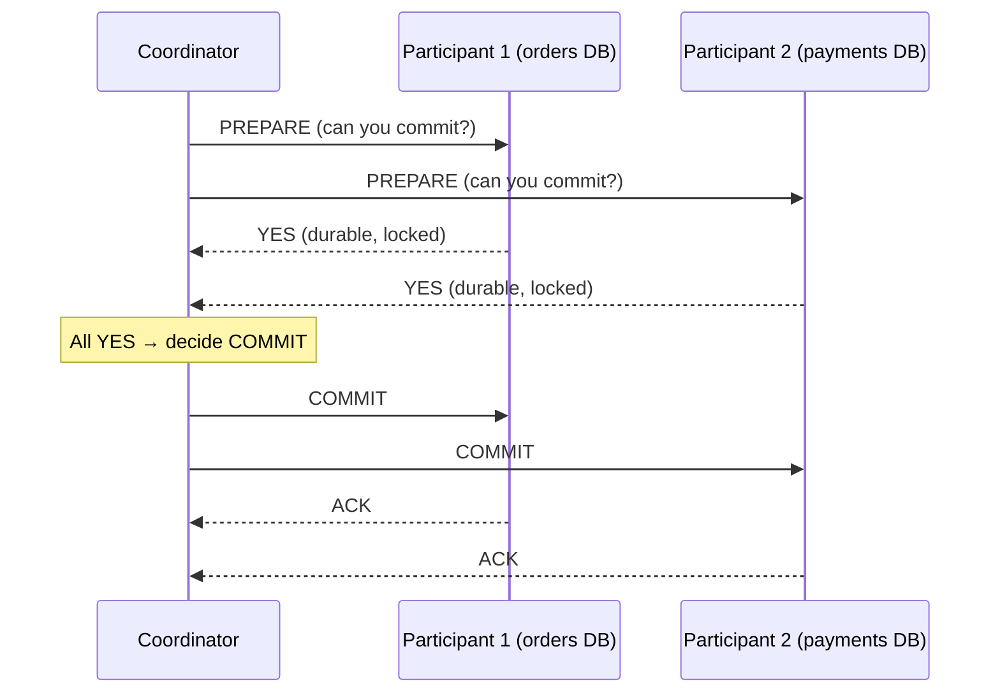
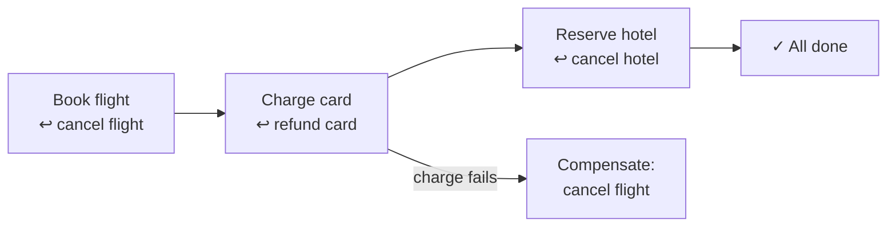
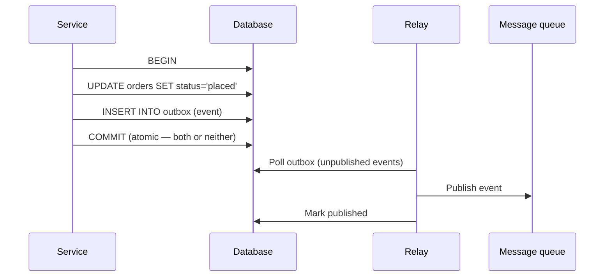

export const meta = {
  slug: 'distributed-transactions',
  title: 'Distributed Transactions',
  tier: 'advanced',
  order: 22,
  summary:
    'Atomicity across machines: two-phase commit, why coordinators block, saga patterns with compensating actions, and the outbox pattern for reliable messaging.',
  estimatedMinutes: 22,
};

## Why this matters

Inside one database, transactions are a solved problem: BEGIN, do work, COMMIT, and
atomicity is guaranteed. Across *multiple* databases or services, that guarantee
evaporates — and "book the flight, charge the card, reserve the hotel" either all happens
or the customer has a very bad day. **Distributed transactions** are how you get atomicity
back, and every approach is a trade-off between correctness, availability, and your own
sanity. This is the lesson where the CAP theorem and the microservices lesson collide at
full speed.

Analogy: a **wedding planner coordinating five vendors** — florist, caterer, band,
photographer, venue — for one Saturday. The planner calls each one: "Can you commit to
June 14th?" Everyone says yes (phase 1: prepare). Then the planner calls back: "It's on —
lock it in" (phase 2: commit). But if the photographer stops answering between the two
calls, the planner is stuck: the florist is holding the date, the money is half-moved, and
nobody knows whether the wedding is happening. That stuck state has a name — **blocking** —
and it's the central drama of this lesson.

## Two-phase commit (2PC): the classic

One **coordinator** drives the transaction across **participants** (databases/services):

Phase 1 (**prepare**): each participant does the work, writes it durably, takes the locks,
and votes YES — or votes NO and the whole thing aborts. Phase 2 (**commit/abort**): the
coordinator broadcasts the decision; participants apply it.

The numbers: a commit costs **2 round trips** minimum (prepare + commit), and participants
hold **locks for the entire duration** — including while waiting on a slow coordinator.
Lock-hold time directly caps throughput: if a 2PC transaction holds locks for 50 ms,
that's at most ~20 such transactions per second per contended row, no matter how much
hardware you buy. 2PC buys atomicity with latency and contention.

## The blocking problem

Here's the wedding planner's nightmare, formalized. If the coordinator crashes *after*
participants voted YES but *before* sending the decision, participants are **blocked**:
they hold locks, they can't unilaterally commit (maybe the coordinator decided abort), and
they can't unilaterally abort (maybe it decided commit — another participant may have
already committed). They wait. And wait. Locks held, throughput zero, until the
coordinator recovers.

**Three-phase commit** adds a pre-commit round so participants can time out and abort
safely — but it only handles coordinator crashes, not network partitions, and the extra
round trip made it unpopular. The industry verdict: 2PC is fine *within* one database
cluster (where the coordinator is really the primary and failures are fenced), and
increasingly avoided *across* independent services — which is where **sagas** come in.

<StepThrough
  title="Two-phase commit: the blocking problem"
  nodes={[
    { id: "coord", label: "Coordinator", x: 240, y: 70 },
    { id: "a", label: "Participant A", x: 130, y: 210 },
    { id: "b", label: "Participant B", x: 350, y: 210 },
  ]}
  edges={[
    { from: "coord", to: "a" },
    { from: "coord", to: "b" },
  ]}
  steps={[
    {
      title: "Prepare phase: everyone votes YES",
      caption: "The coordinator asks A and B: can you commit? Both vote YES — and now hold their locks, waiting for the final decision.",
      highlight: ["coord", "a", "b"],
    },
    {
      title: "The coordinator crashes",
      caption: "Before sending the decision, the coordinator dies. A and B have voted YES; they can neither commit nor abort on their own.",
      highlight: ["coord"],
    },
    {
      title: "Participants are blocked",
      caption: "A and B sit on their locks with throughput at zero, waiting for a coordinator that may never come back. This is the blocking problem.",
      highlight: ["a", "b"],
    },
    {
      title: "Recovery unblocks them",
      caption: "The coordinator recovers, replays its log, learns the prepared transaction, and finally sends COMMIT. The locks release.",
      highlight: ["coord", "a", "b"],
    },
  ]}
/>

## Sagas: embracing the lack of atomicity

A **saga** breaks the distributed transaction into a sequence of **local transactions**,
each with a **compensating action** that semantically undoes it:

If step 3 fails, the saga runs compensations for steps 1–2 *in reverse*. Notice what's
missing: **isolation**. Between "flight booked" and "flight cancelled," other transactions
see the intermediate state — the seat looks taken, then freed. Sagas give you **eventual
atomicity** (all-or-nothing *eventually*), not ACID atomicity. For most business processes
(orders, bookings, onboarding flows), that's exactly the right trade — and it's how
**orchestrated** (a central saga coordinator, e.g., Temporal/Cadence) or **choreographed**
(services react to each other's events, no center) sagas run the world's e-commerce.

Compensating actions are the hard part: "refund the card" is easy; "un-send the email" is
impossible — you send a *correction* email instead. Design compensations to be
**idempotent** (the saga might retry them) and accept that some effects are only
*semantically* undone, never truly erased.

## The outbox pattern: transactions + messaging, safely

The most common distributed-transaction bug in microservices: the service updates its
database and *then* publishes an event — and crashes between the two. Database says
"order placed," no event ever fires, downstream services never hear about it. Or the
reverse: event published, DB write rolled back — a ghost order haunts the system.

The **transactional outbox** fixes it with one local transaction:

The business write and the event land in the *same* local transaction — atomicity
restored. A separate relay process publishes outbox rows to the queue (at-least-once, so
consumers must be idempotent — there's our old friend from *Message Queues*). **Debezium**
(CDC-based) is the industrial-strength version: it tails the database's own replication
log instead of polling a table.

## Choosing your poison

| Approach | Atomicity | Availability during failures | Complexity |
| --- | --- | --- | --- |
| 2PC/XA | Strong (ACID) | Blocks on coordinator failure | Moderate (built into DBs) |
| Saga (orchestrated) | Eventual | High (each step independent) | High (compensations) |
| Saga (choreographed) | Eventual | Highest | Highest (debugging events) |
| Outbox + events | Per-service local | High | Low–moderate |

The pragmatic default for microservices: **avoid distributed transactions where the
domain allows it** (redesign boundaries so one service owns the write), use the **outbox**
for "update + notify," and reach for **sagas** when a multi-step business process truly
spans services. Reserve 2PC for single-cluster cases where the database does it for you.

## Takeaways

1. 2PC gives true atomicity at the cost of 2 round trips, long lock holds, and blocking if the coordinator dies mid-protocol.
2. Sagas trade isolation for availability: local transactions plus idempotent compensating actions, run forward on success and backward on failure.
3. The outbox pattern makes "DB write + publish event" atomic via one local transaction plus a relay — the fix for the dual-write bug.
4. Default to avoiding cross-service transactions; use outbox for notify-flows and sagas for multi-step processes.

<Quiz
  lessonSlug="distributed-transactions"
  questions={[
    {
      question: "In two-phase commit, what does it mean for participants to be 'blocked'?",
      options: [
        "They are waiting for more participants to join",
        "The coordinator crashed after YES votes but before the decision, so participants hold locks indefinitely, unable to commit or abort",
        "The network is too slow for the prepare phase",
        "Two transactions are deadlocking on the same row",
      ],
      correctIndex: 1,
    },
    {
      question: "What does a saga use instead of rollback?",
      options: [
        "Database savepoints",
        "Compensating actions that semantically undo each completed step, run in reverse order",
        "A global lock held for the saga's duration",
        "Automatic retries until the step succeeds",
      ],
      correctIndex: 1,
    },
    {
      question: "What bug does the transactional outbox pattern fix?",
      options: [
        "Slow queries blocking the event loop",
        "The dual-write problem: crashing between a database update and publishing its event",
        "Cache stampedes on hot keys",
        "Deadlocks between concurrent transactions",
      ],
      correctIndex: 1,
    },
    {
      question: "What consistency does a saga provide compared to ACID?",
      options: [
        "Full ACID atomicity and isolation",
        "Eventual atomicity — all-or-nothing eventually, but intermediate states are visible",
        "Stronger than ACID, with causal ordering",
        "No consistency at all — steps are independent",
      ],
      correctIndex: 1,
    },
  ]}
/>

---

## Sources & further reading

- Jim Gray, "Notes on Data Base Operating Systems" (1978) — the paper that formally characterized two-phase commit (the protocol itself was published earlier by Lampson & Sturgis).
- Hector Garcia-Molina & Kenneth Salem, "Sagas" (ACM SIGMOD 1987) — the original saga paper.
- Chris Richardson, microservices.io, "Transactional Outbox" — the pattern write-up with implementation options.
- Martin Kleppmann, *Designing Data-Intensive Applications* (O'Reilly, 2017), Ch. 9 — distributed transactions, 2PC limitations, and exactly-once semantics.
