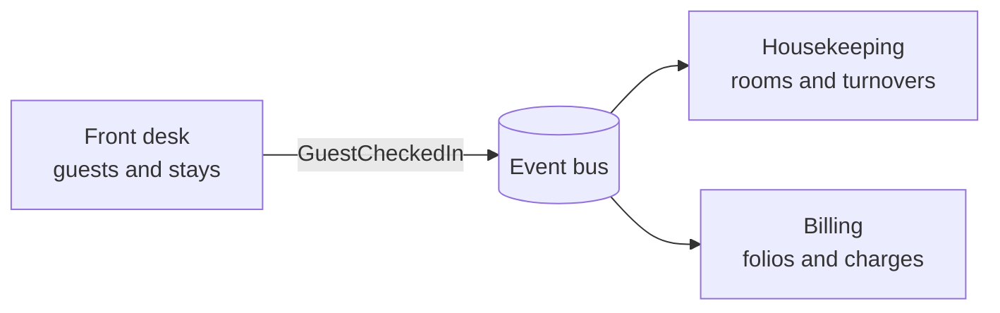
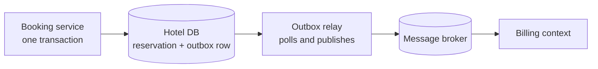

export const meta = {
  slug: 'domain-driven-design',
  title: 'Domain-Driven Design: Let Events Tell the Story',
  tier: 'advanced',
  order: 27,
  summary:
    'Model the business the way the business talks: ubiquitous language, bounded contexts, aggregates, and domain events — plus event storming, the transactional outbox, and a peek at event sourcing.',
  estimatedMinutes: 20,
  difficulty: 4,
  topics: ['ddd', 'architecture'],
};

## Why this matters

Some systems die of load. More die of confusion.

Picture the 2 a.m. page: billing just charged a guest who never checked in. You dig in
expecting a race condition and find something worse — the `Guest` table means "person with
a reservation" to the booking service and "anyone who ever created an account" to billing,
and somewhere between them floats a `GuestUpdated` event that nobody can decode. The fix
isn't a bigger queue. It's a model that says what the business means.

That's what Domain-Driven Design is: a discipline for making your software's model match
the business's mental model, so whole classes of bugs have nowhere to hide. And it's the
strategy underneath the event-driven tactics you've already learned — queues move
messages, but DDD decides which messages deserve to exist.

For this lesson, you run a hotel. Front desk, housekeeping, billing — one building, three
different worlds. Keep it in mind; we'll check back in often.

🎥 **Learn more:** [Reactive DDD: Modeling Uncertainty - Vaughn Vernon](https://www.youtube.com/watch?v=MKLRXCiU5IE) — SpringDeveloper. Vaughn Vernon traces DDD's core ideas and why they still guide today's distributed, event-driven systems.

## Ubiquitous language: call it what the hotel calls it

At the front desk, "check-in" is a five-minute ritual: ID, key card, room assignment. Say
"check-in" to housekeeping and you'll get a blank stare — they talk about "turnovers" and
"dirty rooms." Billing knows neither; they know "folios" and "settled accounts." Same
hotel, same guest, three working vocabularies.

DDD's first and cheapest idea: adopt the vocabulary of the people who do the work, and
use it everywhere. In conversation. In docs. And — the part teams skip — in the code.
Class names, method names, event names, table names. The front desk's `checkIn(guest,
room)` must not quietly become `updateCustStatus(2)` three layers down. Every translation
is a place for meaning to rot.

The precise term is **ubiquitous language**: a shared, rigorous vocabulary used by domain
experts and developers alike, with no translation layer between how the business talks
and how the code reads. If the hotel calls it a folio, your code calls it a `Folio` — not
an `InvoiceRecord`, not `BillingDocV2`.

This sounds soft until you've debugged a system where "order" meant four different
things depending on which service you asked. Then it sounds like the cheapest night
audit you ever ran.

🎥 **Learn more:** [Agile Book Club: Ubiquitous Language](https://www.youtube.com/watch?v=aozNdnfSDBs) — James Shore. James Shore's book-club session explores building a shared domain vocabulary between experts and developers.

## Bounded contexts: draw the property lines

The last section sets a trap: if the front desk, housekeeping, and billing all speak
differently, whose `Guest` class wins? Nobody's. Each department is a **bounded
context** — a boundary inside which one model and one language apply, and outside of
which they don't. The front desk's Guest (name, dates, room preferences) and billing's
Account (folio, charges, payment method) describe the same human being and share nothing.
That isn't duplication; it's honesty. Forcing one `Guest` object across all three is
exactly how you earn the 2 a.m. page from the introduction.

Contexts still talk to each other — not through shared tables, but through published
interfaces and integration events. Direct synchronous calls between contexts are common
too (often behind an anti-corruption layer); the point is that contexts never reach into
each other's tables or private models. They exchange **integration events** over async
transport. The front desk publishes
`GuestCheckedIn`; housekeeping hears it and schedules a turnover for checkout day;
billing hears it and opens a folio. Each context translates the event into its own
language on arrival.

One caution: a bounded context is a modeling boundary, not a microservice. You can run
three contexts in one deployable or split one context across services. Confuse the two
and you'll build a distributed monolith with extra YAML.

🎥 **Learn more:** [Bounded Contexts - Eric Evans - DDD Europe 2020](https://www.youtube.com/watch?v=am-HXycfalo) — Domain-Driven Design Europe. Eric Evans himself explains bounded contexts and keeping each model coherent within its boundary.

## Aggregates: the clerk guarding the reservation book

Inside a context, some rules must never break halfway: a room-night can't be sold twice,
you can't check in against a cancelled reservation, and checkout can't precede check-in.
The **aggregate** is the cluster of objects that enforces those rules as a unit, and the
**aggregate root** — say, `Reservation` — is the only door in. Outside code talks to the
root; nobody reaches past it to fiddle with a line item directly.

Two properties do the heavy lifting. First, the aggregate is a **consistency boundary**:
everything inside it commits in a single transaction, so the invariants hold or nothing
happens. Second, aggregates don't call each other directly. A Reservation doesn't phone
the Folio to add a charge — it publishes a domain event and moves on. That restraint is
the hinge of this whole lesson, and we'll come back to it.

A personal rule of thumb: if your "aggregate" is a bag of getters and setters with the
real validation scattered across three services, that's a data structure wearing an
aggregate costume. The root earns the name by saying no.

🎥 **Learn more:** [Mauro Servienti - Talk Session: All Our Aggregates Are Wrong](https://www.youtube.com/watch?v=KkzvQSuYd5I) — Explore DDD. Mauro Servienti shows where aggregate designs go wrong and how to draw consistency boundaries right.

## Domain events: the past, written down

Now the core of the lesson. A **domain event** is an immutable record of something the
business cares about that has already happened. Three traits, no exceptions:

- **Past tense, in business language.** `GuestCheckedIn`. `RoomMarkedClean`.
  `BillSettled`. (The canonical textbook example is `OrderPlaced` — same idea.) Not
  `CheckInGuest`: that's a command, a wish, not a fact. And never `GuestUpdated`, which
  manages to say that everything happened and nothing happened at the same time.
- **Immutable.** You don't edit the past; you append a correction. Overcharged the folio?
  That's a new event, `ChargeCorrected` — not an UPDATE. History you can rewrite is a log
  you can't trust.
- **Identity plus timestamp.** Every event says *what* it happened to (`reservationId`)
  and *when* (`occurredAt`), and usually carries its own event id too, so a duplicate
  delivery is recognizable as the same fact. That small detail is what makes retries safe.

Back to the hotel: the front-desk logbook. Every entry dated, initialed, written in ink.
A mistaken entry never gets erased — it gets a new entry underneath it. Six months
later, "what did we know at 9:41 a.m.?" has an exact answer. Domain events give your
system the same property: a past you can audit and a present you can explain.

🎥 **Learn more:** [Domain Events: The Hidden Power Behind Software Architecture](https://www.youtube.com/watch?v=36HtWmAAH94) — EzzyLearning. Short explainer on what domain events are, why past-tense facts help, and raising them from aggregates.

## Event storming: the whole hotel on one wall

So where do these events come from? You put everyone in a room — developers, the
front-desk manager, the housekeeping lead, the billing veteran who knows where every
stray charge hides — and you cover a wall in sticky notes. No laptops. This is **event
storming**, and the order of operations is the entire trick. Walk through it:

<StepThrough
  title="Event storming the check-in flow"
  nodes={[
    { id: "commands", label: "Commands (blue)", x: 70, y: 100, w: 105 },
    { id: "aggregates", label: "Aggregates (yellow)", x: 185, y: 100, w: 110 },
    { id: "events", label: "Domain events (orange)", x: 305, y: 100, w: 120 },
    { id: "policies", label: "Policies (lilac)", x: 420, y: 100, w: 100 },
    { id: "readmodels", label: "Read models (green)", x: 240, y: 215, w: 150 },
  ]}
  edges={[
    { from: "commands", to: "aggregates" },
    { from: "aggregates", to: "events" },
    { from: "events", to: "policies" },
    { from: "events", to: "readmodels" },
  ]}
  steps={[
    {
      title: "Storm the events",
      caption: "Everyone writes domain events on orange stickies — past tense, one per note — and lines them up on a timeline, left to right. No filtering, no judging; chaos is the point. Find every 'Happened' in the business.",
      highlight: ["events"],
    },
    {
      title: "Find the commands",
      caption: "For each event, ask what caused it: a blue sticky for the command, plus who issued it — the guest, the clerk, the night-audit job. Commands can be refused; events already happened.",
      highlight: ["commands", "events"],
    },
    {
      title: "Draw the aggregates",
      caption: "Cluster the rules: which yellow sticky decides whether each command succeeds? Reservation guards against double-booking; Room guards its own state; Folio guards the charges. These clusters become your consistency boundaries.",
      highlight: ["aggregates", "commands", "events"],
    },
    {
      title: "Spot the policies",
      caption: "Lilac stickies for the automation rules: whenever GuestCheckedIn, send the welcome email; whenever BillSettled, release the room hold. Policies turn events into new commands — the system's reflexes.",
      highlight: ["policies", "events"],
    },
    {
      title: "Sketch the read models",
      caption: "Green stickies for the screens and reports people actually need. The 'rooms needing turnover' board is just a projection of check-out and cleaning events. If a read model can't be built from your events, you're missing events.",
      highlight: ["readmodels", "events"],
    },
  ]}
/>

A few practical notes from people who run these for a living: a real session burns
through hundreds of stickies in a few hours, and facilitators timebox each round —
twenty minutes is typical — to keep the chaos productive. The wall is disposable. The
shared language the room walks out with is the deliverable.

And one workshop rule worth stealing: anyone who writes a CRUD-y note like `GuestUpdated`
owes the sticky-note jar a coin. By lunch the jar is full — and the team has learned
past-tense naming the fun way.

🎥 **Learn more:** [Alberto Brandolini - 100,000 Orange Stickies Later | Øredev 2019](https://www.youtube.com/watch?v=fGm62ra_mQ8) — Øredev Conference. EventStorming's creator walks through the sticky-note workshop technique for discovering domain models together.

## Specification by example: agree on the stories first

Storming finds the events; **specification by example** pins down what they mean.
Instead of debating abstract rules, the team writes concrete examples: "Given a guest
checks in at 1:10 a.m., when the night audit runs at 3 a.m., then the stay counts toward
the previous business day." Each example fits on an index card and is precise enough to
become a test.

This is the "build the right thing" half of the story: examples are the cheapest
possible prototype of shared understanding. A dozen good examples surface the
misunderstandings a forty-page spec would bury. They graduate into acceptance tests, and
the tests become living documentation — the spec can't rot, because the build enforces
it.

🎥 **Learn more:** [Automation Obsession: Are You Automating the Wrong Things? - Gojko Adzic "Specification by Example"](https://www.youtube.com/watch?v=8EhH2oqK2-0) — Pragmatic Talks. Gojko Adzic discusses capturing shared understanding with concrete examples before committing to automation.

## Domain events vs integration events: the desk bell and the radio

Time to draw the distinction this lesson has been circling. Both are past-tense facts.
The difference is distance.

A **domain event** stays inside one bounded context and is dispatched **in-process** —
the front desk ringing the desk bell so its own back office hears. An **integration
event** crosses a context boundary over **async transport** — the radio message to the
housekeeping building across the street. Toggle between the two:

<VsToggle
  title="Two kinds of events"
  a={{
    label: "Domain events",
    title: "In-process, after the commit",
    points: [
      "Raised by an aggregate inside one bounded context",
      "Persisted in the same database transaction as the state change",
      "Dispatched in-process only after the transaction commits",
      "The preferred way for aggregates to affect each other — no direct calls",
    ],
    note: "Think: the front desk ringing its own desk bell.",
  }}
  b={{
    label: "Integration events",
    title: "Across contexts, over the wire",
    points: [
      "Carry facts across bounded-context boundaries",
      "Travel over async transport: a queue, a broker, an event bus",
      "The schema is a contract with other teams — version it deliberately",
      "Delivery is at-least-once, so consumers must be idempotent",
    ],
    note: "Think: the radio message to the building across the street.",
  }}
/>

Two mechanics deserve emphasis, because getting them wrong is a rite of passage:

**Persist first, publish later.** When the aggregate changes, the domain event goes into
the database in the *same transaction* as the state change — before anything is
published. Only *after the transaction commits* does the event get dispatched to
in-process handlers. A rolled-back check-in must never ring anyone's bell. Publish first
and you get ghost check-ins: downstream systems acting on a stay that never happened.

**Prefer events over direct calls between aggregates.** The Reservation doesn't invoke
the Folio; it publishes `GuestCheckedIn` and the folio's handler reacts. The publisher
never knows its consumers, which keeps the consistency boundary intact — and gives the
next section its seam to hook into.

One more consequence of dispatch-after-commit: handlers run *outside* the transaction,
so a throwing handler can't roll back the business fact. Write handlers to be retryable
and idempotent — your idempotency lesson from message queues is doing real work here.

🎥 **Learn more:** [Every Event, Everywhere, All at Once • Jacqui Read • GOTO 2025](https://www.youtube.com/watch?v=1dIjb9A4uow) — GOTO Conferences. Jacqui Read tours event types, contrasting internal domain events with public integration events.

## The transactional outbox: publish without the fear

Here's the nasty problem the last section left on the table: your database commit and
your broker publish are two separate systems, and you can't wrap them in one
transaction. The distributed-transactions lesson already showed you that road — it ends
in pain. So which goes first? Publish-then-commit risks ghost events; commit-then-publish
risks silent loss if you crash in between.

The **transactional outbox** refuses the dilemma. In the same local transaction that
saves the aggregate, you insert the event into an `outbox` table. One transaction, one
commit: the state change and the "still to publish" record live or die together. A
separate **relay** process polls the outbox, publishes each row to the broker, and marks
it sent. Crash between commit and publish? On restart the relay finds the unsent rows
and finishes the job. No distributed transaction, no lost events:

<PacketFlow
  stages={["Booking service", "Outbox table"]}
  servers={["Relay worker", "Message broker", "Billing context"]}
  requestLabel="event"
  duration={6}
/>

Watch one event's journey: written to the outbox in the same transaction as the booking,
then propagated outward through the relay, the broker, and into the billing context.
Now the failure modes worth internalizing:

- **The polling interval caps freshness.** Poll every 500 ms and each
  integration event waits *up to* half a second (average ~250 ms) before the relay
  even sees it. Tune the interval, or skip
  polling with change-data-capture (Debezium tailing the database log) if you need
  better.
- **The relay can publish twice.** Crash after publishing but before marking the row
  sent, and the event goes out again. Consumers must be idempotent — at-least-once
  delivery, all the way down.
- **Prune the outbox.** An outbox table nobody cleans is a disk-full page at 3 a.m.
  Archive or delete sent rows on a schedule.

🎥 **Learn more:** [On .NET Live: Shaving the outbox pattern yak](https://www.youtube.com/watch?v=JoPY0yfElK4) — dotnet. dotnet session on the outbox pattern's ideas, lessons learned, and alternatives from building it.

## Event sourcing: when the logbook is the database

One step further: what if you skipped the "current state" tables and stored *only* the
events? To answer "is room 412 clean right now," you replay every event that ever
mentioned it. That's **event sourcing** — the logbook as the source of truth, with
current state as a fold over history.

It fits audit-heavy domains beautifully; billing lives for "what did we know, and when."
It fits badly where history is boring — a simple settings page gains nothing from a
replayable past. And the failure mode to respect is **versioning**: rename
`GuestCheckedIn` five years from now and you've changed the meaning of every stored
event unless you upcast old ones on read. Treat event names as a public API to your
future self, and name them accordingly.

Notice the through-line of the whole lesson: domain events are the hotel's logbook,
the outbox is how the front desk reliably radios each entry across the street, and
event sourcing is never tearing a page out of that logbook.

🎥 **Learn more:** [EventSourcing & CQRS: a light introduction - Paolo Banfi - DDD Europe 2022](https://www.youtube.com/watch?v=nwzxyfsubyM) — Domain-Driven Design Europe. DDD Europe talk introducing event sourcing basics and how it fits with CQRS in real systems.

## Takeaways

1. Ubiquitous language means one shared vocabulary spoken identically in conversations, docs, and code — no translation layer where meaning rots.
2. Bounded contexts draw the property lines: each owns its model and its meaning of shared words, and contexts communicate through integration events, not shared tables.
3. Aggregates are consistency boundaries — the root enforces the invariants, everything inside commits in one transaction, and aggregates never call each other directly.
4. Domain events are immutable, past-tense facts carrying entity identity and a timestamp; persist them in the same transaction as the state change and dispatch only after commit. Remember the jar: `GuestCheckedIn`, never `GuestUpdated`.
5. Event storming discovers the model collaboratively: domain events on a timeline first, then commands, aggregates, policies, and read models.
6. The transactional outbox gives you reliable publishing without distributed transactions — one local transaction, a relay, and idempotent consumers.

<Quiz
  lessonSlug="domain-driven-design"
  questions={[
    {
      question: "What does 'ubiquitous language' require of the vocabulary the business uses?",
      options: [
        "It stays in meeting notes while the code uses its own technical terms",
        "It is used identically in conversations, documentation, and code — no translation layer",
        "It is defined once in a glossary that nobody reads",
        "It applies only to event names, not to classes or tables",
      ],
      correctIndex: 1,
    },
    {
      question: "Which name follows the lesson's rules for a domain event?",
      options: [
        "CheckInGuest — a clear imperative verb",
        "GuestUpdated — covers every kind of change at once",
        "GuestCheckedIn — past tense, a business fact that already happened",
        "Guest — named after the entity it belongs to",
      ],
      correctIndex: 2,
    },
    {
      question: "What is the key difference between a domain event and an integration event?",
      options: [
        "Domain events stay inside one bounded context and dispatch in-process; integration events cross context boundaries over async transport",
        "Domain events are stored in the database; integration events are never stored anywhere",
        "Integration events are always larger than domain events",
        "They are the same thing with different names",
      ],
      correctIndex: 0,
    },
    {
      question: "Why does the transactional outbox write the event to an outbox table in the same transaction as the state change?",
      options: [
        "It makes the database write measurably faster",
        "It keeps the events table in third normal form",
        "The message broker requires a database receipt before accepting events",
        "So the state change and the pending event commit or roll back together — no published event without persisted state, and no lost event on crash",
      ],
      correctIndex: 3,
    },
    {
      question: "In event storming, what goes on the wall first?",
      options: [
        "The aggregates, so the business rules are settled early",
        "The domain events, arranged on a timeline from left to right",
        "The database schema, so storage decisions are made up front",
        "The read models, so the UI drives the design",
      ],
      correctIndex: 1,
    },
    {
      question: "Inside one bounded context, why should the Reservation aggregate publish GuestCheckedIn instead of calling the Folio directly?",
      options: [
        "Direct method calls are slower than publishing events",
        "Events let you skip the database transaction entirely",
        "It keeps aggregates decoupled — the publisher never knows its consumers, and the consistency boundary stays intact",
        "The outbox pattern forbids all method calls between objects",
      ],
      correctIndex: 2,
    },
  ]}
/>

---

## Go deeper

Want to keep pulling this thread? These talks and tutorials go further than we did here:

- [The Art of Discovering Bounded Contexts](https://www.youtube.com/watch?v=ez9GWESKG4I) — Nick Tune, DevoxxUK 2017 (~45 min). Finding bounded contexts via subdomains — extends the lesson's "draw the property lines" scenario.
- [Event Storming](https://www.youtube.com/watch?v=mLXQIYEwK24) — Alberto Brandolini, DDD Europe 2019 (~45 min). The collaborative domain-discovery method from its inventor.
- [Alberto Brandolini - 50,000 Orange Stickies Later](https://www.youtube.com/watch?v=1i6QYvYhlYQ) — Alberto Brandolini, Explore DDD 2017 (~45 min). How EventStorming discovers aggregates and consistency boundaries.

## Sources & further reading

- Eric Evans, *Domain-Driven Design: Tackling Complexity in the Heart of Software* (Addison-Wesley, 2003) — the "blue book"; ubiquitous language, bounded contexts, and aggregates.
- Vaughn Vernon, *Implementing Domain-Driven Design* (Addison-Wesley, 2013) — the "red book"; tactical patterns and domain events in real codebases.
- Martin Fowler, "DomainEvent" (martinfowler.com) — the canonical short definition of a domain event.
- Microsoft, "Domain events: design and implementation" (Microsoft Learn, .NET Architecture Guides) — persisting events in the same transaction and dispatching after commit via an in-process dispatcher.
- Gojko Adzic, *Bridging the Communication Gap* (book tip) — specification by example: concrete examples as the cheapest shared understanding, graduating into living documentation.
- software-architektur.tv, [Nicole Rauch zu DDD, Event Storming & Specification by Example](https://software-architektur.tv/2020/09/10/folge017.html) (Folge 15, 2020) — event storming as collaborative DDD modeling; specification by example as building the right thing.
- [Domain Event pattern](https://badia-kharroubi.gitbooks.io/microservices-architecture/content/patterns/tactical-patterns/domain-event-pattern.html) (GitBook, *Microservices Architecture*) — the characteristics checklist: immutability, past-tense naming, timestamps, and entity identity.
