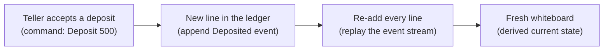
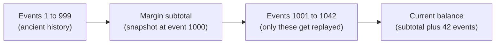
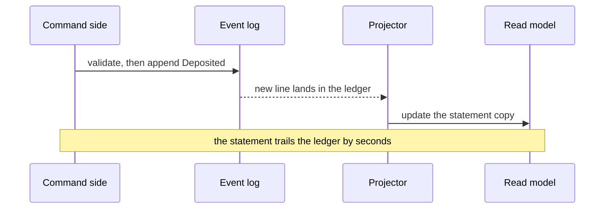

export const meta = {
  slug: 'event-sourcing-cqrs',
  title: 'Event Sourcing & CQRS: Your Database Is a Diary',
  tier: 'advanced',
  order: 32,
  summary:
    'Stop storing the current state and start storing the history: the append-only event log as source of truth, snapshots and projections for speed, and CQRS to split reads from writes — with the replay math, ordering guarantees, and failure modes that decide whether the pattern earns its keep.',
  estimatedMinutes: 18,
};

## Why this matters

The auditor arrives on a Tuesday with a clipboard and one question: "This account shows
a balance of four thousand dollars. Walk me through exactly how it got there — every
step, in order."

Your database answers: "The balance is four thousand dollars." That's it. That's the
whole answer. Somewhere in a transaction log that got rotated three weeks ago, the story
exists. In your system of record, it doesn't. The UPDATE statements that built that
balance overwrote each other like footprints in wet sand, and now someone with legal
authority wants the footprints back.

This is the question event sourcing exists to answer. Not "what is the state" but "how
did we get here" — with receipts. If your domain has money, inventory, medical records,
or anything else where "oops, the row just says 4000 now" is not an acceptable audit
trail, keep reading.

(And yes, the auditor will be back before this lesson is over. She has excellent timing
and no sense of humor about missing history.)

🎥 **Learn more:** [Event Sourcing Explained Using Football](https://www.youtube.com/watch?v=xPmQxYIi5fA) — Metaphorically Speaking. Uses a football analogy to show why storing facts (a ledger) beats storing only the current score.

## The ledger and the whiteboard

Walk into an old-fashioned bank branch. Behind the counter, two objects tell you
everything about the account you're asking about.

The first is the teller's ledger: a bound book, entries in ink, one line per thing that
happened. "March 3 — deposited 500. March 4 — withdrew 200. March 5 — fee 5." Nobody
erases a line. A mistake gets a new line underneath it: "March 6 — corrected March 5
fee, refunded 5." The book only grows, and it never lies about the past because the past
is all it contains.

The second is the whiteboard by the phone: "ACCT 4417 — BALANCE 4000." One number,
updated whenever someone remembers. It answers the only question most people ask, and it
answers fast. But smudge it, and the history is gone. The whiteboard knows the present
the way a goldfish knows the room it's in.

Most databases you've built are whiteboards. An UPDATE overwrites the row the way a
dry-erase marker overwrites the number. Fast to read, easy to reason about, and
completely amnesiac.

Event sourcing says: keep the ledger, derive the whiteboard. The bound book, an
append-only log of immutable events, is the system of record. The current state is a
convenience, recomputed by replaying the entries whenever you need it. Lose the
whiteboard? Wipe it clean and re-add the ledger. The balance comes back, because the
facts never left.

Say the mapping out loud once, because the whole lesson hangs on it:

- **A ledger entry is an event.** `Deposited(500)`, `Withdrew(200)` — past tense,
  immutable, a fact about something that already happened. ([The DDD lesson's logbook](#/lesson/domain-driven-design),
  same idea, now load-bearing.)
- **The bound book is the event log.** Append-only. You never edit line 41; you append
  line 42.
- **The whiteboard is the current state.** Derived, disposable, fast.
- **Re-adding the ledger is a replay.** Fold every entry from the first line to today,
  and the whiteboard rewrites itself.

One more piece of the branch before we get precise: the teller doesn't make you do your
banking and your balance inquiries at the same window. Deposits and withdrawals go to the
transaction counter; "what's my balance" goes to the inquiry desk, which reads from its
own copy. That split — one model for writing, another for reading — is CQRS, and we'll
get there.

🎥 **Learn more:** [Event Sourcing • Greg Young • GOTO 2014](https://www.youtube.com/watch?v=8JKjvY4etTY) — GOTO Conferences. Greg Young contrasts an erasable ledger with an immutable event log versus CRUD's overwrite model.

## Event sourcing, precisely

Strip the analogy. **Event sourcing** is a persistence pattern where the source of truth
is a chronological, append-only sequence of events, and current state is derived by
replaying them. Instead of storing `balance = 4000`, you store the full sequence that
produced it: `AccountOpened`, `Deposited(500)`, `Withdrew(200)`, `FeeCharged(5)`,
`FeeRefunded(5)`, and so on. The state at any moment is a left fold over the events —
start from nothing, apply each in order, arrive at now.

Two properties make this work, and both are non-negotiable:

**Events are immutable facts.** An event records something that happened, in past tense,
with the identity of what it happened to and when. `Deposited` names the account, the
amount, and the timestamp. You never update an event, because you can't update the past
— you append a compensating event. This is the same discipline as the DDD lesson's
domain events, and for good reason: in a well-factored system, the events you source are
the aggregate's domain events. One stream of events per aggregate; the aggregate is the
consistency boundary that decides which events get appended, in which order.

**The log is append-only and ordered.** Within one aggregate's stream, every event
carries a sequence number: 1, 2, 3, no gaps, no reordering. That per-stream ordering is
the whole ballgame. It's what makes replay deterministic. (Global ordering across all
aggregates is a much more expensive promise, and most systems wisely refuse to make it.
Kafka, for example, guarantees order within a partition, not across them.)

Here's the flow:

Notice what the diagram doesn't show: at no point does anyone overwrite a row. The write
path appends; the read path replays.

So what do you gain, concretely? Three things, in ascending order of how much they
matter:

1. **A past you can audit.** "What did we know at 9:41 a.m. on March 3?" Replay the
   stream up to that timestamp. The auditor gets her answer, with receipts. CRUD systems
   approximate this with audit tables bolted on afterward; event sourcing gets it as a
   side effect of the design.
2. **Debuggability from the future.** Production bug at 2 a.m.? Copy the event stream
   into a scratch environment and replay it. You don't reproduce the bug by guessing —
   you rewind time and watch it happen again, deterministically.
3. **New views for free.** Want a report nobody asked for last year — total fees per
   account per month? The data was always there, in the ledger. Write a new projector
   (next section), replay history through it, and the report exists, backfilled to day
   one. In a whiteboard world, that report is impossible: the history was erased as it
   happened.

🎥 **Learn more:** [Event Sourcing Explained - Why Immutability Changes Everything](https://www.youtube.com/watch?v=VdcYjQV19GM) — José Cruz (IT Architect). Walks through immutability, append-only event stores, and deterministic replay rebuilding state.

## Projections: the monthly statement

Nobody re-adds a thousand ledger lines for every balance inquiry, and no system replays
a full stream per request either. Instead you maintain **projections**: read models
built by listening to the event stream and updating some convenient shape. The monthly
bank statement is a projection. So is the whiteboard. So is a search index, a dashboard
counter, or a "recent transactions" list. One event stream can feed many projections,
each shaped for its own reader.

A projection is just a function: for each event, update the read model. `Deposited(500)`
arrives, so add 500 to the cached balance and append a row to the transactions list. The
projector keeps a checkpoint — "I've processed events up to sequence 8,412" — so a
restart resumes where it left off instead of from line one.

This is where the pattern starts charging rent, so count the costs honestly:

- **Every projection is code you own.** Each new read model is a projector to write,
  deploy, monitor, and debug. Three projections is a habit; thirty is a second system.
- **Rebuilding takes real time.** Backfilling a new projection over years of events is
  a batch job, and it competes for the same resources as the live system. Plan for it
  the way you'd plan any migration.
- **Projectors must be idempotent.** Delivery guarantees being what they are (more
  below), your projector will see some events twice. Applying `Deposited(500)` twice
  must not credit the account twice — the event's unique id makes the duplicate
  recognizable, and the projector skips work it already did.

🎥 **Learn more:** [CQRS & Event Sourcing Code Walk-Through](https://www.youtube.com/watch?v=5aznkIEvkKc) — CodeOpinion. Code walk-through showing events published to consumers that update projection read models for queries.

## Snapshots: the teller's subtotal

Here's the math that forces the next mechanism. Say an account's stream holds 2 million
events, and your replay folds 20,000 events per second. Rebuilding that account's state
from scratch takes 100 seconds. Nobody waits 100 seconds for a balance inquiry. The
ledger is complete, but the whiteboard takes too long to rewrite.

The teller solved this centuries ago: every fifty lines, she writes a subtotal in the
margin. Next time, she starts from the subtotal and re-adds only the lines after it.
That's a **snapshot**: a persisted copy of an aggregate's state at some sequence number,
so replay starts from the snapshot and folds only the events after it.

The arithmetic is yours to tune. Snapshot every 1,000 events and the worst case replays
999 events plus one snapshot read — milliseconds instead of minutes. Snapshot every 10
events and you're just maintaining a whiteboard with extra steps, paying write
amplification for snapshots nobody needed. The right interval comes from measuring your
own replay speed against your own latency budget; there's no universal constant, only
your numbers.

Two details that bite people:

- A snapshot is a **cache**, not the truth. If the snapshot corrupts, you delete it and
  replay from scratch. Slow, but correct. Never let snapshot logic diverge from replay
  logic — generate snapshots *by* replaying, or the two will disagree on a bad day.
- Snapshot schema evolves too. When the aggregate's shape changes, old snapshots must
  be discarded or migrated. Version your snapshots the way you version everything else.

🎥 **Learn more:** [Event Sourcing: Rehydrating Aggregates with Snapshots](https://www.youtube.com/watch?v=eAIkomEid1Y) — CodeOpinion. Shows how snapshots checkpoint aggregate state so rebuilds skip replaying the full event stream.

## CQRS: the separate windows

Back to the branch. The transaction counter handles deposits and withdrawals — writes,
validated against business rules, one customer at a time. The inquiry desk answers
balance questions from its own copy — reads, fast, no rules to enforce beyond "show the
number." Different windows, different staffing, different furniture. Nobody asks the
inquiry clerk to approve a loan.

**CQRS** — Command Query Responsibility Segregation — is that split, applied to your
system's model. The **command side** (write model) validates commands against the
aggregate's rules and appends events. The **query side** (read model) serves reads from
projections shaped for the questions people actually ask. They can scale independently,
store data differently (the write side in an event store, the read side in a document
database or a cache), and evolve on separate release cadences.

That trailing is the price, and it has a name: **eventual consistency**. The read model
lags the write model by however long the projector takes: milliseconds in a healthy
system, longer when something is wrong. Your UI must be designed for the lag: after a
deposit, "balance updated" might mean "balance will update." Systems that show a
confirmation and then a stale number aren't broken; they're honest about physics.
Systems that *promise* read-your-write and then don't deliver are how you earn support
tickets.

When does the split pay for itself?

- **Reads and writes scale differently.** Ten thousand balance inquiries per second,
  fifty deposits. One model sized for both wastes money on one side and starves the
  other.
- **Reads want shapes writes don't have.** The write model thinks in aggregates and
  rules; the dashboard wants denormalized, join-free documents. Forcing one shape to
  serve both gives you the worst of each.
- **Multiple audiences, one truth.** Mobile, web, analytics, and a partner API each
  want a different projection of the same events. One ledger, many statements.

And when is it overkill? When the read and write sides want the same shape at the same
scale — a settings page, an admin panel, a simple CRUD resource. CQRS on a settings
page is a second window staffed for customers who never come. The pattern is a response
to a real asymmetry; without the asymmetry, it's just complexity with a name. This is
the judgment the quiz will test, because it's the judgment interviews test.

🎥 **Learn more:** [CQRS in Python: Clean Reads, Clean Writes](https://www.youtube.com/watch?v=Spp-uzXzzdE) — ArjanCodes. Refactors an API into separate write and read stores with a projector, and names when CQRS is worth it.

## Failure modes: what breaks at the limit

Advanced means knowing how it fails. Here's the rogues' gallery, with numbers.

**Poison events.** A projector meets an event it can't handle — a malformed payload, a
schema nobody told it about — and crashes. On restart, the checkpoint says it hasn't
processed this one, so it crashes again. Forever. The fix is a dead-letter queue for the
offending event plus an alert, and a projector that can skip *with a record of the
skip*, not silently. Design the poison path before you need it; you will need it.

**Schema evolution.** Five years from now someone renames `Deposited` to
`AccountCredited`, because the business finally admitted "deposit" also means something
else. Every stored event still says `Deposited`. You have two honest options:
**upcasting** — translate old events to the new schema on read, keeping the raw history
untouched — or a one-time migration that rewrites history (and forfeits the "never
rewrite the past" guarantee). Upcasting is the default answer. Treat event names as a
public API to your future self, because that's exactly what they are.

**The hot aggregate.** One stream accumulates events far faster than the rest — the
inventory aggregate for the one product that goes viral, the ledger for the exchange's
hot wallet. Replay slows, snapshots help less (the events keep coming), and every write
contends on the same stream's sequence number. Mitigations: finer-grained aggregates
(per-warehouse inventory instead of per-product), or accepting that this aggregate gets
special infrastructure. Know which aggregates are hot *before* the spike; the time to
discover it is not during the spike.

**Ordering illusions.** Within one aggregate's stream, order is guaranteed by sequence
numbers. Across streams, it isn't — and "the transfer debited account A before crediting
account B" is a cross-stream claim your infrastructure won't back. If a projector needs
causal order across aggregates, put the causality in the events themselves (correlation
ids, timestamps from a single clock domain), not in delivery order. Kafka gives you
order within a partition; the universe gives you nothing across them.

**Exactly-once is a story we tell children.** No distributed log delivers each event
exactly once — the real choice is at-most-once (fast, lossy, unacceptable for money) or
**at-least-once** (duplicates happen, deal with it). The industry's answer: at-least-once
delivery plus idempotent consumers, which sums to effectively-once *processing*. (One honest exception: Kafka's transactions give you exactly-once for consume-transform-produce pipelines that stay entirely inside Kafka — but the moment your consumer writes to a database, sends an email, or calls another service, you're back to at-least-once plus idempotency.) The
event id is the deduplication key; the projector's "already applied" check is the
mechanism. Anyone selling you exactly-once delivery is selling you at-least-once with
the duplicates hidden where you can't monitor them. Prefer the visible kind.

**The dual-write trap.** The classic failure: write the row to Postgres, then publish
the event to Kafka, and crash between the two. Now the whiteboard and the ledger
disagree and nobody knows. [The DDD lesson's answer](#/lesson/domain-driven-design) stands: the **transactional
outbox** — the event lands in an outbox table inside the same transaction as the state
change, and a relay publishes it afterward. One transaction, no [distributed commit](#/lesson/distributed-transactions), no
disagreement. If your event-sourced write side still dual-writes, the ledger has a hole
in it.

**Forgetting is a feature request.** Regulations sometimes require deleting personal
data. An immutable log and "delete my data" are not natural friends. The standard escape
hatch is **crypto-shredding**: encrypt sensitive payload fields with a per-user key, and
delete the key when the user leaves. The events remain, the shape of history is
preserved, but the personal data inside them becomes unreadable noise. The auditor keeps
her timeline; the user keeps her privacy. Everybody's slightly unhappy, which is how you
know it's a real engineering trade-off.

🎥 **Learn more:** [Event Sourcing   You are doing it wrong by David Schmitz](https://www.youtube.com/watch?v=GzrZworHpIk) — Devoxx. Conference talk on real-world event sourcing failures: Kafka-as-event-sourcing, compliance, and maintainability costs.

## Real systems that keep ledgers

This pattern isn't theoretical. **EventStoreDB** is a database built for it: streams per
aggregate, expected-version writes for optimistic concurrency, and projections as a
first-class feature. **Apache Kafka** is the industry's default distributed log —
append-only, partitioned, replayable — though it's a log, not an event store: it won't
enforce your per-stream sequence numbers or your aggregate boundaries; that's your
code's job. And every bank core, stock exchange, and accounting system you've ever used
is event-sourced in spirit, because accountants invented immutability centuries before
programmers did: debit one account, credit another, never erase.

A closing opinion, since this course trades in them: most teams should start with the
outbox and a projection or two, not full event sourcing. You get the audit trail and
the decoupled reads — eighty percent of the value — without versioning every event your
system will ever produce. Adopt the ledger when the history itself is the product:
money, inventory, compliance, or any domain where "how did we get here" is a question
with legal weight. The auditor will tell you when you've arrived. She always does.

🎥 **Learn more:** [Event Sourcing in Production - Real-Time CQRS/DDD .NET Apps with EventStore](https://www.youtube.com/watch?v=t2AI9hODJ2E) — Barcelona .NET Core. Covers Reactive Trader Cloud on EventStore, including production problems teams faced and how they solved them.

## Takeaways

1. Event sourcing makes the append-only event log the source of truth; current state is derived by replaying events, never overwritten in place.
2. Events are immutable, past-tense facts carrying entity identity, a timestamp, and a unique id — one ordered stream per aggregate, sequenced with no gaps.
3. Projections are read models built by folding the event stream; one ledger feeds many statements, each shaped for its reader, each with its own checkpoint.
4. Snapshots bound replay cost: snapshot every N events and worst-case replay is N-1 events plus one read — tune N from your measured replay speed and latency budget.
5. CQRS splits the write model (commands, rules, events appended) from the read model (projections, fast queries); it pays when reads and writes differ in scale or shape, and it's overkill for simple CRUD.
6. The read side lags the write side — design the UI for eventual consistency instead of promising read-your-write.
7. At-least-once delivery plus idempotent consumers sums to effectively-once processing; exactly-once delivery is not on offer.
8. Evolve event schemas with upcasting on read; treat event names as a public API to your future self.

<Quiz
  lessonSlug="event-sourcing-cqrs"
  questions={[
    {
      question: "In an event-sourced system, what is the source of truth?",
      options: [
        "The current-state table, because it answers reads the fastest",
        "The latest snapshot, because it summarizes everything before it",
        "The append-only event log — current state is derived by replaying it",
        "The read-model database, because it serves the users",
      ],
      correctIndex: 2,
    },
    {
      question: "An account's stream holds 2 million events and replay folds 20,000 events per second. Why does the lesson introduce snapshots?",
      options: [
        "So a restart replays from the latest snapshot instead of event one — turning a 100-second rebuild into milliseconds",
        "So auditors can delete old events they no longer need",
        "So the event log can be compacted down to one entry per account",
        "So projections no longer need checkpoints",
      ],
      correctIndex: 0,
    },
    {
      question: "Your team proposes CQRS for a simple settings page where reads and writes share one shape at modest scale. What is the lesson's verdict?",
      options: [
        "Do it — CQRS is the default architecture for all new services",
        "Do it — the read side will eventually need its own database anyway",
        "Do it — separate models are always safer than shared ones",
        "Skip it — without a real asymmetry in scale or shape between reads and writes, it is complexity with a name",
      ],
      correctIndex: 3,
    },
    {
      question: "The projector receives the same Deposited event twice. What keeps the account correct?",
      options: [
        "The broker's exactly-once delivery guarantee",
        "The consumer is idempotent: the event's unique id makes the duplicate recognizable, so applying it twice changes nothing",
        "Duplicates are impossible in an append-only log",
        "The snapshot absorbs the duplicate automatically",
      ],
      correctIndex: 1,
    },
    {
      question: "Five years in, the business renames the Deposited event to AccountCredited. How do you keep reading the old stored events?",
      options: [
        "Rewrite every old event in the log to the new name",
        "Delete events older than the rename — history before the rename is expendable",
        "Upcast on read: translate old events to the new schema as they are loaded, leaving raw history untouched",
        "Create a new aggregate and migrate all accounts to it",
      ],
      correctIndex: 2,
    },
  ]}
/>

---

## Go deeper

Want to keep pulling this thread? These talks and tutorials go further than we did here:

- [Greg Young - CQRS and Event Sourcing - Code on the Beach 2014](https://www.youtube.com/watch?v=JHGkaShoyNs) — Greg Young, Code on the Beach 2014 (~50 min). The append-only event log as source of truth, from the inventor of the CQRS term.
- [Greg Young — A Decade of DDD, CQRS, Event Sourcing](https://www.youtube.com/watch?v=LDW0QWie21s) — Greg Young, DDD Europe 2016 (~50 min). A decade retrospective: evolution, replay, schema concerns, event names as public API.
- [A practical introduction to DDD, CQRS & Event Sourcing](https://www.youtube.com/watch?v=r26BuahD8aM) — Dennis Doomen, KanDDDinsky 2019 (~45 min). A concrete example, plus when Event Sourcing and CQRS do not help.

## Sources & further reading

- Pat Helland, "Life beyond Distributed Transactions: an Apostle's Opinion" (CIDR, 2007) — the case for append-only, event-driven systems over distributed transactions.
- Martin Kleppmann, *Designing Data-Intensive Applications* (O'Reilly, 2017) — the log as the unifying abstraction behind event sourcing, stream processing, and replication.
- Greg Young, "CQRS Documents" (2010) — the original articulation of Command Query Responsibility Segregation: separate models for reading and writing.
- Apache Kafka documentation, "Design: The Log" — the distributed commit log: append-only, partitioned, replayable; ordering guaranteed within a partition.
- EventStoreDB documentation — streams, expected-version concurrency, and projections in a purpose-built event store.
