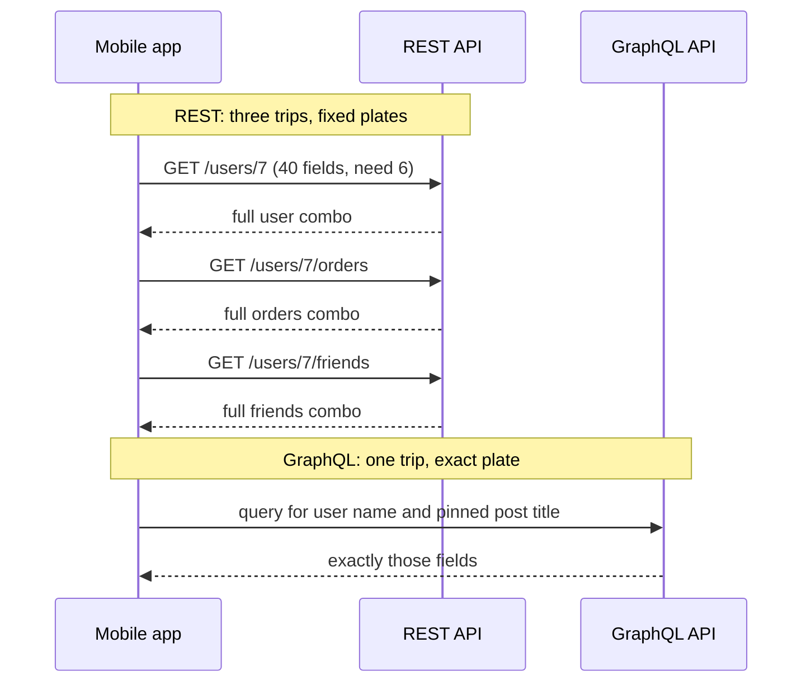
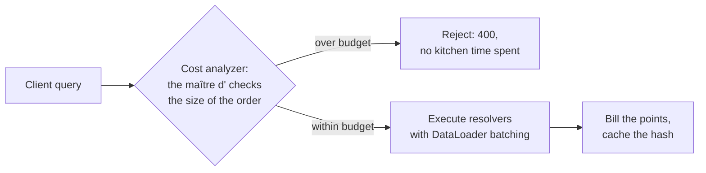

export const meta = {
  slug: 'graphql-vs-rest',
  title: 'GraphQL vs REST: Choosing Your API Shape',
  tier: 'advanced',
  order: 34,
  summary:
    'REST hands every client the same fixed menu; GraphQL lets each client order exactly what fits on its plate. How the two models differ on fetching, caching, versioning, and security — and how to keep a flexible query language from becoming a denial-of-service cannon.',
  estimatedMinutes: 16,
};

## Why this matters

Your mobile team ships a profile screen that displays six fields: name, avatar, handle,
follower count, bio, and one pinned post. The REST endpoint it calls, `GET /users/7`,
returns forty fields — settings flags, internal IDs, timestamps nobody renders. Every user
pays for the other thirty-four fields in bytes on a cellular radio, in battery, in
milliseconds on a slow connection. Multiply by a million daily users and you're burning
real money to ship data straight into the garbage.

Or the reverse disaster: your team adopts GraphQL for that same screen, and one clever
nested query — friends of friends of friends, ten levels deep — fans out into millions of
database hits and takes down production on a Tuesday afternoon. Same root question both
times: **who decides the shape of the data — the server or the client?** REST and GraphQL
give opposite answers, and each answer has a bill attached. This lesson is about reading
both bills before you sign.

(You already know the front door from [*API Gateways*](#/lesson/api-gateways) and the per-client kitchen from [*BFF: One API Per Client*](#/lesson/bff-backend-for-frontend). This lesson is about what the menu looks like once you're inside.)

## The restaurant with two kitchens

This lesson's running analogy: a restaurant with two kitchens. Here's the mapping, stated
out loud, because we'll reuse it all the way down:

- **REST** is the fixed-menu kitchen. You order combo #4 off the printed menu. The chef
  decided what a combo contains — soup, salad, breadsticks — and that's what lands on your
  table. Want just the soup? Tough; combos don't split. Want soup *and* dessert, which live
  on different combos? Order both combos, eat what you want, bus the rest.
- **GraphQL** is the made-to-order kitchen. There's no printed menu of meals — there's a
  list of every ingredient in the building, and you write down exactly what goes on your
  plate: "soup, no breadsticks, dessert on the side." The kitchen assembles precisely that.

The **menu** is the API contract. A **combo** is a REST endpoint — `GET /users/7` — with a
fixed response shape. **Ordering off-menu** is a GraphQL query: you name the fields. The
**waiter** is the network, and every trip between your table and the kitchen costs a round
trip. And **Kevin**, the waiter in our story, is about to become very tired.

## REST: the fixed menu

REST — Representational State Transfer, the architecture Fielding described in his 2000
dissertation — models your world as **resources** with addresses. Nouns, not verbs:
`/users/7`, `/users/7/orders`, `/orders/881`. The HTTP verbs supply the action: GET reads,
POST creates, PUT replaces, PATCH tweaks, DELETE removes. Each endpoint returns a fixed
representation the server chose. Simple. Uniform. Cacheable. And occasionally wasteful in
exactly the way our mobile team discovered.

**Over-fetching** is the combo problem: the server's fixed plate has forty fields and you
wanted six. You pay for thirty-four fields of garnish. If the full response is 4 KB and the
screen needs 600 bytes, you're shipping roughly seven times the bytes you need — over
cellular radios where every byte costs battery and time.

**Under-fetching** is the opposite combo problem: no single combo contains your whole
dinner. The dashboard needs the user, their last five orders, and their three closest
friends. That's three combos — three round trips — and the page can't render until the
slowest lands. Mobile developers know this pain by name; it's half the reason the BFF
pattern exists.

REST's superpower is that combos have **names**. `GET /users/7` is a fixed string, which
means everything built for the web already knows how to cache it: browser caches, CDNs,
the gateway you met in *API Gateways*. A GET is safe to replay, so the whole HTTP caching
layer — `ETag`, `Cache-Control`, edge PoPs — works with zero application code. And
**versioning** is honest: when the menu changes, you print a new one. `/v1/users/7` keeps
working while `/v2` rolls out; old clients never break silently.

## GraphQL: the made-to-order kitchen

GraphQL flips the decision to the client. The server publishes a **schema** — a typed
contract listing every type and field available, written in the Schema Definition Language:

```graphql
type User {
  id: ID!
  name: String!
  avatarUrl: String
  followers(first: Int): [User!]!
  pinnedPost: Post
}
```

The client then sends a **query** naming exactly the fields it wants, to a single endpoint:

```graphql
query {
  user(id: "7") {
    name
    avatarUrl
    pinnedPost {
      title
    }
  }
}
```

Three fields asked, three fields returned. No garnish. The mobile team gets its six fields
at 600 bytes instead of 4 KB, in **one round trip** no matter how many resources the screen
assembles. That last part is the real win: the dashboard's user-plus-orders-plus-friends
becomes one request, because the query can nest.

Behind the query, the server runs **resolvers** — small functions, one per field, that fetch
the data. The `user` resolver loads the user; the `pinnedPost` resolver loads the post.
Simple to write. And hiding a classic trap.



## The N+1 trap, and the tray that fixes it

Here's the trap. A query asks for 100 orders and each order's customer name. The naive
server runs the `orders` resolver once (one database query), then runs the `customer`
resolver **once per order** — 100 more queries. That's the **N+1 problem**: one query plus N
follow-ups. In restaurant terms, Kevin carries each guest's side dish from the kitchen in a
separate trip. A hundred guests, a hundred trips, and the dining room grinds to a halt.

Put numbers on it. If each database round trip costs 2 ms, the batched version costs roughly
4 ms total (one query for orders, one for all 100 customers). The N+1 version costs about
202 ms — fifty times slower — while holding far more database connections open. At real
traffic, that Tuesday-afternoon outage from the hook isn't hypothetical; it's the default
outcome of resolvers written the obvious way.

The fix is **batching**, and the canonical tool is **DataLoader**: instead of each resolver
firing its own query immediately, resolvers register their keys and DataLoader waits a tick,
then fires **one** query for all keys at once. Kevin gets a tray. One trip, a hundred side
dishes. DataLoader also **caches** within a request, so if two fields ask for the same
customer, the second one doesn't re-query. Two lines of discipline — batch, then cache —
turn the deadliest GraphQL failure mode into a non-issue. But you have to know the trap
exists, because the naive code looks perfectly correct.

## Caching: the pass can't label a custom plate

Remember REST's superpower: combos have names, so the pass — the counter where finished
plates wait under the heat lamps, which is our HTTP caching layer — can label every plate. `GET /users/7` is a string; a CDN can store it, serve it, and invalidate
it. Zero application code.

GraphQL breaks this, because every plate is custom. Queries travel as POST bodies to one
endpoint, and no two clients order the same plate. The CDN sees an endless stream of unique
requests to `/graphql` and caches approximately nothing. You've traded the entire HTTP
caching layer for flexibility.

Teams recover caching in three places, each with a cost:

- **Client-side normalized caches** (Apollo Client, Relay) split responses into entities
  keyed by type and ID, so the phone reuses data across screens. Great for the app; does
  nothing for your servers.
- **Persisted queries** flip the model back: the client sends a hash of a pre-registered
  query instead of the query text. The hash *is* a name — a combo number again — so the CDN
  can cache it and the server can reject any query it hasn't seen before. Many teams land
  here in production: flexibility at build time, fixed menu at runtime.
- **Response caching at the edge** with short TTLs for public, low-risk data — possible,
  but you're rebuilding by hand what REST got for free.

The honest accounting: REST caches at the HTTP layer for free; GraphQL moves caching into
application code. If your traffic is read-heavy and cache-friendly, that's a real tax.

## Versioning without reprinting the menu

REST versions by printing a new menu: `/v1`, `/v2`. Old regulars keep ordering from the
old menu. The cost is maintenance — two menus, two code paths — and the eventual awkward
conversation where v1 gets a shutdown date.

GraphQL almost never versions. Because clients name their fields, the server can **evolve
the schema additively**: add new fields and types freely; old queries keep working because
they never asked for the new stuff. Fields that need to die get marked `@deprecated` with a
reason, and you watch usage metrics until nobody orders that dish anymore, then remove it.
No v2. No flag day.

"Almost" is doing work in that paragraph. Removals and type changes **are** breaking, and
deprecation without enforcement is a polite suggestion. Teams that survive this run **schema
checks in CI** — every proposed schema change is diffed against production traffic to prove
no live query breaks. Evolution is a discipline, not a default.

## Mutations, subscriptions, and the recipe book on the wall

Reads are only half the story. **Mutations** are GraphQL's write path — named operations
with explicit inputs and return shapes, the equivalent of POST/PUT/PATCH but typed and
self-describing. One subtle win: a mutation can return the updated object in the same round
trip, so the client skips the follow-up GET it would need to refresh the screen.

**Subscriptions** keep a connection open and push updates as events happen — the kitchen
bell that rings at your table when your food is ready, instead of you flagging down Kevin
every two minutes to ask. Real-time dashboards, chat, live scores. The cost is connection
state on your servers: every subscriber holds resources open, which is a scaling story of
its own.

And then there's **introspection**: a GraphQL server can answer "what's on the menu?" — the
full schema, every type, every field — to anyone who asks. That's what powers the wonderful
developer tooling. It's also the recipe book taped to the restaurant's front window. In
production, most teams disable introspection or gate it behind auth, because a complete map
of your data model is a gift to attackers reconnoitering your API. Flexibility cuts both
ways.



## When each kitchen wins

So who should run which kitchen? It depends on who's eating.

**REST wins for public, partner-facing APIs.** Partners want a contract that never twitches:
fixed endpoints, fixed shapes, versioned menus, HTTP caching they already understand, and
rate limits counted in simple requests. Stripe, Twilio, and AWS all speak REST to the
outside world, and that stability is a feature their customers pay for. When you can't call
the consumer and ask them to update their query, the fixed menu is kindness.

**GraphQL wins for internal product velocity.** When your own web and mobile teams iterate
weekly, letting each screen order exactly its fields kills both over-fetching and the BFF
sprawl of maintaining a bespoke endpoint per client. One schema, many plates. **GitHub's
public GraphQL API** is the canonical example of GraphQL done seriously at scale: a single
typed schema over GitHub's entire data model, with every query **scored in points before
execution** — nested connections multiply the cost — and over-budget queries rejected
before they touch the database. Flexibility, fenced by arithmetic.

The honest middle: plenty of teams run both. REST at the edge for partners and cacheable
public reads; GraphQL inside for product teams moving fast. And some teams get REST's
ergonomics back inside GraphQL via **persisted queries** — the regulars' standing orders,
hashed and CDN-cached, which is the fixed menu re-invented by people who swore they'd never
print one again.

The decision isn't taste; it's arithmetic. Count your clients, count your bytes, count your
cache hits — then pick the kitchen whose bill you can afford.

## Takeaways

1. REST fixes the response shape on the server; GraphQL lets the client name exactly the
   fields it wants. The trade is server-side simplicity and free HTTP caching versus client
   flexibility.
2. Over-fetching wastes bytes and battery; under-fetching costs round trips. GraphQL solves
   both with one request — but only if you avoid the N+1 trap.
3. N+1 happens when each nested resolver fires its own database query; DataLoader-style
   batching plus per-request caching collapses N+1 into a handful of queries.
4. GraphQL's flexibility breaks HTTP-layer caching (unique POST bodies to one endpoint).
   Recover it with client normalized caches, persisted queries, or short-TTL edge
   caching — all hand-built.
5. GraphQL versions by evolution (additive changes plus `@deprecated`), not `/v2` menus —
   but removals still break clients, so gate schema changes with CI checks against live
   traffic.
6. Fence the flexibility with arithmetic: depth limits, query-cost analysis, and
   persisted-query allowlists keep one nested query from becoming a denial-of-service
   attack. GitHub scores every query in points before running it; do the same.

<Quiz
  lessonSlug="graphql-vs-rest"
  questions={[
    {
      question: "Your mobile screen needs 6 fields but GET /users/7 returns 40. What is this called, and what does it cost?",
      options: [
        "Under-fetching; it costs extra round trips to assemble the screen",
        "Over-fetching; it costs wasted bytes, battery, and time on every request",
        "The N+1 problem; it costs one extra database query per field",
        "Schema drift; it costs a version bump of the API",
      ],
      correctIndex: 1,
    },
    {
      question: "A GraphQL query asks for 100 orders and each order's customer name. The naive server runs 101 database queries. What fixes this?",
      options: [
        "Batching the customer lookups (e.g. DataLoader) so all 100 resolve in one query",
        "Switching the query from POST to GET",
        "Adding @deprecated to the customer field",
        "Splitting the query into 100 smaller queries",
      ],
      correctIndex: 0,
    },
    {
      question: "Why does GraphQL largely lose REST's free HTTP caching?",
      options: [
        "GraphQL responses are always too large to cache",
        "GraphQL requires WebSockets, which CDNs cannot proxy",
        "The GraphQL spec forbids caching responses",
        "Queries travel as unique POST bodies to a single endpoint, so caches see no repeatable URLs",
      ],
      correctIndex: 3,
    },
    {
      question: "How do mature GraphQL APIs typically handle versioning?",
      options: [
        "They publish /v1, /v2, /v3 endpoints exactly like REST",
        "They never change the schema after launch",
        "They evolve additively — new fields are added, old ones are marked @deprecated and removed only after usage drops",
        "They force every client to re-fetch the full schema daily",
      ],
      correctIndex: 2,
    },
    {
      question: "How does GitHub's public GraphQL API defend against expensive nested queries?",
      options: [
        "It only allows queries three levels deep, with no exceptions",
        "It scores each query in points before execution and rejects queries that exceed the caller's budget",
        "It disables nested queries for all third-party applications",
        "It runs every query twice and bills the client for both",
      ],
      correctIndex: 1,
    },
  ]}
/>

---

## Go deeper

Want to keep pulling this thread? These talks and tutorials go further than we did here:

- [You probably don't need GraphQL](https://www.youtube.com/watch?v=8-Mzo9OAKOQ) — TheMergeLog, YouTube (~5 min). The N+1 trap, lost HTTP caching, and query-cost limits — a compact video twin of the lesson.
- [GraphQL vs REST | Which API Architecture Should You Choose?](https://www.youtube.com/watch?v=tT2W3tqq2kI) — Uplatz, YouTube (~15 min). Flexibility, caching, versioning, performance, and security compared on every axis.

## Sources & further reading

- Roy T. Fielding, "Architectural Styles and the Design of Network-based Software Architectures," doctoral dissertation, University of California, Irvine, 2000 — introduces REST (Chapter 5).
- GraphQL Specification, October 2021 edition, GraphQL Foundation — the query language, type system, and execution semantics (first Foundation-ratified edition; verified against spec.graphql.org).
- DataLoader documentation (graphql/dataloader, Facebook, 2015) — batching and per-request caching for resolvers; the canonical N+1 fix.
- GitHub Docs, "Rate limits and node limits for the GraphQL API" — scoring queries in calculated points before execution.
- Martin Kleppmann, *Designing Data-Intensive Applications*, O'Reilly, 2017 — caching layers, API evolution, and the costs they carry.
