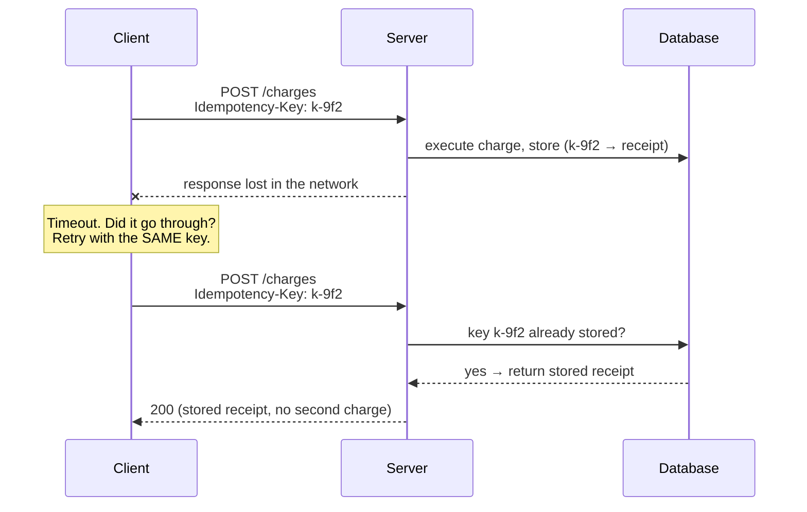
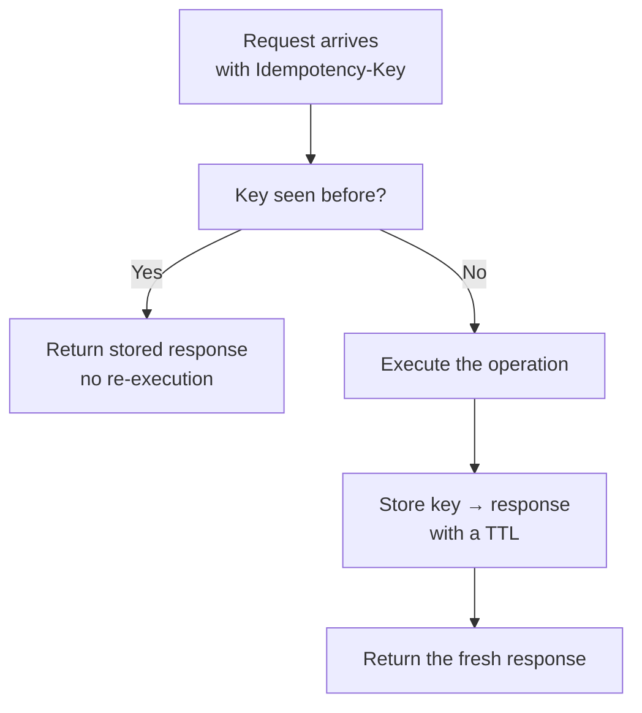
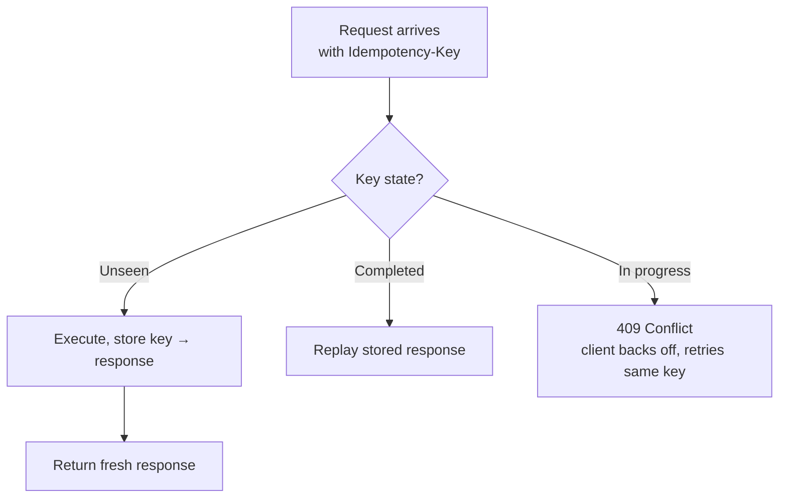

export const meta = {
  slug: 'idempotency',
  title: 'Idempotency: Making Retries Safe',
  tier: 'intermediate',
  order: 9,
  summary:
    'Networks fail, so we retry — but a retry can double-charge a credit card. How idempotency keys and idempotent operations make retries safe.',
  estimatedMinutes: 17,
  difficulty: 3,
  topics: ['api', 'reliability'],
};

## Why this matters

Picture this: your app charges a customer's card, the network hiccups, and the response
never arrives. Did the charge go through? You have no idea — so you retry. The retry goes
through. The first request went through too. Your customer just got charged twice, and
your support queue just got its worst ticket of the week.

This is the most expensive two-line bug in distributed systems, and it happens because of a
perfectly reasonable instinct: *when something fails, try again.* Retrying is correct —
networks are flaky, and giving up on the first timeout would be worse. The fix isn't to
stop retrying. It's to make retries safe. That property has a name: **idempotency**.

<VideoCard videoId="D3VOEyDE630" title="One Retry Can Charge Your Customer Twice" source="In Production Media" description="Shows real production duplicates — webhooks, backups, double charges — and why retries make them inevitable." />

## Pressing the elevator button twice

This lesson's running analogy: the call button outside an elevator. You press it, the
button lights up, and nothing seems to happen — so you press it again. And maybe a third
time, because elevators test everyone's patience. The elevator still sends **one** car.
Pressing the lit button again does nothing new. That's idempotency in the physical world:
repeat the action all you want, the effect happens once.

Map it to your system:

- **Pressing the button** is sending a request.
- **Pressing it again after a timeout** is your retry logic — you got no response, so you
  can't tell whether the first press registered.
- **The lit button** is the server remembering it already saw this request — the
  idempotency key, which we'll get to.
- **One elevator, not three** is the guarantee you actually want: the effect applies once
  no matter how many times the action is repeated.

The elevator doesn't achieve this by being clever. It achieves it because "come to this
floor" is an operation where repeats are harmless. Not every operation is built that way —
and that's where the trouble starts.

<VideoCard videoId="2EVSUpI2DEU" title="Salesforce Apex Idempotency Architecture Explained: Stop Duplicate Records | Cloud Developer" source="Cloud Developer" description="Teaches the elevator-button analogy directly: pressing ten times still calls the elevator once." />

## The precise definition

An operation is **idempotent** if performing it once has the same effect as performing it
multiple times. The textbook shorthand: f(f(x)) = f(x).

Some operations are *naturally* idempotent — repeats are harmless by construction:

- "Set the thermostat to 72°F." Set it twice, still 72.
- "Save this profile with this exact content." Same bytes in, same bytes stored.
- "Delete this file." It's gone after the first delete; the second is a no-op.

And some are stubbornly not:

- "Turn the thermostat up one degree." Twice is +2. (The elevator equivalent of pressing
  "one floor up" twice — enjoy your surprise trip.)
- "Add $10 to this balance." Retried, that's $20.
- "Charge this card $50." Retried, that's the support ticket.

Notice the pattern: **absolute** operations ("set it to X") are idempotent; **relative**
operations ("add X to it") are not. This maps directly onto HTTP, and it's not a
coincidence: the HTTP spec declares PUT and DELETE idempotent and POST not. `PUT
/settings {"theme": "dark"}` — send it five times, the theme is dark. `POST /charges` —
send it five times and find out what your refund policy is.

Drop the analogy when precision matters: idempotency is a property of the *operation's
effect*, not of the transport. A retry that arrives twice must not apply its effect twice.

<VideoCard videoId="Ra39zPA7m1k" title="Mastering Idempotency: Distributed System Reliability on AWS" source="Cloud Explainers" description="Contrasts mathematical and system-design definitions of idempotency, then maps them to real HTTP behavior." />

## Why networks force this on you

You might wonder why we can't just avoid retries. Because the alternative is worse, and
because timeouts are fundamentally ambiguous. When you send a request and hear nothing
back, three things might have happened:

1. The request never arrived. Safe to retry.
2. The request arrived and the reply got lost. **Not** safe to retry — unless the operation
   is idempotent.
3. The request is still being processed, slowly. Retrying now creates a duplicate.

You cannot distinguish these from the client side. The network swallowed the evidence.
This is the same gremlin from the CAP theorem lesson wearing a different hat: the network
doesn't just partition, it lies by omission. So you *must* retry — a system that gives up
on every timeout is a system that fails constantly — and therefore your operations *must*
tolerate being executed more than once.

There's a classic way to frame this, and it shows up in the message-queues lesson too:
**at-least-once delivery plus an idempotent consumer equals effectively-once processing.**
The queue promises "I'll deliver this at least once" (it may deliver twice — Amazon's SQS
standard queues document exactly this; their FIFO queues even dedupe for you via
message deduplication IDs, the queue acting as the lit button). Your consumer promises
"processing the same message twice has no extra effect." Multiply those two promises and
you get the behavior everyone actually wants: each message takes effect once.

<VideoCard videoId="MDuWnzVnfpI" title="Distributed Systems 2.1: The two generals problem" source="Martin Kleppmann" description="Kleppmann proves why unreliable networks make certainty impossible, forcing retries and duplicate handling." />

## Idempotency keys: the lit button

For operations that aren't naturally idempotent — the charges, the orders, the "add to
balance" writes — you need a mechanism. Enter the **idempotency key**: a unique token the
*client* generates for each logical operation (a UUID works), sent along with the request,
typically in a header like `Idempotency-Key`.

The server's contract is simple:

1. First time it sees the key: execute the operation, **store the key and the response**,
   return the response.
2. Any repeat with the same key: skip execution entirely, return the *stored* response.

Now walk through the double-charge scenario. Your app generates key `k-9f2` and POSTs the
$50 charge. Timeout — no response. Was it case 1, 2, or 3 from above? Doesn't matter. You
retry with the same key `k-9f2`. If the first request executed, the server finds the key,
skips the charge, and returns the stored "charged $50" receipt. If the first request never
arrived, the server executes it now. Either way: one charge, one receipt. The button was
lit; the extra presses did nothing.

A few engineering details worth knowing:

- **Keys must be per logical operation, not per attempt.** Generate the key when the user
  clicks "pay," and reuse it across every retry of that click. A fresh key per retry
  defeats the whole mechanism — that's just pressing a different button.
- **Stored results need a TTL.** Nobody needs last Tuesday's receipt forever. Stripe's
  API, the canonical example, stores idempotency results for at least 24 hours — long
  enough to cover any sane retry window, short enough to bound storage.
- **The key must scope the operation, not just the request.** Two different customers
  charging $50 must not share a key, or the second customer gets the first one's receipt
  for free. (A great deal for them; a career-limiting one for you.)

Note what the diagram doesn't show: the client never needed to know which failure case it
was in. That's the whole point. The key collapses all three ambiguous outcomes into one
safe behavior.

The server-side logic, as a decision the code makes on every request:

One subtlety the diagram hides: the "key seen before?" check and the store must be atomic.
Two retries racing each other could both see "not seen," both execute, and both store —
the double-charge you were trying to prevent. The standard fix is a uniqueness constraint
on the key column: the loser's insert fails, and once the winner finishes it reads the
winner's stored response and returns that (if the winner is still in flight, the loser
returns 409 instead — see below). Your database already knows how to do atomic inserts; let it.

<VideoCard videoId="7HYmUO295eU" title="How to Stop Duplicate Payments with Idempotency Keys | System Design" source="Agenthub" description="Walks through timeouts causing duplicate payments, then implements idempotency keys with state-locking and TTLs." />

## The key has three states, not two

That flowchart asks "key seen before?" — but "seen" hides two very different situations,
and handling them the same way is a bug. A key is really in one of three states:

1. **Unseen.** Execute the operation, store key → response, return it. The normal path.
2. **Seen and completed.** Skip execution, replay the stored response. The lit button.
3. **Seen but still in progress.** The first request hasn't finished — remember timeout
   case 3, *slow, not lost*. There's no stored response to replay yet, and executing
   again would double-apply the effect. So what do you return?

Stripe's answer, and the industry convention: **409 Conflict** — "a request with this
key is already being processed." The client treats a 409 like a timeout: back off, wait,
retry later with the *same* key. Eventually the first request finishes and stores its
response, and a subsequent retry gets the replay. Back to the elevator: the button is
lit, but the car hasn't arrived yet. Pressing again doesn't summon a second car — it
just reminds you one is already coming.

Two more details that separate a real implementation from a sketch:

- **Same key, different body.** A key is supposed to identify *one* logical operation.
  If a retry arrives with the same key but different parameters, that's not a retry —
  it's a bug in the client, or someone probing. Stripe rejects it with **400** (an
  `idempotency_error`); the IETF draft recommends **422** for a payload mismatch, and
  some implementations hash the request body and compare it against the hash stored
  with the key — a fingerprint check. Either way, never silently execute a mismatched request
  under an existing key.
- **Who mints the key?** Usually the client, but not always. A plain browser form with
  no JavaScript can't generate UUIDs — so the server can mint the key instead: the
  first POST returns `201` with the key in a header or the body, and the client attaches
  it to any retries. Same contract, the key just originates on the other side of the
  wire.

And the test that proves all of this works: fire N requests carrying the *same* key at
the *same* instant and assert exactly one side effect. Exactly one charge, one order,
one row. If your system fails that test, the key column is missing its uniqueness
constraint — go back and add it. Concurrency is where idempotency designs go to be
graded, and the grader is strict.

<VideoCard videoId="86rHff8QgUM" title="Idempotency System Design || Stop Duplicate Processing at Billion Scale || Part 2" source="ScalaBrix" description="Details the idempotency-key lifecycle — NEW, IN_PROGRESS, SUCCEEDED, FAILED — and avoids retry race conditions." />

## Failure modes: where idempotency breaks

Idempotency keys are simple, which means the bugs hide in the details:

- **Key reuse across different operations.** Two customers each charging $50 must never
  share a key, or the second gets the first's receipt for free. Scope keys per account
  and per operation type, or just use random UUIDs — collisions in 128 bits of randomness
  are somebody else's problem.
- **TTL shorter than the retry window.** Stripe keeps results for at least 24 hours. If
  your server forgets keys after 1 hour but your client retries for 3 days, a late retry
  executes fresh — and double-charges. Rule: the server's key retention must outlive the
  client's maximum retry horizon.
- **Storing the wrong thing.** The stored response should be exactly what the first
  execution returned. If your operation has side effects the response doesn't capture
  (an email sent, a webhook fired), the replay returns the receipt while the side effect
  happened once — usually what you want, but make sure it's what you *designed*.
- **Treating the key as authentication.** An idempotency key is not a secret and not a
  permission check. Anyone who guesses another user's key gets their receipt — so scope
  key lookups to the authenticated user, always.

<VideoCard videoId="mD6Ne9Wn44M" title="Why Network Retries Cause Duplicate Payments (And How to Fix It with Idempotency)" source="Agenthub" description="Breaks down the exact failure loop behind duplicate charges and how blind retries create race conditions." />

## Retries need manners, too

Idempotency makes retries *safe*. It doesn't make them *polite*. A client that retries a
timed-out request instantly, ten times in a row, turns one failure into a small DDoS —
and if every client does it during an outage, the retry storm finishes what the outage
started. The fix is the rate-limiting lesson's cousin: **exponential backoff with
jitter** — wait 1s, then 2s, then 4s, with randomization so a thousand clients don't
retry in lockstep.

Think of it as elevator etiquette: pressing the lit button again is harmless, but jabbing
it forty times a second doesn't summon the car any faster. It just wears out the button.
Idempotency is the lit button; backoff is the patience.

<VideoCard videoId="U2nbwRsE2-I" title="Idempotent Consumers for Retry Logic" source="ByteDistrict" description="Covers retry logic paired with idempotent consumers: response replay, TTLs, locks, and out-of-order delivery." />

## Idempotent vs. not: a toggle

Before you go further, build the instinct. Flip between the two and feel the difference —
it's the same distinction as "set the thermostat" versus "nudge it up":

<VsToggle
  title="Two operations, retried after a timeout"
  a={{
    label: "Idempotent",
    title: "PUT /cart — replace the whole cart",
    points: [
      "The request carries the complete desired state: {items: [book, lamp]}",
      "Executed once, the cart holds a book and a lamp",
      "Executed three times, the cart still holds a book and a lamp",
      "Retries are free — the operation describes an absolute outcome",
    ],
    note: "Absolute writes (set, replace, delete) are safe to retry by construction.",
  }}
  b={{
    label: "Not idempotent",
    title: "POST /cart/items — add one item",
    points: [
      "The request describes a change relative to current state: +1 lamp",
      "Executed once, the cart gains one lamp",
      "Executed three times after timeouts, the cart gains three lamps",
      "Without an idempotency key, every retry is a new lamp",
    ],
    note: "Relative writes (add, increment, append) need an idempotency key — or a redesign into an absolute write.",
  }}
/>

The redesign hint in that footnote is worth internalizing: when you can, prefer the
absolute form. "Set balance to $100" beats "add $10" every time a retry is possible — and
a retry is always possible. The best idempotency mechanism is an operation that doesn't
need one.

<VideoCard videoId="4DKnSdwgmg8" title="HTTP Methods Are Not CRUD" source="LearnThatStack" description="Maps HTTP methods onto safe and idempotent axes: GET, PUT, DELETE repeat safely; POST can charge twice." />

## The exactly-once illusion

A word of caution before you feel too safe: nobody can promise **exactly-once** delivery
across a network. Not your queue, not your framework, not a vendor's marketing page. The
network can always duplicate or delay, and "exactly once" would require the sender and
receiver to agree on what happened *during* a partition — the CAP theorem already told you
how that story ends.

What you *can* build is **effectively-once**: at-least-once delivery where duplicates are
harmless because the consumer is idempotent. Webhooks are the classic arena for this.
A payment provider will retry a `payment.succeeded` webhook until you acknowledge it —
their docs will say "expect duplicates." Your endpoint must therefore treat a webhook
like a lit elevator button: record the event ID, and if you've seen it, acknowledge
without re-applying it. The distributed-transactions lesson wrestles with the same
impossibility from the coordination side; here the answer is humbler and cheaper — just
make repeats harmless.

So when someone says their pipeline is "exactly once," translate it charitably: they mean
effectively-once, built on at-least-once delivery and idempotent consumers, with the
duplicates quietly absorbed. Now you know what to ask them: "where do you dedupe, and
what's the key?"

<VideoCard videoId="W0k2JOUAbdU" title="Exactly Once Delivery: Why It Does Not Exist and What You Get Instead" source="HafsDeepLearning" description="Derives why exactly-once delivery is impossible over unreliable networks, and what guarantees replace it." />

## Takeaways

1. Timeouts are ambiguous — you can't tell whether a request was lost, processed, or is
   just slow — so you must retry, and therefore your operations must tolerate repeats.
2. Idempotency means f(f(x)) = f(x): repeating the operation has the same effect as doing
   it once. The elevator sends one car no matter how many times you press the lit button.
3. Prefer naturally idempotent operations: absolute writes ("set to X") over relative ones
   ("add X"). HTTP already encodes this: PUT and DELETE are idempotent, POST is not.
4. For operations that can't be naturally idempotent, use idempotency keys: the client
   generates one key per logical operation, the server stores key → response and replays
   the stored response on duplicates. Same key across retries — a new key per retry
   defeats the mechanism.
5. Exactly-once delivery is impossible over a real network; build effectively-once
   instead: at-least-once delivery (like SQS standard queues) plus idempotent consumers
   that dedupe on a key.
6. A key has three states, not two: unseen (execute and store), in progress (return
   409 — the client backs off and retries with the same key), and completed (replay
   the stored response). A key reused with different parameters is a bug, not a
   retry — reject it.

<Quiz
  lessonSlug="idempotency"
  questions={[
    {
      question: "You press the elevator call button, nothing happens, so you press it again. In an idempotent system, what arrives?",
      options: [
        "One elevator per press — the system dispatches every request it receives",
        "No elevator at all, because duplicate presses cancel each other out",
        "Exactly one elevator — repeat presses have no additional effect",
        "One elevator per press, but the extras are refunded",
      ],
      correctIndex: 2,
    },
    {
      question: "Which of these operations is naturally idempotent?",
      options: [
        "POST /orders — create a new order",
        "Increment a page-view counter by one",
        "Append a line to a log file",
        "PUT /profile — replace the profile with this exact content",
      ],
      correctIndex: 3,
    },
    {
      question: "Your charge request times out, so you retry with the same idempotency key. The first request actually succeeded. What does the server do?",
      options: [
        "It charges the card again, because a retry is a new request",
        "It skips execution and returns the stored response from the first request",
        "It rejects the retry with an error, since the key is already used",
        "It ignores the key and executes the operation only if the amount differs",
      ],
      correctIndex: 1,
    },
    {
      question: "A queue guarantees at-least-once delivery and your consumer is idempotent. What processing semantics do you get?",
      options: [
        "Effectively-once: every message takes effect exactly one time",
        "At-most-once: some messages will be silently dropped",
        "Exactly-once delivery, guaranteed by the queue alone",
        "Unordered delivery with no duplicate protection",
      ],
      correctIndex: 0,
    },
    {
      question: "A retry carrying the same idempotency key arrives while the first request is still being processed. What should the server do?",
      options: [
        "Execute the operation again so the client gets a faster response",
        "Return 409 Conflict, so the client backs off and retries later with the same key",
        "Replay the stored response from the first request",
        "Reject the key as expired and ask the client to generate a new one",
      ],
      correctIndex: 1,
    },
  ]}
/>

---

## Go deeper

Want to keep pulling this thread? These talks and tutorials go further than we did here:

- [The 3 Golden Rules of Distributed Systems](https://www.youtube.com/watch?v=yebUpcBTdtQ) — Sam Newman, QCon London 2025 (~51 min). Timeouts, retries, and idempotency from the author of Building Microservices.
- [How Payment Systems Prevent Double Charges | Idempotency Explained](https://www.youtube.com/watch?v=ClXZw3sF6bQ) — Programming Tutorials, YouTube (~9 min). Idempotency keys, key reuse across retries, and race conditions.
- [Idempotency on AWS — Explained](https://www.youtube.com/watch?v=DqUyk6SXBT4) — Joud Awad, YouTube (~43 min). Idempotency keys, conditional writes, and natural idempotency with live AWS demos.
- [System Design for AI Agents – Building a Multi-Agent PR Reviewer](https://www.youtube.com/watch?v=iqRcGCah0Kw) — freeCodeCamp.org (~3h 11m). Watch the idempotency chapter — webhook HMAC, idempotent receivers, and Redis queues in a production system.

## Sources & further reading

- Stripe, "Idempotent requests," Stripe API documentation — the canonical idempotency-key design: client-supplied keys, stored responses, minimum 24-hour retention.
- Amazon Web Services, "Amazon SQS standard queues" documentation — at-least-once delivery semantics and why consumers must handle duplicates.
- Martin Kleppmann, *Designing Data-Intensive Applications* (O'Reilly, 2017), Ch. 11 — end-to-end exactly-once semantics in stream processing and why effectively-once is the achievable goal.
- IETF HTTPAPI Working Group, "The Idempotency-Key HTTP Header Field," draft-ietf-httpapi-idempotency-key-header — the (now expired) IETF draft for the `Idempotency-Key` header field itself.
