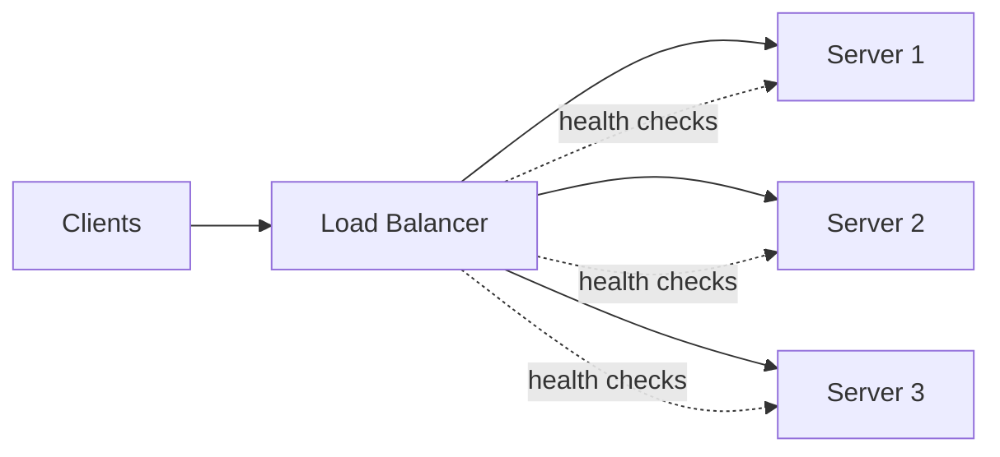
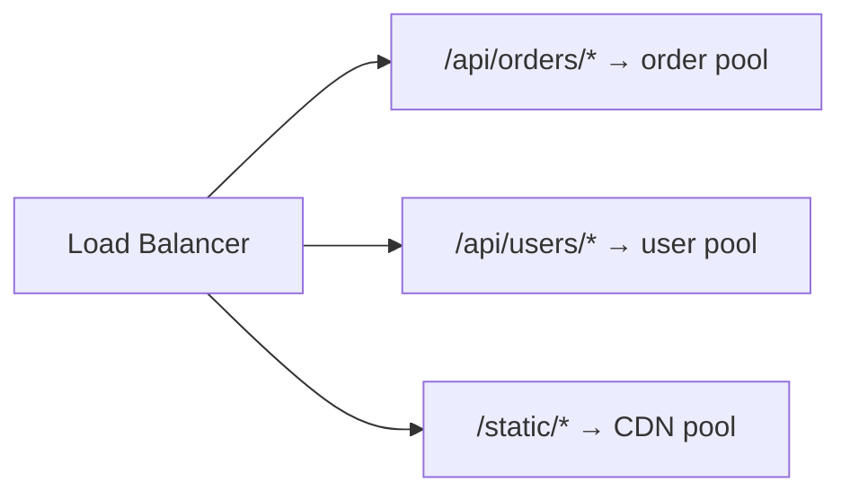
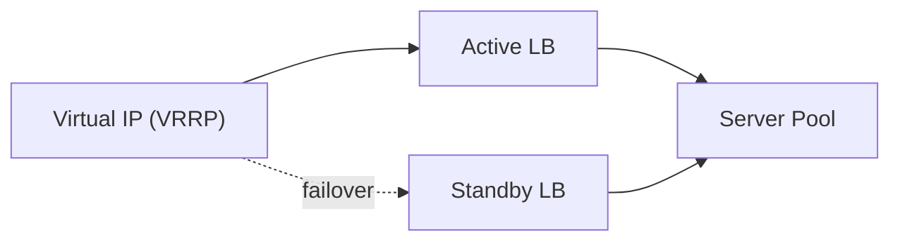

export const meta = {
  slug: 'load-balancers',
  title: 'Load Balancers',
  tier: 'beginner',
  order: 2,
  summary:
    'How traffic gets distributed across a fleet of servers, the layers at which it happens, and the algorithms used to pick a target.',
  estimatedMinutes: 15,
};

## Why this matters

A single server can only handle so many concurrent connections before latency climbs and it
falls over. A **load balancer** sits in front of a pool of servers and spreads incoming requests
across them, giving you horizontal scalability and resilience to individual server failure.

## Where load balancing happens

- **DNS load balancing** — a domain resolves to multiple IPs; crude, but cheap and works at the
  very edge before a connection is even opened.
- **Layer 4 (transport)** — balances based on IP address and TCP/UDP port, without looking at
  the request content. Fast, protocol-agnostic, but can't route by URL path or header.
- **Layer 7 (application)** — terminates HTTP(S) and can route based on path, host header,
  cookies, or request body. More flexible, more CPU cost per request.

## Routing algorithms

| Algorithm | How it picks a server | Good for |
| --- | --- | --- |
| Round robin | Cycles through servers in order | Uniform, stateless workloads |
| Weighted round robin | Round robin, biased by server capacity | Mixed hardware fleets |
| Least connections | Sends to the server with fewest active connections | Long-lived / uneven requests |
| IP hash | Hashes client IP to pick a server | Session affinity without shared state |
| Consistent hashing | Maps both servers and keys onto a ring | Caches, sharded stores — minimizes reshuffling when nodes change |

## Health checks and failover

A load balancer is only as good as its view of backend health. It periodically probes each
server (a TCP connect, or an HTTP `GET /health`) and removes unhealthy nodes from rotation. This
turns a single server crash into a brief capacity dip instead of an outage.

## Layer 7 example: routing by path

This kind of routing is what lets a single public hostname front a whole fleet of independently
scaled microservices.

## Single point of failure — solved twice

The load balancer itself would be a single point of failure if there were only one instance. In
practice, teams run at least two load balancer nodes behind a floating (virtual) IP managed by a
protocol like VRRP or a cloud provider's managed load balancer, so there's no single machine that
can take the whole system down.

## Takeaways

1. Load balancing is what turns "one big server" into "many small, replaceable servers."
2. Layer 4 is faster; Layer 7 is smarter — most production systems use both, in layers.
3. The choice of algorithm matters most when backends are stateful or heterogeneous in capacity.

<Quiz
  lessonSlug="load-balancers"
  questions={[
    {
      question: "What is the key difference between Layer 4 and Layer 7 load balancing?",
      options: [
        "Layer 4 is only for HTTPS; Layer 7 is only for HTTP",
        "Layer 4 balances on IP/port without inspecting content; Layer 7 can route by path, host, or cookies",
        "Layer 7 is faster because it skips health checks",
        "There is no functional difference, only naming",
      ],
      correctIndex: 1,
    },
    {
      question: "Which routing algorithm minimizes key/request reshuffling when servers are added or removed?",
      options: ["Round robin", "IP hash", "Consistent hashing", "Weighted round robin"],
      correctIndex: 2,
    },
    {
      question: "Why do production teams typically run at least two load balancer nodes?",
      options: [
        "To double the number of routing algorithms available",
        "Because a single load balancer instance would be a single point of failure",
        "To support both Layer 4 and Layer 7 simultaneously",
        "Load balancers are required to run in pairs by TCP/IP standards",
      ],
      correctIndex: 1,
    },
  ]}
/>

---

## Sources & further reading

- Betsy Beyer et al., *Site Reliability Engineering* (Google / O'Reilly, 2016), Ch. 19–20 — load balancing at the frontend and within the datacenter.
- David Karger et al., "Consistent Hashing and Random Trees," *STOC 1997* — the consistent-hashing technique.
- Martin Kleppmann, *Designing Data-Intensive Applications* (O'Reilly, 2017) — scaling and request routing.
- NGINX and HAProxy documentation — production Layer 4 / Layer 7 configuration and balancing algorithms.
