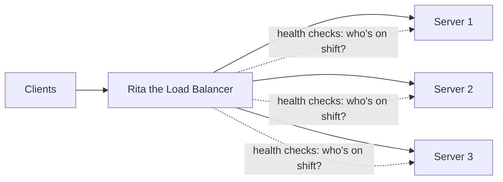
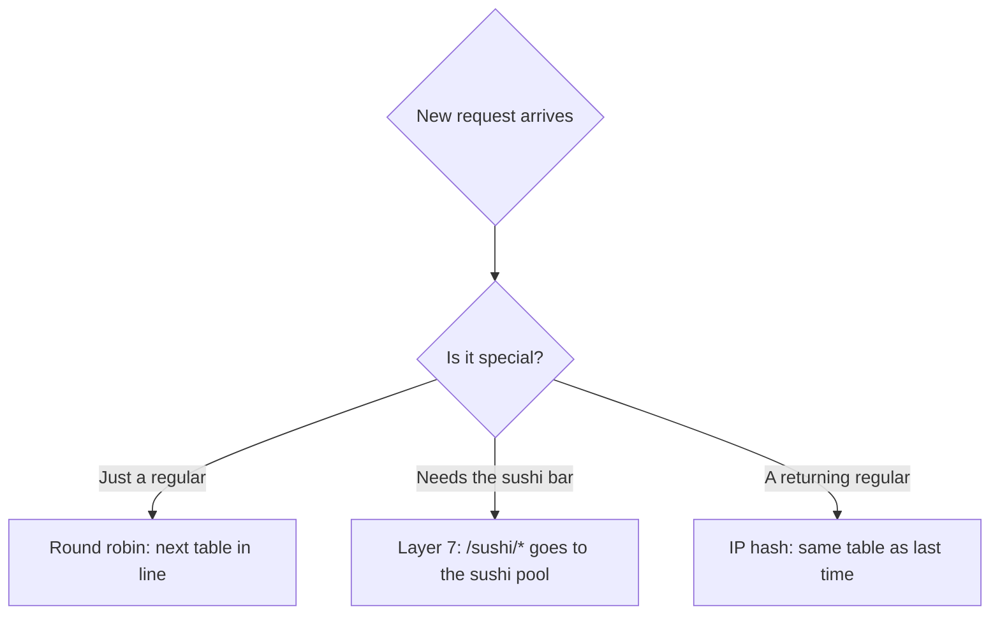
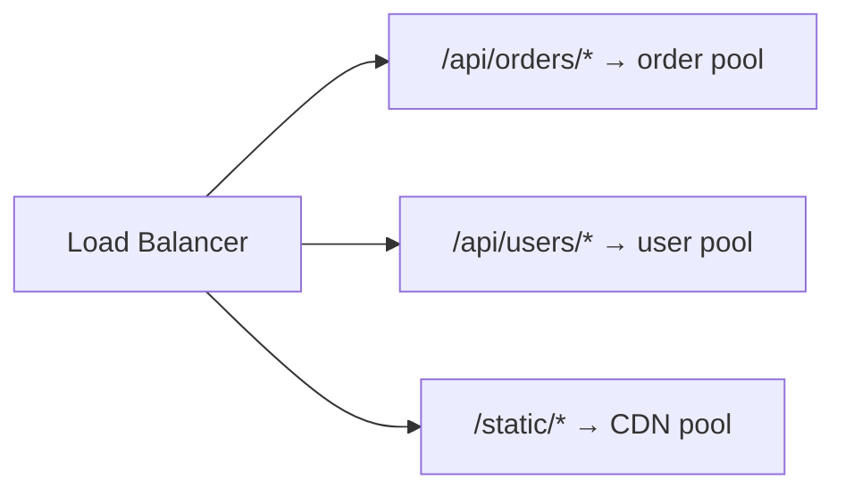
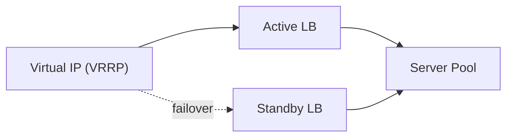

export const meta = {
  slug: 'load-balancers',
  title: 'Load Balancers',
  tier: 'beginner',
  order: 5,
  summary:
    'How traffic gets distributed across a fleet of servers, the layers at which it happens, and the algorithms used to pick a target.',
  estimatedMinutes: 15,
  difficulty: 1,
  topics: ['load balancing', 'scaling'],
};

## Why this matters

Every website you've ever used without thinking about it was quietly load balanced. One
server can only handle so many requests before it starts sweating — latency climbs, requests
queue up, and eventually the whole thing falls over. A **load balancer** is how we go from
"one big server doing its best" to "many servers sharing the work," and it's the reason your
favorite apps survive traffic spikes, celebrity tweets, and the occasional server that just
gives up on life.

<VideoCard videoId="oUU51Y6XA2w" title="Load Balancers, Properly Explained — Part 1: The Why" source="whiteboardinterview" description="Opens with one server buckling under ten thousand users, then shows why every serious service needs a balancer." />

## Picture a restaurant host

Meet **Rita**, the host at the busiest restaurant in town. Rita does three things, and they are
*exactly* what a load balancer does:

1. **She greets everyone at the door** — one entrance, all the incoming guests (requests).
2. **She seats guests across the dining room** — spreading them among waiters and tables
   (servers) so no single waiter gets 40 tables while another stands around polishing
   glasses.
3. **She knows who's actually on shift** — if a waiter called in sick (a failed server), Rita
   simply stops seating people at their section. The dining room barely notices.

That's the whole concept. One smart greeter in front of a pool of workers:

(Rita never takes a bathroom break. We'll come back to why that's a problem.)

<VideoCard videoId="17AFseaBDgk" title="What is Load Balancing?" source="NGINX" description="Uses a restaurant-host analogy to explain how requests get seated across servers, with clear visual flow." />

## Where Rita works: DNS, Layer 4, Layer 7

Requests pass through several layers before reaching your app, and Rita can stand at more
than one door:

- **DNS load balancing** — the restaurant's phone book lists several addresses; callers pick
  one. Crude, but cheap — it works before a connection is even opened.
- **Layer 4 (transport)** — Rita glances at the name tag (IP address and port) and points you
  to a table *without reading your reservation*. Fast and works for any protocol, but she
  can't route you to the sushi bar versus the grill.
- **Layer 7 (application)** — Rita actually reads your reservation: "party of four, sushi
  bar, and you're a regular." She routes based on URL path, host header, or cookies. Smarter,
  but it costs more of her attention per guest.

<VideoCard videoId="EDbnQTZvJb8" title="What Is Load Balancing? Types of Load Balancing Every Cloud Architect Must Know" source="Go Cloud Architects" description="Covers DNS load balancing through network and cloud types, mapping each balancer to its place in the stack." />

## How Rita picks a table: the algorithms

Seating a Friday-night crowd is a strategy question, and Rita has several playbooks:

| Algorithm | How it picks a server | Good for |
| --- | --- | --- |
| Round robin | Cycles through servers in order | Uniform, stateless workloads |
| Weighted round robin | Round robin, biased by server capacity | Mixed hardware fleets |
| Least connections | Sends to the server with fewest active connections | Long-lived / uneven requests |
| IP hash | Hashes client IP to pick a server | Session affinity without shared state |
| Consistent hashing | Maps both servers and keys onto a ring | Caches, sharded stores — minimizes reshuffling when nodes change |

Round robin is the classic "your turn, my turn" — dead simple, and surprisingly effective when
every request costs about the same. Least connections is what Rita reaches for when one table
is a family of twelve settling in for the evening and another is a coffee-and-go: raw
headcounts lie, so she watches *active* load instead.

<VideoCard videoId="dBmxNsS3BGE" title="Top 6 Load Balancing Algorithms Every Developer Should Know" source="ByteByteGo" description="Breaks down six algorithms — round robin, least connections, hashing — with simple diagrams showing when each fits." />

## Health checks: who's actually on shift

Rita's superpower is that she never sends a guest to a table whose waiter just quit. The load
balancer periodically probes each server — a TCP connect, or an HTTP `GET /health` — and pulls
unhealthy nodes out of rotation. This turns a single server crash into a brief capacity dip
instead of an outage. Your users keep eating; they never know a waiter left mid-shift.

<VideoCard videoId="LcSR7jpVEFI" title="Load Balancers Part 2: Algorithms, Health Checks & Sticky Sessions" source="whiteboardinterview" description="Frames health checks as a morning standup that finds dead servers and pulls them out of rotation." />

## Layer 7 example: routing by path

A Layer 7 balancer like Rita-with-a-reservation-list can front an entire fleet of independently
scaled services behind one hostname:

This is what lets one public address — `app.example.com` — quietly serve orders, users, and
images from completely different server pools, each scaled for its own appetite.

<VideoCard videoId="XdrypYpVTSs" title="The Only AWS ALB Guide You Need | Listeners, Rules & Traffic Distribution" source="Madhukar Reddy" description="Walks through ALB listener rules sending /api and /app paths to different target groups, step by step." />

## The bathroom-break problem

Rita is indispensable. But if Rita is the *only* host and she steps away for five minutes,
the entire restaurant grinds to a halt. A lone load balancer is a single point of failure.
The fix is delightfully simple: **hire two hosts**. Run at least two load balancer nodes
behind one floating (virtual) IP, managed by a protocol like VRRP or a cloud provider's
managed load balancer. One is active, the other waits in the wings — if the active host
faints, the standby picks up the clipboard without the diners noticing:

So Rita finally gets her bathroom break — as long as there's a second Rita on standby.
(They split tips.)

<VideoCard videoId="hkXhY9mPmQU" title="AWS Network Load Balancer: Connection Draining & Deregistration Delay Explained" source="Network Ninja" description="Explains deregistration delay so in-flight requests finish before a removed target stops serving them." />

## Takeaways

1. A load balancer is the host of your restaurant: one door, smart seating, and a live sense
   of who's actually on shift.
2. Layer 4 is faster (glances at the name tag); Layer 7 is smarter (reads the reservation) —
   most production systems use both, in layers.
3. The algorithm matters most when backends are stateful or unevenly sized — otherwise round
   robin and a smile go a long way.
4. Even Rita needs a backup: always run redundant load balancers behind a virtual IP.

<Quiz
  lessonSlug="load-balancers"
  questions={[
    {
      question: "In the lesson's analogy, what does Rita the restaurant host represent?",
      options: [
        "The load balancer — greeting requests, seating them across servers, and tracking server health",
        "A database server",
        "The DNS phone book",
        "A firewall blocking unwanted guests",
      ],
      correctIndex: 0,
    },
    {
      question: "What is the key difference between Layer 4 and Layer 7 load balancing?",
      options: [
        "There is no functional difference, only naming",
        "Layer 4 is only for HTTPS; Layer 7 is only for HTTP",
        "Layer 7 is faster because it skips health checks",
        "Layer 4 balances on IP/port without inspecting content; Layer 7 can route by path, host, or cookies",
      ],
      correctIndex: 3,
    },
    {
      question: "Which routing algorithm minimizes key/request reshuffling when servers are added or removed?",
      options: [
        "IP hash",
        "Round robin",
        "Consistent hashing",
        "Weighted round robin",
      ],
      correctIndex: 2,
    },
    {
      question: "Why do production teams typically run at least two load balancer nodes?",
      options: [
        "To support both Layer 4 and Layer 7 simultaneously",
        "Because a single load balancer instance would be a single point of failure",
        "To double the number of routing algorithms available",
        "Load balancers are required to run in pairs by TCP/IP standards",
      ],
      correctIndex: 1,
    },
  ]}
/>

---

## Go deeper

Want to keep pulling this thread? These talks and tutorials go further than we did here:

- [Load balancing in Layer 4 vs Layer 7 with HAPROXY Examples](https://www.youtube.com/watch?v=aKMLgFVxZYk) — Hussein Nasser, The Backend Engineering Show (~38 min). The L4/L7 split with hands-on HAProxy examples for both.
- [AWS re:Invent 2025 – Deep dive: The evolution of AWS load balancing (NET334)](https://www.youtube.com/watch?v=0sg7KtCuhh0) — Matt Lehwess, Milind Kulkarni (AWS), AWS re:Invent 2025 (~1 hr). ALB/NLB internals, weighted target groups, DNS front-ends.
- [The System Design Concept That Fixes Traffic Overload (Load Balancing)](https://www.youtube.com/watch?v=HIXs-ZZXU84) — The Logic Blueprint, YouTube. Round-robin, least-connections, health checks, sticky sessions, redundant balancers.
- [System Design Course – APIs, Databases, Caching, CDNs, Load Balancing & Production Infra](https://www.youtube.com/watch?v=C842vFY5kRo) — freeCodeCamp.org (~2h 05m). The load-balancing and health-check chapters — how traffic distribution eliminates the single point of failure.
- [System Design Concepts Course and Interview Prep](https://www.youtube.com/watch?v=F2FmTdLtb_4) — freeCodeCamp.org (~54m). Proxies and load balancers in one concise pass — a quick second angle.

## Sources & further reading

- Betsy Beyer et al., *Site Reliability Engineering* (Google / O'Reilly, 2016), Ch. 19–20 — load balancing at the frontend and within the datacenter.
- David Karger et al., "Consistent Hashing and Random Trees," *STOC 1997* — the consistent-hashing technique.
- Martin Kleppmann, *Designing Data-Intensive Applications* (O'Reilly, 2017) — scaling and request routing.
- NGINX and HAProxy documentation — production Layer 4 / Layer 7 configuration and balancing algorithms.
