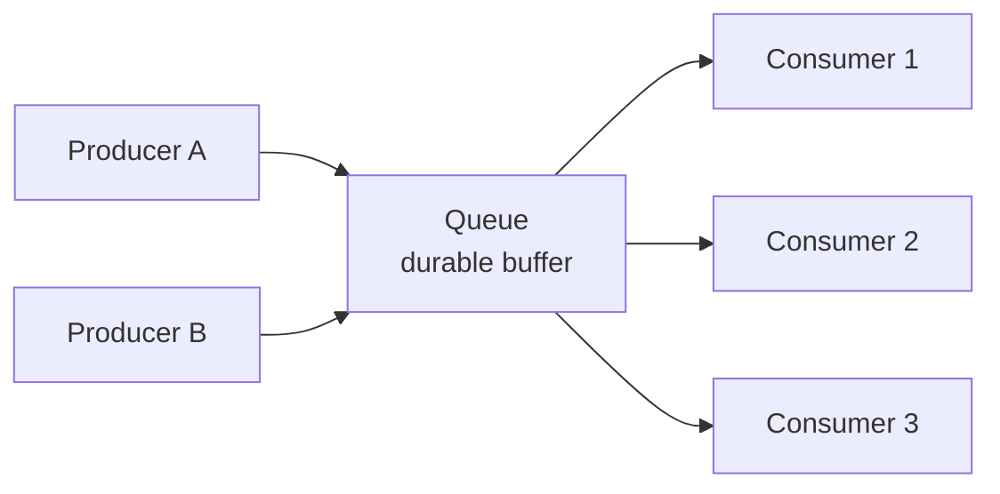
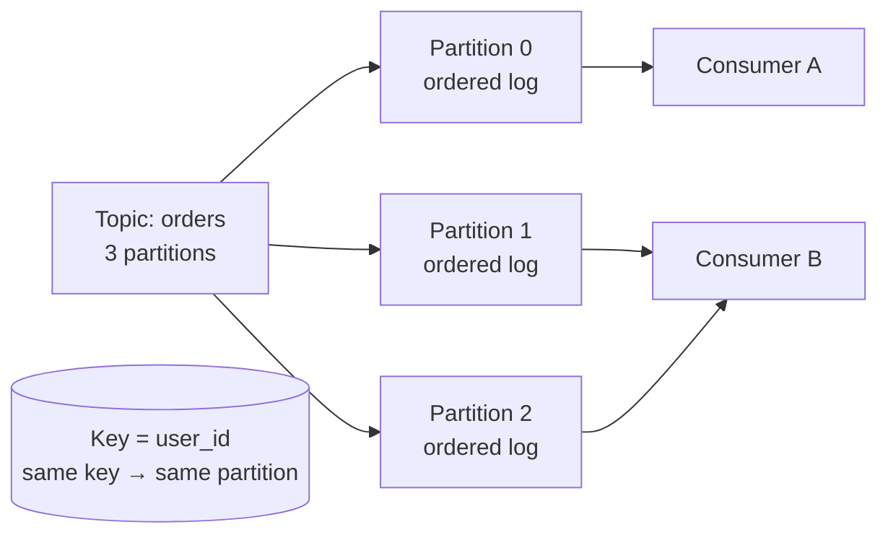

export const meta = {
  slug: 'message-queues',
  title: 'Message Queues',
  tier: 'intermediate',
  order: 14,
  summary:
    'Decoupling producers from consumers with queues: delivery guarantees, ordering, backpressure, and how Kafka, RabbitMQ, and SQS differ.',
  estimatedMinutes: 18,
  difficulty: 3,
  topics: ['messaging', 'async'],
};

## Why this matters

Sooner or later, every growing system hits the same wall: Service A needs Service B to do
something, but Service B is slow, or down, or drowning. If A calls B directly and waits, A's
fate is chained to B's worst day. A **message queue** breaks that chain. A drops a message
in the queue and walks away; B picks it up when it's ready. The queue absorbs spikes,
survives outages, and lets each side scale independently. Email notifications, order
processing, image resizing, fraud checks — the unglamorous plumbing of the internet runs on
queues.

Think of it like a **restaurant's order counter**. The waitstaff (producers) scribble orders
and clip them to the rail — they don't stand there watching the cooks. The kitchen
(consumers) grabs tickets at its own pace. If the kitchen gets slammed, tickets pile up on
the rail instead of waiters freezing mid-dining-room. The rail is the queue, and the whole
restaurant would collapse without it.

🎥 **Learn more:** [What is a Message Queue?](https://www.youtube.com/watch?v=xErwDaOc-Gs) — IBM Technology. Shows how a queue turns an 8-second upload into async work, with buffering, retries, and decoupling benefits

## The basic shape

Producers and consumers never talk to each other directly — they only know the queue. That
decoupling buys you three things: **temporal decoupling** (B can be down when A sends),
**load leveling** (spikes become a backlog, not an outage), and **independent scaling**
(add consumers without touching producers).

<PacketFlow
  stages={["Producers", "Durable queue"]}
  servers={["consumer-1", "consumer-2", "consumer-3"]}
  requestLabel="order"
  duration={5}
/>

🎥 **Learn more:** [Message Queues Finally Clicked: Producers, Partitions & Dead-Letter Queues Explained](https://www.youtube.com/watch?v=WYzLS3aNwgo) — The Logic Blueprint. Visual walkthrough of producers, brokers, consumers, and topics that builds the queue's core anatomy

## Delivery guarantees: pick your poison

This is the section that separates "we use a queue" from "we understand our queue":

- **At-most-once** — the message may be lost, but never duplicated. Fast, and fine for
  metrics or heartbeats where a dropped sample is harmless.
- **At-least-once** — the message will arrive, possibly more than once. The workhorse
  default (**SQS** standard queues, **RabbitMQ** with acknowledgments). Your consumers must
  be **idempotent** — processing the same message twice must be safe.
- **Exactly-once** — arrives once and only once. Sounds ideal, sounds expensive, and —
  here's the industry's open secret — is usually *at-least-once plus idempotency* wearing a
  trench coat. **Kafka** offers exactly-once semantics via transactions, but only within
  Kafka-to-Kafka flows; the moment your consumer calls an external API, you're back to
  designing for duplicates.

The practical rule: assume at-least-once, make your handlers idempotent (dedupe keys,
upserts instead of inserts), and sleep well.

🎥 **Learn more:** [Kafka's Exactly-Once Delivery: The Truth Behind the Marketing](https://www.youtube.com/watch?v=reSV1HHK5xw) — Compiling Ideas. Walks through at-most-once, at-least-once, and exactly-once trade-offs with idempotent writes and outbox patterns

## Ordering and partitioning

Most queues guarantee order *within* a partition or queue, not globally. Kafka's model is
the clearest: a topic is split into **partitions**, each an ordered log; messages with the
same key always land in the same partition. Consumers in a **consumer group** split
partitions among themselves — add a consumer, and partitions get rebalanced.

The catch: a partition is consumed by exactly one consumer in a group, so your parallelism
is capped by your partition count. Pick too few partitions and you can't scale consumers;
pick too many and rebalancing gets chatty. This is one of those decisions that's cheap to
make early and painful to change later.

🎥 **Learn more:** [Lesson 12 | Kafka Message Keys & Ordering Explained — How to Guarantee Event Order](https://www.youtube.com/watch?v=j9xAVG7I3Ew) — TechWithY. Explains same-key-same-partition routing, per-partition ordering, and the hot-partition tradeoff

## Backpressure: when the rail overflows

Queues absorb spikes — until they can't. Every queue is finite, and "what happens when it's
full" is a design decision, not an accident:

- **Block the producer** — simple, but now the producer feels the pain (RabbitMQ does this
  with publisher confirms and flow control).
- **Drop messages** — oldest first (a ring buffer) or newest first. Acceptable for
  telemetry, horrifying for payments.
- **Dead-letter queues (DLQ)** — messages that fail processing N times get shunted aside
  for inspection instead of clogging the main queue forever. If you take one operational
  practice from this lesson, make it DLQs. The poison message that crashes your consumer on
  every retry is not a hypothetical — it's a Tuesday.

🎥 **Learn more:** [Your Stream Is Falling Behind: Backpressure, Lag, and Batching](https://www.youtube.com/watch?v=lW68_KeMNnA) — Swetank Srivastava. Separates consumer lag from backpressure and shows how slowdowns travel upstream until spare capacity recovers

## Kafka vs. RabbitMQ vs. SQS

|  | Kafka | RabbitMQ | SQS |
| --- | --- | --- | --- |
| Model | Durable distributed log | Smart broker, flexible routing | Fully managed queue |
| Retention | Days/weeks, replayable | Until acknowledged | Up to 14 days |
| Ordering | Per partition | Per queue (mostly) | FIFO queues only |
| Best for | Event streaming, high throughput | Complex routing, low latency | Zero-ops AWS workloads |
| You operate | Brokers, ZooKeeper/KRaft | The broker cluster | Nothing |

Rough heuristic: need to replay history or stream millions of events/sec → **Kafka**. Need
fancy routing (topic exchanges, per-message TTLs) → **RabbitMQ**. Need a queue in the next
five minutes with no servers → **SQS**. Many architectures use two of the three and feel
zero shame about it.

🎥 **Learn more:** [Kafka vs RabbitMQ vs SQS: Which One Should You Choose?](https://www.youtube.com/watch?v=Yq91UbHcfug) — RandomTalks. Compares the three systems side by side across replay, ordering, retries, and real workloads

## Takeaways

1. Queues decouple producers from consumers in time and scale — spikes become backlogs, not outages.
2. Assume at-least-once delivery and make consumers idempotent; true exactly-once rarely survives contact with the real world.
3. Ordering is per-partition, and partitions cap your consumer parallelism — choose counts deliberately.
4. Plan for full queues and poison messages: backpressure policies and dead-letter queues are not optional.

<Quiz
  lessonSlug="message-queues"
  questions={[
    {
      question: "What does a message queue primarily decouple?",
      options: [
        "The database from the cache",
        "Producers from consumers, in both time and scaling",
        "The frontend from the backend",
        "Synchronous from asynchronous code in a single process",
      ],
      correctIndex: 1,
    },
    {
      question: "With at-least-once delivery, what must your consumers be?",
      options: [
        "Synchronous",
        "Idempotent — safe to process the same message twice",
        "Written in the same language as the producer",
        "Limited to one message per second",
      ],
      correctIndex: 1,
    },
    {
      question: "In Kafka, what limits how many consumers in a group can work in parallel?",
      options: [
        "The number of brokers in the cluster",
        "The number of partitions in the topic",
        "The retention period of the log",
        "The size of each message",
      ],
      correctIndex: 1,
    },
    {
      question: "What is a dead-letter queue (DLQ) for?",
      options: [
        "Storing messages that were successfully processed, for auditing",
        "Shunting aside messages that repeatedly fail processing so they don't clog the main queue",
        "Encrypting messages that contain sensitive data",
        "Holding messages during a planned broker upgrade",
      ],
      correctIndex: 1,
    },
  ]}
/>

---

## Go deeper

Want to keep pulling this thread? These talks and tutorials go further than we did here:

- [The Many Meanings of Event-Driven Architecture](https://www.youtube.com/watch?v=STKCRSUsyP0) — Martin Fowler, GOTO Chicago 2017 (~52 min). The four event-driven patterns and the trade-offs behind queue-based decoupling.
- [What is a Message Queue and When should you use Messaging Queue Systems Like RabbitMQ and Kafka](https://www.youtube.com/watch?v=W4_aGb_MOls) — Hussein Nasser, The Backend Engineering Show. When to reach for a queue; RabbitMQ vs Kafka.
- [Event-Driven Microservices, the Sense, the Non-sense and a Way Forward](https://www.youtube.com/watch?v=jrbWIS7BH70) — Allard Buijze (Axon Framework creator), GOTO Amsterdam 2019 (~50 min). Separates event-driven hype from production practice.
- [Kafka Crash Course – Hands-On Project](https://www.youtube.com/watch?v=B7CwU_tNYIE) — TechWorld with Nana (~1h 08m). Why Kafka, a broker comparison, and a real producer/consumer pipeline with Docker Compose and Python.
- [Microservices with FastAPI – Full Course](https://www.youtube.com/watch?v=Cy9fAvsXGZA) — freeCodeCamp.org (~1.5h). Watch the Redis Streams chapter — queues carrying inventory and payment events between real microservices.

## Sources & further reading

- Martin Kleppmann, *Designing Data-Intensive Applications* (O'Reilly, 2017), Ch. 11 — log-based message brokers and exactly-once semantics.
- Jay Kreps, "The Log: What every software engineer should know about real-time data's unifying abstraction" (LinkedIn Engineering, 2013) — the essay behind Kafka's design.
- Apache Kafka documentation, "Design" — partitions, consumer groups, delivery semantics.
- AWS documentation, "Amazon SQS" — visibility timeouts, DLQs, FIFO queues.
