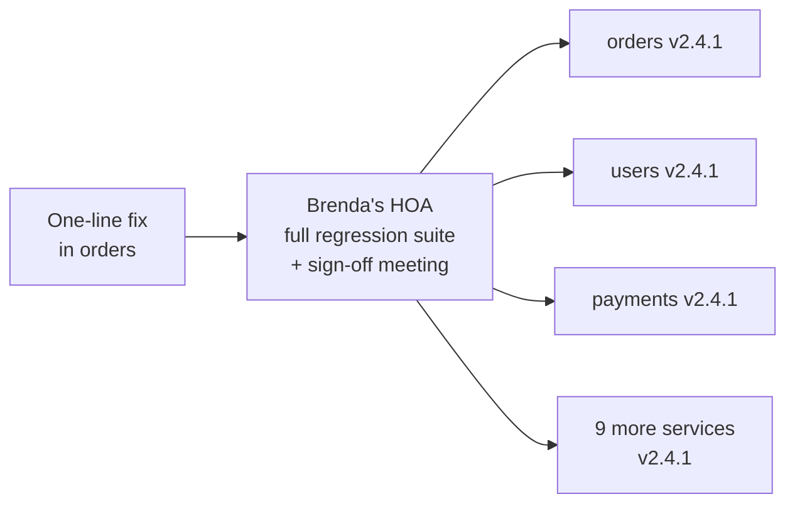
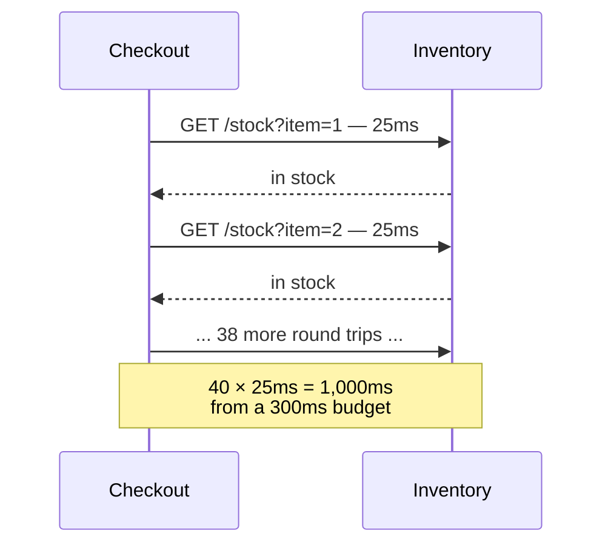
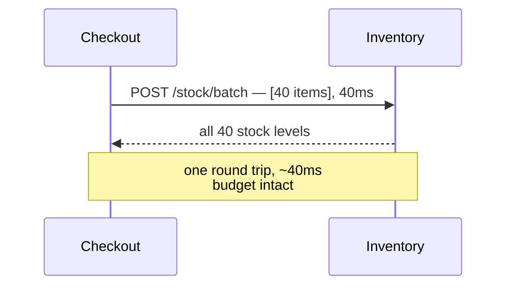
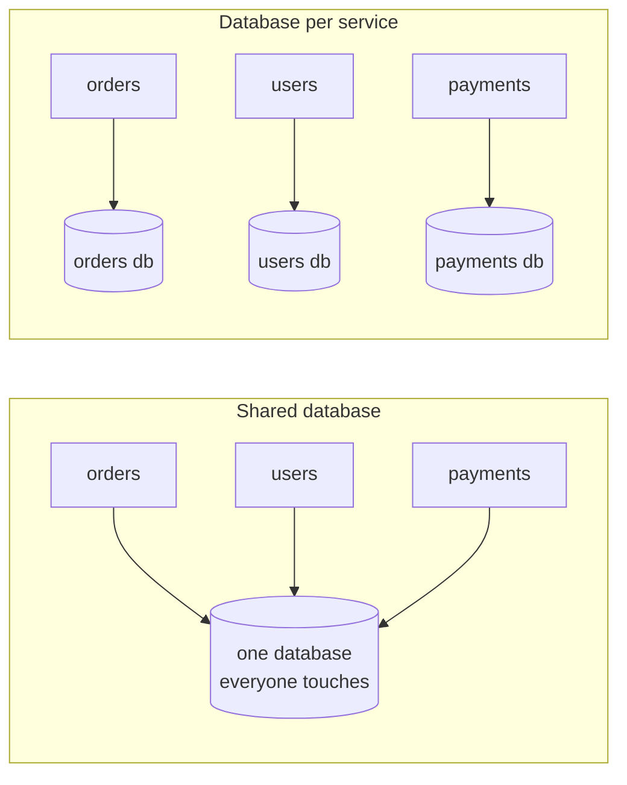

export const meta = {
  slug: 'microservices-patterns-pitfalls',
  title: 'Microservices Patterns & Pitfalls: Avoiding the Distributed Monolith',
  tier: 'advanced',
  order: 20,
  summary:
    'The loopholes that turn microservices into a distributed monolith: the independent-deployability test, chatty services and latency budgets, the shared-database cardinal sin, temporal coupling — and when to start with a modular monolith instead.',
  estimatedMinutes: 20,
};

## Why this matters

Every few months, some team posts the postmortem: "we adopted microservices and
everything got slower." Twelve deployables, a service mesh, Kubernetes — and deploys
still happen in one terrifying Friday batch, because nothing can ship alone. They didn't
get microservices. They got the worst of both worlds, with YAML.

This lesson is the field guide to how that happens: the specific loopholes teams fall
through on the way to a distributed monolith, and how to stay out of them. You've seen
the trade-offs in the microservices-vs-monolith lesson; here we go deeper into the
failure modes, with numbers.

🎥 **Learn more:** [Understanding Progressive Collapse: How To Avoid A Cascading Failure](https://www.youtube.com/watch?v=ECUd5FuK5q4) — InfoQ. Sam Newman shows real post-mortems where small failures cascaded, proving why distributed pitfalls deserve serious attention.

## The neighborhood (and where to draw the fences)

The running analogy for this lesson: your system is a street of row houses. A monolith
is one big house with roommates. Microservices are row houses: each with its own front
door, its own plumbing, its own mailbox. The whole game is the fences — where you draw
them decides whether you get independence or just extra paperwork.

So where do the fences go? Along **bounded contexts**: slices of the business that
already think differently — billing vs. shipping vs. recommendations. Split by technical
layer instead (all the database code in one "service," all the UI logic in another) and
you've built a distributed ball of mud with extra latency. The full treatment of bounded
contexts lives in the domain-driven-design lesson; the short version is: cut along
business seams, not technical ones.

One decomposition hint from the DDD world, free of charge: not every subdomain deserves
equal love. Your core subdomain (the thing that makes you money) gets your best people;
supporting subdomains get solid citizens; generic subdomains (auth, email sending, the
plumbing of billing) get bought, not built. Splitting a generic subdomain into five
hand-rolled services is how you spend a quarter reimplementing Stripe.

🎥 **Learn more:** [Granularity and Communication  in Microservices Architectures - Neal Ford](https://www.youtube.com/watch?v=CzAmPAuEGpI) — Developer Summit. Neal Ford teaches the architecture quantum technique for finding right-sized service boundaries and measuring coupling.

## Loophole one: the distributed monolith

Here's the test, from Sam Newman's *Building Microservices*: **can you make a change to
one service and deploy it to production without changing or deploying anything
else?** If yes, you have microservices. If the answer involves a spreadsheet, a sign-off
meeting, and twelve version numbers moving in lockstep — congratulations, you have a
distributed monolith. It looks like row houses from the street, but you can't renovate
your bathroom without the neighbors' plumber approving the plans.

The running joke of this lesson: **Brenda from the HOA.** Every distributed monolith has
a Brenda — the process, person, or 4,000-line integration test suite that must bless
every deploy. Brenda says nobody paints their garage door unless everybody paints theirs
the same Saturday. Brenda means well. Brenda is why your "independent" services deploy
together every Friday at 4 p.m.

Telltale signs Brenda runs your architecture:

- **Lockstep deploys.** A one-line fix in `orders` ships with eleven other services
  "just in case."
- **Distributed transactions.** Your "services" coordinate through two-phase commit or
  saga-chains-of-doom because no single service owns its data (more on that below).
- **The big-bang integration test.** The only suite that matters runs against all
  services together, takes 40 minutes, and fails for reasons nobody can attribute.

Twelve deployables, one deploy. That's not microservices — that's a monolith that pays
network rent.

How do teams end up here? Usually through the next three loopholes. Each one is a
specific kind of coupling wearing a microservices costume.

🎥 **Learn more:** [Jonathan Tower | How to Avoid Doing Microservices Completely Wrong](https://www.youtube.com/watch?v=a2WbPgrxALI) — Update Conference. Tower names the distributed monolith and walks through mistakes that keep services from deploying independently.

## Loophole two: chatty services

In-process, calling another module costs nanoseconds. Over the network, it costs a round
trip: DNS, TLS, serialization, the actual work, deserialization — realistically a few
milliseconds in the best case, tens of milliseconds once you add sidecars, retries, and
a congested network. One call is nothing. Forty calls is your whole latency budget, gone.

The classic form is the **N+1 query over the network**: checkout needs stock levels for
every line item, so it calls inventory once per item. Forty items at 25ms a call is a
full second — spent inside a checkout with a 300ms p99 budget. Your neighbor doesn't
knock forty times to borrow sugar; they ask once, for all of it.

The fix is a **latency budget** plus batching. Give every request a budget (say, 300ms
at p99), spend it deliberately across hops, and make chatty hops prove they're worth it.
The mechanical fix for the N+1 is the batch endpoint: one call, all forty items.

versus:

Watch the budget burn, hop by hop:

<StepThrough
  title="A checkout spends its 300ms budget"
  nodes={[
    { id: "shopper", label: "Shopper", x: 55, y: 150, w: 70 },
    { id: "gw", label: "API Gateway", x: 150, y: 150, w: 95 },
    { id: "co", label: "Checkout", x: 250, y: 150, w: 90 },
    { id: "inv", label: "Inventory\n(40 calls)", x: 355, y: 150, w: 105 },
    { id: "pay", label: "Payment", x: 440, y: 150, w: 60 },
  ]}
  edges={[
    { from: "shopper", to: "gw" },
    { from: "gw", to: "co" },
    { from: "co", to: "inv" },
    { from: "co", to: "pay" },
  ]}
  steps={[
    {
      title: "Set the budget",
      caption: "The shopper clicks Buy. Your SLO promises checkout completes in 300ms at p99. Every hop below spends from that same 300ms — there is no separate budget per service.",
      highlight: ["shopper"],
    },
    {
      title: "Gateway and checkout: −45ms",
      caption: "TLS termination, auth check, routing: 45ms gone before any business logic runs. 255ms remain. That is the fixed cost of being distributed — a monolith's function call would have cost microseconds.",
      highlight: ["gw", "co"],
    },
    {
      title: "The N+1 ambush: −1,000ms",
      caption: "Checkout asks inventory about each of 40 line items, one HTTP call each at ~25ms. That is 1,000ms — more than triple the entire budget — burned on a single hop. The budget isn't just blown; it's a smoking crater.",
      highlight: ["inv"],
    },
    {
      title: "Payment still has to happen",
      caption: "And payment's fraud check calls a third party with its own p99. Chains don't just add latency — they multiply tail risk. Every extra synchronous hop is another chance for a slow response to become your response.",
      highlight: ["pay"],
    },
    {
      title: "Batch the chatty hop",
      caption: "One batched call: 40 items, ~40ms. New total: 45 + 40 + payment's ~60ms ≈ 145ms. Inside budget with room to spare. Count round trips the way you count dollars, and batch the chatty ones.",
      highlight: ["co", "inv"],
    },
  ]}
/>

Two more chatty-service habits worth killing: **synchronous chains where async would
do** (the order-confirmation email doesn't need to block the response — publish an
event), and **fine-grained CRUD APIs between services** (if checkout needs half of
inventory's data model on every call, the boundary is in the wrong place).

🎥 **Learn more:** [The Chatty Service Anti-Pattern | Why Too Many Microservice Calls Slow You Down](https://www.youtube.com/watch?v=s4DFikOxFd0) — Jay Reboul. Explains how excessive synchronous service-to-service calls add latency and fragility, plus batching and aggregation fixes.

## Loophole three: the shared database

Of all the sins on this list, Newman treats this one as nearly unforgivable: **two
services sharing one database.** It looks pragmatic — "it's just a table, we'll be
careful" — but the database becomes the coupling point every service boundary was
supposed to eliminate:

- **One schema to rule them all.** Any team's migration is everyone's deployment event.
  Brenda's HOA now meets about ALTER TABLEs.
- **Backdoor integration.** Service A reads service B's tables directly "just for this
  one report." Six months later, B can't rename a column without breaking three teams.
  You've rebuilt the monolith's spaghetti, with network latency on top.
- **No independent ownership.** You can't move orders to a hotter database without
  dragging users and payments along with it.

The rule: **each service owns its data, privately.** If another service needs it, it
goes through the owning service's API — or better, subscribes to its events (the
domain-driven-design lesson shows the mechanics). Yes, this means giving up
cross-service joins and transactions; the distributed-transactions lesson exists
precisely because that trade-off is real. But sharing the database to dodge the
trade-off just relocates the coupling to the one place you can't version, deprecate,
or deploy independently.

🎥 **Learn more:** [Should Each Microservice Have Its Own Database or Table?](https://www.youtube.com/watch?v=eZocOdvxFh8) — Ram N Java. Walks through why shared tables break service independence and how database-per-service restores ownership and scaling.

## Loophole four: temporal coupling

**Temporal coupling** is when service A can only do its job while service B is awake,
reachable, and healthy. Checkout calls inventory synchronously; inventory has a bad
deploy; checkout goes down too — even though checkout's own code is flawless.
Availability becomes contagious: if each of five services in a chain is 99.9% available,
the chain is roughly 99.5% available, and that's before counting the network between
them.

Back to the neighborhood: temporal coupling is needing your neighbor to be home to
unlock the shared gate before you can leave for work. Their bad morning becomes your
missed flight.

The escapes, in order of preference:

1. **Don't call synchronously.** Publish an event; let the other service catch up. (Your
   message-queues lesson is the how.)
2. **Cache and degrade.** If inventory is down, checkout can sell from a slightly stale
   stock snapshot and reconcile later. For most businesses, a five-minute-old stock
   count beats a dead checkout page.
3. **Isolate the blast radius.** Timeouts, retries with backoff, circuit breakers — the
   resilience-patterns lesson's toolkit — so one slow service degrades instead of
   detonating.

Temporal coupling is also why "just add a service mesh" doesn't save you. The mesh
makes the calls observable and retryable, but it can't make five synchronous
dependencies less synchronous.

🎥 **Learn more:** [Loose Coupling Isn’t Free — The Cost of Event-Driven Systems](https://www.youtube.com/watch?v=Rk1gL9w8L14) — Systems Thinking for Architects. Unpacks temporal coupling: event ordering and hidden timing dependencies that quietly re-couple services.

## When not to use microservices

Everything above is an argument for a starting position: **don't.** Not yet. Martin
Fowler's advice is blunt — "MonolithFirst": even if you're confident microservices are
the destination, start with a monolith, because you don't yet know where the boundaries
are. A wrong boundary in a monolith is a refactor; a wrong boundary in microservices is
a migration.

The version of "monolith" worth starting with is the **modular monolith**: one
deployable, strict internal module boundaries, no sneaky cross-imports. (The
microservices-vs-monolith lesson covers it in full — what follows is the short version,
tuned for this lesson's question: when do you stay?)

<VsToggle
  title="Stay or split?"
  a={{
    label: "Modular monolith",
    title: "One deployable, strict internal fences",
    points: [
      "One team owns everything: deploys, debugging, and the 3 a.m. page stay simple",
      "Refactoring across a wrong boundary is a code move, not a cross-team migration",
      "Transactions, joins, and stack traces work the way the textbooks say",
      "When a module outgrows the house, the fence is already drawn — extraction is mechanical",
    ],
    note: "The default. Split along seams that prove painful, not ones you predict.",
  }}
  b={{
    label: "Microservices",
    title: "Many deployables, genuinely independent",
    points: [
      "Several teams need to ship without waiting on each other — the deployability test passes",
      "Workloads scale on different curves: scale the hot service, not everything",
      "One service's bad day stays its own: failure isolation per team and per deploy",
      "You can afford the platform cost: CI/CD, observability, and on-call per service",
    ],
    note: "Earn this by outgrowing the monolith. Premature distribution is the root of the 3 a.m. page.",
  }}
/>

The honest version of the decision: microservices are an answer to a *team-scaling*
problem. If your problem is a *code* problem — tangled modules, slow tests, scary
deploys — distribution makes every one of those worse while adding network failure
modes. Fix the code problem with module boundaries first. If, later, two teams are
stepping on each other's deploys every week, you'll know exactly which fence to turn
into a network boundary. Brenda will be disappointed. That's fine.

🎥 **Learn more:** [Monoliths vs Microservices: Are We Overcomplicating Everything?](https://www.youtube.com/watch?v=5rt6-rndQQA) — SEEKJobs. SEEK engineers weigh when monoliths beat microservices, covering team size, complexity, and ownership trade-offs.

## Takeaways

1. Draw service boundaries along bounded contexts — business seams, not technical
   layers. The domain-driven-design lesson has the full method.
2. The independent-deployability test is the whole game: if you can't change and deploy
   one service without touching the others, you have a distributed monolith.
3. Chatty services burn latency budgets one round trip at a time. Count round trips
   like dollars; batch the N+1s; give every request a budget and spend it deliberately.
4. A shared database is the cardinal sin: it couples every service to one schema, one
   migration schedule, and one team's bad ALTER TABLE.
5. Temporal coupling makes availability contagious. Prefer events over synchronous
   calls, degrade gracefully from cache, and isolate failures with timeouts and circuit
   breakers.
6. Default to a modular monolith. Split along seams that prove painful — MonolithFirst
   — not along boundaries you predicted on a whiteboard.

<Quiz
  lessonSlug="microservices-patterns-pitfalls"
  questions={[
    {
      question:
        "Your team 'has microservices': 12 deployables. A one-line fix in orders requires the full regression suite, and all 12 services deploy together on Friday. What does the independent-deployability test say?",
      options: [
        "You have microservices — 12 deployables is the definition",
        "You have a modular monolith, which was the goal anyway",
        "You have a distributed monolith: it looks distributed, but nothing deploys independently",
        "The test doesn't apply until you have at least 20 services",
      ],
      correctIndex: 2,
    },
    {
      question:
        "Checkout calls inventory once per line item: 40 items × 25ms ≈ 1,000ms against a 300ms p99 budget. What fix does the lesson recommend?",
      options: [
        "Batch it: one call carrying all 40 items (~40ms)",
        "Add more inventory service replicas",
        "Raise the latency budget to 1,500ms",
        "Cache inventory responses for a week",
      ],
      correctIndex: 0,
    },
    {
      question: "Why does the lesson call a shared database the cardinal sin?",
      options: [
        "Databases can't handle connections from multiple services",
        "It makes backups technically impossible",
        "Joins across services become too fast to measure",
        "Every service couples to one schema: one team's migration becomes everyone's deployment event",
      ],
      correctIndex: 3,
    },
    {
      question: "What is temporal coupling?",
      options: [
        "Two services deployed at the same time of day",
        "Service A can only answer while service B is up and reachable — availability becomes contagious",
        "Two databases sharing the same system clock",
        "A cache whose TTL is set too short",
      ],
      correctIndex: 1,
    },
    {
      question:
        "The lesson says to decompose services along what boundary — and where is the full treatment?",
      options: [
        "Bounded contexts and subdomains — see the domain-driven-design lesson",
        "Database tables — one service per table",
        "Team size — one service per developer",
        "Network zones — one service per availability zone",
      ],
      correctIndex: 0,
    },
    {
      question: "A three-person startup is choosing an architecture. The lesson's advice?",
      options: [
        "Microservices from day one — it's the modern default",
        "Skip architecture entirely and rewrite everything later",
        "Start with a modular monolith; extract along seams that prove painful",
        "Build a distributed monolith first, then add independence later",
      ],
      correctIndex: 2,
    },
  ]}
/>

---

## Go deeper

Want to keep pulling this thread? These talks and tutorials go further than we did here:

- [When To Use Microservices (And When Not To!)](https://www.youtube.com/watch?v=GBTdnfD6s5Q) — Sam Newman & Martin Fowler, GOTO 2020 (~37 min). The independent-deployability test and how teams fossilize lockstep deploys.
- [3 Common Pitfalls in Microservice Integration & How to Avoid Them](https://www.youtube.com/watch?v=7uvK4WInq6k) — Bernd Rücker, GOTO Berlin 2019 (~46 min). Retry strategies, timeouts, and distributed-transaction traps with real code.
- [Modular Monoliths](https://www.youtube.com/watch?v=5OjqD-ow8GE) — Simon Brown, GOTO Berlin 2018 (~45 min). The case for starting with a modular monolith, with concrete encapsulation techniques.

## Sources & further reading

- Sam Newman, *Building Microservices* (O'Reilly, 2nd ed. 2021) — the independent-deployability test; information hiding and chatty interfaces; database-per-service.
- James Lewis & Martin Fowler, "Microservices" (martinfowler.com, 2014) — the canonical definition: independently deployable services organized around business capability; "smart endpoints and dumb pipes."
- Martin Fowler, "MonolithFirst" (martinfowler.com, 2015) — start with a monolith even when microservices are the destination, because boundaries are discovered, not predicted.
