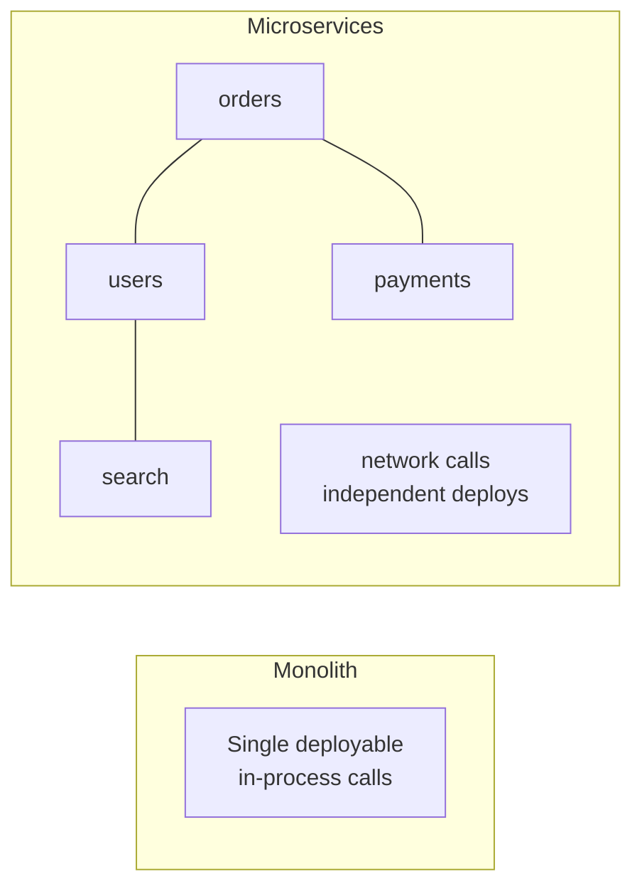

export const meta = {
  slug: 'microservices-vs-monolith',
  title: 'Microservices vs. Monolith',
  tier: 'intermediate',
  order: 19,
  summary:
    'The most argued-over trade-off in backend architecture: when splitting services pays off, when a modular monolith wins, and how to avoid the distributed monolith.',
  estimatedMinutes: 18,
};

## Why this matters

Few topics generate more confident wrongness than this one. "Microservices" has been both
sold as the inevitable future and blamed for spectacular engineering face-plants — sometimes
about the same company. The honest version is boring and useful: it's a trade-off about **team
scaling and failure isolation** versus **operational simplicity**, and the right answer
depends on your organization more than your technology. Get it wrong in either direction and
you'll feel it for years.

The analogy: a **monolith is one big restaurant kitchen** — every cook in one room,
shouting distance from everyone else. Communication is instant, but Thanksgiving dinner for
400 means chaos in a single space. **Microservices are a food court** — each stall
independent, with its own staff, menu, and hours. One stall's grease fire doesn't close the
others, but now you need shared plumbing, shared seating, and a directory so customers can
find the dumplings.

🎥 **Learn more:** [Microservices, Where Did It All Go Wrong - Ian Cooper - NDC London 2025](https://www.youtube.com/watch?v=d8NDgwOllaI) — NDC Conferences. Cooper unpacks the misunderstandings that made a decade of microservices painful, and what each approach was meant to solve.

## What each buys you

**Monolith strengths:** one codebase to understand, one deployment pipeline, function
calls instead of network calls (no serialization, no partial failure, no latency), trivial
refactoring across boundaries, and transactions that actually work (see *Distributed
Transactions* for what you give up). Debugging is *pleasant* — the stack trace is right
there.

**Microservices strengths:** independent deployment (the search team ships without waiting
for the billing team), independent scaling (scale the hot service, not everything),
technology choice per service, and **failure isolation** — one service's memory leak pages
one team instead of taking down the site. This last one is the real prize at scale.

🎥 **Learn more:** [Monolithic vs Microservice Architecture: Which To Use and When?](https://www.youtube.com/watch?v=NdeTGlZ__Do) — Alex Hyett. Walks through advantages and disadvantages of each style so you see what monoliths and microservices buy you.

## Conway's law: the part nobody warns you about

> "Organizations design systems that mirror their own communication structure." — Melvin Conway, 1968 (written 1967)

This is the closest thing our field has to a law of physics. Three teams that never talk
will produce three services with awkward seams in exactly the places the teams don't talk.
Microservices don't *fix* communication problems — they *fossilize* them into network
boundaries. If your org chart is a mess, your service diagram will be a mess with latency.

The flip side: if you have five genuinely independent teams stepping on each other in one
repo, splitting is how you stop the merge-conflict wars. Architecture follows org, not the
other way around.

🎥 **Learn more:** [Architecture and Organization: Inverse Conway and Team Topologies](https://www.youtube.com/watch?v=8lfeIdqwWDM) — Adaptive Organizations meet Architecture. Explains how team structures shape software design, and how the inverse Conway maneuver lets you redesign teams deliberately.

## The distributed monolith: the worst of both

The failure mode to fear has a name: the **distributed monolith**. It looks like
microservices (many deployables, network calls everywhere) but behaves like a monolith
(everything must deploy together, one service's change breaks five others, no independent
scaling). You get all the operational pain of distribution with none of the autonomy. Telltale
signs: distributed transactions across services, lockstep deployments, and a "service"
diagram that is really one big ball of mud with HTTP in the middle.

🎥 **Learn more:** [Don't Build a Distributed Monolith: How to Avoid Doing Microservices Wrong - Jonathan J. Tower](https://www.youtube.com/watch?v=9iW_2MMLd4w) — NDC Conferences. Tower walks through ten common microservices mistakes that quietly produce a distributed monolith, and how to avoid them.

## The modular monolith: the underrated middle

Here's the option the discourse skips: a **modular monolith** — one deployable, but with
strict internal module boundaries (separate packages, explicit interfaces, no sneaky
cross-imports). You keep the monolith's operational simplicity while practicing the
discipline microservices force on you. If a module later needs independent scaling, the
boundary is already drawn — extraction becomes a mechanical move, not an archaeology
project. **Shopify** runs one of the world's largest Rails monoliths this way; **Amazon
Prime Video** famously *moved back* from microservices to a monolith for one workload and
cut infrastructure costs ~90%.

🎥 **Learn more:** [You're Building Modular Monoliths All Wrong](https://www.youtube.com/watch?v=I4dC_lqS_I8) — CodeOpinion. Comartin shows how to draw true module boundaries with real data ownership inside one deployable monolith.

## A decision framework

| Choose the monolith (modular!) when… | Choose microservices when… |
| --- | --- |
| One small team owns everything | Multiple teams need to ship independently |
| The domain boundaries are still unclear | Boundaries are stable and well-understood |
| You need to move fast and refactor freely | You need independent scaling per workload |
| Operational headcount is limited | You can afford platform/infra investment |

And the golden rule, courtesy of everyone who's been burned: **don't start with
microservices.** Start with a modular monolith; split along the seams that prove painful.
Premature distribution is the root of all evil — or at least of all 3 AM pages involving
seven services and one missing trace span.

🎥 **Learn more:** [Monolith vs Microservices (Most Engineers Get This WRONG) | When to Use What (Interview Guide)](https://www.youtube.com/watch?v=sXVpQpsdjfQ) — TechingEasy. Lays out when to use a monolith versus microservices, giving clear criteria for the architecture decision.

## Takeaways

1. Monoliths optimize for simplicity and team velocity; microservices optimize for independent scaling and team autonomy.
2. Conway's law: your architecture will mirror your org chart — fix the communication before drawing the boundaries.
3. The distributed monolith (coupled services, lockstep deploys) is the worst of both worlds — watch for it.
4. Default to a modular monolith; extract services along seams that prove painful, not ones you predict.

<Quiz
  lessonSlug="microservices-vs-monolith"
  questions={[
    {
      question: "According to Conway's law, what shapes a system's architecture?",
      options: [
        "The programming languages chosen",
        "The organization's own communication structure",
        "The cloud provider's service catalog",
        "The CAP theorem trade-offs",
      ],
      correctIndex: 1,
    },
    {
      question: "What is a 'distributed monolith'?",
      options: [
        "A monolith deployed across multiple regions",
        "Many separately-deployed services that are still tightly coupled — requiring lockstep deployments with none of the autonomy benefits",
        "A monolith that uses a distributed database",
        "Microservices that share a single database",
      ],
      correctIndex: 1,
    },
    {
      question: "What is the main advantage of a modular monolith over a naive monolith?",
      options: [
        "It deploys faster because modules deploy independently",
        "Strict internal boundaries keep the operational simplicity of one deployable while making future extraction mechanical",
        "It eliminates the need for automated tests",
        "Modules can be written in different languages",
      ],
      correctIndex: 1,
    },
    {
      question: "When is starting with microservices most defensible?",
      options: [
        "Always — it's the modern default",
        "When multiple teams need to ship and scale independently and domain boundaries are well understood",
        "When the team is small and wants to move fast",
        "When the domain boundaries are still unclear",
      ],
      correctIndex: 1,
    },
  ]}
/>

---

## Go deeper

Want to keep pulling this thread? These talks and tutorials go further than we did here:

- [David Heinemeier Hansson: Microservices vs. Monolith](https://www.youtube.com/watch?v=rkXGSLf-rVQ) — David Heinemeier Hansson (Rails creator), Honeypot. The pro-monolith side: team size, communication cost, operational simplicity.
- [Modular Monoliths](https://www.youtube.com/watch?v=5OjqD-ow8GE) — Simon Brown, GOTO Berlin 2018 (~45 min). The underrated middle: strict module boundaries inside one deployable.
- [Modular Monoliths and Other Facepalms](https://www.youtube.com/watch?v=4qfsmE11Ejo) — Kevlin Henney, NDC London 2026. The microservices-vs-monolith pendulum in historical context.

## Sources & further reading

- Melvin Conway, "How Do Committees Invent?" (*Datamation*, 1968) — the original Conway's law paper.
- Sam Newman, *Building Microservices* (O'Reilly, 2nd ed. 2021) — the pragmatic field guide.
- Amazon Prime Video tech blog, "Scaling up the Prime Video audio/video monitoring service" (2023) — the famous monolith move-back with ~90% cost reduction.
- Shopify Engineering, "Designing Software that Maximizes Developer Productivity" — componentization of a giant Rails monolith without going distributed.
