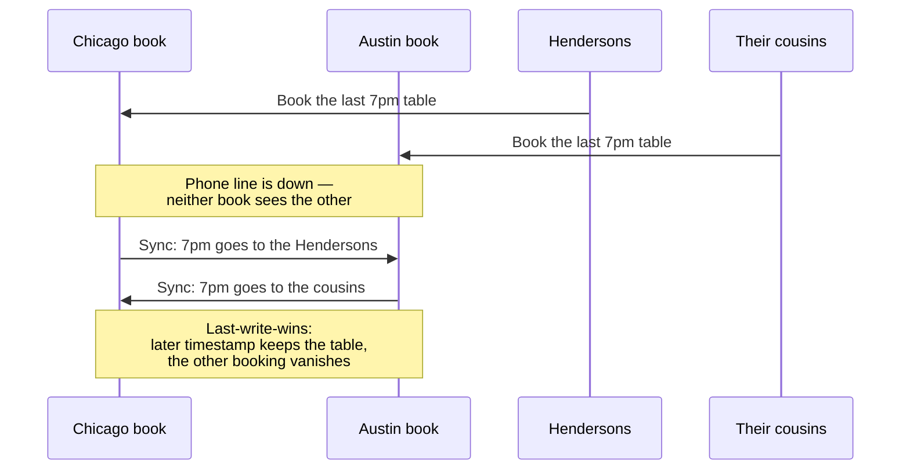
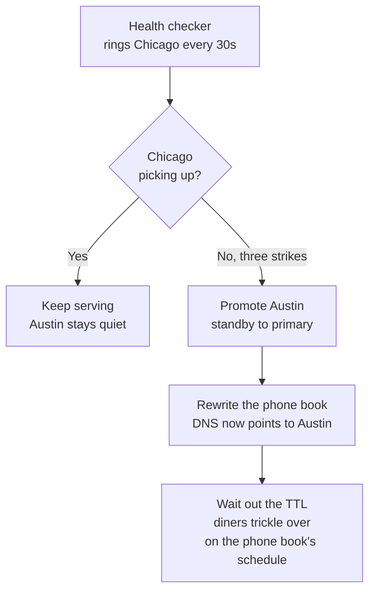

export const meta = {
  slug: 'multi-region-active-active',
  title: 'Multi-Region Active-Active: Surviving the Datacenter Fire',
  tier: 'advanced',
  order: 35,
  summary:
    "Your whole region goes dark at 2 a.m. — now what? RPO and RTO with real numbers, active-passive vs active-active, replication lag, write conflicts and how to survive them, DNS failover, data borders, and why you should set fire to your own plans on purpose.",
  estimatedMinutes: 20,
  difficulty: 5,
  topics: ['reliability', 'scaling', 'distributed systems'],
};

## Why this matters

It's 2:47 a.m. and your pager is screaming. Your entire region — every server, every
disk, every load balancer you own — has gone dark at once. You open the cloud
provider's status page. It says, in the universal language of bad nights, "we are
investigating."

This is not hypothetical. In February 2017, a mistyped command during routine
debugging took down S3 in AWS's us-east-1 region for hours — and because an
embarrassing share of the internet kept critical dependencies there, half the web
went with it. In December 2021, us-east-1 had another major event. Every cloud has a
version of this story. Regions are the largest failure domain your provider sells
you, and they fail the way everything fails: rarely, suddenly, and at the worst
possible time.

The cloud-native lesson taught you to spread across availability zones — separate
wings of the same building. This lesson is about what happens when the whole building
burns. Going multi-region is the most expensive reliability decision you'll make, and
the trade-offs are measured in two numbers and two architectures — plus one very
cursed dinner reservation.

<VideoCard videoId="-NDKW8Bfujk" title="When Everything Burns: Disaster Recovery &amp; Multi-Region Architecture — Surviving Outages" source="Nat &amp; Leo (certquests)" description="Exam-trap-style walkthrough of surviving regional outages: Multi-AZ vs DR, pilot light, warm standby, active-active vs active-passive failover, and RTO/RPO in disaster recovery. Caveat: also exam-prep oriented; no verified authoritative alternative found" />

## The twin restaurants

This lesson's running analogy: you own two restaurants — one in Chicago, one in
Austin — and they share a single reservation book. Chicago takes a booking; the
hostess phones it to Austin so both books match. Austin takes a booking; same thing
in reverse. One restaurant group, two cities, one shared truth. That's multi-region
in a sentence.

Mapping, stated plainly:

- A **restaurant** is a **region** — a full, independent copy of your system in one
  geography.
- The **reservation book** is your **data** — the state both regions must agree on.
- The **phone call between hostesses** is **cross-region replication** — and the line
  has lag, gets garbled, and occasionally goes dead.
- A **diner** is your **user**, who just wants a table and does not care about your
  phone lines.
- The **health inspector's files that legally can't leave Texas** are **data
  residency** — more on those later.

And our running gag for the evening: the Henderson anniversary dinner. Party of 12.
Saturday, 7 p.m. The most cursed reservation in the history of hospitality.
Everything that can go wrong with two books will go wrong for the Hendersons first.

<VideoCard videoId="gcSWFKX89vo" title="PostgreSQL HA Architecture: Surviving a Full Region Failure" source="PostgreSQL Mechanics" description="Demonstrates active-active multi-region replication, write conflicts, and planned replica lag." />

## How dead can you afford to be: RPO and RTO

Before any architecture, two numbers. They come from the unglamorous world of
business continuity planning, and they are the entire conversation:

- **RPO — Recovery Point Objective.** How much data you can afford to lose, measured
  in time. An RPO of 24 hours means "we can lose everything since yesterday's backup
  and still be okay." An RPO of zero means "we lose nothing, ever."
- **RTO — Recovery Time Objective.** How long you can afford to be down. An RTO of 4
  hours means "dinner is cancelled for four hours and we survive." An RTO of zero
  means "nobody notices."

Smaller numbers cost more money. That's the whole game. The industry names four
rungs on this ladder — AWS's disaster recovery whitepaper lays them out, and every
cloud has a version:

1. **Backup and restore.** You ship backups to the other city nightly. Chicago
   burns; you rebuild in Austin from last night's tape. RPO: up to 24 hours of
   reservations gone. RTO: hours — you're rebuilding a restaurant from a box of
   photographs. Cheapest. Also the slowest.
2. **Pilot light.** The Austin kitchen exists but the burners are off — a minimal
   copy of your systems idles there, with data replicated continuously. Chicago
   burns; you turn the gas on and scale up. RPO: minutes. RTO: tens of minutes.
3. **Warm standby.** Austin is fully staffed and open, just smaller — it serves a
   trickle of traffic normally and scales up when Chicago dies. RPO: near zero.
   RTO: minutes.
4. **Multi-site active-active.** Both restaurants are open, full staff, both seating
   diners right now. Chicago burns; Austin was already serving. RPO: near zero.
   RTO: near zero — the closest thing to "the fire never happened."

Notice the bill climbing with each rung. Active-active means paying for two full
restaurants while hoping you never need the redundancy. Nobody picks it for fun. You
pick it when the cost of being down exceeds the cost of the second restaurant —
which, for a payments company or a hospital system, it does by 9 a.m.

<VideoCard videoId="koRSzvlIX1Q" title="RTO vs RPO — Explained in Detail" source="software-engineer-blog" description="Prices each RTO and RPO tier with a worked shop example, showing what zero costs." />

## Active-passive vs active-active: who seats the diners?

Here's the real fork in the road. In **active-passive** — backup/restore, pilot
light, warm standby — one restaurant carries the dinner rush and the other idles or
serves a trickle. Simple. One
reservation book is the truth; the other is a copy. When Chicago dies, you promote
Austin, flip the sign, and reopen.

In **active-active**, both restaurants seat diners simultaneously — and both
hostesses are writing in the book at the same time. Failover is instant because
there's nothing to fail over *to*; Austin was already working. But now you own the
hardest problem in this lesson: **two people writing in the same book over a phone
line with lag.**

That lag is physics, not pessimism. Chicago to Austin is roughly 1,600 kilometers;
light in fiber needs about 8 milliseconds just to make the one-way trip, and real
replication — batching, fsync, apply — lands in the tens to hundreds of
milliseconds, sometimes seconds under load. (AWS advertises its Aurora Global
Database replication lag as typically under a second, and that's considered
*good*.) So there is always a window — small, but real — where Chicago's book and
Austin's book disagree.

One callback to your [CAP](/lesson/cap-theorem) and [replication](/lesson/replication-consistency-models) lessons, and then we move on: you already
learned that perfect consistency, perfect availability, and a network partition
can't all hold at once, and that quorums are how single-region systems vote on the
truth. Across regions, voting gets too slow — nobody wants the hostess to wait for
Austin's permission before seating a walk-in — so multi-region systems usually choose
availability and sort out the disagreements after. The rest of this lesson is the
sorting-out.

<VideoCard videoId="__yGOdiTU9A" title="Redundancy & Replication Explained | Active-Active vs Active-Passive Architectures" source="Engineering Systems" description="Explains both architectures through a food-delivery case study, comparing availability against complexity." />

## When the two books disagree: conflicts and how to survive them

Saturday, 7 p.m. The Hendersons call Chicago and book the last big table. Their
cousins call Austin — same restaurant group, remember — and book the last big
table. The phone line between the cities is down. Both books now promise the same
table to two parties of 12. The books sync on Sunday. Somebody isn't eating.

You have three ways to handle this, and none of them is free:

**1. Last-write-wins.** Every entry carries a timestamp; when the books sync, the
later timestamp wins and the earlier one is silently discarded. The cousins keep
the table. The Hendersons arrive to find strangers eating their anniversary dinner.
LWW is simple, fast, and *eats data without telling you*. Cassandra and Riak both
default to it, which is fine when your data is "the latest temperature reading"
and catastrophic when it's "the last table." Use LWW only for data where
overwriting is harmless.

**2. CRDTs — data structures that can't disagree.** A Conflict-free Replicated Data
Type is a data structure designed so merges are always safe: a grow-only counter,
an observed-remove set. The math guarantees that no matter what order the updates
arrive in, both books converge to the same result. If the reservation book were a
CRDT set, syncing would union both bookings — and you'd discover you now owe *two*
parties of 12 a table, which is at least honest. CRDTs don't prevent the conflict;
they make the merge deterministic and data-loss-free. The price: they only work for
certain shapes of data, and "certain shapes" rarely covers your entire schema.

**3. Application-level merge.** You decide, in your own code, what a conflict
means. The shopping cart merges by union — both cities' items stay. The bank
balance refuses to merge at all — money goes through a single writer, because
"deterministic but wrong" is not acceptable for ledgers. This is the most work and
the most correct: your application understands the *meaning* of the data, so it's
the only layer that can merge it sensibly.

The honest summary: pick your poison per dataset. Counters and sets get CRDTs.
Sensor readings get LWW. Money gets a single writer and a hard stare. The teams
that get burned are the ones that pick one strategy for everything.

<VideoCard videoId="RK2odztfP0I" title="L27 : Leaderless Replication, Topologies, CRDTS, Quorum Writes, Read Repair & Anti-Entropy" source="Aarchi Gandhi" description="Covers multi-leader conflict handling: last-write-wins, custom merges, and CRDTs, with DynamoDB examples." />

## Getting diners to the open restaurant: DNS failover and anycast

Chicago is on fire. Austin is ready. But every diner in America has Chicago's phone
number memorized — your DNS records point at the dead region. How do they find
Austin?

**DNS failover** is the classic answer: a health checker rings Chicago every 30
seconds, and after a few unanswered calls it rewrites the DNS record to Austin's
address. Simple, cheap, and fibbing to you about one thing: the TTL. You set a
60-second TTL thinking "diners switch in a minute." In practice, ISP resolvers,
corporate DNS, browsers, and apps cache answers longer than your TTL says — some
ignore low TTLs entirely. The phone book reprints on its own schedule. Real-world
DNS failover takes minutes, sometimes tens of minutes, and during that window some
diners keep calling the burned-down restaurant.

**Anycast** is the fancier answer: both restaurants share one phone number — one IP
address announced from both cities — and internet routing delivers each caller to
the nearest working restaurant. No DNS change, no TTL wait; when Chicago dies, its
announcement is withdrawn and callers land in Austin in seconds. This is how
Cloudflare and Google's front ends work. The catch: it needs provider-level
networking support, it doesn't help your *data* agree with itself, and debugging
"which city answered that call" will age you.

Most teams land on DNS failover with health checks for the sign flip, accept the
TTL slop, and reserve anycast for the front door of truly global systems. Either
way: the failover mechanism is the easy part. The reservation book was always the
hard part.

<VideoCard videoId="TAGW_H1HNHk" title="Apply Anycast Best Practices for Resilient & Performant Global Applications" source="NetActuate" description="Shows how anycast routing sends users to the nearest healthy PoP, covering global DNS and failover." />

## The fine print: borders, bills, and fire drills

Three things nobody puts on the architecture diagram:

**Borders.** Some reservation books legally can't leave the state. Data residency
rules — the EU's GDPR restricts how personal data can leave the EU/EEA, and
stricter localization laws in places like China and Russia require certain data
to stay inside national borders — mean your "Austin" for European diners might
need to be in Frankfurt, not Virginia, and many teams choose to keep EU personal
data off US books entirely. Multi-region isn't just "two cities" — it's two
cities your lawyers approve of. Design your data model so regulated data is
separable *before* you need it to be.

**Bills.** Every phone call between the hostesses costs money. Cross-region traffic
is metered — on the order of cents per gigabyte — and a chatty replication setup
moves a lot of gigabytes. Teams routinely discover that their second restaurant's
biggest expense isn't the building; it's the phone bill. Compress, batch, and
replicate only what the other city actually needs. Your FinOps friends from the
cloud-native lesson will find this line item before you do.

**Fire drills.** Here's the uncomfortable part: a failover plan you've never run is
a hope, not a plan. The runbook says "promote Austin, flip DNS, scale up" — but
does the Austin database actually have the right credentials? Does the DNS change
need a human approval nobody documented? Did anyone update the runbook since the
migration in March? The industry answer is scheduled disaster: game days, chaos
engineering, and Google's DiRT exercises (Disaster Recovery Testing), where you
*actually set the fire* — kill a region on purpose, on a Tuesday, with everyone
watching — and fix everything the drill exposes. Schedule yours for the Saturday
of the Henderson anniversary. Of course.

And the nightmare scenario the drills are for: **split-brain**. The phone line
dies, both cities conclude the other burned down, and both promote themselves to
primary. Now you have two restaurants, two full books, both seating diners — and
when the line comes back, the merge is a war. This is why promotion is never
automatic without fencing: the old primary must be *proven* dead — or forcibly
fenced off, "shoot the other node in the head" in clustering parlance — before the
standby takes over. Automatic failover without fencing doesn't give you high
availability; it gives you two primaries and a data integrity incident.

<VideoCard videoId="a9mVfHjgANU" title="Balancing Data Locality, Data Sovereignty, and Data Replication" source="Datadog" description="Datadog panel on sovereignty, placement costs, and operating through regional failures and outages." />

## Takeaways

1. **RPO is how much data you can lose; RTO is how long you can be down.** Every
   multi-region decision is priced in these two numbers — smaller numbers, bigger
   bills.
2. **The four rungs:** backup and restore (cheap, slow), pilot light (data
   replicated, servers idle), warm standby (smaller live copy), active-active
   (both live). Pick the cheapest rung your business can survive.
3. **Active-active fails over instantly and conflicts constantly.** Replication lag
   is physics — tens of milliseconds at best — so the two books will disagree, and
   you need a plan for the disagreement, not just the failover.
4. **Last-write-wins is simple and eats data.** Use it only where overwriting is
   harmless. CRDTs make merges deterministic for certain data shapes. Money and
   meaning get application-level merge or a single writer.
5. **DNS failover works on the phone book's schedule, not yours.** TTLs are
   advisory; resolvers cache longer. Anycast is faster but needs provider-grade
   networking — and neither fixes your data.
6. **Borders and bills are architecture.** Data residency laws pick your cities;
   cross-region transfer is metered per gigabyte and will surprise you.
7. **Drill the fire.** An untested failover plan is a hope. Kill a region on
   purpose, on a Tuesday, and fix what the drill finds — including split-brain
   fencing, so you never get two primaries.

<Quiz
  lessonSlug="multi-region-active-active"
  questions={[
    {
      question:
        "Your nightly backup runs at 2 a.m. and a full restore takes 4 hours. The region dies at 6 p.m. Roughly what are your RPO and RTO?",
      options: [
        "RPO of about 4 hours and RTO of about 16 hours",
        "RPO of zero and RTO of zero — backups are magic",
        "RPO of about 16 hours (everything since the 2 a.m. backup) and RTO of about 4 hours",
        "RPO of about 2 hours and RTO of about 2 hours",
      ],
      correctIndex: 2,
    },
    {
      question:
        "Why is active-active harder than active-passive, even though it fails over faster?",
      options: [
        "Both regions accept writes at once, so replication lag and conflicting writes become your daily problem",
        "Health checks are unnecessary when both regions are live",
        "DNS failover becomes instant, which confuses the health checker",
        "It doubles your servers but halves your latency everywhere",
      ],
      correctIndex: 0,
    },
    {
      question:
        "The Hendersons book the last 7 p.m. table in Chicago while their cousins book it in Austin, with the link between cities down. Under last-write-wins, what happens when the books sync?",
      options: [
        "The system pages you to decide, then waits for your answer",
        "Whichever write carries the later timestamp keeps the table; the other booking silently disappears",
        "Both bookings are kept and the restaurant seats 24 people at a table for 12",
        "The older write wins, because seniority",
      ],
      correctIndex: 1,
    },
    {
      question:
        "You flip DNS to the healthy region with a 60-second TTL. Why might some customers still reach the dead region minutes later?",
      options: [
        "DNS changes require a human to approve each one",
        "A 60-second TTL guarantees every client switches within 60 seconds",
        "Anycast blocks DNS updates while an outage is in progress",
        "Resolvers and apps cache DNS answers longer than your TTL — the phone book reprints on its own schedule",
      ],
      correctIndex: 3,
    },
    {
      question:
        "Your team has a written failover runbook but has never actually run it. According to this lesson, what do you have?",
      options: [
        "A hope, not a plan — untested failover is how you discover the runbook is fiction at 2 a.m.",
        "An active-passive architecture",
        "A guaranteed zero RTO",
        "A plan that works, because it was reviewed carefully",
      ],
      correctIndex: 0,
    },
  ]}
/>

---

## Go deeper

Want to keep pulling this thread? These talks and tutorials go further than we did here:

- [AWS re:Invent 2025 — Global Resilient Apps: Multi-AZ/Region Architecture with ELB (NET311)](https://www.youtube.com/watch?v=_WFrt9ABrMM) — AWS Events, AWS re:Invent 2025. Multi-AZ vs multi-region, active-passive vs active-active, failover, RTO/RPO trade-offs.
- [CRDTs: The Hard Parts](https://www.youtube.com/watch?v=x7drE24geUw) — Martin Kleppmann, Hydra 2020. Where CRDTs break in practice — the conflict-handling depth behind the lesson.
- [How Stripe Moves Petabytes of Data with 5.5 Nines of Reliability](https://www.youtube.com/watch?v=icizosswxsM) — Jimmy Morzaria (Stripe), InfoQ. Bidirectional replication, idempotency via the oplog, split-brain and fencing in production.
- [AWS re:Invent 2022 - Multi-Region design patterns and best practices (ARC306)](https://www.youtube.com/watch?v=ilgpzlE7Hds) — AWS Events (2022). Active-passive vs active-active trade-offs and the building blocks (Route 53 Application Recovery Controller, Aurora Global Database, DynamoDB global tables) — the "datacenter fire" scenario from the vendor running the largest multi-region fleets.

## Sources & further reading

- Amazon Web Services, "Disaster Recovery of Workloads on AWS: Recovery in the Cloud" (whitepaper) — the four recovery strategies (backup and restore, pilot light, warm standby, multi-site active/active) and the RPO/RTO framing.
- Amazon Web Services, "Summary of the Amazon S3 Service Disruption in the Northern Virginia (US-EAST-1) Region" (2017) — post-event summary; a mistyped command during debugging impaired S3 for hours.
- Amazon Web Services, "Summary of the AWS Service Event in the Northern Virginia (US-EAST-1) Region" (December 2021) — post-event summary of a major regional event.
- Peter Bailis, Alan Fekete, Michael J. Franklin, Ali Ghodsi, Joseph M. Hellerstein, Ion Stoica, "Coordination Avoidance in Database Systems," Proceedings of the VLDB Endowment, Vol. 8, No. 3 (2015) — which operations can safely avoid coordination; the foundation for reasoning about LWW and CRDT trade-offs.
- Marc Shapiro, Nuno Preguiça, Carlos Baquero, Marek Zawirski, "A comprehensive study of Convergent and Commutative Replicated Data Types," INRIA Research Report RR-7687 (2011) — CRDTs: data structures whose merges are always safe.
- National Institute of Standards and Technology, SP 800-34 Rev. 1, "Contingency Planning Guide for Federal Information Systems" (2010) — the canonical RPO/RTO definitions.
- Google, "The Site Reliability Workbook," Chapter 5: "Disaster Recovery Testing" — DiRT exercises: deliberately causing disasters to validate recovery plans.
- Amazon Web Services, Route 53 Developer Guide, "Configuring DNS Failover" — health-check-based DNS failover mechanics.
