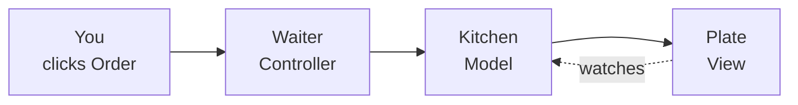
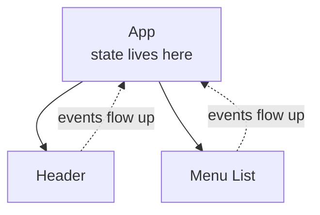

export const meta = {
  slug: 'mvc-to-react',
  title: 'From MVC to React: How Frontend Architecture Evolved',
  tier: 'beginner',
  order: 3,
  summary:
    "How forty years of UI architecture fits together: the OOP ideas underneath, Smalltalk's Model-View-Controller, its MVP and MVVM descendants, the single-page app, and React's component model — told through a diner.",
  estimatedMinutes: 15,
  difficulty: 1,
  topics: ['frontend', 'architecture'],
};

## Why this matters

Every app on your phone answers one question: where does the UI logic live, and how
does it talk to everything else? The industry's answer changed four times in forty
years. Each change was someone fixing the previous answer's worst pain — and each new
answer kept something from the old one. Learn the lineage instead of just the latest
framework, and every UI codebase you meet will feel familiar. You've seen its
grandparents.

For this lesson, you run a diner.

🎥 **Learn more:** ["MVC With and Without a Framework", with Nolan Erck--CFMeetup #318](https://www.youtube.com/watch?v=4ZIUqnYGyWA) — Charlie Arehart, CArehart. Conference talk showing how MVC keeps real codebases sane, framework or not — the payoff this lesson explains.

## The OOP seeds: what the kitchen already taught you

Last lesson's kitchen gave you two ideas that never leave frontend architecture:

**Encapsulation.** You don't walk into the kitchen and grab the fryer. You tell the
waiter what you want; the kitchen hides its knives, its fire, its mess, and hands you
a plate. Objects work the same way: private state, public menu.

**Composition.** Nobody inherits their dinner from a `GrandparentMeal`. A meal is
*composed* of dishes; dishes are composed of ingredients. You assemble the plate from
parts instead of carving it from one block.

Hold both thoughts. MVC is about to use them, and React will be built on them.

🎥 **Learn more:** [The Four Pillars of OOP Explained in Python](https://www.youtube.com/watch?v=yU6JBscFCVc) — Kandi Brian. Covers the four OOP pillars — the kitchen skills you'll reuse when the waiter metaphor arrives.

## MVC, 1988: three jobs, three objects

The idea started with Trygve Reenskaug at Xerox PARC in the late seventies and was
written down properly a decade later by Glenn Krasner and Stephen Pope in "A Cookbook
for Using the Model-View-Controller User Interface Paradigm in Smalltalk-80" (1988),
revised as "A Description of the Model-View-Controller User Interface Paradigm in the
Smalltalk-80 System." Their summary: MVC is a *three-way factoring* — objects of
different classes take over the operations related to the application domain, the
display of the application's state, and user interaction with the model and the view.

In diner terms:

- The **Model** is the kitchen and the order book — the food, the recipes, the state
  of every table's order. It knows nothing about dining rooms.
- The **View** is the plated dish and the menu board — everything the customer sees.
  It watches the model and reflects it.
- The **Controller** is the waiter — the only one who takes input. You point at the
  menu; the waiter carries the order to the kitchen.

Precise definitions, under the analogy: the model holds data and rules and is unaware
of the UI; the view displays state and observes the model; the controller handles input
and tells the model what to do. Three jobs, three objects, strict lanes.

One order, end to end:

<StepThrough
  title="One order, end to end"
  nodes={[
    { id: "customer", label: "You (click)", x: 65, y: 150, w: 100 },
    { id: "waiter", label: "Waiter (Controller)", x: 185, y: 150, w: 100 },
    { id: "kitchen", label: "Kitchen (Model)", x: 305, y: 150, w: 100 },
    { id: "plate", label: "Plate (View)", x: 425, y: 150, w: 100 },
  ]}
  edges={[
    { from: "customer", to: "waiter" },
    { from: "waiter", to: "kitchen" },
    { from: "kitchen", to: "plate" },
    { from: "plate", to: "kitchen" },
  ]}
  steps={[
    {
      title: "You point at the menu",
      caption:
        "Your click is input. In MVC, input always goes to the controller first — the waiter takes your order before anyone cooks anything.",
      highlight: ["customer", "waiter"],
    },
    {
      title: "The waiter briefs the kitchen",
      caption:
        "The controller translates your click into an instruction the model understands: table 4 wants the salmon. The controller never cooks.",
      highlight: ["waiter", "kitchen"],
    },
    {
      title: "The kitchen updates the order book",
      caption:
        "The model changes its state — one more salmon on the fire — and notifies anyone watching. It has no idea a dining room exists.",
      highlight: ["kitchen"],
    },
    {
      title: "The plate arrives",
      caption:
        "The view was watching the model. New state means a fresh plate: it re-renders to match. You see salmon; you never saw the order book.",
      highlight: ["plate", "kitchen"],
    },
  ]}
/>

🎥 **Learn more:** [MVC Design Pattern Demystified](https://www.youtube.com/watch?v=A4X2uE_5hDU) — Dara Oladapo | Code, Cloud and DevOps. Plain-English walkthrough of Model, View, Controller and what each object owns.

## MVP and MVVM: stricter waiters

MVC's lanes were a little blurry in practice — controllers tended to fatten up. Two
descendants tightened the rules:

**MVP (Model-View-Presenter).** The plate goes passive: it can't talk to the kitchen
at all. The presenter — a stricter waiter — carries every message both ways and owns
all the display logic. The payoff is testability: you can test the presenter without
ever setting a table.

**MVVM (Model-View-ViewModel).** The menu rewrites itself. The viewmodel translates
kitchen state into menu-ready form, and the binding goes *both* ways: the kitchen runs
out of salmon and the menu crosses it out on its own; you circle a dish and the order
updates itself. Convenient — until a change ripples from somewhere you weren't
watching. Two-way binding is a helpful ghost until it moves a chair.

Both are MVC's children, and both taught the industry the same lesson: the stricter
the lanes, the easier the testing — but somebody still has to carry the messages.

🎥 **Learn more:** [MVC vs MVP vs MVVM — Quick Android Interview Tip (7 minutes)](https://www.youtube.com/watch?v=NH6otflkHXs) — Bijoy Android Interview Prep. Seven-minute side-by-side of MVC, MVP, and MVVM so the stricter variants click.

## The web remix: one table, many courses

Then the web happened, and the diner got weird. In server-side MVC — Rails, Django,
and their cousins — the *entire restaurant* lived on the server. Every click sent you
walking to a brand-new restaurant, a full page reload, just to see the dessert menu.
It worked. But nobody walks to a new restaurant between courses if they can help it.

JavaScript grew up, and the single-page app arrived: **one table, many courses.** The
page loads once; after that, courses keep arriving without anyone leaving the room.
The dining room got smart — the browser now ran real application logic — and the
server retreated to being a very good kitchen: an API.

But the smart dining room had a new problem: a whole application's worth of UI state,
living in JavaScript, with no architecture to hold it. Enter React.

🎥 **Learn more:** [I built 10 web apps... with 10 different languages](https://www.youtube.com/watch?v=FQPlEnKav48) — Fireship. One developer rebuilds the same app in ten languages — watch MVC's ideas survive the remix.

## React: components all the way down

React rebuilt the dining room from the two OOP ideas you already know:

**Components are encapsulation, again.** A component is a bento box: self-contained,
with its own little compartments of state, a tidy public surface (its props), and no
peeking inside. A `MenuItem` doesn't care how `OrderButton` works. It just uses it.

**Composition over inheritance.** You don't build a `FancyMenuItem` by inheriting from
`MenuItem` and overriding three methods. You snap bricks together: a `Menu` is
composed of `MenuItem`s, each composed of a `Name`, a `Price`, an `OrderButton`. LEGO,
not woodcarving. The React docs say it outright: favor composition over inheritance.

**Unidirectional data flow.** State lives near the top and rains down as props — a
one-way street. A click doesn't reach sideways into another component; it calls a
handler that updates state, and the new state flows back down. Water down a terraced
garden: never uphill.

Compare the two eras directly:

<VsToggle
  title="Where does the update go?"
  a={{
    label: "Classic MVC",
    title: "Input goes to the controller, the view watches the model",
    points: [
      "Your click lands on the controller — the waiter",
      "The controller tells the model what changed",
      "The view observes the model and redraws itself",
      "The model never knows the view exists",
    ],
    note: "Three roles, strict lanes — born on Smalltalk desktops in 1988.",
  }}
  b={{
    label: "React's data flow",
    title: "State flows down, events flow up",
    points: [
      "State lives in components near the top of the tree",
      "Data flows down as props — never up, never sideways",
      "A click calls a handler that updates state",
      "New state re-renders everything below it",
    ],
    note: "One-way streets: easier to trace than a view watching everything.",
  }}
/>

🎥 **Learn more:** [Learn React JS - Full Beginner’s Tutorial & Practice Projects](https://www.youtube.com/watch?v=x4rFhThSX04) — freeCodeCamp.org. freeCodeCamp beginner course built around components — the foundation of React thinking.

## Takeaways

1. **MVC (Krasner & Pope, 1988) splits UI work three ways:** the model owns data and
   rules, the view displays, the controller takes input. Three jobs, three objects.
2. **The model never knows the UI exists.** The view observes the model; the
   controller is the only one who talks to both.
3. **MVP makes the view passive** and gives the presenter all the logic — easier to
   test. **MVVM adds two-way binding** between view and viewmodel — convenient,
   harder to trace.
4. **Server-side MVC reloaded the whole page per click;** SPAs keep one page and let
   the browser run the dining room, talking to the server as an API.
5. **React is OOP ideas at UI scale:** components encapsulate state, UIs are composed
   rather than inherited, and data flows one way — down as props, up as events.
6. **Learn the lineage** and every UI codebase feels familiar. You've met its
   grandparents.

<Quiz
  lessonSlug="mvc-to-react"
  questions={[
    {
      question:
        "In the diner analogy, which role is the Controller — and why?",
      options: [
        "The kitchen, because it does the real work",
        "The waiter, because it's the only one that takes your input and carries it to the kitchen",
        "The menu board, because it displays all the options",
        "The customer, because everything starts with them",
      ],
      correctIndex: 1,
    },
    {
      question: "In classic MVC, what does the Model know about the View?",
      options: [
        "Everything — it renders the view directly",
        "Only the view's address, so it can send updates",
        "It builds the view's HTML on every change",
        "Nothing — the model is unaware of the UI; the view observes the model",
      ],
      correctIndex: 3,
    },
    {
      question: "What distinguishes MVP from classic MVC?",
      options: [
        "The view becomes passive — it never talks to the model; the presenter carries every message",
        "The model and the view merge into a single object",
        "The presenter is removed and the view talks straight to the database",
        "MVP requires a relational database underneath",
      ],
      correctIndex: 0,
    },
    {
      question:
        "In React's unidirectional data flow, how does a click on a deeply nested button update what the user sees?",
      options: [
        "The button edits its sibling components directly",
        "The click travels straight to the database and back",
        "It calls a handler that updates state; the new state flows down as props and the UI re-renders",
        "The view observes the model and redraws itself",
      ],
      correctIndex: 2,
    },
    {
      question:
        'The lesson says React favors "LEGO, not woodcarving." What does that mean?',
      options: [
        "React apps must be prototyped with physical toys",
        "Build UIs by composing small components, not by inheriting from big ones",
        "React is slower to build with than plain JavaScript",
        "Every React component is required to use inheritance",
      ],
      correctIndex: 1,
    },
  ]}
/>

---

## Go deeper

Want to keep pulling this thread? These talks and tutorials go further than we did here:

- [React: Rethinking best practices](https://www.youtube.com/watch?v=x7cQ3mrcKaY) — Pete Hunt, JSConf EU 2013 (~35 min). The foundational talk on React's declarative component model, and why it broke from MVC-era patterns.
- [Live React: Hot Reloading with Time Travel](https://www.youtube.com/watch?v=xsSnOQynTHs) — Dan Abramov, React Europe 2015 (~30 min). Components as encapsulated state holders with one-way data flow, demonstrated live.
- [React Today and Tomorrow](https://www.youtube.com/watch?v=V-QO-KO90iQ) — Sophie Alpert and Dan Abramov, React Conf 2018 (~1 hr). Hooks and Suspense — where the component model went next.

## Sources & further reading

- Glenn E. Krasner & Stephen T. Pope, "A Cookbook for Using the Model-View-Controller User Interface Paradigm in Smalltalk-80," Journal of Object-Oriented Programming, vol. 1, no. 3, pp. 26–49, Aug. 1988 — revised as "A Description of the Model-View-Controller User Interface Paradigm in the Smalltalk-80 System" (ParcPlace Systems, 1988). The three-way factoring of model, view, and controller.
- React documentation (react.dev) — the Learn guide: components, props, state, and unidirectional data flow; composition favored over inheritance.
