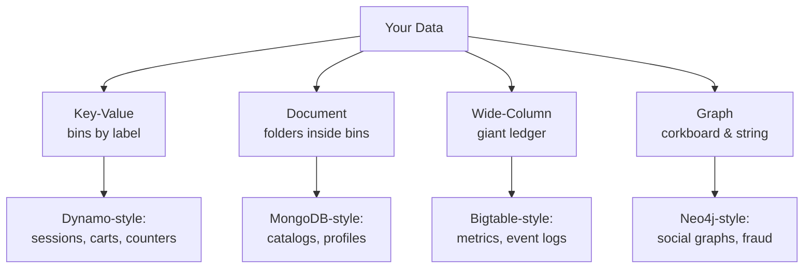
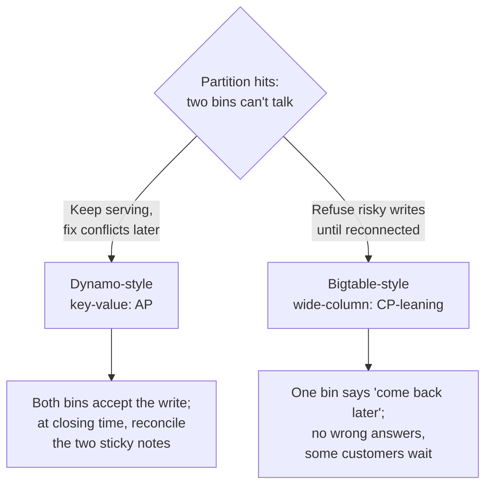

export const meta = {
  slug: 'nosql-databases',
  title: 'NoSQL in Plain English: Picking the Right Database',
  tier: 'beginner',
  order: 6,
  summary:
    'Why one database shape doesn’t fit every job: the four NoSQL families — key-value, document, wide-column, and graph — what each is good at, and how to choose between them and good old relational.',
  estimatedMinutes: 15,
};

## Why this matters

Sooner or later you'll watch a team argue about databases the way people argue about
text editors — with strong opinions and thin evidence. "Just use Postgres for everything"
versus "relational is legacy, go NoSQL." Both camps are half right, which makes both camps
dangerous. The real skill isn't picking a side; it's matching the *shape of your data* to
the *shape of the store*. This lesson gives you the four shapes that cover nearly every
system you'll ever build, and a plain-English guide to choosing among them.

## Picture a storage room

This lesson's running analogy: you're in charge of a storage room for a busy office.

The **relational database** is a classic **filing cabinet**: rigid drawers, labeled folders,
every folder in a drawer holds exactly the same form. Employee records go in the Employee
drawer, and every employee folder has precisely the same fields — name, start date,
department — in the same order. Beautiful for anything uniform. Miserable the moment someone
shows up with a folder that doesn't fit the form.

**NoSQL** is the rest of the storage room: sturdy **labeled bins** on open shelves. No
fixed forms. A bin labeled `user:8421` can hold a photo, a sticky note, and a USB stick,
while the bin next to it holds something completely different. You trade the cabinet's
tidiness for the freedom to store whatever shows up.

Mapping, stated plainly:

- The **filing cabinet** is the relational database — tables, rows, a fixed schema.
- The **labeled bins** are NoSQL stores — flexible containers, no fixed schema.
- The **label on each bin** is the key you look things up by.
- **What's inside the bin** is the value: whatever shape your data happens to be.

NoSQL isn't one thing. It's four different kinds of bins, each designed for a different
kind of stuff. Let's walk the shelves.

## Shelf 1: Key-value stores — the label is everything

The simplest bin of all: every bin has a label (the **key**), and inside is one opaque blob
(the **value**). You can do exactly two useful things: put a blob in the bin labeled X, and
get the blob back out of the bin labeled X. The store never looks inside the blob. It
doesn't know or care whether it's JSON, a JPEG, or your grandmother's cookie recipe.

This sounds almost too dumb to be useful — until you realize how many real systems are
exactly this. A session store: key = session ID, value = "who's logged in." A shopping
cart: key = user ID, value = the cart. Feature flags, user preferences, rate-limit
counters. The archetype is Amazon's **Dynamo**, the system behind the famous 2007 paper:
a key-value store built to stay available and keep accepting writes even when parts of the
system can't talk to each other. (Sound familiar? That's the AP side of the CAP trade-off
from your earlier lesson — Dynamo chose availability, and it shows.)

Key-value stores win on **speed and scale**: looking up a bin by its label is about the
fastest operation a database can do, and it's trivially easy to spread bins across thousands
of machines. What they can't do is *search inside* the blobs — "find every cart containing
blue shoes" means opening every bin yourself.

## Shelf 2: Document stores — bins with labeled folders inside

Now imagine each bin contains **folders, and each folder can hold different papers**.
One user folder has name, email, and three addresses; another has name, email, and a
list of favorite movies instead. Nobody made you declare the form up front. That's a
**document store**: each record is a self-contained document (usually JSON-like), and
documents in the same collection are allowed to differ.

The archetype is **MongoDB**. A product catalog is the canonical example: a toaster
document has wattage and slot count; a novel document has page count and ISBN. In the
filing cabinet, you'd need a sparse table full of empty cells or a tangle of extra tables.
In the document store, each document just... describes itself.

Document stores also let you **query inside the folders** — "find every document where
address.city is Portland" — which key-value stores can't do. The price is the oldest
question in document modeling: when two things are related, do you staple the papers
together (embed) or keep them in separate folders with a cross-reference (reference)?

<VsToggle
  title="One document or two? Modeling an order and its items"
  a={{
    label: "Embed",
    title: "Staple them together",
    points: [
      "The order and its line items live in ONE document",
      "Fetching an order is a single lookup — fast reads",
      "Best when items are always read with their order and never shared",
    ],
    note: "The document-store superpower: related data travels together.",
  }}
  b={{
    label: "Reference",
    title: "Separate folders, cross-referenced",
    points: [
      "Orders and line items are separate documents linked by ID",
      "Updating one shared item updates it everywhere at once",
      "Best when items are shared, huge, or change independently",
    ],
    note: "More flexible, but reads now need two lookups (or a join-like $lookup).",
  }}
/>

Neither answer is "correct" — it's the first real database design judgment call of your
career, and now you know what the trade-off is.

## Shelf 3: Wide-column stores — the giant ledger

The third shelf looks less like bins and more like an enormous **ledger book**: rows upon
rows, each row identified by a key, each row holding a huge but sparse set of columns.
Row 8421 might have columns A, B, and Q filled in; row 8422 might use columns C and Z.
The archetype is Google's **Bigtable** (2006 paper), the system that stores web index data,
Google Earth tiles, and much more — built to swallow *petabytes* across thousands of
machines.

Wide-column stores are the bins for **time-series and analytics-shaped data**: sensor
readings, metrics, event logs. The pattern is always "one row per entity, one column per
timestamp or attribute," and the store is ruthlessly good at scanning ranges of rows fast.
Think: "give me every temperature reading from sensor 7 between Tuesday and Thursday."
The filing cabinet *can* do this, but at Bigtable's scale the cabinet would need its own
zip code.

The trade-off: the query language is deliberately thin. No joins, no ad-hoc cleverness.
You design the row key and column layout around the questions you'll ask, because the store
is a finely tuned instrument for exactly those questions — and a blunt one for anything
else.

## Shelf 4: Graph stores — the corkboard with string

The last shelf doesn't look like storage at all. It's a **corkboard**: photos pinned up
(the nodes — people, products, places) with pieces of string connecting them (the edges —
"follows," "bought," "lives in"). The archetype is **Neo4j**. A graph store's whole job
is answering questions *about the strings*: "friends of friends who bought this book,"
"the shortest chain of introductions between me and the hiring manager."

You could model friendships in the filing cabinet — a `friendships` table with two user
IDs per row — and for "who are your friends" it's fine. But "friends of friends of
friends" becomes a pile of joins that gets slower with every hop, because the cabinet was
designed for tidy forms, not for chasing strings across a corkboard. Graph stores keep the
connections as first-class citizens, so hopping from node to node stays fast no matter how
deep you go. Fraud detection ("which accounts share a phone number?"), recommendations,
network analysis — that's corkboard territory.

## The four shelves, one diagram

Keep this picture in your head — the rest of the lesson is just learning when to walk to
which shelf.

## The honest comparison: relational vs. NoSQL

The filing cabinet isn't obsolete; it wins plenty of matchups. Here's the trade-off,
stated without taking sides:

| | Filing cabinet (relational) | Labeled bins (NoSQL) |
| --- | --- | --- |
| **Schema** | Fixed up front; every folder matches the form | Flexible; each bin holds what it holds |
| **Scaling model** | Traditionally scales *up* (bigger cabinet); scaling *out* takes real work | Designed to scale *out* across many machines from day one |
| **Query power** | Rich: joins, aggregations, ad-hoc questions | Varies: strong inside its specialty, thin outside it |
| **Consistency** | Strong guarantees (ACID transactions) are the default | Tunable; many stores trade strict consistency for availability and speed |
| **Best when** | Your data is uniform and your questions are unpredictable | Your data is varied/huge and your access patterns are known |

That last row is the decision in one line. The cabinet shines when the *questions* are
unpredictable — "slice last quarter's sales seventeen ways" — because the relational
model can answer questions you never planned for. The bins shine when the *access pattern*
is predictable and extreme — "look up this session ID ten million times a second" —
because each bin type is a specialist.

And remember the CAP lesson: many NoSQL stores were built by people who had already
decided which side of the consistency–availability trade-off they were on. Dynamo-style
stores lean AP (keep serving, reconcile later); wide-column stores like Bigtable lean CP
in practice. The database you pick inherits a philosophy. Know which one you're signing
up for.

## The CAP callback: what the bins chose

Remember the CAP lesson — during a network partition, a distributed store must pick
availability or consistency? The NoSQL families were largely *born* from that choice, and
you can see the philosophy in each design:

In bin terms: the Dynamo-style shelf says "never turn a customer away — take both orders
and sort it out at closing time" (this reconciliation has a real name, **conflict
resolution**, and Dynamo's paper made it famous). The Bigtable-style shelf says "better a
short wait than a wrong answer." Neither is braver; they're optimized for different kinds
of heartbreak. When you evaluate a NoSQL store, ask which heartbreak its designers chose —
then check whether that's *your* heartbreak too.

## When each wins: the decision guide

Walk the shelves with a real scenario in mind:

- **User sessions, shopping carts, feature flags** → **Key-value.** You always look things
  up by one label, and you need it *fast*. Nothing beats a bin with your name on it.
- **Product catalog, user profiles, content management** → **Document.** Each item is a
  rich, self-describing bundle, and items legitimately differ from each other.
- **Metrics, sensor data, clickstreams, event logs** → **Wide-column.** Append-heavy,
  time-ordered, enormous. The ledger was born for this.
- **Social networks, recommendations, fraud rings** → **Graph.** The question *is* the
  connections. Don't fight the corkboard.
- **Bank ledgers, inventory counts, anything where money must never be wrong** →
  **Stay with the filing cabinet.** ACID transactions exist for a reason, and "eventually
  consistent" is a terrifying phrase next to someone's paycheck.

One more piece of senior-engineer honesty: the most common real-world answer is "more than
one." A single system routinely keeps user accounts in a relational database, sessions in
a key-value store, analytics in a wide-column store, and recommendations in a graph. This
is called **polyglot persistence** — a fancy way of saying "use the right bin for each
kind of stuff." It adds operational cost (more things to run, monitor, and back up), so
don't reach for it on day one. But when each shelf is genuinely earning its keep, it's the
grown-up architecture.

## Takeaways

1. **NoSQL means "not only SQL," not "no SQL ever."** It's four families of flexible
   storage — key-value, document, wide-column, graph — each a specialist.
2. **Key-value** (Dynamo-style): look up a blob by its label. Fastest, simplest, scales
   beautifully; can't search inside the blobs.
3. **Document** (MongoDB-style): self-describing JSON-like records that may differ from
   each other. Great for catalogs and profiles; the embed-vs-reference call is your first
   real modeling judgment.
4. **Wide-column** (Bigtable-style): a giant sparse ledger for time-series and event data
   at enormous scale. Thin queries, so design the row key around your questions.
5. **Graph** (Neo4j-style): a corkboard of nodes and edges for connection questions —
   friends-of-friends, fraud rings, recommendations.
6. **Choose by data shape and access pattern**, not by hype. Uniform data with
   unpredictable questions → relational. Known, extreme access patterns → the matching
   NoSQL shelf. Money that must never be wrong → the filing cabinet, always.

<Quiz
  lessonSlug="nosql-databases"
  questions={[
    {
      question:
        "In the storage-room analogy, what makes the NoSQL 'labeled bins' different from the relational 'filing cabinet'?",
      options: [
        "The bins are physically larger than the cabinet drawers",
        "The cabinet requires every folder to match a fixed form, while each bin can hold whatever shows up",
        "The bins are slower but cheaper than the cabinet",
        "The cabinet stores numbers and the bins store text",
      ],
      correctIndex: 1,
    },
    {
      question:
        "You need to store millions of user sessions, always looked up by session ID, as fast as possible. Which shelf do you walk to?",
      options: [
        "Document store, because sessions are JSON",
        "Graph store, because sessions are connected to users",
        "Key-value store — lookup by a single label is exactly what it's built for",
        "Wide-column store, because there are millions of them",
      ],
      correctIndex: 2,
    },
    {
      question:
        "Why is a graph store (the corkboard) better than a relational table for 'friends of friends of friends' queries?",
      options: [
        "Graph stores keep connections as first-class citizens, so hopping node to node stays fast at any depth",
        "Relational databases cannot store friendship data at all",
        "Graph stores automatically delete inactive friendships",
        "The corkboard uses less disk space for every query type",
      ],
      correctIndex: 0,
    },
    {
      question:
        "According to the lesson's decision guide, which workload should stay in the relational 'filing cabinet'?",
      options: [
        "Clickstream event logs",
        "A social network's friend graph",
        "Product catalog with wildly varying attributes",
        "Bank ledgers — where ACID transactions guarantee money is never wrong",
      ],
      correctIndex: 3,
    },
  ]}
/>

---

## Go deeper

Want to keep pulling this thread? These talks and tutorials go further than we did here:

- [Amazon DynamoDB Deep Dive: Advanced Design Patterns for DynamoDB (DAT401)](https://www.youtube.com/watch?v=HaEPXoXVf2k) — Rick Houlihan, AWS re:Invent 2018 (~55 min). Key-value modeling, partition keys, and choosing SQL vs NoSQL by data shape.
- [From RDBMS to NoSQL at Enterprise Scale](https://www.youtube.com/watch?v=U1UbDslhoXo) — Pete Johnson, MongoDB.local London 2026 (~20 min). The normalization-to-denormalization shift, and choosing by access pattern.

## Sources & further reading

- Martin Kleppmann, *Designing Data-Intensive Applications* (O'Reilly, 2017), Ch. 2 — data models: relational, document, and graph, and what each expresses well.
- Giuseppe DeCandia et al., "Dynamo: Amazon's Highly Available Key-value Store," *Proc. SOSP* 2007 — the key-value archetype and its availability-first design.
- Fay Chang et al., "Bigtable: A Distributed Storage System for Structured Data," *Proc. OSDI* 2006 — the wide-column model at petabyte scale.
