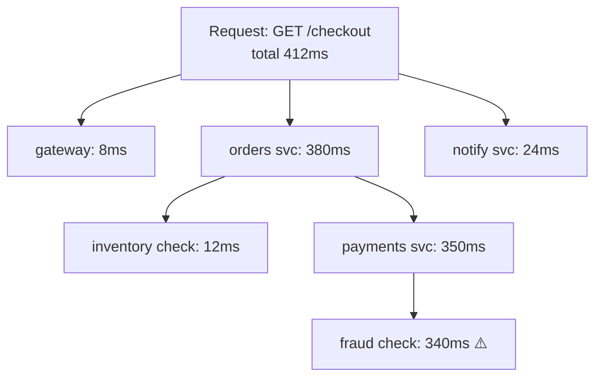

export const meta = {
  slug: 'observability',
  title: 'Observability for Distributed Systems',
  tier: 'advanced',
  order: 26,
  summary:
    'Metrics, logs, and traces that actually answer questions: RED and USE, sampling math, cardinality explosions, and SLIs, SLOs, and error budgets.',
  estimatedMinutes: 22,
};

## Why this matters

"Is the system healthy?" is a surprisingly hard question when "the system" is 40 services,
3 regions, and a queue with opinions. **Observability** is the discipline of making systems
answer questions about themselves — especially the questions you didn't think to ask.
Monitoring tells you *when* something is wrong; observability helps you figure out *why*.
At 3 AM, the difference between a dashboard that says "error rate spiked" and a trace that
says "the spike is exactly these requests hitting exactly this shard" is the difference
between a 10-minute fix and a 4-hour war room.

Analogy: **monitoring is the check-engine light** — it tells you something's wrong, in one
bit. **Observability is the full diagnostic port** a mechanic plugs into: live sensor
readings, freeze-frame data from when the fault occurred, the ability to ask "show me fuel
pressure during the last misfire." You need the light to know to look; you need the
diagnostics to actually fix it.

## The three pillars (and why traces win arguments)

- **Metrics** — numbers over time: request rate, error rate, latency histograms, CPU,
  queue depth. Cheap, aggregatable, and the backbone of alerting (**Prometheus**,
  **Datadog**).
- **Logs** — discrete events with context: "order 8472 failed: payment declined."
  Indispensable for the *specific* incident, expensive to retain at scale.
- **Traces** — the journey of one request across services, as a tree of **spans** with
  timings. This is the only pillar that shows *causality* across service boundaries
  (**OpenTelemetry**, **Jaeger**, **Tempo**).

One look at that trace and you know the fraud check owns the latency — no guessing, no
SSHing into four boxes. Logs would show you four separate "slow request" lines; the trace
shows you the *relationship*. In microservices, traces are the closest thing to a
stack trace you'll ever get.

## RED and USE: what to measure

Two mnemonics keep dashboards focused:

- **RED** (for services, from Tom Wilkie): **R**ate (requests/sec), **E**rrors
  (failed/sec), **D**uration (latency distribution). If your service dashboard doesn't lead
  with these three, it's decoration.
- **USE** (for resources, from Brendan Gregg): **U**tilization, **S**aturation,
  **E**rrors — for every CPU, disk, and network interface. Saturation (queueing) is the one
  people forget: a disk at 70% utilization with a deep queue is slower than one at 90%
  with none.

And measure latency as **percentiles, not averages**. An average latency of 50 ms can hide
1% of users waiting 5 seconds — the average lies because it lets the happy majority vote
down the miserable minority. Track p50, p95, p99 (and p99.9 if you're fancy); alert on the
tail, because the tail is where your angriest users live.

## Sampling: the math of seeing enough

You cannot keep every trace. A service doing 10k requests/sec emitting 2 KB spans per
request generates ~1.7 TB of trace data *per day* — per service. So you **sample**:

- **Head-based sampling** — decide at request start (keep 1% randomly). Simple, but the
  1% you keep is random — the one failed checkout in a million successes is almost
  certainly *not* in your sample. Precisely when you need traces most, you don't have them.
- **Tail-based sampling** — buffer spans, decide after seeing the outcome: keep 100% of
  errors and slow requests, 1% of the boring successes. Needs a collector
  (**OpenTelemetry Collector**) with memory to hold the buffer, but it keeps exactly the
  traces you'll actually open.

The back-of-envelope: if your error rate is 0.1% and you want every error trace, tail-based
sampling at "all errors + 1% of successes" stores ~1.1% of traffic — a 90× cost reduction
over keeping everything, while retaining 100% of the interesting cases. Do the arithmetic
for your own traffic; the answer is always "sample, but sample *smart*."

## Cardinality: the bill you didn't expect

Metrics systems index every unique label combination as a separate **time series**.
`http_requests_total{path="/checkout", status="500"}` is one series. Now add
`user_id` as a label with a million users: you've created millions of series, and your
**Prometheus** is having a very bad day — slow queries, exploding memory, and a storage
bill that arrives like a ransom note.

Rules of thumb: labels should be **low-cardinality** (region, service, status code, route
*template* like `/users/:id` — never the raw path `/users/8472`, never user IDs, never
request IDs). High-cardinality data belongs in **logs and traces**, which are designed for
it. The cardinality explosion is the #1 self-inflicted observability outage; the second is
alerting on the wrong thing (see below).

<StepThrough
  title="Reading a trace: find the slow span"
  nodes={[
    { id: "req", label: "GET /checkout · 412ms", x: 240, y: 42, w: 170 },
    { id: "gw", label: "gateway · 8ms", x: 75, y: 128, w: 120 },
    { id: "orders", label: "orders svc · 380ms", x: 240, y: 128, w: 140 },
    { id: "notify", label: "notify svc · 24ms", x: 405, y: 128, w: 130 },
    { id: "inv", label: "inventory · 12ms", x: 150, y: 214, w: 130 },
    { id: "pay", label: "payments · 350ms", x: 330, y: 214, w: 140 },
    { id: "fraud", label: "fraud check · 340ms", x: 330, y: 282, w: 150, h: 32 },
  ]}
  edges={[
    { from: "req", to: "gw" },
    { from: "req", to: "orders" },
    { from: "req", to: "notify" },
    { from: "orders", to: "inv" },
    { from: "orders", to: "pay" },
    { from: "pay", to: "fraud" },
  ]}
  steps={[
    {
      title: "One request, seven spans",
      caption: "A single GET /checkout fans out into a tree of spans. The trace shows the whole causality tree — now, which span is eating the budget?",
      highlight: ["req"],
    },
    {
      title: "Follow the slow branch",
      caption: "orders svc: 380 of the 412 ms. Inside it, payments: 350 ms — and inside that, the fraud check: 340 ms. One look and you know who owns the latency.",
      highlight: ["orders", "pay", "fraud"],
    },
    {
      title: "Drill from span to logs",
      caption: "The fraud check span carries the trace ID. Jump from the span straight into its structured logs — request IDs, not timestamps, connect the two pillars.",
      highlight: ["fraud"],
    },
  ]}
/>

## SLIs, SLOs, and error budgets: alerting like an adult

Raw metrics don't tell you what's *acceptable*. The SRE vocabulary fixes that:

- **SLI** (Service Level Indicator) — what you measure: "99th-percentile latency" or
  "fraction of successful requests."
- **SLO** (Objective) — the target: "99.9% of requests succeed over 30 days."
- **Error budget** — the allowed failure: 0.1% of 30 days ≈ **43 minutes of downtime per
  month**. That budget is a *feature*: it's permission to deploy, experiment, and break
  things — until it's spent.

The numbers make trade-offs concrete. 99.9% ("three nines") = 43 min/month downtime;
99.99% = 4.3 min/month; 99.999% = 26 sec/month. Each additional nine roughly **doubles the
engineering cost** while the user-visible difference shrinks. This is why "how many nines"
is a *business* negotiation, not an engineering aspiration — and why alerting should fire
on **burn rate** (how fast you're spending the budget) rather than on every blip. A
5-minute spike that consumes ~12% of the monthly budget is not a page; a sustained burn that
eats 20% in an hour is.

## Takeaways

1. Metrics tell you *when*, logs tell you *what*, traces tell you *why across services* — invest in all three, correlate them.
2. Dashboard by RED (services) and USE (resources); measure latency in percentiles, because averages hide the tail.
3. Sample traces tail-based (keep all errors, few successes) and never put high-cardinality values in metric labels.
4. Define SLIs/SLOs, compute the error budget in minutes, and alert on burn rate — each extra nine costs roughly double.

<Quiz
  lessonSlug="observability"
  questions={[
    {
      question: "What does the RED mnemonic stand for when monitoring a service?",
      options: [
        "Redundancy, Encryption, Durability",
        "Rate, Errors, Duration",
        "Retries, Escalations, Downtime",
        "Reads, Events, Deploys",
      ],
      correctIndex: 1,
    },
    {
      question: "Why are latency percentiles (p99) preferred over averages?",
      options: [
        "Averages are harder to compute",
        "Averages hide tail latency — a good average can conceal 1% of users having a terrible experience",
        "Percentiles require less storage",
        "Averages cannot be graphed over time",
      ],
      correctIndex: 1,
    },
    {
      question: "What is the key advantage of tail-based over head-based trace sampling?",
      options: [
        "It uses less memory in the collector",
        "It keeps 100% of errors and slow requests instead of a random subset, so the traces you need actually exist",
        "It requires no collector infrastructure",
        "It samples before the request starts, reducing overhead",
      ],
      correctIndex: 1,
    },
    {
      question: "What is a 'cardinality explosion' in metrics?",
      options: [
        "Too many dashboards being created",
        "Adding a high-cardinality label (like user_id) creates a separate time series per value, exploding memory and storage",
        "Metrics being sampled too aggressively",
        "Alerts firing in a cascading pattern",
      ],
      correctIndex: 1,
    },
    {
      question: "A 99.9% SLO over 30 days allows roughly how much downtime (the error budget)?",
      options: [
        "About 43 minutes per month",
        "About 7 hours per month",
        "About 4 minutes per month",
        "Zero — 99.9% means no downtime",
      ],
      correctIndex: 0,
    },
  ]}
/>

---

## Sources & further reading

- Betsy Beyer et al., *Site Reliability Engineering* (Google / O'Reilly, 2016), Ch. 4 ("Service Level Objectives") — SLIs, SLOs, and error budgets; free online at sre.google.
- Brendan Gregg, "The USE Method" — utilization/saturation/errors for resource analysis.
- OpenTelemetry documentation — traces, spans, and the Collector for tail-based sampling.
- Cindy Sridharan, "Distributed Systems Observability" (O'Reilly, 2018) — the metrics/logs/traces synthesis for microservices.
