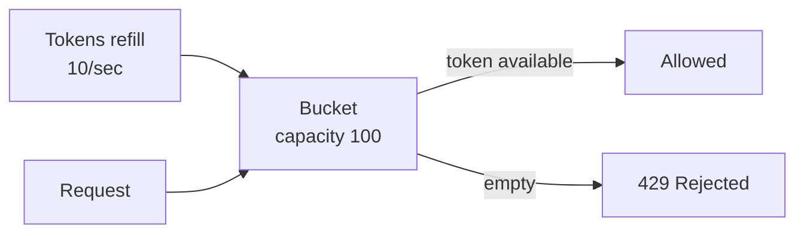
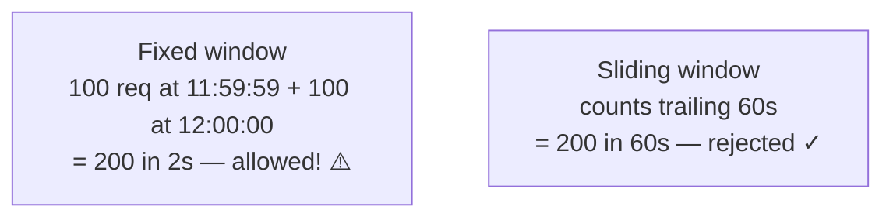

export const meta = {
  slug: 'rate-limiting',
  title: 'Rate Limiting',
  tier: 'intermediate',
  order: 18,
  summary:
    'Keeping abusive and accidental traffic from ruining everyone’s day: token bucket, leaky bucket, sliding windows, and distributed rate limiting with Redis.',
  estimatedMinutes: 15,
};

## Why this matters

Every public API is one enthusiastic script away from disaster. A buggy client retrying in a
tight loop, a scraper with no manners, a genuine flash crowd — without **rate limiting**,
one actor's traffic becomes everyone's outage. Rate limiting is how you say "you get a fair
share" in a way machines understand. It's also a business tool: free tier vs. paid tier is
very often just two different rate limits wearing a pricing page.

Picture a **nightclub bouncer with a velvet rope**. The club holds 300 people comfortably.
The bouncer lets people in at a steady pace — one out, one in — and turns away (politely,
one hopes) anyone arriving faster than the club can absorb. Without the bouncer, the fire
marshal shuts you down. Without rate limiting, your database is the fire marshal, and it
expresses itself through timeouts.

## The algorithms

### Token bucket

Each user has a bucket holding up to *capacity* tokens; tokens refill at *rate* per second.
Each request costs one token. Bucket empty? Request rejected (HTTP **429 Too Many
Requests**).



Token bucket is the crowd favorite because it allows **bursts**: a user who's been quiet
accumulates tokens and can then fire off 100 requests at once. Real-world traffic *is*
bursty, so this matches reality. **Stripe**, **GitHub**, and **AWS** APIs all document
token-bucket-style limits.

### Leaky bucket

Requests pour into a queue (the bucket) and drain out at a fixed rate. Bursts get
*smoothed* rather than *allowed*: if the bucket overflows, requests are dropped. Where
token bucket says "bursts are fine, you saved up for them," leaky bucket says "everyone
marches at the same pace." Pick leaky bucket when downstream systems genuinely can't handle
bursts — a fixed-rate pump, not a savings account.

### Fixed vs. sliding window

The naive approach: "100 requests per minute," counted on minute boundaries. The flaw: at
11:59:59 a user fires 100 requests, at 12:00:00 the counter resets and they fire 100 more —
200 requests in two seconds, technically "within the limit." The **sliding window** fixes
this by counting the last 60 seconds continuously. Sliding-window counters (often
implemented in **Redis** with expiring keys) are the pragmatic default for per-user API
limits.



<StepThrough
  title="Token bucket under a burst"
  nodes={[
    { id: "client", label: "Client", x: 90, y: 150 },
    { id: "bucket", label: "Token bucket", x: 240, y: 150, w: 130 },
    { id: "api", label: "API", x: 390, y: 150 },
  ]}
  edges={[
    { from: "client", to: "bucket" },
    { from: "bucket", to: "api" },
  ]}
  steps={[
    {
      title: "Tokens refill steadily",
      caption: "The bucket refills at a fixed rate — say 10 tokens per second, up to a cap of 50. Each token is permission for one request.",
      highlight: ["bucket"],
    },
    {
      title: "Steady traffic flows",
      caption: "Requests arrive, each spends a token, and the bucket refills behind them. Everything passes — the savings account stays funded.",
      highlight: ["client", "bucket", "api"],
    },
    {
      title: "A burst drains the bucket",
      caption: "Sixty requests arrive at once and spend every saved token. Bursts are allowed — you saved up for them — but the account is now empty.",
      highlight: ["bucket", "client"],
    },
    {
      title: "429s until refill",
      caption: "With no tokens left, further requests are rejected with 429 Too Many Requests until the bucket refills. Back off and retry.",
      highlight: ["client"],
    },
  ]}
/>

## Distributed rate limiting

One server can count in memory. Ten servers behind a load balancer cannot — each sees only
a tenth of a user's traffic, so each allows ten times too much. The standard fix: a shared
counter in **Redis**, incremented per request with a TTL:

```
INCR ratelimit:{user_id}:{window}
EXPIRE ratelimit:{user_id}:{window} 60
→ if value > 100: reject with 429
```

This works beautifully until Redis becomes the thing you're protecting *from* — at very
high scale, teams use **local buckets with periodic sync**, or probabilistic structures,
accepting slightly fuzzy limits to avoid a central counter on the hot path. Precision is a
spectrum; "roughly 100 requests per minute" is usually fine.

## Being a good citizen about it

Rate limiting isn't just enforcement — it's communication. Well-behaved APIs return:

- **429** status when the limit bites (not 403, not 500 — 429 means "slow down and retry").
- `Retry-After` header saying how long to wait.
- `X-RateLimit-Limit`, `X-RateLimit-Remaining`, `X-RateLimit-Reset` headers so clients can
  pace themselves *before* hitting the wall.

And on the client side: respect 429s with **exponential backoff and jitter** (retry after
1s, 2s, 4s… plus randomness so a thousand clients don't retry in lockstep — the
thundering herd's needy cousin). A client that ignores backoff signals is how you get
rate-limited harder.

## Where to enforce

Defense in depth, from the edge inward:

1. **CDN / edge** (Cloudflare, AWS WAF) — kill obvious abuse (DDoS, scrapers) before it
   costs you compute.
2. **API gateway** — per-key quotas and tiers; this is the natural home (see *API
   Gateways*).
3. **Service level** — protect expensive endpoints individually; your `/search` endpoint
   deserves a stricter limit than `/health`.

One more subtlety: rate-limit by something the abuser can't trivially rotate. IP-based
limits fall to botnets with a million IPs; authenticated-user or API-key limits hold up
better. And always leave headroom for your own health checks — nothing is sadder than your
monitoring getting 429'd during the outage it's trying to report.

## Takeaways

1. Token bucket allows saved-up bursts; leaky bucket enforces a steady pace; sliding windows fix the boundary exploit.
2. Distributed systems need shared counters (Redis) — local counters let each server allow the full limit.
3. Communicate limits with 429 + Retry-After + X-RateLimit-* headers; clients should back off exponentially with jitter.
4. Enforce in layers (edge → gateway → service) and limit by API key or user, not just IP.

<Quiz
  lessonSlug="rate-limiting"
  questions={[
    {
      question: "How does a token bucket differ from a leaky bucket?",
      options: [
        "Token bucket allows bursts (saved-up tokens); leaky bucket smooths traffic to a fixed rate",
        "Leaky bucket allows bursts; token bucket enforces a fixed rate",
        "Token bucket only works for read requests",
        "They are two names for the same algorithm",
      ],
      correctIndex: 0,
    },
    {
      question: "What is the flaw in a naive fixed-window rate limiter?",
      options: [
        "It uses too much memory",
        "A user can make double the limit in a short burst straddling the window boundary",
        "It cannot distinguish between different users",
        "It requires synchronized clocks",
      ],
      correctIndex: 1,
    },
    {
      question: "Why can't each server behind a load balancer just count requests locally?",
      options: [
        "Local counters are too slow",
        "Each server sees only a fraction of a user's traffic, so each would allow the full limit",
        "Load balancers strip the headers needed for counting",
        "Local memory is cleared on every request",
      ],
      correctIndex: 1,
    },
    {
      question: "What should an API return when a client exceeds its rate limit?",
      options: [
        "HTTP 500 Internal Server Error",
        "HTTP 403 Forbidden",
        "HTTP 429 Too Many Requests, ideally with a Retry-After header",
        "HTTP 200 with an empty body",
      ],
      correctIndex: 2,
    },
  ]}
/>

---

## Sources & further reading

- Stripe API documentation, "Rate limits" — token-bucket limits and headers in a production API.
- GitHub REST API documentation, "Rate limits" — primary/secondary limits and how to respect them.
- Cloudflare Learning Center, "What is rate limiting?" — edge enforcement and DDoS context.
- AWS Architecture Blog, "Rate limiting with API Gateway" / token-bucket via Redis patterns — distributed counting implementations.
