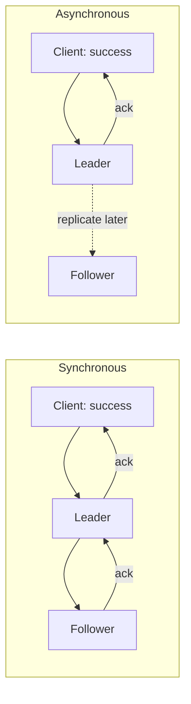
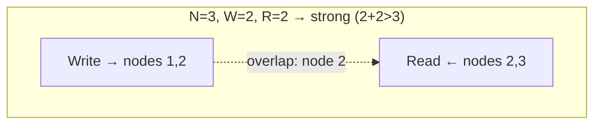

export const meta = {
  slug: 'replication-consistency-models',
  title: 'Replication & Consistency Models',
  tier: 'intermediate',
  order: 14,
  summary:
    'How copies of your data stay in sync (or don’t): synchronous vs. asynchronous replication, leader-based and leaderless designs, quorums, and the consistency models clients actually observe.',
  estimatedMinutes: 20,
};

## Why this matters

A single copy of your data is a single point of failure wearing a trench coat. So every
serious database keeps **replicas** — extra copies on other machines, in other racks, in
other regions. But the moment you have two copies, you have a question with no free answer:
*when a write lands on one copy, what does a read from another copy see?* The answers form
a spectrum of **consistency models**, and choosing where to sit on that spectrum is one of
the most consequential decisions in system design. (Your CAP theorem lesson was the trailer;
this is the feature film.)

Analogy time: imagine a **shared team whiteboard** — except every team member has their own
photocopy, and updates arrive by office gossip. If gossip is instant, everyone's copy
matches (strong consistency). If gossip trickles through over coffee breaks, copies
temporarily disagree — but if everyone stops writing, the gossip eventually catches up and
all copies converge. That convergence is **eventual consistency**, and the speed and
reliability of the gossip is your replication design.

## Synchronous vs. asynchronous replication

The first fork in the road:

- **Synchronous** — the write isn't acknowledged until replicas confirm. Durable (a leader
  crash loses nothing committed) but slow: every write pays the slowest replica's latency.
  **Postgres** synchronous streaming replication and **etcd**'s Raft log work this way.
- **Asynchronous** — acknowledge first, replicate after. Fast, but a leader crash can lose
  recently acknowledged writes. The classic "we said success and then the data vanished"
  incident.

Most systems offer a dial, not a switch: Postgres lets you require 1, 2, or N synchronous
standbys; **MySQL** semi-sync replication waits for *at least one* replica. Turn the dial
toward durability when the data is money; toward speed when it isn't.

## Leader-based vs. leaderless

**Leader-based** (single-leader): one node accepts writes, followers replay its log.
Simple to reason about — there's exactly one source of truth — but writes funnel through
one node, and failover (promoting a follower) is the operation everyone dreads.

**Leaderless** (Dynamo-style): any node accepts writes; the write is sent to N replicas
and acknowledged by a **quorum**. No failover drama — every node is equal — but concurrent
writes to different nodes create conflicts that somebody must resolve. **Cassandra**,
**DynamoDB**, and **Riak** live here.

{/* ANIMATION: RequestFlow showing a leaderless write fanning out to 3 replicas with W=2 acknowledgments, then a read with R=2 */}

## Quorums: the tunable middle

Leaderless systems tune consistency with two numbers. With N replicas:

- **W** = writes that must acknowledge before success
- **R** = replicas that must respond to a read

The magic rule: if **R + W > N**, every read overlaps every write on at least one node, so
reads see the latest write — **strong consistency** (well, linearizability-ish; clock skew
can still bite). If **R + W ≤ N**, you get eventual consistency with lower latency.

Typical tunings: `W=1, R=1` for blazing speed and crossed fingers; `W=QUORUM, R=QUORUM`
for the balanced default; `W=ALL` when you'd rather be slow than sorry. Notice the latency
implication: quorum writes wait for the *second-fastest* of 3 replicas — usually fine, and
resilient to one slow node. `W=ALL` waits for the *slowest*, always.

## Consistency models clients observe

Beyond "eventual vs. strong," clients experience specific guarantees — each one rules out a
particular weirdness:

- **Read-your-writes** — after you change your profile photo, *you* see the new one. (Others
  might not yet.) Without this, users think the app ate their update.
- **Monotonic reads** — once you've seen version 5, you'll never again see version 4. No
  time-travel backwards when your requests bounce between replicas.
- **Monotonic writes** — your writes apply in the order you made them.
- **Causal consistency** — if you reply to a comment, everyone sees the comment before
  your reply. The strongest model an *always-available* system can provide during
  partitions — it's what AP-oriented designs like the COPS geo-replicated store aim for.
  (Systems like **CockroachDB** instead pay for *stronger*, serializable guarantees —
  causal consistency is deliberately weaker, which is why it's cheap enough to keep
  serving through a partition.)

Stronger guarantees cost latency and availability — there's no free consistency, only
consistency whose price you've decided to pay.

## Conflict resolution

When two writes hit different replicas concurrently (leaderless, or multi-leader), they
collide. Strategies:

- **Last-write-wins (LWW)** — highest timestamp wins. Simple, and silently *deletes* the
  loser's data. Fine for caches; terrifying for shopping carts.
- **Application merge** — the app gets both versions and reconciles (Dynamo/Riak-style
  vector clocks; CRDTs for counters, sets, and text).
- **Avoid conflicts structurally** — design so concurrent writes to the same key are rare
  (per-user partitions, single writers per entity).

## Takeaways

1. Sync replication = durable but slow; async = fast but can lose acknowledged writes. Most systems let you turn the dial.
2. Leader-based is simple with painful failover; leaderless has no failover but needs conflict resolution.
3. R + W > N gives strong reads in quorum systems — tune W and R to buy the consistency you need, no more.
4. Name the guarantee your users actually need (read-your-writes? causal?) and pay only for that.

<Quiz
  lessonSlug="replication-consistency-models"
  questions={[
    {
      question: "What is the main risk of asynchronous replication?",
      options: [
        "Writes become much slower",
        "A leader crash can lose recently acknowledged writes",
        "Reads can never be served from followers",
        "The system cannot scale past three nodes",
      ],
      correctIndex: 1,
    },
    {
      question: "In a leaderless system with N=3 replicas, which tuning gives strong consistency?",
      options: [
        "W=1, R=1",
        "W=2, R=2 (because R + W > N)",
        "W=2, R=1",
        "W=1, R=2",
      ],
      correctIndex: 1,
    },
    {
      question: "'Read-your-writes' consistency guarantees that...",
      options: [
        "All users worldwide immediately see your write",
        "After you write, your own subsequent reads reflect that write",
        "Writes are applied in the same order on every replica",
        "No two users can write concurrently",
      ],
      correctIndex: 1,
    },
    {
      question: "What is the danger of last-write-wins (LWW) conflict resolution?",
      options: [
        "It requires synchronized clocks across all nodes",
        "It is too slow for high-throughput systems",
        "It silently discards the loser's data",
        "It only works with leader-based replication",
      ],
      correctIndex: 2,
    },
  ]}
/>

---

## Sources & further reading

- Martin Kleppmann, *Designing Data-Intensive Applications* (O'Reilly, 2017), Ch. 5 — replication, the definitive treatment.
- Werner Vogels, "Eventually Consistent" (ACM Queue, 2008) — Dynamo's philosophy from Amazon's CTO.
- DeCandia et al., "Dynamo: Amazon's Highly Available Key-Value Store" (SOSP 2007) — leaderless replication, quorums, and vector clocks.
