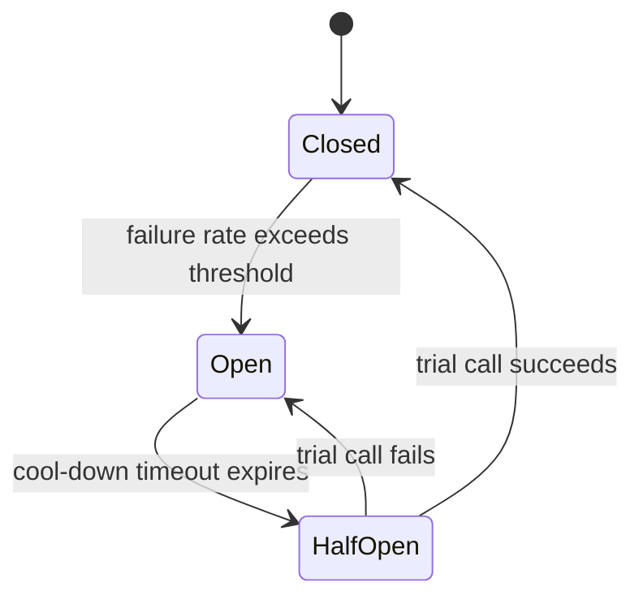
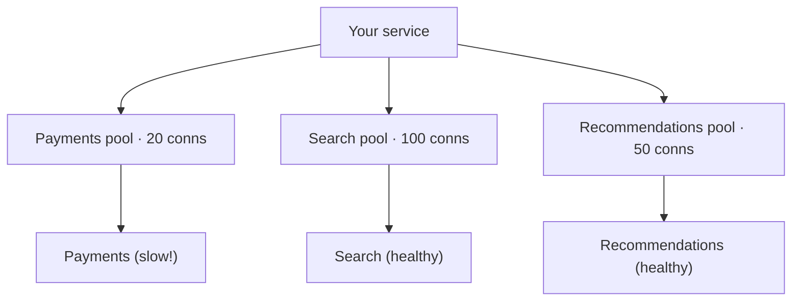

export const meta = {
  slug: 'resilience-patterns',
  title: 'Resilience Patterns: Breakers, Bulkheads & Backoff',
  tier: 'advanced',
  order: 21,
  summary:
    'How to stop one slow dependency from taking down everything: timeouts, retries with backoff and jitter, circuit breakers, bulkheads, and graceful degradation.',
  estimatedMinutes: 18,
};

## Why this matters

Every serious outage you've ever read about has the same shape: something small failed, and
then *everything* failed. A payment provider slows to a crawl, threads pile up waiting,
memory fills, health checks stop answering, the load balancer routes around the "dead"
nodes and hammers the survivors, and ten minutes later your status page is a wall of red.
The initial failure was a stubbed toe. The cascade was the system. Resilience patterns are
how you make the toe-stub survivable — they're the difference between "payments were slow
for five minutes" and "we were down for five hours."

🎥 **Learn more:** [Episode 55 - What Happens When a Component Fails? | Building Resilient Systems](https://www.youtube.com/watch?v=MscUun1GWu8) — Anupam Tech Talks. Walks through what happens when a component fails — the case for resilient design.

## The house wiring and the ship's hull

This lesson's running analogy comes in two parts, both stolen from engineering older than
software:

**Your house has circuit breakers.** When a faulty appliance draws too much current, the
breaker *trips* and cuts power to that circuit — annoying, but it saves the house from an
electrical fire. Crucially, the breaker doesn't keep feeding current "just in case the
appliance recovers." It fails fast and stays open until a human resets it. Software circuit
breakers work the same way: when a downstream dependency is clearly sick, stop calling it.

**A ship has bulkheads.** A hull divided into watertight compartments can take a flooded
compartment and stay afloat — the water is *contained*. Without bulkheads, one breach lets
water spread everywhere and the whole ship goes down. The shipbuilding idea is exactly
this: one flooded compartment shouldn't sink the ship. Software bulkheads work the same
way: isolate resources per dependency so one slow service can't drown the rest.

Keep both images handy. The breaker protects you from *calling* a sick dependency; the
bulkhead protects you from *sharing* resources with one.

🎥 **Learn more:** [💊 Designing for Failure: The Key to Robust Microservices Architecture](https://www.youtube.com/watch?v=UySf6ivvGoM) — مصطفى سليمان. Covers timeouts, circuit breakers, and bulkheads — the wiring that keeps ships afloat.

## The anatomy of a cascade

Before the patterns, stare at the failure mode, because every pattern here is an answer to
a specific step in this chain:

1. A dependency gets slow — not down, just *slow*. A database query that took 50 ms now
   takes 8 seconds. (Down is easy; slow is the killer, because slow consumes your
   resources while giving you nothing.)
2. Your threads block waiting for it. A server with 200 worker threads can absorb 200
   concurrent slow calls — call 201 waits for a thread that will never free up in time.
3. Queues fill, memory grows, garbage collection panics, and your service stops answering
   *its own* health checks.
4. The load balancer declares your nodes dead and shifts traffic to the survivors, which
   now take even more load and die faster.

Note the cruelty: the dependency eventually recovers, but your system doesn't — it's
buried under a mountain of queued, stale work. Michael Nygard's *Release It!* calls these
"cascading failures" and treats them as the default outcome of connecting systems without
protection. He's right. Unprotected, every distributed system is one slow dependency away
from this story.

🎥 **Learn more:** [How Adding Servers Froze AWS us-east-1: The Kinesis Thundering Herd Autopsy](https://www.youtube.com/watch?v=C4h-xbwgDGc) — Fault Domain. Postmortem of a real cascading outage: thread exhaustion, health-check starvation, thundering-herd recovery.

## Timeouts: the cheapest insurance you'll ever buy

The most underrated resilience pattern is also the simplest: **decide, in advance, how
long you'll wait — and then stop waiting.** A call without a timeout is a thread you've
lent to a stranger with no return date. Timeouts bound the damage of step 2 in the cascade
above: a slow dependency can only hold your threads for as long as you let it.

A few things engineers learn the hard way about timeouts:

- **The default is almost always wrong.** Libraries love defaults like 30 or 60 seconds —
  an eternity during which one slow endpoint can eat your whole thread pool. Set a timeout
  per dependency, based on its actual latency profile: a small multiple of its p99 works
  well. If payments usually answer in 300 ms at p99, a 1–2 second timeout is sane; a 30
  second one is a loaded gun.
- **Timeouts must propagate.** If your API has a 5-second deadline with the user, a
  downstream call inside it can't have a 10-second timeout — the math doesn't work. Pass
  deadlines down the call chain (gRPC's deadline propagation is the canonical example) so
  every layer agrees on when to give up.
- **Time out the whole attempt, not just the socket connect.** A connection that opens
  instantly and then dribbles bytes forever is the classic slowloris shape. Bound total
  elapsed time per attempt.

Timeouts are insurance: you pay a small premium (occasionally giving up on a call that
would have succeeded at second 31) to avoid the catastrophic loss (the cascade). Buy the
insurance.

🎥 **Learn more:** [Timeouts & Retries in Distributed Systems (Tuning for Reliability)](https://www.youtube.com/watch?v=G_kExQGrbOs) — Mila Bay. Practical tuning guide for timeouts and retries in distributed systems.

## Retries: help the patient, don't mob the hospital

A single failed call is often transient — a blip, a restarted container, a momentary
network hiccup. Retrying is correct and good. But naive retries are how a stubbed toe
becomes a stampede: if a hundred clients all retry *immediately and simultaneously*, the
recovering dependency gets hit with a synchronized wave — the **thundering herd** — and
falls over again. The retry storm keeps the patient from ever getting up.

The fix has two parts, and both matter:

**Exponential backoff** spaces retries out: wait 100 ms, then 200 ms, then 400 ms, then 800
ms — each wait roughly doubling, up to a cap. The formula looks like
`sleep = min(cap, base × 2^attempt)`. Early retries stay snappy for quick blips; later ones
back off and give the dependency room to breathe. Cap it (a few seconds is typical) and
cap the attempts (3–5 is plenty) — a retry loop without a ceiling is just a slower way to
melt down.

**Jitter** randomizes the waits. Without it, every client that failed at the same moment
retries at the *same* moments — 100 ms, 200 ms, 400 ms, in lockstep. Jitter breaks the
synchronization by adding randomness, and the AWS guidance on this recommends going all
the way: **full jitter**, where each sleep is a random value between zero and the computed
backoff (`sleep = random(0, min(cap, base × 2^attempt))`). The retries smear out across
time instead of arriving as a wall.

Watch the difference. Same recovering server, same fifty clients retrying — first without
jitter, then with:

<PacketFlow
  stages={["50 clients", "No jitter: synchronized retries"]}
  servers={["payments-svc · recovering"]}
  requestLabel="retry"
  duration={2}
/>

Every dot arrives in the same burst. The server was catching its breath; now it's drowning
again.

<PacketFlow
  stages={["50 clients", "Full jitter: randomized backoff"]}
  servers={["payments-svc · recovering"]}
  requestLabel="retry"
  duration={9}
/>

Same retries, spread thin across time. The server absorbs them between real requests and
actually recovers. Jitter is a one-line change — `sleep *= random()` — and it's the
difference between a recovery and a relapse. The thundering herd is just a crowd with
synchronized watches; jitter takes everyone's watch away.

One more rule, the one people forget: **only retry what's safe to retry.** Retrying a
read is harmless. Retrying "charge the card" is how someone gets billed twice — unless the
operation is *idempotent* (safe to repeat, e.g., keyed by an idempotency token the server
deduplicates). Retry budgets help too: cap retries at, say, 10% of your traffic, so a
systemic failure can't turn every request into five.

🎥 **Learn more:** [Why Every Microservice Needs Retry Mechanisms | Retry patterns in microservices](https://www.youtube.com/watch?v=RN77jxqHMRg) — Frustrated Programmer. Explains why microservices need retry mechanisms — and how to use them safely.

## Circuit breakers: stop calling a phone that's off the hook

Backoff helps when failures are transient. But when a dependency is *genuinely down* —
failing every call for minutes — retries are just expensive hope. Every attempt burns a
thread, waits out a timeout, and fails. A **circuit breaker** watches the failure rate and,
past a threshold, *trips*: it stops sending calls at all and fails fast instead. Like the
breaker in your fuse box, it protects the house by cutting the circuit.

Three states, with precise transition rules:

- **Closed** — normal. Calls flow through; the breaker counts failures (say, 50% failing
  over the last 20 calls trips it).
- **Open** — tripped. Calls fail *immediately*, without touching the network. No threads
  burned, no timeouts waited out. After a cool-down (30–60 seconds is typical), the breaker
  allows one trial call through.
- **Half-open** — the probe. That single trial call decides: success closes the breaker and
  traffic resumes; failure re-opens it for another cool-down.

Walk through it step by step:

<StepThrough
  title="Circuit breaker: a dependency goes down and comes back"
  nodes={[
    { id: "closed", label: "CLOSED · calls flow", x: 110, y: 80, w: 150 },
    { id: "open", label: "OPEN · fail fast", x: 370, y: 80, w: 150 },
    { id: "half", label: "HALF-OPEN · one probe", x: 240, y: 220, w: 170 },
  ]}
  edges={[
    { from: "closed", to: "open" },
    { from: "open", to: "half" },
    { from: "half", to: "closed" },
    { from: "half", to: "open" },
  ]}
  steps={[
    {
      title: "Closed: business as usual",
      caption: "Calls flow to the dependency. The breaker quietly counts outcomes — say, a rolling window of the last 20 calls.",
      highlight: ["closed"],
    },
    {
      title: "Threshold tripped: the breaker opens",
      caption: "Failures pass 50% of the window. The breaker trips to OPEN: every new call fails immediately, no network touched, no thread burned.",
      highlight: ["open"],
    },
    {
      title: "Cool-down: waiting out the storm",
      caption: "For the next 30–60 seconds the dependency gets total silence — no calls, no retries piling on. This is what lets it actually recover.",
      highlight: ["open"],
    },
    {
      title: "Half-open: one brave probe",
      caption: "The cool-down expires. The breaker lets exactly one trial call through to test the waters — not the flood, just a toe.",
      highlight: ["half"],
    },
    {
      title: "Probe succeeds: breaker closes",
      caption: "The trial call worked. The breaker closes and full traffic resumes. Total cost of the outage: fast failures instead of thread exhaustion.",
      highlight: ["closed"],
    },
    {
      title: "Probe fails: back to open",
      caption: "The trial call failed too. The breaker re-opens for another cool-down. The dependency stays protected from a stampede until it's truly healthy.",
      highlight: ["open"],
    },
  ]}
/>

Two subtleties worth knowing at the advanced level. First, the breaker needs a **fallback**
for the open state — fail fast *into what?* An error, a cached value, a degraded response.
A breaker that fails fast into a 500 with no fallback is just a faster way to be down.
Second, breakers compose: put them on every outbound call, per dependency, so a sick
payments service trips its own breaker while search keeps humming. Which is exactly the
bulkhead idea — and a good segue.

🎥 **Learn more:** [Circuit Breaker Pattern in Microservices | System Design](https://www.youtube.com/watch?v=QpLMeEa5l4E) — Prashant Pandey. Clear system-design walkthrough of the circuit breaker pattern in microservices.

## Bulkheads: one flooded compartment shouldn't sink the ship

The breaker stops you from *calling* a sick dependency. The bulkhead stops a sick
dependency from *spending your resources*. The mechanism is almost embarrassingly simple:
**don't share thread pools or connection pools across dependencies.** Give each downstream
its own isolated pool:

Payments slows to a crawl? It exhausts *its own* 20 connections and its own breaker trips —
but search and recommendations still have their full pools. The water stays in one
compartment. Without bulkheads, there's one shared pool: payments' slow calls eat every
connection, and search — perfectly healthy — starts failing because it can't get a thread.
The ship sinks because of a leak in a room it never used.

Sizing the compartments is the engineering judgment: too small and you throttle healthy
traffic; too large and the bulkhead is decorative. Start from each dependency's normal
concurrency plus headroom, then watch the metrics. And bulkheads aren't just pools —
separate queues, separate rate limits, even separate *processes* for critical vs.
best-effort work all count. Any shared resource is a shared fate.

🎥 **Learn more:** [Bulkhead Pattern in Microservices Explained | Resilience4j + Spring Boot ✅](https://www.youtube.com/watch?v=uOhlKkfcTms) — CodeSnippet. Bulkhead pattern with Resilience4j and Spring Boot — isolating failure compartments.

## Degrade gracefully: the backup generator

When a compartment floods despite everything, the last question is: what does the user
see? **Graceful degradation** means choosing a smaller answer over no answer. The
backup-generator version of your house: the mains are out, so you run the essentials, not
the hot tub.

Concrete fallbacks, from cheapest to bravest:

- **Cached last-known-good data.** Product listings from a 5-minute-old cache beat a 500
  page. Mark it stale if you like; users prefer slightly old over entirely gone.
- **Default or static content.** Recommendations service down? Show bestsellers. Avatar
  service down? Initials in a colored circle.
- **Shed non-critical features.** Turn off the "people also bought" carousel, keep checkout
  alive. Feature flags make this a runtime decision, not a deploy.
- **Fail the request, but fail well.** A fast, honest 503 with `Retry-After` beats a
  30-second hang every time — and it lets the client's own backoff do its job.

Degradation is a product decision as much as an engineering one: someone has to rank
features by "what can we lose and still be useful." Have that argument on a calm Tuesday,
not during the outage. Write the fallback *with* the feature, not after the postmortem.

🎥 **Learn more:** [Ep. 29: Graceful Degradation: What You Need to Know](https://www.youtube.com/watch?v=Lw8KExizlPQ) — Systemic Stack English. Dedicated explainer on graceful degradation — your backup generator strategy.

## You can't fix what you can't see

Every pattern in this lesson runs on measurements. A circuit breaker is a failure-rate
threshold — without metrics on failure rate, it's a guess. Retry budgets need traffic
ratios; bulkhead sizing needs per-dependency concurrency; degradation needs alerts that
tell you *which* compartment flooded. This is why the observability lesson ('observability')
comes before this one in spirit if not in order: metrics, logs, and traces are the
instrument panel. Flying a ship with bulkheads and breakers but no gauges is just sinking
with extra steps. If you take one operational habit from this lesson: dashboard the
failure rate, latency, and saturation of every dependency you add a breaker to — otherwise
you'll never know whether the pattern is working or merely installed.

🎥 **Learn more:** [SRE101: How Tech Companies Monitor Apps in Production | Hands-On Workshop with Grafana & Prometheus](https://www.youtube.com/watch?v=j_PDMsDxFF8) — Opportunity Hack. Hands-on workshop monitoring apps with Prometheus and Grafana — see issues before users do.

## Takeaways

1. Cascading failures are the default: one *slow* dependency consumes threads, queues, and
   memory until healthy services die too. Every pattern here interrupts a step of that
   chain.
2. Timeouts are the cheapest insurance — set them per dependency from real latency data
   (p99 plus headroom), propagate deadlines down the call chain, and bound total attempt
   time.
3. Retry with exponential backoff (`sleep = min(cap, base × 2^attempt)`) plus **full
   jitter** (`sleep = random(0, …)`) — jitter is what prevents the thundering herd from
   re-killing a recovering dependency. Only retry idempotent operations, and cap your
   retry budget.
4. Circuit breakers trip (closed → open) past a failure threshold, fail fast during
   cool-down, and probe recovery with a single half-open call. Always pair the open state
   with a fallback.
5. Bulkheads isolate resources per dependency — separate pools, queues, or limits — so one
   flooded compartment can't sink the ship. Size them from real concurrency, not vibes.
6. Degrade gracefully: cached data, defaults, and shed features beat a hang. Decide the
   fallback order on a calm Tuesday, and dashboard every breaker you install — you can't
   fix what you can't see.

<Quiz
  lessonSlug="resilience-patterns"
  questions={[
    {
      question: "Fifty clients all fail at once and retry after exactly 100 ms, then 200 ms, then 400 ms — in lockstep. What is this synchronized wave called, and what does jitter do about it?",
      options: [
        "A cascade; jitter replaces the failing dependency with a cached one",
        "The thundering herd; jitter randomizes retry timing so retries spread out instead of arriving as a wall",
        "A bulkhead breach; jitter isolates each client's connection pool",
        "A retry budget; jitter caps total retries at 10% of traffic",
      ],
      correctIndex: 1,
    },
    {
      question: "A circuit breaker is in the OPEN state. What happens to the next incoming call?",
      options: [
        "It waits for the full timeout, then fails if the dependency is still down",
        "It is queued until the cool-down expires",
        "It fails immediately without touching the network, typically falling back to a degraded response",
        "It is sent through as a half-open probe",
      ],
      correctIndex: 2,
    },
    {
      question: "Your payments dependency is slow but healthy search traffic is failing too. All outbound calls share one 200-connection pool, now exhausted by waiting payments calls. Which pattern was missing?",
      options: [
        "Exponential backoff — the retries were too aggressive",
        "PKCE — the calls weren't authenticated properly",
        "Timeouts — the calls should have been retried instead",
        "Bulkheads — each dependency needed its own isolated pool",
      ],
      correctIndex: 3,
    },
    {
      question: "Which timeout strategy does the lesson recommend?",
      options: [
        "Use the library default (usually 30–60 seconds) for every dependency",
        "Set one global 5-second timeout for all outbound calls",
        "Set a per-dependency timeout from real latency data (around p99 plus headroom) and propagate deadlines down the call chain",
        "Avoid timeouts on internal calls — only time out calls to third parties",
      ],
      correctIndex: 2,
    },
  ]}
/>

---

## Go deeper

Want to keep pulling this thread? These talks and tutorials go further than we did here:

- [Mastering Chaos - A Netflix Guide to Microservices](https://www.youtube.com/watch?v=CZ3wIuvmHeM) — Josh Evans, QCon SF 2016 (~50 min). Netflix's real-world playbook: timeouts, retries, fallbacks, bulkheads, and fault injection in production.
- [The Circuit Breaker Pattern Explained](https://www.youtube.com/watch?v=QvRLxoXylTc) — SysSketch, YouTube. Closed, open, and half-open states, plus how to tune trip thresholds without causing retry storms.
- [How Complex Systems Fail](https://www.youtube.com/watch?v=2S0k12uZR14) — Richard Cook, Velocity 2012 (O'Reilly). Why cascading failure is the default for complex systems — the mental model behind this lesson.

## Sources & further reading

- Michael T. Nygard, *Release It! Design and Deploy Production-Ready Software*, Second Edition (Pragmatic Bookshelf, 2018) — cascading failures, circuit breakers, bulkheads, and timeouts; the patterns in this lesson originate here.
- Betsy Beyer et al., *Site Reliability Engineering: How Google Runs Production Systems* (O'Reilly, 2016), chapters on cascading failures and handling overload — failure-rate thinking and overload behavior at scale.
- Marc Brooker, "Exponential Backoff And Jitter," AWS Architecture Blog (2015) — exponential backoff with full jitter and why decorrelated randomization beats fixed schedules.
