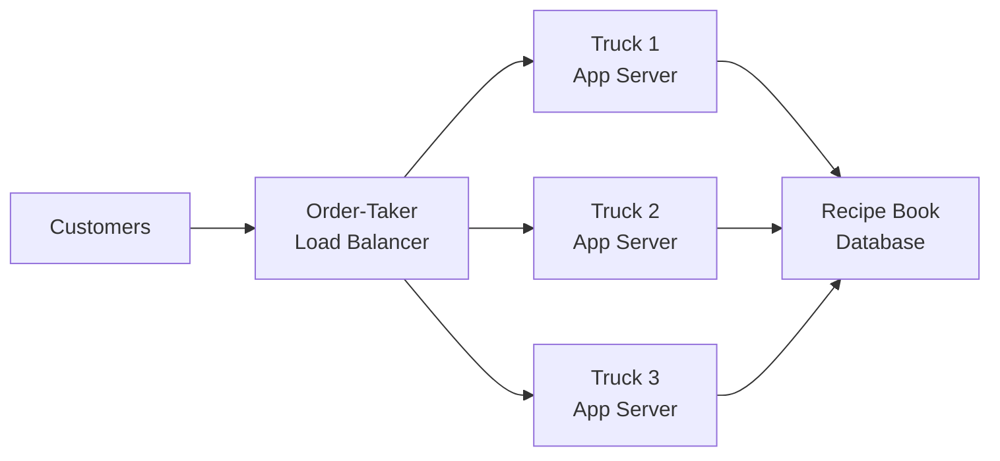
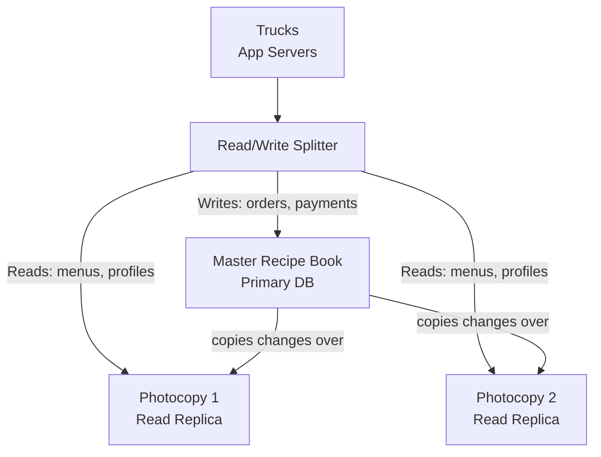
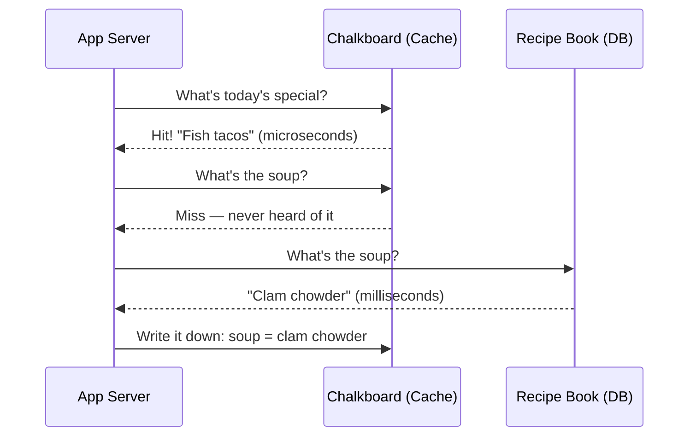
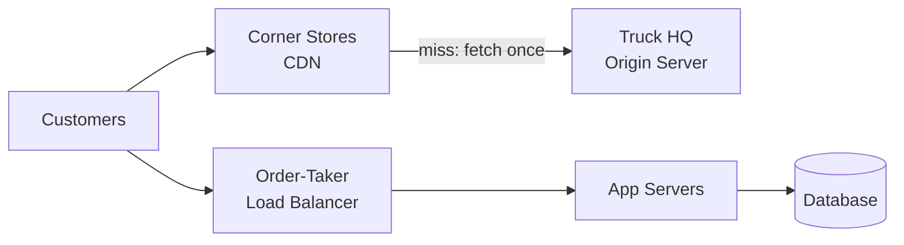
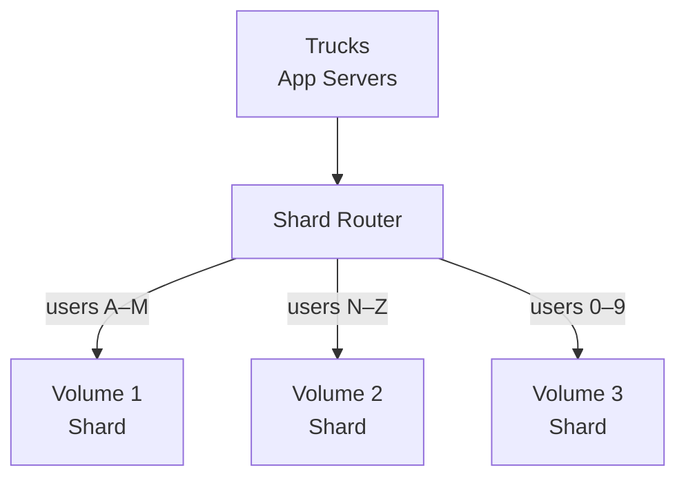
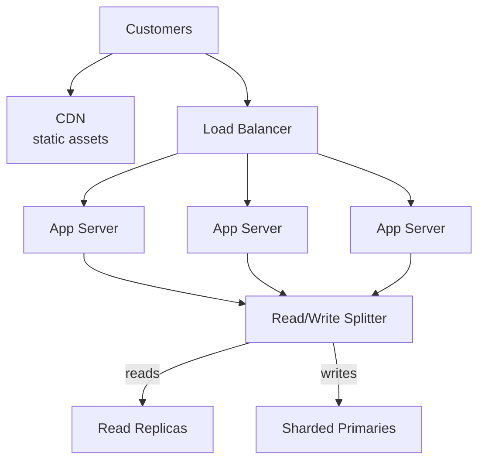

export const meta = {
  slug: 'scaling-web-service',
  title: 'From Zero to Millions: Scaling a Web Service',
  tier: 'beginner',
  order: 1,
  summary:
    'The classic journey from one server to millions of users: vertical and horizontal scaling, load balancers, read replicas, CDNs, and sharding — with the napkin math to back it up.',
  estimatedMinutes: 15,
  difficulty: 1,
  topics: ['scaling', 'load balancing', 'caching'],
};

## Why this matters

Almost every system design interview starts the same way: "Design a web service that goes
from zero users to a million." The interviewer isn't really asking about a million — they're
asking whether you know the *stages*. Every large system you admire — a video platform, a
chat app, a food delivery service — walked the same path, solving one bottleneck at a time.
This lesson walks it with you, step by step. Learn this journey once and you'll recognize it
everywhere.

🎥 **Learn more:** [The Truth About Scaling: Why More Servers Isn't Always Better](https://www.youtube.com/watch?v=865BgE1gbPA) — Tahir Alvi. Traces how one server becomes a bottleneck and why scaling is a deliberate response to real bottlenecks, not a default.

## Picture a food truck

This lesson's running analogy: you run a food truck. One truck, one cook, one window for
taking orders. That's your web service on day one.

Mapping, stated plainly:

- The **truck** is your server — one machine running everything.
- The **cook** is your CPU — the thing that actually does the work.
- The **line of customers** is your incoming requests.
- The **recipe book** is your database — where the truth lives.
- The **cash register's memory of who ordered what** is your session state.

Day one is glorious. Customers trickle in. The cook handles it. Everything lives in the one
truck. The problem is what happens when the food blog writes you up and five hundred people
show up at once. That moment has a name: **scaling**. And there are two fundamentally
different ways to do it.

🎥 **Learn more:** [Horizontal vs Vertical Scaling: How to Handle Million Users | System Design Ep 2](https://www.youtube.com/watch?v=wbPOANluZN4) — Vishal Kumar. Uses a restaurant analogy to make horizontal and vertical scaling concrete, building the mental model this stage needs.

## Stage 0: One truck (and its limits)

Your first server does it all: it serves the web pages, runs your application code, and
holds the database on the same disk. For a hobby project this is honestly the right call —
one machine, one bill, one thing to debug at 2 a.m.

The first move when traffic grows is the obvious one: **scale vertically**. Get a bigger
truck. More RAM, a faster CPU, a bigger disk. In the analogy, that's a bigger grill, a
wider prep counter, a second register.

Vertical scaling has real charms: nothing in your code changes, your recipe book stays in
one place, and there's no distributed anything to keep you up at night. But it has a hard
ceiling. There's only so big a grill can get, and the price curve is cruel — the jump from a
good machine to a great one costs far more than the performance you gain. Worse, you still
have exactly one truck. If the engine dies, lunch is cancelled. Vertical scaling has no
answer for failure.

So the industry converged on the other direction.

🎥 **Learn more:** [Vertical vs Horizontal Scaling: Bigger Box or More Boxes?](https://www.youtube.com/watch?v=X5wt11TVEKo) — The Hot Path. Shows exactly where one server hits its limits and why vertical scaling eventually stops working — Stage 0's core lesson.

## Stage 1: Clone the truck (horizontal scaling)

**Horizontal scaling** means: instead of one bigger truck, run *more* trucks. Ten ordinary
trucks side by side can serve more customers than one enormous one, and if one breaks down,
the other nine keep cooking. You trade one super-machine for a fleet of cheap ones.

But fleets create a new problem. When a customer walks up, *which* truck takes their order?
You need someone at the front of the line pointing people to the shortest queue. That's the
**load balancer** — the friendly order-taker with the headset who waves each customer to a
free window.

Here's the whole idea in one picture:

Now here's the catch the order-taker forces on you. Suppose a customer orders at Truck 2,
and the cashier there remembers "this person paid already, their burger is coming." If that
customer's next request lands at Truck 3, Truck 3 has no idea who they are. The trucks must
be **stateless**: no truck is allowed to keep private memories of customers. Any memory —
who's logged in, what's in their cart — has to live somewhere every truck can reach: the
shared database, or a shared cache.

This is not a minor detail; it's one of the core rules of building scalable services. Adam
Wiggins wrote it down as one of the twelve factors of app design: processes should be
stateless and share-nothing, with any state that needs to persist kept in a backing service
(the recipe book lives outside the trucks, never inside them). (There's a whole lesson on
load balancers waiting for you if you want the deeper cut — the algorithms, the health
checks, the failure handling.)

Watch the requests stream through:

<PacketFlow stages={["Customers", "Load Balancer"]} servers={["Truck 1", "Truck 2", "Truck 3"]} requestLabel="GET" duration={5} />

With three trucks and an order-taker, you can add a fourth, fifth, twentieth truck with
almost no changes. That's the superpower of horizontal scaling: capacity becomes a number
you dial up, not a wall you hit.

🎥 **Learn more:** [The Greeter. Load balancing, stateless servers, and horizontal scale. Learning Maps Ep.10](https://www.youtube.com/watch?v=n7mYiBIhNqA) — Organic Arts LLC. Teaches load balancing, stateless servers, and horizontal scale together in one lesson.

## Stage 2: Stop re-reading the recipe book (read replicas)

The trucks multiply beautifully. But notice the diagram: all three trucks still share one
recipe book — one database. And databases have a personality trait: they handle writes
carefully and slowly (every write must be recorded faithfully), but they can hand out reads
much more easily.

Most real services are wildly read-heavy. A social feed might serve a thousand profile views
for every profile update. So the database's bottleneck is usually *reads*, and there's a
beautiful trick for it: **read replicas**. Photocopy the recipe book. Put a copy at every
truck. Reads go to the nearest copy; writes still go to the one true original, which then
updates all the copies.

In the food-truck world: nobody needs to walk back to the original recipe book to check the
menu. The copies are fine — as long as you accept that a just-changed special might take a
minute to reach every photocopy. That little delay is called **replication lag**, and it's a
trade-off you choose on purpose: slightly stale reads in exchange for massively more read
capacity.

Two honest warnings. First, writes still funnel through the one master, so if your problem
is *write* volume, replicas don't save you. Second, that lag is real — if a customer changes
their password and the replica still has the old one, they'll have a confusing minute. Some
systems route a user's own reads to the master right after they write ("read your own
writes") to dodge exactly this.

🎥 **Learn more:** [What is Database Replication](https://www.youtube.com/watch?v=HftLmLLbJMU) — Dargslan. Covers primary/replica split, replication lag, and read-your-own-writes with clear visual explanations.

## Stage 2.5: The chalkboard by the window (caching)

Before we leave the database behind, one more trick — and it's the one with the biggest
payoff on this whole list. Some questions get asked *constantly*: "what's today's special?", "is the
truck open?" Making the cook look it up in the recipe book every time is silly when the
answer barely changes. So you put a **chalkboard by the window** with the top ten answers
written on it. The cashier reads the chalkboard; the cook is only bothered when the answer
isn't there.

That's a **cache**: a small, blazing-fast store (usually in-memory, systems like Redis or
Memcached) sitting in front of the database, holding copies of the hottest data. The usual
pattern even has a folksy name — **cache-aside**:

1. App server needs an answer → checks the chalkboard first.
2. **Hit:** it's there. Served in microseconds, database never involved.
3. **Miss:** not there. Ask the database, then *write the answer on the chalkboard* for
   next time.

Two honest footnotes. First, chalkboards get stale: if the special changes, the board still
says fish tacos until someone erases it. Caches handle this with a **TTL (time to live)** —
every chalk note auto-erases after, say, 60 seconds. Short TTL: fresher answers, more
database trips. Long TTL: fewer trips, staler answers. Another dial you tune on purpose.

Second, a chalkboard is small by design. When it's full, something gets erased to make room
(**eviction** — usually the least-recently-used note). A cache doesn't replace your
database or your replicas; it *protects* them, absorbing the repetitive questions so the
expensive machinery underneath can breathe. There's a whole lesson on caching strategies
later — consider this your appetizer.

🎥 **Learn more:** [Redis Cache Explained in 300 Seconds (Beginner to Pro) #redis #cache #coding #seniordeveloper](https://www.youtube.com/watch?v=JcufU5dtBYQ) — Coding With Raj Dave. Covers cache-aside, TTL, and eviction policies with Redis in a compact format.

## Stage 3: Let the corner stores sell the drinks (CDN)

By now your trucks serve food fast. But half of what customers ask for isn't cooked to
order — it's the bottled drinks, the pre-made desserts, the printed menus. In web terms:
images, videos, stylesheets, JavaScript bundles. **Static assets.** They never change per
customer, so why is your precious cook fetching them from the truck?

A **CDN (content delivery network)** is a franchise of corner stores that stock your drinks
for you. You make one delivery to the franchise; after that, customers grab drinks from the
store on their corner instead of driving to your truck. Technically: copies of your static
files sit on servers all over the world, and each user downloads them from the nearest one.

The wins are twofold. Your trucks stop wasting effort on work any corner store could do,
and customers get their drinks *faster* because the corner store is closer than your truck.
For media-heavy services, a CDN isn't an optimization — it's the difference between
possible and impossible. (There's a full lesson on CDNs later in this course.)

One catch: when you change a drink's recipe (update an asset), the corner stores keep
selling the old bottles until their stock refreshes. That's cache invalidation, and there's
a famous joke that it's one of the two hard problems in computer science. The usual fix is
versioned filenames — ship `menu-v2.png` instead of overwriting `menu.png` — so old stock
and new stock never get confused.

🎥 **Learn more:** [What is a CDN? - #Cloudbits Episode 2](https://www.youtube.com/watch?v=9254n-FM97M) — Cloudflare Developers. Cloudflare's own explainer on what CDNs are and how edge caching works.

## Stage 4: Split the recipe book (sharding)

Everything scales now except the one master recipe book. Writes keep growing, and one
database — even the beefiest — eventually can't keep up. The final stage of the classic
journey: **shard** the data. Tear the recipe book into volumes and give each volume to a
different truck.

Sharding means splitting your data across multiple databases by some key: customers A–M on
one shard, N–Z on another; or by geography, or by a hash of the user ID. Each shard is an
independent database holding a slice of the whole. Now writes scale too — adding a shard
adds write capacity.

But — and here the "but" is doing honest work — sharding is the most expensive stage on
this list. Queries that used to touch one database now might touch
many ("find every customer named Lee" means asking all three volumes). Rebalancing shards
as data grows is delicate surgery. And some operations, like transactions across shards,
range from painful to genuinely impossible. Shard when the math says you must, not before.
(There's a dedicated lesson on sharding strategies for exactly that math.)

Notice something about the whole journey: each stage attacked the *current* bottleneck and
nothing else. You didn't shard on day one. You didn't need a CDN for your first hundred
users. Scaling is sequential problem-solving, not a shopping list.

🎥 **Learn more:** [System Design Part 5: Indexing & Sharding Explained (Scale to Millions)](https://www.youtube.com/watch?v=cYskVBOxOHQ) — Coding Devs. Covers sharding strategies, shard keys, hot shards, and cross-shard query costs for write scaling.

## The napkin math

Senior engineers do capacity planning on the back of a napkin, and you can too. The Google
SRE book treats this as a core discipline: translate users into requests per second, then
into machines. Here's the whole technique in one worked example.

**Step 1: Users → requests per second.** Your analytics say the service handles **1 million
requests per day**. A day has 86,400 seconds, so:

- Average: 1,000,000 ÷ 86,400 ≈ **12 requests/second**
- Traffic isn't flat — dinner rush is real. Assume peak is ~10× average: **~120 requests/second**

That "10× peak" rule of thumb is deliberately pessimistic. Underestimate the peak and your
launch-day story becomes a postmortem.

**Step 2: Requests per second → servers.** Suppose one app server comfortably handles ~500
requests/second. Your peak of ~120 req/s fits on a *single* server — so why did we build a
fleet of three? Because one server is a single point of failure, and because the peak
estimate is a guess. You run three for **redundancy and headroom**, not because the math
demands three. Capacity planning is half arithmetic, half humility.

**Step 3: Data → storage.** Storage math is even simpler — multiply the thing by the count:

- User profiles: 1M users × 2 KB per profile ≈ **2 GB**. Fits in RAM on one box. Yawn.
- Same profiles at a billion users: 1B × 2 KB ≈ **2 TB**. Now you're sharding, and you can
  prove it on the napkin before writing a line of code.

That last line is the real lesson of this section. Back-of-the-envelope math won't give you
the exact answer, but it reliably tells you which *stage* of the journey you're in — and
which stages you can stop worrying about for now.

<NapkinMathPlayground />

🎥 **Learn more:** [SREcon19 Europe/Middle East/Africa - Advanced Napkin Math: Estimating System...](https://www.youtube.com/watch?v=IxkSlnrRFqc) — USENIX. SREcon talk on estimating system performance from first principles, matching the napkin-math discipline.

## The full journey, one diagram

Here's everywhere the food truck has been, in the order it got there:

Stateless trucks behind an order-taker. Reads fanned out to photocopies. Writes spread
across volumes. Static assets handled by the franchise. Every stage earned its place by
solving the bottleneck in front of it.

Now walk the whole journey yourself — scroll, and watch each stage light up in the order
the truck actually grew:

<ScrollyDiagram
  nodes={[
    { id: "customers", label: "Customers", sub: "hungry humans", x: 90, y: 60 },
    { id: "cdn", label: "CDN", sub: "corner stores", x: 320, y: 60 },
    { id: "lb", label: "Load Balancer", sub: "order taker", x: 90, y: 190 },
    { id: "app1", label: "App Server", sub: "truck 1", x: 90, y: 320 },
    { id: "app2", label: "App Server", sub: "truck 2", x: 320, y: 320 },
    { id: "cache", label: "Cache", sub: "chalkboard", x: 90, y: 450 },
    { id: "splitter", label: "Read/Write Splitter", sub: "traffic cop", x: 320, y: 450 },
    { id: "replica", label: "Read Replicas", sub: "photocopies", x: 90, y: 580 },
    { id: "shard", label: "Sharded Primaries", sub: "recipe volumes", x: 320, y: 580 },
  ]}
  edges={[
    { id: "e_cdn", from: "customers", to: "cdn", label: "static" },
    { id: "e_lb", from: "customers", to: "lb", label: "orders" },
    { id: "e_a1", from: "lb", to: "app1" },
    { id: "e_a2", from: "lb", to: "app2" },
    { id: "e_cache", from: "app1", to: "cache", label: "hot reads" },
    { id: "e_s1", from: "app1", to: "splitter" },
    { id: "e_s2", from: "app2", to: "splitter" },
    { id: "e_reads", from: "splitter", to: "replica", label: "reads" },
    { id: "e_writes", from: "splitter", to: "shard", label: "writes" },
  ]}
  steps={[
    {
      title: "One truck does everything",
      body: "Every customer lines up at a single truck that takes orders, cooks, and keeps the books. Wonderfully simple — until the line wraps around the block and one breakdown ends the day.",
      nodes: ["customers", "app1"],
      edges: [],
    },
    {
      title: "Clone the truck",
      body: "An order-taker (load balancer) spreads the line across identical truck clones. Any single truck can break down and lunch still gets served.",
      nodes: ["lb", "app1", "app2"],
      edges: ["e_lb", "e_a1", "e_a2"],
    },
    {
      title: "Stop re-reading the recipe book",
      body: "Reads drown the kitchen, so a traffic cop (read/write splitter) sends menu lookups to photocopies (read replicas) and only real orders to the master book.",
      nodes: ["splitter", "replica"],
      edges: ["e_s1", "e_s2", "e_reads"],
    },
    {
      title: "The chalkboard by the window",
      body: "The most-asked questions get answered from the chalkboard (cache) in milliseconds — no trip to the kitchen at all.",
      nodes: ["cache"],
      edges: ["e_cache"],
    },
    {
      title: "Corner stores sell the drinks",
      body: "Bottled drinks don't need the truck. The franchise (CDN) serves static goods from corner stores right next to every customer.",
      nodes: ["cdn"],
      edges: ["e_cdn"],
    },
    {
      title: "Split the recipe book",
      body: "When one master book can't take all the writes, split it into volumes (shards) — each primary owns its own slice of the orders.",
      nodes: ["shard"],
      edges: ["e_writes"],
    },
  ]}
  caption="Scroll to walk the food truck's whole journey — each stage solved the bottleneck in front of it."
/>

🎥 **Learn more:** [System Design Explained: How Apps Scale to 1 Billion Users](https://www.youtube.com/watch?v=Z_D3esVduTk) — TheBinaryBreakdown. Rebuilds the whole journey from one server to global architecture: load balancers, caching, replicas, sharding, CDN.

## Takeaways

1. **Scale vertically first, horizontally second.** A bigger truck is simple but has a hard
   ceiling and a single point of failure; a fleet of trucks scales further and survives
   breakdowns.
2. **Horizontal scaling demands stateless servers.** A load balancer can send any request
   to any server, so no server may keep private memories — shared state lives in the
   database or cache, never in the app process.
3. **Read replicas multiply read capacity** by photocopying the database; writes still flow
   through the primary. Accept a little replication lag as the price.
4. **A CDN offloads static assets** to servers near your users — faster for them, cheaper
   for you. Version your filenames to dodge cache invalidation headaches.
5. **Shard only when the math says so.** Splitting the database scales writes, but
   cross-shard queries and rebalancing are genuinely painful. The napkin math tells you
   when you've arrived.
6. **Do capacity planning on a napkin:** daily requests ÷ 86,400 = average req/s, assume
   ~10× for peak, then size the fleet with room to spare. Half arithmetic, half humility.

<Quiz
  lessonSlug="scaling-web-service"
  questions={[
    {
      question:
        "Your food truck's line is out the door. What's the key difference between scaling vertically and scaling horizontally?",
      options: [
        "Vertical means adding more trucks; horizontal means getting a bigger grill",
        "Vertical means a bigger, more powerful truck; horizontal means more trucks side by side",
        "Vertical means hiring more cooks; horizontal means opening longer hours",
        "They're two names for the same thing",
      ],
      correctIndex: 1,
    },
    {
      question:
        "Why must the app servers (trucks) behind a load balancer be stateless?",
      options: [
        "Stateless servers use less electricity",
        "The load balancer can route any customer's next request to a different server, so a server can't rely on remembering that customer",
        "Databases refuse connections from servers that keep local state",
        "Stateless servers never need to be restarted",
      ],
      correctIndex: 1,
    },
    {
      question: "Your service handles 1M requests/day. What are the average and (10×) peak requests per second?",
      options: [
        "About 120 avg, about 1,200 peak",
        "About 1,000 avg, about 10,000 peak",
        "About 12 avg, about 120 peak",
        "About 60 avg, about 600 peak",
      ],
      correctIndex: 2,
    },
    {
      question:
        "Read replicas help you scale, but they do NOT help with which problem?",
      options: [
        "Serving a huge volume of read queries",
        "Reducing load on the primary database from reads",
        "Handling a huge volume of writes — writes still funnel through the single primary",
        "Serving reads from a database copy close to the app servers",
      ],
      correctIndex: 2,
    },
  ]}
/>

---

## Go deeper

Want to keep pulling this thread? These talks and tutorials go further than we did here:

- [Scaling Slack](https://www.youtube.com/watch?v=o4f5G9q_9O4) — Keith Adams, GOTO Amsterdam 2018 (~50 min). Slack's real journey from hundreds to millions of users, stateful-connection trade-offs included.
- [How I'd Scale a Website to 1 Million Users: Complete Architecture & Performance Guide](https://www.youtube.com/watch?v=Dfgxm4jW2A8) — Ashok Babu Kandula, YouTube. Mirrors the lesson stage by stage, with capacity-planning math you can steal.
- [Scalability Fundamentals Explained | System Design Fundamentals](https://www.youtube.com/watch?v=bQYnbl0nYmc) — System Overflow, YouTube (~10 min). Vertical vs horizontal trade-offs, Little's Law, and thundering-herd failure modes in ten minutes.
- [System Design Course – APIs, Databases, Caching, CDNs, Load Balancing & Production Infra](https://www.youtube.com/watch?v=C842vFY5kRo) — freeCodeCamp.org (~2h 05m). The full zero-to-millions arc — vertical and horizontal scaling, load balancing, and eliminating single points of failure.
- [System Design Concepts Course and Interview Prep](https://www.youtube.com/watch?v=F2FmTdLtb_4) — freeCodeCamp.org (~54m). The compressed version — vertical vs horizontal scaling and the core scaling moves, tight and interview-ready.
- [System Design Primer ⭐️: How to start with distributed systems?](https://www.youtube.com/watch?v=SqcXvc3ZmRU) — Gaurav Sen (~9m). A nine-minute warm-up — scaling, decoupling, load balancing, and logging before you dive into the long courses.

## Sources & further reading

- Adam Wiggins, "The Twelve-Factor App" (12factor.net) — stateless processes and backing services as design rules.
- Betsy Beyer, Chris Jones, Jennifer Petoff & Niall Richard Murphy (eds.), *Site Reliability Engineering* (O'Reilly, 2016) — capacity planning: turning demand forecasts into machine counts.
- Martin Kleppmann, *Designing Data-Intensive Applications* (O'Reilly, 2017), Ch. 1 — the recurring architecture of data systems and why services evolve in stages.
