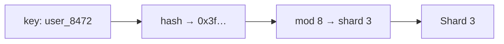
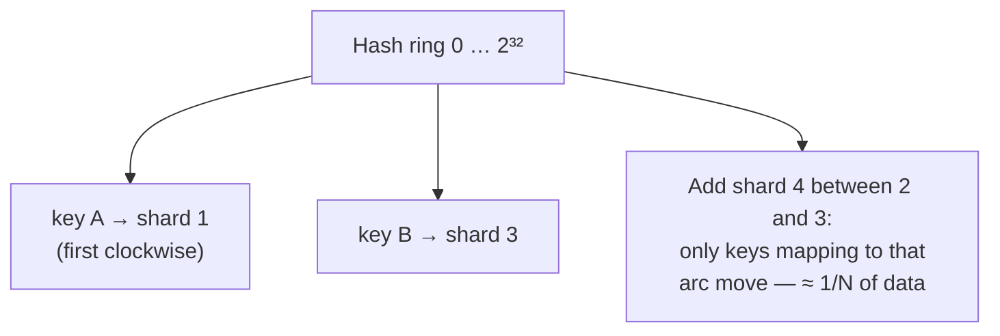

export const meta = {
  slug: 'sharding-strategies',
  title: 'Sharding Strategies',
  tier: 'advanced',
  order: 24,
  summary:
    'Splitting a dataset across machines without regret: key-based, range-based, and directory-based sharding, consistent hashing with virtual nodes, and the true cost of resharding.',
  estimatedMinutes: 22,
};

## Why this matters

Your database was fast when it fit on one machine. Then the dataset grew 100×, and no
amount of vertical scaling (bigger box, faster disks) keeps up — physics and budgets both
tap out. **Sharding** (horizontal partitioning) splits the data across many machines so
each one holds a fraction. It is the only strategy that scales writes indefinitely, and it
is also the strategy most likely to ruin your quarter if you botch the shard key. Choose
well and shards are invisible; choose badly and one shard melts while the others idle.

The analogy: a **library with too many books for one building**. You could shelve by
author's last initial (key-based: deterministic, but 'S' gets crushed), by acquisition
date with ranges per building (range-based: great for date queries, terrible when this
year's books are all anyone reads), or keep a master catalog saying which building holds
what (directory-based: flexible, but the catalog becomes its own scaling problem). Every
sharding scheme is one of these three library layouts.

## Strategy 1: Key-based (hash) sharding

`shard = hash(key) mod N`. Deterministic, uniform-ish distribution, trivially computable.
No lookup needed. **Cassandra**, **DynamoDB**, and **Redis Cluster** all hash the key.

The catch is the `mod N`: **adding a shard renumbers almost everything**. With naive
modulo hashing, going from 8 to 9 shards moves ~8/9 of your data — a full reshuffle for
one shard of new capacity. This is the problem consistent hashing was invented to solve
(see below). Key-based sharding also scatters *related* data: a user's orders land on
different shards than the user, so joins become application-level scatter-gather.

## Strategy 2: Range-based sharding

Contiguous key ranges per shard: shard 1 holds A–F, shard 2 holds G–M, and so on.
**HBase**, **Bigtable**, **CockroachDB**, and **MongoDB** (range sharding) work this way.
Range queries are beautiful — "all orders in March" hits one or two shards instead of all
of them.

The failure mode has a name: the **hotspot**. Time-series data, auto-increment IDs, or
anything monotonically increasing piles all writes onto the *last* shard — one machine
does 100% of the writes while the others nap. The standard fix is a **salted prefix**:
prepend `hash(key) mod K` to the key so sequential writes spray across K shards, at the
cost of making range scans touch K shards. There is no free lunch; there is only lunch
whose price you've itemized.

## Strategy 3: Directory-based sharding

Keep a **lookup service** mapping each key (or key range) to its shard. Maximum
flexibility: move any key anywhere, split hot shards surgically — at the cost of the
directory itself: it's a critical-path lookup on every request (cache it aggressively) and
a new thing to keep highly available. Useful when your sharding needs are irregular enough
that no formula works, e.g., multi-tenant SaaS where one whale customer deserves their own
shard.

## Consistent hashing: adding shards without the apocalypse

The elegant fix for the `mod N` reshuffle. Hash both keys *and* shards onto a ring; each
key belongs to the first shard clockwise from it.

The math that matters: adding one shard to N moves only **~1/N of keys** (vs. ~(N-1)/N
with naive modulo). With 10 shards, a scale-up moves ~10% of data, not ~90%. But plain
consistent hashing distributes unevenly when N is small — so production systems use
**virtual nodes**: each physical shard claims, say, 100–200 points on the ring, smoothing
distribution and making heterogeneous hardware natural (big machine gets more virtual
nodes). **Dynamo**, **Cassandra**, and **Riak** all do this.

<StepThrough
  title="Consistent hashing: a new shard joins"
  nodes={[
    { id: "s1", label: "Shard S1", x: 240, y: 52, w: 90 },
    { id: "s2", label: "Shard S2", x: 345, y: 155, w: 90 },
    { id: "s4", label: "Shard S4", x: 240, y: 258, w: 90 },
    { id: "s3", label: "Shard S3", x: 135, y: 155, w: 90 },
    { id: "ka", label: "key A", x: 160, y: 95, w: 80, h: 32 },
    { id: "kb", label: "key B", x: 320, y: 220, w: 80, h: 32 },
    { id: "kc", label: "key C", x: 155, y: 220, w: 80, h: 32 },
  ]}
  edges={[
    { from: "s1", to: "s2" },
    { from: "s2", to: "s4" },
    { from: "s4", to: "s3" },
    { from: "s3", to: "s1" },
  ]}
  steps={[
    {
      title: "Keys on the ring",
      caption: "Three shards sit on the hash ring. Key A hashes into S1's arc, key C into S3's — every key belongs to the first shard clockwise from it.",
      highlight: ["s1", "s2", "s3", "ka", "kc"],
    },
    {
      title: "Shard S4 joins",
      caption: "S4 lands on the ring between S2 and S3 and claims the arc from S2's position to its own.",
      highlight: ["s4"],
    },
    {
      title: "Only the arc migrates",
      caption: "Key B — the only key in S4's new arc — moves over from S3. Everything else stays put: about 1/N of keys move, not (N−1)/N.",
      highlight: ["s4", "kb"],
    },
  ]}
/>

## The numbers: resharding cost and shard sizing

Some back-of-envelope arithmetic before you shard:

- **Data per shard**: keep shards small enough to move. If a shard holds 500 GB and your
  network does 1 Gbps (~100 MB/s after overhead), moving one shard takes ~80 minutes —
  and resharding usually moves many. Teams that keep shards ≤ 50–100 GB can rebalance in
  minutes, not maintenance windows.
- **Connection math**: with S shards and C app servers each holding a connection pool of P
  connections per shard, you have S×C×P connections. 64 shards × 50 app servers × 20 pool
  = 64,000 connections — congratulations, you've DDoS'd your own connection limits. Shard
  count is not free.
- **The hot-key ceiling**: sharding scales *aggregate* throughput, but a single hot key
  (the celebrity's profile, the viral post) still lives on one shard. If one key gets
  50k writes/sec and a shard handles 10k, no shard count saves you — you need caching,
  key-splitting, or a different design. Know your hottest key's traffic *before* choosing
  N.

## Choosing the shard key (the decision you'll live with)

The shard key determines data distribution, query patterns, and your future resharding
pain. Good keys have **high cardinality** (many distinct values), **even distribution**,
and **colocate related data** (a user's rows on one shard = single-shard transactions).
Bad keys: timestamps (hotspot), booleans (two shards, one idle), tenant ID when one tenant
is 80% of traffic (the whale problem — give the whale its own shard via directory-based
routing).

Changing the shard key later is a full data migration. The most expensive schema change
there is. Spend the design meeting. Future you, paged at 3 AM because shard 7 of 8 is at
100% CPU, will be grateful.

## Takeaways

1. Key-based = simple and uniform but reshuffles on scale-up; range-based = great scans but hotspot-prone; directory-based = flexible but adds a critical lookup.
2. Consistent hashing with virtual nodes makes adding a shard move ~1/N of data instead of nearly all of it.
3. Budget the real costs: shard move time (GB ÷ network), connection explosion (S×C×P), and the hot-key ceiling no sharding fixes.
4. The shard key is the hardest decision — high cardinality, even distribution, colocated related data — because changing it is a full migration.

<Quiz
  lessonSlug="sharding-strategies"
  questions={[
    {
      question: "What is the main problem with naive hash(key) mod N sharding when adding a shard?",
      options: [
        "The hash function becomes slower",
        "Almost all data must move because the modulus changed",
        "Keys can no longer be looked up",
        "Range queries become impossible forever",
      ],
      correctIndex: 1,
    },
    {
      question: "What failure mode does range-based sharding suffer with monotonically increasing keys?",
      options: [
        "Data is distributed too evenly",
        "The hotspot: all writes pile onto the last shard",
        "Keys hash to the wrong shard",
        "The directory service becomes a bottleneck",
      ],
      correctIndex: 1,
    },
    {
      question: "With consistent hashing, adding one shard to N approximately moves what fraction of keys?",
      options: [
        "Nearly all of them",
        "About 1/N of them",
        "Exactly half",
        "None — keys never move",
      ],
      correctIndex: 1,
    },
    {
      question: "Why do production consistent-hashing systems use virtual nodes?",
      options: [
        "To encrypt the keys on the ring",
        "To smooth out uneven distribution with few physical shards and support heterogeneous hardware",
        "To reduce the number of hash computations",
        "Virtual nodes eliminate the need for replication",
      ],
      correctIndex: 1,
    },
  ]}
/>

---

## Go deeper

Want to keep pulling this thread? These talks and tutorials go further than we did here:

- [What is Database Sharding?](https://www.youtube.com/watch?v=XP98YCr-iXQ) — Anton Putra, YouTube (~10 min). Range, hashed, and directory sharding, then how to actually pick a shard key.
- [Database Sharding and Partitioning — Explained in Detail](https://www.youtube.com/watch?v=FJwbE4puX-8) — YouTube tutorial, YouTube (~8 min). Why cross-shard queries hurt and why mod-N resharding moves 75% of your rows.
- [Consistent Hashing Explained | System Design Interview](https://www.youtube.com/watch?v=PYJ4yDSKAkE) — TechGik, YouTube (~6 min). The hash ring, virtual nodes, and the hot-key ceiling, all in six minutes.

## Sources & further reading

- DeCandia et al., "Dynamo: Amazon's Highly Available Key-Value Store" (SOSP 2007) — consistent hashing with virtual nodes in production.
- Karger et al., "Consistent Hashing and Random Trees" (STOC 1997) — the original paper.
- Martin Kleppmann, *Designing Data-Intensive Applications* (O'Reilly, 2017), Ch. 6 — partitioning strategies and rebalancing.
- MongoDB documentation, "Sharding" — hashed vs. ranged shard keys and the hotspot problem, with real operational guidance.
