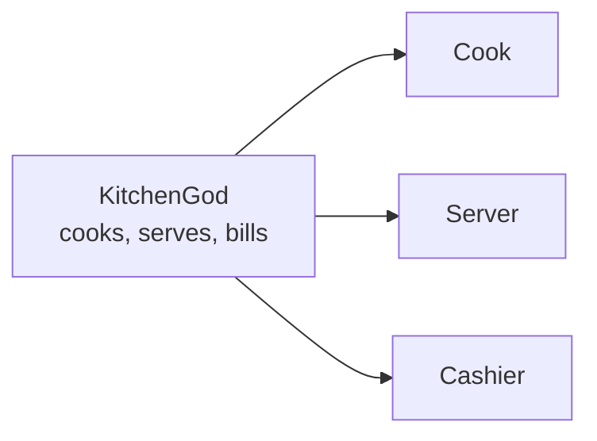
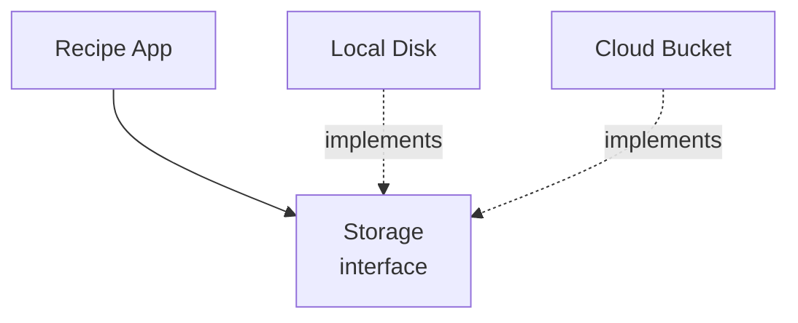

export const meta = {
  slug: 'solid-principles',
  title: 'SOLID: Object-Oriented Design That Ages Well',
  tier: 'beginner',
  order: 2,
  summary:
    'Five principles for code that survives contact with the future: one job per class, extend without rewriting, substitutes that keep their promises, small interfaces, and dependencies that point at abstractions — told through a home kitchen.',
  estimatedMinutes: 15,
};

## Why this matters

Every senior engineer carries a scar from a class called something like `Manager`,
`Utils`, or `God`. Ten thousand lines. Touched by forty people. Nobody dares delete a
line, because nobody knows which three features that line is secretly holding up. You
change the tax calculation and the email templates break. You fix the emails and login
breaks. The code works — right up until you need it to do anything new.

SOLID is five principles for never building that class in the first place. The principles
come from Robert C. Martin's writing on object-oriented design — first collected in
*Agile Software Development* (2002); the SOLID acronym itself was coined a couple of
years later by Michael Feathers, who noticed the initials spelled a handy word.
Martin revisited them in *Clean Architecture* (2017).
You've probably seen the acronym before. This lesson is about what the letters actually
*buy you* — not as rules to memorize, but as instincts for splitting code into pieces
that stay easy to change.

For this lesson, your code is a home kitchen. Yours — the one you'll cook in for the
next ten years.

## What good design actually buys you

Before the five letters, the payoff. Object-oriented design earns its keep in three
ways, and every principle below serves at least one of them:

- **Maintainability.** When the recipe changes, you change it in one place. Not five.
- **Testability.** You can practice with a toy oven instead of firing up the real
  kitchen — test the recipe without the heat.
- **Changeability.** You can add a pasta attachment to the mixer without rebuilding
  the mixer.

That's the whole sales pitch. A codebase where change is cheap, testing is easy, and
nothing is secretly holding up three other things.

Now the five principles. Each one gets one kitchen analogy, then the precise definition
underneath.

## S — Single responsibility: one job per gadget

Somewhere in a catalog there's an all-in-one breakfast station: toaster on the left,
griddle in the middle, coffee maker on the right, one power cord. It looks efficient
until the toaster element dies — and takes your morning coffee down with it. Three
jobs, one box, one shared fate.

Classes work the same way. Martin's phrasing is exact: **a class should have one, and
only one, reason to change.** Not "do one thing" — *change for one reason*. A
`ReportGenerator` that also sends emails and writes to the database has three reasons
to change: the report format, the email policy, the schema. Every change risks the
other two.

```ts
// Three reasons to change, one class to blame
class OrderManager {
  takeOrder() { /* ... */ }   // changes when ordering changes
  cookFood() { /* ... */ }    // changes when the menu changes
  printBill() { /* ... */ }   // changes when billing changes
}
```

The fix is the split you'd expect:



Cook, Server, Cashier. The menu changes? You touch the Cook. Billing changes? The
Cashier. Nothing else flinches. That's maintainability, bought with a sketch you could
draw on a napkin.

See it side by side:

<VsToggle
  title="One class or three?"
  a={{
    label: "The everything class",
    title: "OrderManager does it all",
    points: [
      "One class takes orders, cooks food, and prints bills",
      "A menu change risks breaking billing",
      "Testing the cook means dragging in the cash register too",
    ],
    note: "This is the junk drawer with a class name.",
  }}
  b={{
    label: "Split by responsibility",
    title: "Cook, Server, Cashier",
    points: [
      "Each class has exactly one reason to change",
      "A menu change touches only the Cook",
      "You can test the Cashier against a fake Server",
    ],
    note: "Three small classes, each boring in the best way.",
  }}
/>

And your smoke detector? It has exactly one job — scream when there's smoke — and it
has never once tried to also be a clock radio. Be like the smoke detector. (It'll be
back.)

## O — Open/closed: the stand mixer

Your stand mixer is a motor with a socket on top. Pasta roller, meat grinder, grain
mill, ice cream churn — every attachment snaps into the same socket. You've never once
opened the motor housing to add a new one.

That's the **open/closed principle**, and the phrase comes from Bertrand Meyer
(*Object-Oriented Software Construction*, 1997): software entities should be **open for
extension, but closed for modification**. You add behavior by adding new code, not by
editing old code.

The usual violation is the switch statement that grows a new case every sprint:

```ts
function charge(order) {
  switch (order.paymentType) {
    case 'card': /* ... */ break;
    case 'cash': /* ... */ break;
    case 'crypto': /* ... */ break;  // this month's edit
    // next month: crack this function open again
  }
}
```

Every new payment method means opening a function that already works — and risking
every payment method that already works. The fix is the mixer socket: depend on a
`PaymentMethod` interface, and let each new method arrive as a new attachment. New code
gets added; old code stays shut. That's changeability, and it's the reason the mixer
outlives every attachment trend.

## L — Liskov substitution: the cream test

A recipe calls for cream. You're out, so you reach for oat cream. Fine — *if* it
behaves like cream everywhere the recipe needs cream: it shouldn't curdle under heat,
and it should whip. If your substitute curdles in the pan, it wasn't really a
substitute. It just looked like one on the shelf.

That's **Liskov substitution**, from Barbara Liskov's 1987 keynote "Data Abstraction
and Hierarchy": objects of a subtype must be usable anywhere the supertype is expected,
without breaking the program. It's about *behavior*, not labels. The classic violation:
`Square` extends `Rectangle`, but `Rectangle` lets you set width and height
independently — and a square that silently changes its height when you set its width
just broke every recipe written for rectangles.

The kitchen version: if the recipe says "any pan," your non-stick pan had better
survive the broiler the way the cast iron would. A substitute that can't keep the
contract isn't a substitute — it's a surprise. LSP is the principle that says surprises
are bugs.

## I — Interface segregation: the right menu

Your TV remote has eighty buttons. You use nine. The other seventy-one are a maze you
navigate every time you want the volume up — and every one of them is a button some
client is forced to depend on.

**Interface segregation** says: no client should be forced to depend on methods it
doesn't use. Hand the vegan the vegan menu, not the steakhouse menu with a lecture. In
code: prefer several small, focused interfaces over one fat one.

```ts
// The 80-button remote
interface Worker { work(): void; eat(): void; sleep(): void; }

class Robot implements Worker {
  work() { /* ... */ }
  eat() { /* throw? */ }   // robots don't eat. Now what?
  sleep() { /* ... */ }
}
```

The robot is forced to implement `eat()` — a method it can never honestly provide —
because the interface was designed for humans. Split the interface and the problem
evaporates:

```ts
interface Workable { work(): void; }
interface Eatable { eat(): void; }

class Human implements Workable, Eatable { /* ... */ }
class Robot implements Workable { /* ... */ }  // no fake eat() required
```

Small interfaces, honest clients. Nobody implements a method just to throw "not
supported" into the void.

## D — Dependency inversion: plug, don't hardwire

Your lamp plugs into a wall outlet. It is not hardwired to the power plant. When you
move apartments, the lamp comes with you — because it depends on the *socket*, an
abstraction, not on any particular grid.

**Dependency inversion** says the same about code: high-level modules should depend on
abstractions, not on low-level details — and the details should depend on the
abstractions too. The recipe app shouldn't name your hard drive. It should name a
`Storage` interface, and let the hard drive (or the cloud bucket, or the test fake)
plug into that.



Notice the arrows: the low-level details point *at* the abstraction. That's the
"inversion" — in naive code, the app would point straight at the disk, and swapping
storage would mean rewriting the app.

Watch a swap happen, step by step:

<StepThrough
  title="Swapping storage without touching the app"
  nodes={[
    { id: "app", label: "Recipe App", x: 80, y: 150, w: 110 },
    { id: "iface", label: "Storage interface", x: 245, y: 150, w: 130 },
    { id: "disk", label: "Local Disk", x: 400, y: 80, w: 110 },
    { id: "cloud", label: "Cloud Bucket", x: 400, y: 220, w: 110 },
  ]}
  edges={[
    { from: "app", to: "iface" },
    { from: "disk", to: "iface" },
    { from: "cloud", to: "iface" },
  ]}
  steps={[
    {
      title: "The app knows one name",
      caption:
        "The recipe app talks only to the Storage interface. It has never heard of a disk or a bucket — local files or cloud, it couldn't tell you.",
      highlight: ["app", "iface"],
    },
    {
      title: "Plug in local disk",
      caption:
        "Version one ships with a LocalDisk class behind the interface. The app doesn't change; it still just calls save().",
      highlight: ["iface", "disk"],
    },
    {
      title: "Swap to the cloud",
      caption:
        "Traffic grows. You write a CloudBucket class, plug it into the same interface, and the app never notices the difference.",
      highlight: ["iface", "cloud"],
    },
    {
      title: "Test with a fake",
      caption:
        "Tests plug in a FakeStorage that keeps everything in memory. No real disk, no cloud bill, and the app is none the wiser. That's testability, bought with one interface.",
      highlight: ["app", "iface"],
    },
  ]}
/>

## The junk drawer tour: violations you'll meet in the wild

You now have names for the messes. A quick field guide:

- **The God class** (violates S): the kitchen junk drawer with a class name —
  `OrderManager` doing ordering, cooking, billing, and email. Every change is
  archaeology.
- **The switch-statement farm** (violates O): a function that grows a new case every
  sprint. You can smell it from the hallway.
- **Inheritance for reuse** (violates L): `Penguin extends Bird` — then someone calls
  `fly()` and the penguin files a complaint. If the subtype can't keep the contract,
  don't inherit; compose.
- **The 80-button remote** (violates I): one fat interface, half the clients faking
  methods they can't honestly implement.
- **The hardwired lamp** (violates D): the app that names its database in twelve
  places. Moving apartments now requires an electrician.

And the smoke detector? Still on the ceiling. Still one job. Still never broken a
build.

## Takeaways

1. **SOLID is about cheap change.** Maintainability (one place to edit), testability
   (swap the real thing for a fake), changeability (add without rewriting) — every
   principle serves at least one.
2. **Single responsibility:** a class should have one, and only one, reason to
   change. Split the breakfast station into a toaster, a griddle, and a coffee maker.
3. **Open/closed:** open for extension, closed for modification (Meyer). Add
   attachments to the mixer; never open the motor housing.
4. **Liskov substitution:** a subtype must be usable anywhere its supertype is
   expected, without breaking the program. The oat cream must survive the pan.
5. **Interface segregation:** no client should depend on methods it doesn't use.
   Hand the vegan the vegan menu.
6. **Dependency inversion:** depend on abstractions, not details. Plug the lamp into
   the outlet; don't hardwire it to the power plant.

<Quiz
  lessonSlug="solid-principles"
  questions={[
    {
      question:
        "Your ReportGenerator class also sends the report by email and saves a copy to the database. Which principle is it violating?",
      options: [
        "The open/closed principle — it can't be extended with new report types",
        "The Liskov substitution principle — it isn't substitutable for its parent",
        "The single responsibility principle — it has three reasons to change",
        "The dependency inversion principle — it depends on low-level details",
      ],
      correctIndex: 2,
    },
    {
      question:
        "In the stand-mixer analogy, what does the mixer's attachment socket represent?",
      options: [
        "The stable interface that new behavior plugs into without modifying existing code",
        "A base class that every attachment must inherit from",
        "The database where the mixer stores its recipes",
        "A performance trick for running the motor faster",
      ],
      correctIndex: 0,
    },
    {
      question:
        "Square extends Rectangle, but setting a square's width also changes its height — breaking code written for rectangles. What does this violate?",
      options: [
        "Interface segregation — the interface is too fat",
        "Dependency inversion — it depends on concrete classes",
        "The open/closed principle — the rectangle was modified",
        "Liskov substitution — the subtype can't stand in for the supertype",
      ],
      correctIndex: 3,
    },
    {
      question:
        "A Robot class is forced to implement eat() even though robots don't eat. What's the interface-segregation fix?",
      options: [
        "Make eat() throw an error — that's honest enough",
        "Delete the Robot class entirely",
        "Split the fat interface into smaller ones, so Robot implements only what it uses",
        "Merge eat() and work() into a single method",
      ],
      correctIndex: 2,
    },
    {
      question:
        "Why should the recipe app depend on a Storage interface instead of directly on LocalDisk?",
      options: [
        "Interfaces execute faster than concrete classes",
        "So the app can swap in a cloud bucket or a test fake without changing its own code",
        "Because the compiler requires every class to have an interface",
        "To make the class diagram symmetrical",
      ],
      correctIndex: 1,
    },
  ]}
/>

---

## Sources & further reading

- Robert C. Martin, *Agile Software Development: Principles, Patterns, and Practices* (Prentice Hall, 2002) — collects the five principles under the SOLID acronym.
- Robert C. Martin, *Clean Architecture* (Prentice Hall, 2017) — restates the principles, including the "one, and only one, reason to change" framing of single responsibility.
- Bertrand Meyer, *Object-Oriented Software Construction*, 2nd ed. (Prentice Hall, 1997) — the open/closed principle: open for extension, closed for modification.
- Barbara Liskov, "Keynote address — data abstraction and hierarchy," OOPSLA '87 (published in ACM SIGPLAN Notices, vol. 23, no. 5, 1988) — the substitution property behind the Liskov substitution principle.
- The acronym "SOLID" was coined around 2004 by Michael Feathers (as noted on Wikipedia's SOLID article and Martin's own *Clean Architecture*, p. 58) — Martin originated the five principles, Feathers named them.
