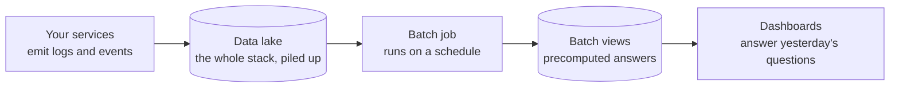
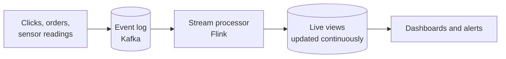
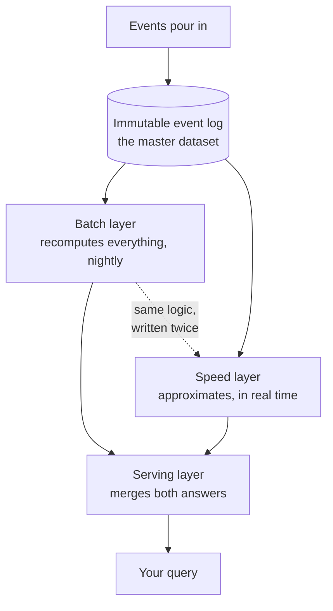
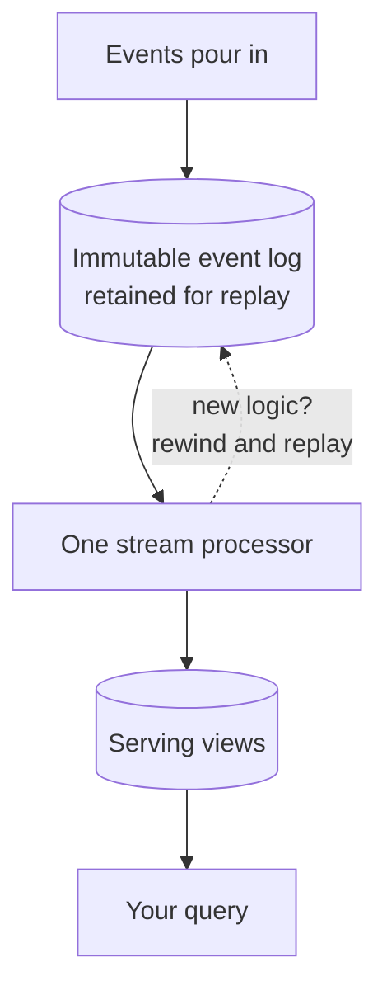

export const meta = {
  slug: 'stream-vs-batch',
  title: 'Stream vs. Batch: Processing Data at Scale',
  tier: 'advanced',
  order: 22,
  summary:
    'Event streams vs batch jobs, lambda vs kappa architectures, and how to choose the right one when the data never stops arriving.',
  estimatedMinutes: 18,
  difficulty: 4,
  topics: ['data processing', 'streaming'],
};

## Why this matters

Every system you've built so far answers questions about the present. Sooner or later somebody
asks about the past — "how many orders shipped last Tuesday?" — and about *right now* — "is
the checkout flow broken *this second*?" One question wants a settled, final answer. The other
wants an answer while the data is still arriving. Batch processing and stream processing are the
two families of tools for those two questions, and picking the wrong one is how you end up with
a fraud report that's twelve hours late, or a "real-time" dashboard that's really a cron job
with ambition.

<VideoCard videoId="XmmdXzTvn4s" title="Beyond Batch Processing: Streaming to Accelerate Value for Data | Amazon Web Services" source="Amazon Web Services" description="AWS explains the real value of processing data continuously instead of waiting on batches, with stateless/stateful processing and windowing basics." />

## The core distinction: the newspaper stack vs the live ticker

This lesson's running analogy has two halves. The first is a **stack of newspapers** delivered
to your door every morning: finite, complete, countable. You can read it in any order, re-read
page one, and know for certain when you've finished it. The second is the **live news ticker**
at the bottom of a 24-hour news channel: it never ends, you can't see tomorrow's headlines,
and if you blink, you missed one.

That is the whole distinction:

- **Bounded data** is the newspaper stack — a dataset with a known beginning and a known end.
  Yesterday's server logs. Last month's orders. It's all there, and it's not changing.
- **Unbounded data** is the ticker — an event stream with no end. Clicks, orders, sensor
  readings, arriving forever. You can only ever reason about *what has arrived so far*.

Batch processing reads the stack. Stream processing watches the ticker. Everything else in
this lesson — the tools, the architectures, the trade-offs — falls out of that one difference.

<VideoCard videoId="pOqQ-0cRWKU" title="Batch vs Realtime Stream Processing - A Deep Dive" source="The Geek Narrator" description="Deep-dive interview contrasting batch and realtime processing on latency, throughput, cost, idempotency, and schema evolution." />

## Batch: reading the morning stack

Batch processing is the older sibling, and its recipe hasn't changed in twenty years: collect
everything into a pile, run one big job over all of it on a schedule, write the results
somewhere queryable. The pile is usually a data lake or warehouse; the schedule is hourly,
nightly, or weekly; the job is **MapReduce** or, these days, **Spark**.

The canonical example: at 2 a.m., a Spark job reads the entire day's worth of order events,
joins them against the product catalog, and writes out yesterday's revenue report. Nobody
expects the answer at 2:01 a.m. — the job might take an hour — but when it finishes, the answer
is *complete and correct*, computed over every single record.

In newspaper terms: you wait for the full stack to be delivered, sit down with a red pen, and
read the whole thing before anyone is allowed to ask you a question. High **throughput**
(crunching terabytes in one job), high **latency** (answers are hours old by design).

Batch shines where correctness and completeness beat freshness: billing, financial reporting,
training machine-learning models over months of history, and — critically — **reprocessing**.
If you discover the revenue logic had a bug, you fix the job and re-run it over the whole
stack. The stack is still there. That's a superpower the ticker doesn't have for free.

<VideoCard videoId="TWYdLeJlc7I" title="Data Engineering Deep Dive: Batch Processing & Immutable Artifacts" source="deferstech" description="Walks through MapReduce internals, HDFS, Spark dataflow engines, and why immutable batch outputs make rollback safe." />

## Streams: watching the ticker

Stream processing flips the recipe: instead of waiting for the pile, you process each event
as it arrives. The events flow through a durable **event log** — **Kafka**, which you met in
the Message Queues lesson — and a stream processor like **Flink** reacts to each one,
keeps running state, and emits results continuously. Latency drops from hours to seconds or
less.

The catch is that the ticker forces you to answer questions the stack never asked. Three of
them are worth internalizing:

**Event time vs processing time.** Every headline on the ticker has two timestamps: the time
printed on the story (when the click *happened* — **event time**) and the moment it scrolled
past your screen (when your system *saw* it — **processing time**). They're different because
phones go offline, networks stall, and retries happen. Count by processing time and a click
from midnight lands in the morning's bucket. Count by event time and the buckets are right —
but you have to wait for stragglers, because the 11:59 p.m. headline might scroll past at
12:04 a.m.

**Windowing.** You can't total "all time" on a ticker that never ends, so you slice it into
**windows** — like clipping the ticker into segments and summarizing each one. **Tumbling
windows** are fixed, non-overlapping blocks (every 5 minutes). **Sliding windows** overlap
(the last 10 minutes, recomputed every minute). **Session windows** group bursts of activity
separated by gaps. Picking the window *is* picking the question.

**Watermarks.** Late headlines are a fact of life, so stream processors use **watermarks**: a
marker that says "we're now confident we've seen every event up to 9:00." Once the watermark
passes 9:00, the 8:55–9:00 window closes and its result is emitted — without waiting forever
for a headline that might never arrive. A watermark is a heuristic, not a promise: a straggler
arriving *after* the watermark is either dropped or routed to a late-data path. Set the grace
too tight and you lose data; too loose and your "real-time" answers are just batch with extra
steps.

A concrete pass through all three ideas: you're counting ad clicks in 5-minute **tumbling
windows**. The 9:00–9:05 window should close at 9:05 — but a click stamped 9:04:58
(**event time**) only reaches your processor at 9:05:03 (**processing time**) because the
user's phone was in a tunnel. With a 2-minute **watermark**, the window stays open until
9:07, the late click lands in the right bucket, and the count is correct. A click stamped
8:59 that arrives at 9:08 misses the watermark and goes to the late-data path. Every
streaming number you've ever trusted was produced by exactly this machinery.

Stream processing also has to survive crashes *mid-ticker* without double-counting or losing
state — Flink does this with periodic **checkpoints** of its state, so a failed worker
restarts from the last checkpoint and replays the log from there. Conceptually: if you doze
off during the broadcast, you rewind to where you remember and keep watching. That
log-replay trick will matter a lot in a moment.

<VideoCard videoId="rDT42hwD1ck" title="Stream Processing System Design: From Fundamentals to Real-Time Architecture" source="programmerCave" description="Builds stream processing from first principles: Kafka log brokers, CDC, event vs processing time, joins, and fault tolerance." />

## Lambda: the stack *and* the ticker, stapled together

In the early 2010s, Nathan Marz — then at Twitter — looked at the two approaches and decided
he wanted both: the completeness of batch and the freshness of streams. The result was the
**Lambda architecture**, described in his and James Warren's book *Big Data* (2015). It has
three layers:

- **Batch layer** — keeps the immutable master dataset and periodically recomputes **batch
  views** from scratch. Slow, but complete and correct — and if the logic had a bug, you just
  recompute.
- **Speed layer** — processes recent events incrementally for **real-time views**. Fast, but
  approximate: it only sees a slice of history.
- **Serving layer** — merges the two at query time. The batch views answer everything up to
  last night; the speed layer fills in the last few hours.

Back to the analogy: you keep the entire newspaper archive *and* watch the ticker, then staple
the two answers together whenever someone asks. It works. It also costs you something real:
**two implementations of the same logic** — a batch job and a streaming job that must agree
with each other forever. They drift. Somebody fixes a bug in one and not the other. And when
an answer looks wrong, you get to play detective: *which layer lied?* Lambda buys you both
freshness and completeness, and the price is operating two systems that do the same job
differently.

<VideoCard videoId="vOYpLg5uB2g" title="Lambda vs Kappa vs Data Streaming Platform — Which One Wins? | Modern Data Engineering Pipelines" source="Confluent Developer" description="Explains why Lambda architecture exists: batch layer for correctness plus speed layer for freshness, then its dual-codebase costs." />

## Kappa: burn the stack, keep the ticker

In 2014, Jay Kreps — one of Kafka's creators — published an essay questioning whether the
second system was ever worth it. His proposal, the **Kappa architecture**, is disarmingly
simple: *everything is a stream*. One event log, one stream-processing engine, no batch
layer at all.

The trick is the log-replay you saw earlier. If the log is **immutable** and retained long
enough, you can rebuild any view by replaying history through new code. Bug in the revenue
logic? Deploy the fix and rewind — reprocess the whole log with the corrected processor.
Need a brand-new view nobody asked for before? Run a new stream job over the old log. The
batch layer's superpower (reprocessing) turns out to live in the log, not in the batch job.

Kappa wins on simplicity: one codebase, one system to operate, no "which layer lied"
debates. But it has a hard requirement that Lambda doesn't: **the log must be kept long
enough to replay**. Retention becomes a first-class design decision — keep 7 days of log and
you can only ever rebuild 7 days of history. And for true bulk computation — scanning years
of data to train a model — a streaming replay is a slow, awkward way to do what a batch job
does naturally. Kappa replaces the batch layer only when your log retention covers your
reprocessing horizon.

<VsToggle
  title="Lambda vs Kappa: two ways to get fresh *and* correct"
  a={{
    label: "Lambda",
    title: "Batch layer + speed layer, merged at query time",
    points: [
      "The batch layer recomputes complete, correct views from the immutable master dataset — reprocessing is its native superpower",
      "The speed layer fills in the last few hours with fast, incremental, approximate results",
      "You maintain two implementations of the same logic that must agree forever — and debug 'which layer lied?' when they don't",
    ],
    note: "Pick it when you need full-history accuracy AND low-latency freshness, and can afford to operate two systems.",
  }}
  b={{
    label: "Kappa",
    title: "One stream processor over a replayable log",
    points: [
      "A single engine serves every query — one codebase, one system to operate",
      "New logic or bug fixes are handled by rewinding and replaying the immutable log through the updated processor",
      "Only works if the log is retained long enough to replay your full reprocessing horizon — retention is the architecture",
    ],
    note: "Pick it when the log can hold your history and you value simplicity over bulk-scan speed.",
  }}
/>

<VideoCard videoId="TW1e3AhdPTY" title="Big Data Kappa Architecture Explained" source="Thomas Henson" description="Shows how Kappa drops the batch layer entirely so Spark, Flink, and search all consume one streaming layer." />

## One problem, two solutions: counting ad clicks

Make it concrete. An advertiser asks: "how many clicks did my ad get in the last hour?"

**The batch answer:** every hour, a Spark job scans the click log, groups by ad, and
writes the counts. Exact to the click — and an hour stale. The advertiser adjusting
their budget at 3 p.m. is steering by the 2 p.m. numbers. For *money*, that's fine:
invoices get settled by the batch job, where every click is counted exactly once.

**The stream answer:** a Flink job counts clicks in 5-minute tumbling windows on
*event time*, with a 2-minute watermark. The advertiser watches a dashboard update
every few seconds and pauses a burning campaign before lunch. A click arriving 10
minutes late misses its window and lands in a late-data stream — the dashboard is
*approximately* right in real time, and the nightly batch reconciliation makes the
invoice exactly right.

Notice what just happened: the real production answer was a hybrid — streams for
operations, batch for money. That's the decision guide in action, and it's how most
serious ad platforms actually work. Freshness where it changes behavior, exactness
where it changes balances.

<VideoCard videoId="tFv2ydbD0Ys" title="Ad Metrics Collection System Design | Kafka, Flink, ClickHouse, Redis | Ad Click Aggregation" source="PartTimeEngineer" description="Designs ad click counting end-to-end: Flink stream aggregation with windowing, dedup, plus failure recovery and reconciliation." />

## Delivery semantics: the fine print on the ticker

The ticker raises one more question the stack never asks: when a headline scrolls past
*twice*, do you count it twice? Network retries, crashed workers, and replays all mean
stream processors routinely see the same event more than once. So every stream system
picks a **delivery semantic**:

- **At-most-once** — an event may be lost, but never counted twice. Fast, and fine for
  metrics where a dropped sample is statistical noise.
- **At-least-once** — every event is processed, possibly more than once. The workhorse
  default. Your processing logic must be **idempotent**: seeing the same click twice
  must not double-count it (dedupe keys, upserts instead of inserts).
- **Exactly-once** — processed once and only once, *as far as anyone downstream can
  tell*. In practice this is at-least-once plus idempotency plus careful state
  management — Flink's checkpointing gets you there within the stream processor, but
  the moment your job calls an external API, you're back to designing for duplicates.

This is the same guarantees conversation from the Message Queues lesson, now wearing a
compute hat. The practical rule carries over unchanged: assume at-least-once, make your
logic idempotent, and save "exactly-once" for the narrow paths where duplicates are
genuinely expensive.

<VideoCard videoId="SNVoVNNQ3wQ" title="External systems & data streaming | The Duchess & The Doctor #3 ft. Anna McDonald & Matthias J. Sax" source="Confluent Developer" description="Kafka experts dig into exactly-once versus retries, stateful snapshots, and correctness trade-offs in event-driven systems." />

## Failure modes: what breaks at 2 a.m.

Advanced means knowing how it fails. The two families fail differently:

- **Batch: the straggler.** Your Spark job is 99% done in twenty minutes, then one
  partition — one *key* with wildly more data than the others, the dreaded **skew** —
  takes another forty. Speculative execution (re-running slow tasks elsewhere) helps,
  but skew is a data problem, not a scheduling problem: sometimes you have to
  re-partition by a better key.
- **Streams: state that never stops growing.** A stream processor keeps state —
  "clicks per user in the last hour" — and state for keys that never go quiet grows
  forever. Production stream jobs need **state TTLs** and compaction, or the ticker
  slowly eats all your memory. Related: a watermark set too tight silently drops late
  data, and nobody pages you about data you never saw.
- **Lambda: the drift.** The batch layer and the speed layer implement the same logic
  in different code, and they will disagree — usually discovered as "the real-time
  number doesn't match yesterday's corrected number," which is exactly the moment
  someone asks you which one is right in front of a customer.
- **Kappa: the long replay.** Reprocessing a year of log through a new processor takes
  as long as it takes — hours or days — during which your shiny new view doesn't exist
  yet. Retention is a promise: keep less log than your reprocessing horizon and kappa
  quietly becomes "lambda without the batch layer to fall back on."

<VideoCard videoId="nm0DjhNk3Hc" title="Lambda vs. Kappa: The Battle for Real-Time Pipelines" source="CodeForData" description="Compares Lambda and Kappa, covering dual-codebase drift and log-replay reprocessing costs." />

## How to choose: a decision guide

There's no universally right answer, but the questions that pick one are refreshingly
concrete:

- **How fresh must the answer be?** Seconds or sub-second — fraud detection, live
  monitoring, real-time recommendations — that's the ticker, go streaming. If yesterday's
  numbers are fine — billing, daily reports, ML training — the stack is cheaper and simpler.
- **How often does the logic change?** If metric definitions get corrected regularly,
  you need cheap reprocessing: batch, or kappa with a long-retained log.
- **How much history do you scan at once?** Petabyte-scale scans over years of data are a
  batch job's home turf (Spark exists for exactly this). A continuous trickle of events is
  a stream processor's.
- **What's your complexity budget?** Lambda is two systems wearing a trench coat. Don't
  pay for it unless *both* full-history accuracy and low-latency freshness are
  non-negotiable. Most teams that think they need lambda actually need "streams for the
  live stuff, one nightly batch job for the reports" — and that's a fine, boring,
  operable system.

And one connection worth making explicit: the durable log at the heart of both streaming
architectures is the same Kafka you studied in the Message Queues lesson. There, it was a
buffer between producers and consumers. Here, it's the system of record you compute on —
and, in kappa's case, the thing you rewind when you need a second chance.

The cheat sheet, if you want it on one slide:

| | Batch | Stream |
| --- | --- | --- |
| Data shape | Bounded — the newspaper stack | Unbounded — the live ticker |
| Latency | Minutes to hours | Milliseconds to seconds |
| Reprocessing | Native superpower: re-run the job | Replay the retained log |
| Hard parts | Skew, stragglers, scheduling | Event time, state growth, late data |
| Reach for | Spark, MapReduce | Kafka + Flink |

<VideoCard videoId="7M_ato44Lvw" title="Batch vs Streaming Explained for Data Engineering" source="TechLambda" description="Practical decision guide: when batch pipelines win, when streaming is worth the cost, and why hybrid architectures are common." />

## Takeaways

1. **Bounded vs unbounded** is the core distinction: batch reads a finished dataset (the
   newspaper stack); streams process an endless flow (the live ticker).
2. Batch gives you **high throughput and complete, reprocessable answers** at the cost of
   latency — Spark jobs on a schedule. Streams give you **low latency** at the cost of
   dealing with event time, windowing, and late data.
3. **Watermarks** are the stream processor's answer to late events: a declared cut-off
   ("we've seen everything up to 9:00") that lets windows close — a heuristic, not a
   guarantee.
4. **Lambda** merges batch and speed layers for freshness plus completeness, priced in
   duplicated logic and operational complexity. **Kappa** drops the batch layer entirely
   and replays a retained immutable log — simpler, but only as good as your retention.

<Quiz
  lessonSlug="stream-vs-batch"
  questions={[
    {
      question: "In this lesson's analogy, the live news ticker represents...",
      options: [
        "The serving layer of a Lambda architecture",
        "A bounded dataset, like yesterday's server logs",
        "An unbounded data stream that never ends",
        "A nightly Spark job that precomputes reports",
      ],
      correctIndex: 2,
    },
    {
      question:
        "Some click events arrive four minutes after the window they belong to has closed. What do watermarks let the stream processor do?",
      options: [
        "Declare a cut-off time up to which events are assumed seen, so windows can close without waiting forever",
        "Pause the event log until every straggler has arrived",
        "Retroactively rewrite the results of closed windows for free",
        "Guarantee that no event will ever arrive late",
      ],
      correctIndex: 0,
    },
    {
      question: "A team running a Lambda architecture changes how a metric is computed. What must they do to stay correct?",
      options: [
        "Delete the serving layer and query the event log directly",
        "Update and re-run both the batch job and the streaming job, so the two layers keep agreeing",
        "Only update the batch layer — the serving layer backfills the speed layer",
        "Only update the speed layer — the batch layer recomputes itself automatically",
      ],
      correctIndex: 1,
    },
    {
      question: "Kappa architecture can fully replace a batch layer only when...",
      options: [
        "The stream processor runs on more machines than the batch cluster had",
        "Events arrive in perfect timestamp order, so watermarks are unnecessary",
        "The serving layer caches every historical query result",
        "The immutable event log is retained long enough to replay the full history through new logic",
      ],
      correctIndex: 3,
    },
  ]}
/>

---

## Go deeper

Want to keep pulling this thread? These talks and tutorials go further than we did here:

- [Turning the database inside out with Apache Samza](https://www.youtube.com/watch?v=fU9hR3kiOK0) — Martin Kleppmann, Strange Loop 2014. The durable log as ground truth — the stream-first mindset behind Kafka.
- [Stephan Ewen, data Artisans](https://www.youtube.com/watch?v=4U9m5SwCtK8) — Stephan Ewen, theCUBE @ Flink Forward 2018. Stream vs batch time and consistency models; batch as a special case of streaming.
- [Kafka Crash Course – Hands-On Project](https://www.youtube.com/watch?v=B7CwU_tNYIE) — TechWorld with Nana (~1h 08m). The streaming half, hands-on — producers, consumers, and why a log beats a nightly job for data that's always moving.
- [System Design for Beginners Course](https://www.youtube.com/watch?v=m8Icp_Cid5o) — freeCodeCamp.org (~1h 25m). Skip to the MapReduce chapter (~0:34:37) for the batch half — big parallel jobs inside the same system Gaurav Sen designs live.

## Sources & further reading

- Martin Kleppmann, *Designing Data-Intensive Applications* (O'Reilly, 2017), Ch. 10
  ("Batch Processing") and Ch. 11 ("Stream Processing") — the canonical treatment of both
  families, including event time, windows, and exactly-once semantics.
- Nathan Marz & James Warren, *Big Data: Principles and Best Practices of Scalable
  Realtime Data Systems* (Manning, 2015) — introduces the Lambda architecture.
- Jay Kreps, "Questioning the Lambda Architecture" (2014 essay) — the case for Kappa:
  streams plus a replayable log instead of separate batch and speed layers.
