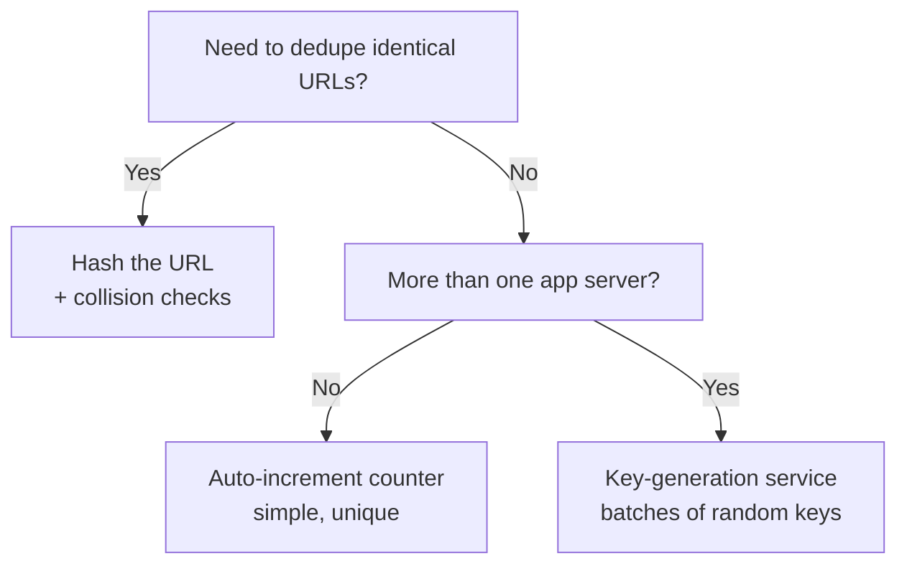
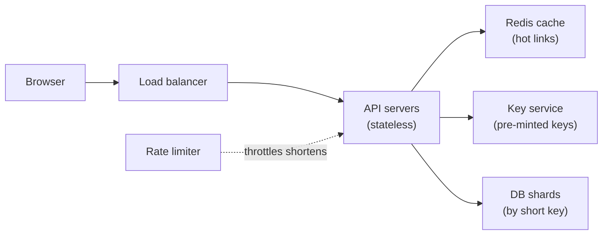
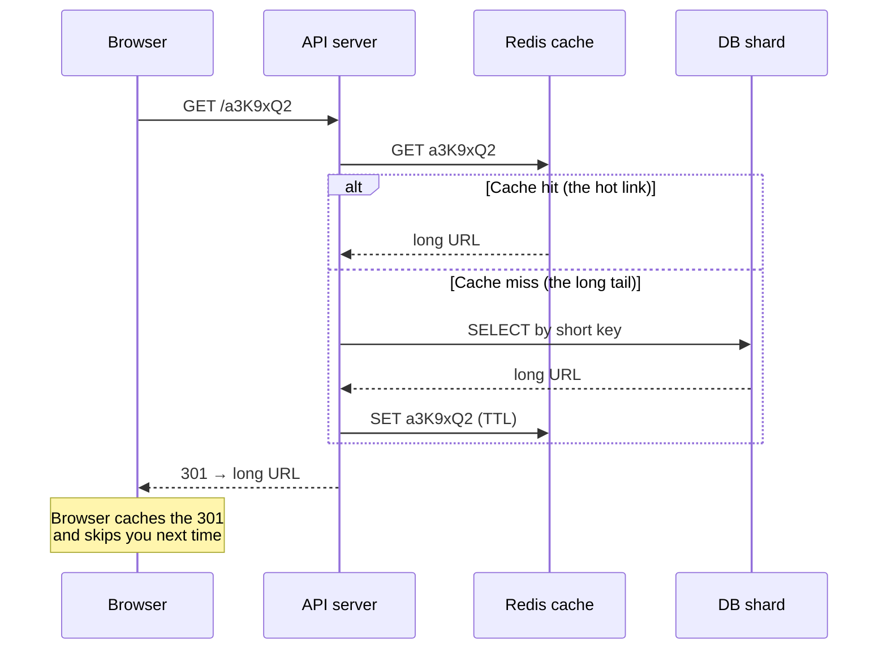

export const meta = {
  slug: 'url-shortener',
  title: 'Design a URL Shortener',
  tier: 'intermediate',
  order: 8,
  summary:
    'Our first case-study lesson: apply hashing, sharding, caching, and rate limiting to a real interview classic.',
  estimatedMinutes: 18,
};

## Why this matters

"Design TinyURL" is the interview question that launched a thousand whiteboard sessions. It's
also a genuinely good system to design, because it's small enough to hold in your head and
big enough to need almost every tool in the distributed-systems drawer: unique ID generation,
partitioning, caching, and abuse protection.

This lesson runs like the interview itself. You'll clarify the requirements first (the step
everyone skips and everyone regrets skipping), do the back-of-envelope math, then make the
hard decisions — starting with the one that makes or breaks this design: how do you mint the
short keys?

## First, clarify the problem

A URL shortener does two things and only two things:

1. **Shorten** — accept a long URL, return a short one. `POST /shorten` with
   `https://example.com/some/absurdly/long/path?with=query&params=too` returns
   `https://sho.rt/a3K9xQ2`.
2. **Redirect** — accept a visit to the short URL and send the browser to the long one with
   an HTTP redirect.

Everything else is a follow-up question for your interviewer, not a core requirement:

- **Traffic?** Let's say 100 million new URLs a month, 10 redirects per URL on average.
- **How short?** 7 characters is the classic answer — enough room, still tweetable.
- **Analytics?** Nice-to-have. Mention it, then park it: click counting is a separate
  problem with its own pipeline.
- **Custom aliases or expiring links?** Out of scope for now. Don't gold-plate the design
  before the basics work.

Notice what we did not ask: nothing about frameworks, nothing about cloud providers.
Interviewers grade you on decisions and trade-offs, not on brand names.

## Picture a coat-check counter

This lesson's running analogy: a coat-check counter at a busy theater. You hand over your
bulky coat (the long URL) and the attendant hands you a small numbered ticket (the short
key). The coat goes on a rack in the back room (the database). When you come back, you
present the ticket and get your coat — the redirect. The mapping, ticket to coat, is the
whole system.

- **The short key** is the ticket number: tiny, unique, all you need to carry.
- **The database** is the rack room: rows and rows of coats, organized by ticket number.
- **Key generation** is the attendant writing the next ticket — and as you'll see, *how*
  the attendant picks the numbers turns out to be the entire design.

Keep the attendant in mind. They're about to have a very bad evening.

## Back-of-envelope math

Two minutes of arithmetic now saves you from designing for the wrong decade. Start with
what the interviewer gave you: 100 million new URLs per month.

**Writes:** 100,000,000 ÷ (30 × 24 × 3,600 seconds) ≈ 40 new short URLs per second. Call
peak traffic 2–3× the average, so size for ~100 writes/sec. A single database could handle
that — writes are not your problem.

**Reads:** you assumed 10 redirects per shortened URL, so ~400 reads/sec on average,
~1,000/sec at peak. Still modest — but reads outnumber writes 10 to 1, which tells you
where to spend your engineering: the redirect path deserves the caching budget.

**Storage for 10 years:** 100M × 12 months × 10 years = 12 billion URLs. Each record holds
the long URL (say ~100 bytes on average), the 7-character key, an owner ID and timestamps
— call it 500 bytes. 12B × 500 bytes ≈ 6 TB. That fits on a handful of commodity disks,
but no single machine should hold the only copy, so you'll shard it.

The theme of this math: nothing here is exotic. The scale is a rounding error for a real
database cluster — which is exactly why this problem is about *decisions*, not heroics.

## The key-generation problem

Here's the decision that earns the offer. You need 12 billion unique 7-character tickets,
minted across many servers, with no duplicates and no central bottleneck. Three strategies
exist. The attendant is about to try all of them.

**Strategy 1: Hash the URL.** Run the long URL through a hash (say MD5), take the first 7
characters of the base62 encoding. Base62 is `a–z`, `A–Z`, `0–9` — 62 symbols, so 7
characters give you 62⁷ ≈ 3.5 trillion possible tickets. Big perk: the same URL always
produces the same ticket, so you get free deduplication — shorten the same link twice, get
the same key back, store one row. The catch: with billions of keys in a 3.5-trillion
keyspace, collisions are not a freak accident, they're a Tuesday. Every insert has to check
"is this ticket already taken by a *different* URL?" and rehash with a salt when it is.
Collision checks mean a database read on every write, and the hot path gets slower exactly
as you scale.

**Strategy 2: Auto-increment counter.** Keep one counter in the database, hand out 1, 2,
3… and base62-encode it. Dead simple, never collides, tickets stay short. Two problems.
First, the counter is a single choke point: every shorten request on every server queues up
for one number — your "distributed" system has a single-file line at the ticket window.
Second, the tickets are *predictable*: anyone can walk `sho.rt/1`, `sho.rt/2`,
`sho.rt/3`… and scrape every private link your users ever shortened. (Real shorteners have
been bitten by exactly this.) You'd never ship enumerable keys for user content.

**Strategy 3: A dedicated key-generation service (KGS).** Run a small fleet of servers whose
only job is minting tickets. Each KGS server pre-generates random 7-character keys, marks
them used in its own table, and hands them out. Your app servers fetch *batches* of, say,
1,000 keys at a time and spend them locally — no coordination, no collision checks, no
hot-path database call. Keys are random, so nobody can enumerate them. The costs: you now
operate one more service, and if an app server crashes holding an unused batch, those
tickets are wasted. But with 3.5 trillion tickets and 12 billion coats, waste is the
cheapest problem on the list.

<StepThrough
  title="Three ways the attendant hands out tickets"
  nodes={[
    { id: "hash", label: "Hash the URL", x: 90, y: 150, w: 120 },
    { id: "counter", label: "Counter", x: 240, y: 150 },
    { id: "kgs", label: "Key service", x: 390, y: 150 },
  ]}
  edges={[
    { from: "hash", to: "counter" },
    { from: "counter", to: "kgs" },
  ]}
  steps={[
    {
      title: "Strategy 1: hash the URL",
      caption: "Same URL always yields the same ticket, so duplicates collapse for free. But collisions are inevitable at billions of keys, and every insert pays for a collision check against the database.",
      highlight: ["hash"],
    },
    {
      title: "Strategy 2: auto-increment counter",
      caption: "One counter hands out 1, 2, 3… — never collides, trivially short. But every server queues at one ticket window (a bottleneck and a single point of failure), and predictable tickets let strangers enumerate your users' private links.",
      highlight: ["counter"],
    },
    {
      title: "Strategy 3: dedicated key-generation service",
      caption: "KGS servers pre-mint random keys; app servers grab batches of 1,000 and spend them with zero coordination. Random keys can't be enumerated, and the hot path never touches the database for a key. You run one more service — worth it.",
      highlight: ["kgs"],
    },
    {
      title: "What the interviewer wants to hear",
      caption: "Start with the counter to show you see the simple answer, reject it for the bottleneck and the enumeration attack, then land on the KGS. Mention hashing only if they ask about deduplicating identical URLs — it optimizes storage at the cost of collision handling.",
      highlight: ["hash", "counter", "kgs"],
    },
  ]}
/>

## Sharding by key

With the ticket-minting settled, the coats still need rack space. 12 billion rows and 6 TB
means one database won't do — so shard by the short key. Hash the 7-character ticket,
modulo the number of shards, and each row lives on exactly one shard. Lookups are single-
shard reads: the ticket tells you which rack room to walk into, no scatter-gather.

In coat-check terms, the theater got popular and opened ticket counters numbered 1 through
8. Your ticket's number decides which counter holds your coat. Add a ninth counter and
rehash — or better, use consistent hashing (the sharding-strategies lesson covers the
mechanics) so only a fraction of coats move.

## Caching hot links

Remember the 10-to-1 read ratio: the redirect path is where the traffic lives, and a small
fraction of links gets most of the clicks — the viral tweet, the product launch. That's the
80/20 rule doing you a favor. Put a cache (Redis, Memcached — pick your fighter) in front
of the database and store ticket → long URL with a TTL.

The redirect flow becomes: check the cache, and on a hit, answer in ~1 ms without waking
the database. On a miss, read the shard, populate the cache, and redirect. Hot links stay
warm in memory; the long tail of forgotten links costs you nothing. And since a redirect
is just a lookup, cache invalidation is almost a non-issue — a short URL's destination
rarely changes.

<PacketFlow
  stages={["Browser", "API"]}
  servers={["db-shard-1", "db-shard-2", "db-shard-3"]}
  requestLabel="POST"
/>

The shorten path above: your POST arrives, the API spends a pre-fetched ticket from its
local batch (refilled from the key service in the background — no per-request
coordination), and the row lands on the shard its key hashes to. Now the redirect path,
where the cache earns its keep:

<PacketFlow
  stages={["Browser", "API"]}
  servers={["Redis cache", "db-shard-1", "db-shard-2"]}
  requestLabel="GET"
/>

## Rate limiting

One loose end, and it's the one the attendant dreads: a spammer scripting shorten requests
at 10,000 a minute. Each fake URL burns a ticket, a database row, and rack space —
multiplied forever, that's your keyspace and your storage gone to junk.

The fix is the rate-limiting lesson applied directly: cap shortens per user or per IP
(say 50 a day for anonymous users, more for accounts). 429 the abusers, as the
rate-limiting lesson's token bucket would. Legitimate users never notice; the spammer's
script dies at the door. You might also require sign-in for bulk shortening — a little
friction aimed precisely at the people who deserve it.

A decision tree for the whiteboard, if the interviewer asks you to justify the pick:

## Failure modes: the attendant's bad evening

No design survives contact with production without a failure plan. Walk through what
breaks:

- **The key service goes down.** App servers keep shortening from their local batches —
  that's the whole point of batching. Size batches for hours of runway (a batch of 100,000
  keys at ~100 shortens/sec buys you ~17 minutes; size up from there), alert loudly, and
  fix the service. If batches run dry, shortens degrade — but redirects never notice,
  because the redirect path doesn't touch the KGS.
- **A database shard goes down.** Every short key on that shard stops resolving. Sharding
  without replication is just distributing your outages, so each shard gets replicas
  (the replication-consistency-models lesson covers the trade-offs). The redirect path
  fails over to a replica; the cache absorbs most of the read spike in the meantime.
- **A hot link's cache entry expires.** A thousand browsers ask for the same viral link in
  the same second, all miss the cache, and all stampede the same shard — the thundering
  herd. Mitigations: jitter the TTLs so entries don't expire in lockstep, or coalesce
  concurrent misses so one database read serves the whole crowd.
- **The keyspace runs out.** It won't — 3.5 trillion tickets against 12 billion coats is
  300× headroom — but if the business ever 100×'d, you'd add an 8th character to new
  keys. Old 7-character links keep working; the ticket printer just starts issuing longer
  tickets. That's a migration, not a redesign.

## Interview follow-ups (they will ask)

Once the core design lands, interviewers probe the parked requirements:

- **Click analytics** — you chose 301s, so browsers skip you on repeat visits and you see
  nothing. To count clicks, switch to 302 (every click hits your API) and push events to
  a message queue for async aggregation — the message-queues lesson's home turf.
- **Custom aliases** (`sho.rt/my-talk`) — these bypass the KGS entirely: check the alias
  isn't taken (a unique constraint on the key column does this atomically), then insert.
  Vanity keys are user input, so validate and rate-limit them harder.
- **Expiring links** — store an `expires_at` timestamp, check it on redirect, and lazily
  delete or archive expired rows. A nightly sweeper reclaims the storage; the tickets
  themselves are never reused, because a recycled ticket could resurrect someone's old
  link.

## The full architecture

Put it together and the design fits on one diagram — which is the point of the whole
exercise:

And the redirect itself, down to the HTTP semantics. Use **301 Moved Permanently**: it
tells the browser "remember this mapping," so repeat visits skip your servers entirely —
free caching at the edge. The trade-off is honesty: a 301 means you never see those repeat
clicks, so if you ever want analytics, you'd switch to **302 Found** and count every
visit yourself. Choose 301 for performance, 302 for observability. Don't let anyone tell
you it's not a trade-off.

## Takeaways

1. Clarify requirements before designing: shorten + redirect is the core; analytics,
   custom aliases, and expirations are follow-up questions, not day-one scope.
2. The key-generation strategy is the crux of this design. A shared counter bottlenecks
   and produces enumerable keys; hashing gives free dedup but needs collision handling; a
   dedicated key-generation service handing out batches of random keys is the scalable
   answer.
3. Back-of-envelope math (100M URLs/month → ~40 writes/sec, 10:1 reads, 6 TB over 10
   years) tells you the redirect path and its cache deserve the engineering budget.
4. Shard by short key so every lookup is a single-shard read; cache hot links in Redis so
   the database only serves the long tail.
5. Rate-limit the shorten endpoint — an unguarded ticket window gets emptied by spammers
   burning your keyspace and storage.

<Quiz
  lessonSlug="url-shortener"
  questions={[
    {
      question: "100 million new URLs per month works out to roughly how many shorten requests per second?",
      options: ["400 per second", "40 per second", "4,000 per second", "400,000 per second"],
      correctIndex: 1,
    },
    {
      question: "Why is a plain auto-increment counter a poor key generator for a public shortener?",
      options: [
        "The keys collide with hashed keys issued by other shorteners",
        "Base62 encoding cannot represent sequential numbers",
        "Counters require a cache in front of them, and caches are forbidden in interviews",
        "Sequential keys let anyone enumerate every shortened link — plus the counter is a single bottleneck",
      ],
      correctIndex: 3,
    },
    {
      question: "In the key-generation-service (KGS) design, what does an app server do when it needs a new short key?",
      options: [
        "It hashes the long URL and checks the database for collisions",
        "It asks the KGS fleet to mint one key synchronously, waiting for the reply",
        "It takes one from its locally held batch of pre-minted keys, fetching a new batch only when empty",
        "It increments a counter stored in Redis",
      ],
      correctIndex: 2,
    },
    {
      question: "A spammer is scripting 10,000 shorten requests a minute. Your first line of defense is...",
      options: [
        "Rate limiting the shorten endpoint per user/IP",
        "Making the short keys longer",
        "Adding more database shards",
        "Switching redirects from 301 to 302",
      ],
      correctIndex: 0,
    },
  ]}
/>

---

## Go deeper

Want to keep pulling this thread? These talks and tutorials go further than we did here:

- [System Design : Design a service like TinyUrl](https://www.youtube.com/watch?v=fMZMm_0ZhK4) — Gaurav Sen, YouTube. Hashing vs pre-minted keys, plus caching, load balancers, and capacity math.
- [Design a URL Shortener — Full System Design Interview Walkthrough (bit.ly)](https://www.youtube.com/watch?v=DjWBfEyEsFU) — systemdr, YouTube. The full interview arc: clarify, estimate, API, data model, and cache strategy.

## Sources & further reading

- Bitly Engineering blog (blog.bitly.com) — engineering posts on scaling their URL-shortening infrastructure.
- Martin Kleppmann, *Designing Data-Intensive Applications* (O'Reilly, 2017), Ch. 5 (Replication) and Ch. 6 (Partitioning) — the theory behind the sharding and replica decisions in this lesson.
- R. Fielding & J. Reschke, RFC 7231 §6.4.2 (2014) — the semantics of 301 Moved Permanently.
