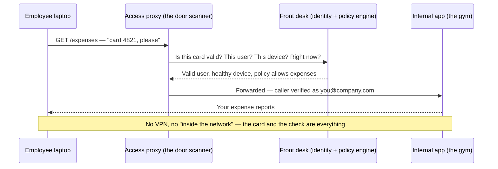
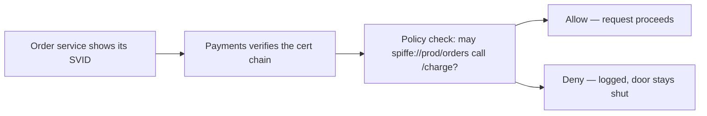

export const meta = {
  slug: 'zero-trust-security',
  title: 'Zero Trust: Never Trust, Always Verify',
  tier: 'advanced',
  order: 36,
  summary:
    'The castle-and-moat network is dead: why modern systems authenticate and authorize every single request, how workload identity and mutual TLS make it work, and what it costs when the front desk goes down.',
  estimatedMinutes: 18,
  difficulty: 4,
  topics: ['security'],
};

## Why this matters

An attacker phishes one employee's VPN password on a Tuesday afternoon. By Tuesday night
they are inside your "trusted" corporate network — and from here, nothing asks who they
are again. The file server, the build system, the customer database: every one of them
assumed that anyone on the inside belongs there. This is not a hypothetical. It is the
shape of half the breach reports you have ever read: one stolen credential, then free
movement through a network that trusted its own hallways.

Zero trust is the industry's answer, and it is beautifully simple to state: stop trusting
the hallway. Authenticate and authorize every request, from every caller, every time —
whether it comes from a laptop in a coffee shop or a service three hops deep in your own
data center.

It also comes with its own brand-new way to ruin your week. In a zero-trust system,
identity infrastructure is load-bearing: let one certificate expire and every service in
your fleet can stop talking to every other service in the same instant. In September
2021, the expiration of a single widely-used root certificate broke TLS for millions of
older devices overnight. You are trading one class of catastrophe (the breached
perimeter) for another (the expired credential) — and this lesson is about making that
trade deliberately, with your eyes open.

<VideoCard videoId="PTpkr2N5S2U" title="CompTIA Security+ Zero Trust Architecture (1.2)" source="Rich & Resourceful" description="Opens with the Colonial Pipeline breach, then shows how zero trust stops one stolen credential from toppling everything." />

## The hotel with one guard

This lesson's running analogy: a hotel. The old-school hotel has one guard at the front
entrance. Show a room key once — or just walk in looking confident — and every interior
door stands open: the kitchen, the cash office, other guests' rooms, the roof. Say the
mapping out loud, because the rest of the lesson hangs on it: **the front-door guard is
your VPN and firewall, and the unlocked hallways are your internal network.** This is the
perimeter model, sometimes called castle-and-moat. Once you are past the guard, you
are trusted. Every door assumes the guard did their job.

The problem is that guards get fooled. Phishing, a compromised vendor laptop, a
misconfigured firewall rule — any of these puts an attacker in the hallway, and the
hallway has no more questions to ask. The 2013 retail breaches taught this the painful
way: attackers entered through a third-party vendor's remote access and then wandered a
flat internal network until they found the payment systems. The guard checked one
credential, once, at the door. After that, trust was free.

<VideoCard videoId="S3MwWi35zhs" title="Why Perimeter Security Failed | Zero Trust Explained" source="CyberSecurityByDesign" description="Walks through the castle-and-moat model: one guarded edge, flat interior, and how a single breach reaches everything." />

## The hotel that checks your card at every door

Now picture the zero-trust hotel. Your key card is scanned at *every* door — the
elevator, your floor's hallway, your room, the gym, the business center, even the ice
machine room. Each scanner radios the front desk: "Card 4821 wants the gym at 11 p.m. —
allowed?" The front desk checks the card's validity, its expiry, whether this guest is
allowed in the gym, and whether anything looks odd about the request. Then the door
opens. Or it doesn't.

Here is the part that makes people uncomfortable: **the front desk never remembers your
face.** It does not matter that you have been a guest for six nights, or that the
scanner saw you an hour ago. Every door, every time, fresh check. No trusted hallways.
That discomfort is the entire philosophy, and it has a formal definition.

NIST Special Publication 800-207, the canonical reference, defines zero trust around one
core tenet: **no implicit trust is granted based on network location**. Being "inside"
the corporate network, the VPC, or the data center buys you nothing. Every access
decision authenticates the requester, authorizes the specific action, and assumes the
network is already compromised ("assume breach"). The hallway is treated as hostile
territory, even when you own the building.

The front desk clerk never sleeps, never recognizes you, and never takes your word
for it. Annoying? Deeply. That is rather the point.

<VideoCard videoId="c8A8vgAZrag" title="The Real-Time Verification System Behind Zero Trust" source="CyberTechHaus" description="Explains the policy engine and enforcement points that re-verify every access request in real time — every door, every time." />

## Identity is the new front desk

In the old hotel, the front desk mostly dealt with humans. In the zero-trust hotel, the
front desk's hardest job is the *staff*: the hundreds of services calling each other all
day. A human gets a key card at check-in; a workload needs the same thing — a
cryptographic identity it can present at every door. This is **workload identity**, and
the industry standard for it is **SPIFFE** (Secure Production Identity Framework for
Everyone), with **SPIRE** as its reference implementation.

A SPIFFE identity is issued as an **SVID** — a SPIFFE Verifiable Identity Document,
usually a short-lived X.509 certificate carrying a name like
`spiffe://prod/payments/api`. Read that as the service's key card: it says *who* the
caller is (the payments API in prod, not just "some process on host 10.0.4.12"), it is
signed by an authority the building trusts, and it expires in hours, not years. When a
service is compromised or decommissioned, its cards simply stop being minted — no frantic
hunt through config files for a shared password.

For humans, the equivalent of the every-door scanner is the **identity-aware proxy**.
Google's BeyondCorp is the famous production example: Google deleted the corporate VPN
and put internal applications behind access proxies that check *who you are* and *the
health of your device* on every single request, from anywhere on the internet. There is
no "inside" anymore — a request from a Google office and a request from a café get the
exact same interrogation. Cloudflare Access sells the same shape as a product. The
mapping: the proxy is the bouncer at each door who radios the front desk instead of
waving regulars through because he recognizes their jackets.

Notice what disappeared: the VPN. There is no moat because there is no castle. The
application never sees an unauthenticated request — the proxy either vouches for the
caller or the request never arrives.

<VideoCard videoId="5eDVGSZ7ynM" title="Identity Is the New Perimeter | Zero Trust Explained" source="CyberSecurityByDesign" description="Uses a hotel keycard to show why verified identity — not network location — now decides who gets in." />

## mTLS: the staff show their cards to each other

Users are the easy half. The harder half is service-to-service traffic: your order
service calls payments, payments calls fraud-check, fraud-check calls a database. In the
old hotel, the kitchen staff wandered everywhere on a nod. In the zero-trust hotel, the
line cook's card gets scanned at the pantry door too.

The mechanism is **mutual TLS (mTLS)**: not just the client verifying the server's
certificate (normal TLS), but both sides presenting certificates to each other. The
order service shows its SVID; the payments service verifies the signature chain *and*
checks policy — "is `spiffe://prod/orders` allowed to call my charge endpoint?" Identity
answers *who is calling*; policy answers *whether this caller may do this thing*. That
is the authN/authZ split from [the earlier lesson](/lesson/authn-authz), now applied to every hop between
machines, not just at the edge.

Short lifetimes do quiet, enormous work here. A database password that lives for a year
is a treasure worth stealing; an SVID that expires in four hours is barely worth the
effort, because by the time an attacker figures out how to use it, the front desk has
stopped honoring it. Revocation — the hard problem with JWTs you met in the auth lesson —
matters less when credentials die of old age on their own.

SPIRE is the machinery that makes this survivable at scale: it attests each workload
("yes, this process really is the payments API, I checked its container image and node")
and mints fresh SVIDs automatically, so no human is hand-issuing certificates at 2 a.m.
Without that automation, mTLS across hundreds of services is a paperwork nightmare. With
it, it is plumbing.

<VideoCard videoId="qPjFV7Zbt8w" title="mTLS Explained: The 30-Year-Old Fix Nobody Used" source="Devsplainers" description="Breaks down the mutual TLS handshake step by step, showing how services present certificates to each other." />

## Least privilege, and secrets that die young

Every hotel has a housekeeping master key, and every attacker dreams about it. In your
systems, the master keys are the long-lived, over-broad credentials: the database
password from 2019 that half the services share, the API key with admin scope sitting in
a config file, the service account that can read every bucket "just in case." Zero trust
has no patience for these. **Least privilege** means each card opens exactly the doors
its holder needs — the minibar restocker's card does not open the cash office — and
nothing more.

The practical pattern is **dynamic secrets**: instead of handing out a password that
lives for years, a broker (the HashiCorp Vault shape, now copied by every cloud
provider's secrets manager) mints a credential on demand, valid for minutes, scoped to
one job. A batch job asks for database access, gets a username and password valid for
fifteen minutes, does its work, and the credential rots. Steal it from a log file
tomorrow and it is already garbage. Rotation stops being a quarterly fire drill and
becomes something the front desk does continuously, while you sleep.

There is a second-order win here that security teams love and auditors *adore*: every
denied door-swipe is logged. In the old hotel, nobody recorded who wandered the
hallways. In the zero-trust hotel, the front desk has a timestamped record of every
check — granted and denied. When something goes wrong, you are not reconstructing from
vibes; you have the ledger.

<VideoCard videoId="4ebOexB3GHE" title="Secrets Management: Vault vs AWS Secrets Manager (Rotation & CI/CD)" source="Merge Ready" description="Compares Vault and AWS Secrets Manager on rotation, short-lived credentials, and least-privilege access control." />

## Micro-segmentation: shrinking the blast radius

Now for the payoff, in numbers: take a flat network with 120 services and one
compromised credential — say an attacker lifts a valid service token. In the old hotel,
that token is a hallway pass: the attacker can probe all 120 services, because nothing
between them asks questions. Expected reachable targets: **120 out of 120**.

Now give every service an identity and a policy that allows only its genuine callers —
the payments API accepts traffic from the order service and the refunds service, and
from nothing else. The same stolen token now opens exactly the doors its policy names:
perhaps 3 out of 120. You have not prevented the theft — assume breach, remember — but
you have divided the blast radius by forty. **Blast radius math is the whole business
case for micro-segmentation**: exposure equals the number of resources a single
compromised credential can reach, and per-request authorization is how you drive that
number toward the minimum.

Continuous verification tightens it further. The card is not checked once at check-in;
it is checked at every door. A token stolen at noon and used at 2 a.m. from an
unrecognized device can be challenged or denied mid-session, because each new request is
a new decision with fresh context. The old model asked "are you a guest?" once. The new
model asks "are you still *this* guest, doing something *this* guest is allowed to do,
*right now*?" — every time.

<VideoCard videoId="Rsn6xFAZ2Ys" title="Micro-Segmentation Explained: How Zero Trust Stops Lateral Movement" source="CyberSecurityByDesign" description="Hotel keycard tour of micro-segmentation: small zones, gated corridors, and how they contain lateral movement." />

## The price of paranoia

Nothing this thorough is free. Here is the bill, and you should budget for all of it
before you start.

**Certificate management becomes load-bearing.** In the old world, an expired cert meant
one website showed a browser warning. In the zero-trust hotel, the front desk *is* the
card-minting machine: if issuance breaks or a root expires, every door in the building
stops opening at once. September 2021 is the cautionary tale — when the DST Root CA X3
root certificate expired, millions of older devices lost the ability to validate TLS,
and services that had never thought about their trust chains broke simultaneously.
The lesson is operational, not theoretical: automate issuance and rotation (this is what
SPIRE and ACME-style tooling exist for), alert on expiry the way you alert on disk
space, and test what happens when the mint goes down.

**Latency has a new line item.** A TLS 1.3 handshake costs one round trip; verifying a
token against a *local* policy cache typically lands in the single-digit milliseconds.
That word "local" is doing heavy lifting — a policy check that phones home to a central
server on every request will show up in your p99 latency and then in your incident
reviews. The standard answer is to cache policy decisions at the enforcement point and
keep the hot path local, accepting that a cached "allow" might lag a revocation by
seconds. Which, again, is why the credentials themselves are short-lived: the cache
window and the credential lifetime bound each other.

**Debugging gets a new first question.** "Is it the network or is it auth?" becomes the
opening line of every incident, because from the caller's side they look identical: the
request just fails. Teams that run zero trust learn to read certificate chains and
policy decision logs the way previous generations learned to read packet captures.
Invest in that tooling *before* the 2 a.m. page — an "access denied" with no reason
attached is the new "connection refused," and it is exactly as fun to debug blind.

**The front desk is a single point of failure.** This is the honest trade at the heart
of the design: you eliminated hundreds of implicit trust decisions and concentrated
them in the identity provider and policy engine. If those go down, nobody gets through
any door. So you engineer them like the critical path they are — multi-region,
heavily cached enforcement points, and an explicit, deliberate choice about
fail-closed versus fail-open for each door. (Fail-closed is the secure default; just
make sure you have chosen it on purpose for the door that pages *you*.)

None of this is an argument against zero trust. It is the argument for going in with a
budget: the perimeter model failed *silently* — breaches you discovered months later —
while zero trust fails *loudly*, at the front desk, where you can see it. Loud failures
are a feature. They are also, at 2 a.m., extremely loud.

<VideoCard videoId="6reox4sqaUc" title="Zero Trust: From Revolution to Reality" source="Threat Talks" description="Zero-trust architect Dr. Chase Cunningham on why programs stall: underestimated complexity and the discipline execution demands." />

## Takeaways

1. Zero trust grants no implicit trust based on network location (NIST SP 800-207):
   every request is authenticated and authorized on its own merits, as if the network is
   already compromised — because it might be.
2. Identity is the new perimeter. Humans get verified through identity-aware proxies
   (the BeyondCorp shape: no VPN, every request checked); workloads get cryptographic
   identities via SPIFFE/SPIRE SVIDs — short-lived certificates naming the service, not
   the host.
3. mTLS extends the authN/authZ split to every service-to-service hop: both sides show
   credentials, the receiver verifies the chain and checks policy before the request
   proceeds.
4. Least privilege plus short-lived, dynamically-issued secrets shrinks what a stolen
   credential is worth. A fifteen-minute database password found in a log tomorrow is
   already garbage.
5. Micro-segmentation is blast-radius math: per-request authorization divides the number
   of resources one compromised credential can reach. Continuous verification means the
   card is checked at every door, not once at check-in.
6. The costs are real and operational: certificate issuance becomes load-bearing
   infrastructure (automate rotation, alert on expiry), policy checks add latency unless
   the hot path stays local, auth failures need first-class debugging tooling, and the
   identity provider itself must be engineered for survival.

<Quiz
  lessonSlug="zero-trust-security"
  questions={[
    {
      question:
        "In the hotel analogy, the door scanner radioing the front desk — 'Card 4821 wants the gym at 11 p.m., allowed?' — represents…",
      options: [
        "A firewall blocking the gym door after business hours",
        "The guest's browser caching the gym's web page for faster loading",
        "The VPN encrypting traffic between the hotel and the guest",
        "A policy enforcement point asking the identity and policy engine to authorize this specific request",
      ],
      correctIndex: 3,
    },
    {
      question:
        "An attacker steals one valid service credential in a flat 120-service network with no per-request authorization. Compared with a micro-segmented zero-trust network where the credential's policy names 3 reachable services, the blast radius differs by…",
      options: [
        "Roughly 120 reachable services versus 3: segmentation divides what one stolen credential can touch",
        "The segmented network is slower, so the attacker gets bored and leaves",
        "Nothing — segmentation only helps against outside attackers",
        "The flat network is safer because there is only one credential to rotate",
      ],
      correctIndex: 0,
    },
    {
      question: "What is a SPIFFE SVID, in this lesson's terms?",
      options: [
        "A firewall rule that blocks traffic from untrusted countries",
        "A short-lived identity document — usually a certificate — naming a workload, like the service's key card",
        "A VPN configuration file issued to employees working remotely",
        "A long-lived master password shared by every service in a cluster",
      ],
      correctIndex: 1,
    },
    {
      question:
        "Why does this lesson prefer short-lived credentials over trying to perfect revocation?",
      options: [
        "Short-lived credentials never need to be rotated",
        "Short-lived credentials are easier to remember than long passwords",
        "A stolen credential that expires in hours limits the attacker's window on its own, so revocation matters less",
        "Revocation lists are illegal in some jurisdictions",
      ],
      correctIndex: 2,
    },
    {
      question:
        "What is the main operational lesson of the September 2021 DST Root CA X3 expiration?",
      options: [
        "Mutual TLS is too slow for real-world use",
        "Root certificates should never be used in production systems",
        "Identity-aware proxies should be replaced with VPNs",
        "In a zero-trust system, certificate issuance and rotation are load-bearing infrastructure — automate them and alert on expiry",
      ],
      correctIndex: 3,
    },
  ]}
/>

---

## Go deeper

Want to keep pulling this thread? These talks and tutorials go further than we did here:

- [USENIX Enigma 2016 - NSA TAO Chief on Disrupting Nation State Hackers](https://www.youtube.com/watch?v=bDJb8WOJYdA) — Rob Joyce, USENIX Enigma 2016. The attacker's case against castle-and-moat security — why the hard shell fails.
- [What is BeyondCorp? What is IAP](https://www.youtube.com/watch?v=TtmsV-xq0r0) — Max Saltonstall, YouTube. No-VPN, per-request identity and device checks via Identity-Aware Proxy.
- [SPIFFE Project Intro - Andrew Jessup & Emiliano Berenbaum, Scytale, Inc.](https://www.youtube.com/watch?v=0LSaNrOabH4) — Andrew Jessup & Emiliano Berenbaum, KubeCon + CloudNativeCon EU 2018. Short-lived workload identity documents — the mechanism behind mTLS at scale.
- [Identity Based Segmentation for a ZTA](https://www.youtube.com/watch?v=s2lIaFhkA8c) — Zack Butcher & Ramaswamy Chandramouli, CNCF (~38m). Replacing network trust with identity-based runtime authorization — and one speaker co-wrote NIST's zero-trust guidance.

## Sources & further reading

- S. Rose, O. Borchert, S. Mitchell, and S. Connelly, "Zero Trust Architecture,"
  NIST Special Publication 800-207, Gaithersburg, Md., August 2020 — the canonical
  definition: no implicit trust from network location; authenticate and authorize every
  access; assume breach.
- R. Ward and B. Beyer, "BeyondCorp: A New Approach to Enterprise Security," ;login:,
  vol. 39, no. 6, USENIX, December 2014 — Google's production deployment: per-request
  user and device checks through access proxies instead of a corporate VPN.
- NIST National Cybersecurity Center of Excellence, SP 1800-35, "Implementing a Zero
  Trust Architecture," final practice guide, June 2025 — 19 example zero-trust
  implementations built with 24 industry collaborators; implementation guidance and
  best practices building on SP 800-207.
- SPIFFE Project, "SPIFFE Concepts," spiffe.io documentation — the SVID identity
  document format and the SPIRE reference implementation for workload attestation and
  automated issuance.
- Let's Encrypt, "DST Root CA X3 Expiration (September 2021)," letsencrypt.org
  documentation — the CA's own account of the root expiry that broke TLS validation for
  older clients, and why expiry monitoring matters.
