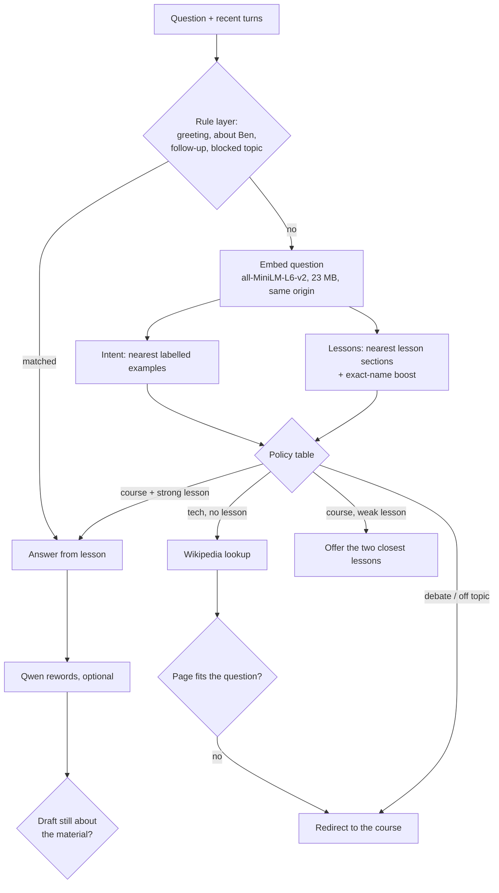

# ADR 0001: Ben decides by meaning, in the browser

- Status: accepted
- Date: 2026-09-24
- Scope: the local tutor (`src/ai/local/`, `QaWidget.tsx`)

## Context

Ben answered "Should we be studying science in Catholic schools?" with the Zero Trust lesson and
labelled it "High confidence". The cause was structural, not a single bug:

1. **Every decision was lexical.** Scope, lesson choice, and "should we search the web" were BM25
   scores and regexes. The question was never read for meaning. Filler words ("because",
   "everything") that happened to appear in a lesson card were enough to pass the scope gate.
2. **The model could not take those decisions over.** Qwen2.5-0.5B is the largest generator a
   phone browser can reasonably download. It is too weak to plan or call tools reliably, so the
   design kept it downstream, rewording text that had already been chosen.
3. **Nothing measured routing.** Each fix answered one screenshot. Tests asserted hand-picked
   strings, so a fix for one phrasing could not show whether it broke ten others.
4. **Qwen never actually ran in production.** The page CSP (`script-src 'self'` plus one hash)
   blocked the runtime import from jsDelivr, so every reply Ben ever gave was the raw keyword
   pipeline text. Found by running the chat in Chromium while building this change.

Constraints that stay fixed:

- **No cloud model.** Nothing the student types goes to a model API. GitHub Pages serves static
  files only.
- **Phones matter.** The reported failure was on a phone, so a multi-GB in-browser LLM is out.
- **Lessons, quizzes, and progress must work with Ben absent or broken.**

## Decision

Split Ben into an **understanding layer** that runs a small embedding model and a **wording
layer** that stays optional. Every routing decision is made by the first layer, before Qwen is
downloaded.

### 1. Embedding model, served by the site itself

- `Xenova/all-MiniLM-L6-v2`, quantized (`onnx/model_quantized.onnx`, 384 dimensions).
- Served from `public/models/all-MiniLM-L6-v2/`, the same origin as the course.
- Every file is pinned by SHA-256 in `scripts/ben/embedder.mjs`. `npm run ben:index` fetches from
  Hugging Face (or a local copy via `BEN_EMBEDDER_DIR`) and refuses a file whose hash differs.
  The files are gitignored and fetched at build time, so no 23 MB binary lives in git.

### 2. The runtime is part of the site

- `@huggingface/transformers` is bundled by Vite into a lazy chunk that loads only when the chat
  opens. The ONNX WASM files are copied from the same installed `onnxruntime-web` into `ort/`.
- Devices with WebGPU get the asyncify build (27 MB, needed for WebGPU). Devices without it,
  most phones among them, get the plain build (14 MB). Only one is downloaded.
- The CSP keeps `script-src 'self'`. It gains `'wasm-unsafe-eval'`, which permits WebAssembly
  compilation and nothing else (not `eval()` of JavaScript). The runtime's blob-URL WASM cache is
  off because the CSP forbids `blob:` scripts; the browser's HTTP cache still applies.
- Model loads are serialized (`src/ai/local/runtime.ts`). Transformers.js reads its local/remote
  settings from one global on every file fetch, and the two models come from different places.
- Qwen's weights still come from the Hugging Face Hub (a `fetch`, allowed by `connect-src`).
  That is data, not code, and only happens when Qwen rewords an answer.

### 3. Lesson index built at build time

`scripts/ben/build-index.mjs` splits every `content/lessons/*.mdx` into sections at `##`/`###`
headings, embeds each section, and embeds the labelled intent examples. It writes
`public/ben/index.json` (int8 vectors with per-row scale, base64). The file is regenerated on
every build, so it cannot drift from the lessons. The browser fetches it when the chat opens.

The index covers the **full lesson text**, not the one-paragraph cards. The cards still drive
the spoken answer shapes (analogy, example, simpler). The sections give Qwen richer material.

### 4. Router: a pure function with a visible policy

`src/ai/local/semantic/router.ts` takes the question vector, the index, and the rule-layer
signals. It returns a `Decision`: intent, action, ranked lessons, and the reasons behind it. It
does no I/O, so it is unit-tested with synthetic vectors and evaluated with real ones.

| Intent (k-NN vote) | Lesson similarity | Action |
|---|---|---|
| greeting / about Ben / follow-up (rules) | any | answer as Ben |
| blocked topic (rules) | any | redirect |
| debate or off topic, confident | below the "named it" bar | redirect |
| course or tech | at or above the lesson bar | answer from the lesson |
| course | below the bar, above the clarify bar | offer the two closest lessons |
| tech | below the bar | Wikipedia lookup, then fit check |
| anything else | low | redirect |

An exact lesson name ("MVC", "RPO", "Raft") adds a fixed boost, but only in short questions
(three content words or fewer). Acronyms embed poorly; in a full sentence, a title word such as
"client" is not a name, and boosting it sent a rate-limiting question to the BFF lesson.

The rule layer runs first but is not absolute: an "about Ben" rule match loses to a confident
debate or off-topic vote ("Is it ever okay to lie to your boss?" is not about Ben's boss). The thresholds live in one exported object and are tuned against the eval set, never
against a single screenshot.

### 5. Tools are checked after they run

- **Web fit:** the Wikipedia extract is embedded and must clear a similarity bar against the
  question, or it is dropped. That stops "Doctor Who" answers to "who hired you".
- **Draft fit:** Qwen's rewrite is embedded and must stay close to the material it was given,
  or the grounded reply stays on screen.

### 6. Graceful degradation

If the embedder cannot load (offline, blocked CDN, old browser), Ben falls back to the keyword
pipeline (`prepareTurn`) with its guard rails. The confidence line says so. The chat never
blocks on a model download.

### 7. Evaluation is part of the build

- `evals/ben/exemplars.json`: the labelled bank the k-NN votes with. It ships, as vectors only.
- `evals/ben/cases.json`: the diagnosis set. Never shipped, never used for voting. Its misses
  drive changes.
- `evals/ben/holdout.json`: written after the router was tuned and before it was ever scored.
  Scored, never tuned against. When it starts driving changes, fold it into `cases.json` and
  write a new holdout.
- A unit test asserts that no scored question is also a voting example.
- `npm run eval:ben` scores the semantic router **and** the legacy keyword router on the same
  cases. It writes `evals/ben/REPORT.md` (committed, so a routing change shows its metric change
  in the diff) and fails CI below the gates:

  | Gate | Threshold |
  |---|---|
  | Drift: off-course questions answered from a lesson or the web | ≤ 3% |
  | Off-course questions answered with "did you mean one of these lessons?" | ≤ 10% |
  | Accuracy | ≥ 85% |
  | Course questions turned away | ≤ 8% |
  | A correct lesson in the top 3 | ≥ 90% |
  | Beats the keyword pipeline, and the screenshot question redirects | always |

### Results at acceptance

| Pipeline | Accuracy | Drift | Course turned away |
|---|---|---|---|
| Keyword pipeline, all 192 cases | 73.4% | 26.1% | 7.1% |
| Semantic router, all 192 cases | 87.5% | 2.9% | 3.0% |
| Keyword pipeline, holdout only | 70.8% | 30.0% | 13.6% |
| Semantic router, holdout only | 89.6% | 5.0% | 0.0% |

The one holdout drift ("Is AI art real art?") routes to a Wikipedia lookup, where the page-fit
check is the second line of defence. See `evals/ben/REPORT.md` for every miss.

## Consequences

**Better**

- Scope and intent come from meaning. Filler words, typos, and phrasing matter much less.
- Routing no longer waits for Qwen, so a phone gets a correct first answer without the 750 MB
  download.
- Every behavior change is measured against the same held-out set.

**Costs**

- The first chat on a device downloads the embedder (23 MB) and the ONNX runtime WASM (14 MB,
  or 27 MB with WebGPU), plus a ~0.47 MB gzipped index. All cached afterwards.
- The deployed site grows by ~65 MB of static files (both WASM builds, a duplicate asyncify WASM
  that Vite emits from onnxruntime's own `new URL(...)` reference, and the model).
- `@huggingface/transformers` becomes a dev dependency (it runs the build-time embedding and the
  eval in Node). It is large (~450 MB in `node_modules`). It never ships to the browser bundle.
- The build now fetches the embedder from Hugging Face (hash-pinned). A Hugging Face outage fails the build
  loudly instead of shipping a Ben without an index.
- k-NN intent is only as good as the example bank. New failure reports should become new
  held-out cases first, then new examples, never a new regex.

**Not solved**

- Ben still does not reason in multiple steps. The understanding layer classifies and retrieves.
  It does not plan. A larger local model can revisit that once phones can run one.

## Alternatives rejected

- **Cloud model (Claude, Workers AI):** best reasoning, but violates the no-cloud constraint.
- **3B-class model via WebLLM:** can plan, but needs WebGPU and 2–4 GB, which fails on phones.
- **More regexes and stopwords:** cheap, but each one fixes a phrasing, not the class of problem.
- **Qwen as a label classifier:** plausible as a tie-breaker later. It needs the 750 MB model
  loaded before routing, which defeats the phone goal.
