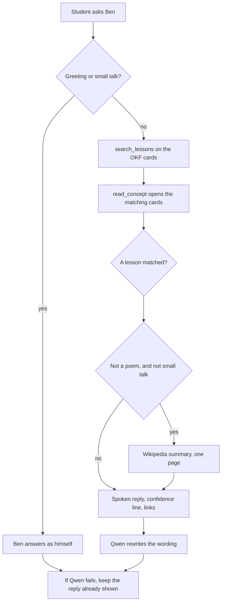

# How Ben is set up

Ben is the chat button on the course site. He runs in the student's browser. GitHub Pages only hosts the static files. Nothing the student types is sent to GitHub, OpenAI, or any other model API.

The first real question downloads [Qwen2.5-0.5B-Instruct](https://huggingface.co/onnx-community/Qwen2.5-0.5B-Instruct) (q4 ONNX, about 750MB, file `onnx/model_q4.onnx`). The browser caches it. Later questions reuse that cache.

## What each piece does

| Piece | Where it runs | Job |
|---|---|---|
| Page (`QaWidget.tsx`) | Browser | Takes the question, shows the reply, confidence line, and source links |
| `prepareTurn` (`agent.ts`) | Browser | Decides if this is small talk, then searches the course cards |
| OKF cards (`cards.ts`) | Already in the page | One short card per lesson, plus a few guides. Not the full lesson markdown |
| `searchWeb` (`web.ts`) | Browser → Wikipedia | Reads one article intro. Does not scrape arbitrary sites |
| Qwen (`slm.ts`) | Browser, WebGPU or WASM | Rewrites a reply that is already grounded. Does not pick tools and does not browse |

The runtime is Transformers.js 4.3.0, loaded from jsDelivr only after the student asks something. The site bundle does not contain the weights. If WebGPU fails, the page tries plain WebAssembly. If Qwen never loads, the reply already on screen stays. A failed download must not wipe a cited answer.

There is no API key. Set `VITE_QA_API_BASE` at build time only if you want the old Cloudflare Worker instead of this loop. Lessons, quizzes, and badges do not use either path.

## What happens to one question



Small talk never reaches Wikipedia. "hello Ben" and "how are you tody" stay with Ben. A poem is declined. Anything else factual is looked up.

`search_lessons` is BM25 over card title, tags, summary, and body. One word is enough when it is a lesson name or tag, such as MVC. The lesson open on the page is used for "explain this".

`web_search` calls Wikipedia's summary API. A few names are forced onto the right page so "java" is not the island and "playwright" is not the disambiguation list: Java, C#, and Playwright (software) among them. The link under the bubble is the citation.

## Confidence

| Line | Meaning |
|---|---|
| High · I'm Ben | Greeting or small talk |
| High · course lesson, checked against a published page | A lesson matched and Wikipedia returned a page |
| High · from the course lesson | A lesson matched and the web lookup did not |
| Medium · not a lesson here. Checked a published page just now | No lesson. The reply is the article intro |
| Low · no source, or the source check failed | Nothing to cite. Ben does not guess |

## Why the model is not the tool caller

Qwen2.5-0.5B is a small instruct model. It is better at a conversation than SmolLM2-135M, which this course tried first, and it still should not decide when to search. The page runs the tools, then hands Qwen the card text or the article extract as data. A draft is dropped if it is too short, copies the source almost word for word, or repeats the old refusal line.

Chat memory is the last few turns in that tab. "New topic" clears it. It is not an account and it is not stored on a server.

## Files

```
src/components/qa/QaWidget.tsx   chat UI
src/ai/local/agent.ts            greeting check, lesson search, spoken reply
src/ai/local/retrieve.ts         tokenize and BM25
src/ai/local/cards.ts            OKF bundle the search reads
src/ai/local/web.ts              Wikipedia lookup, query aliases, confidence
src/ai/local/slm.ts              Qwen load and rewrite
src/ai/local/agent.test.ts
src/ai/local/web.test.ts
```

To swap the model, change `MODEL_ID` in `slm.ts`. It has to be an ONNX instruct repo that Transformers.js can load with `dtype: 'q4'`. A 1.5B model is a much larger first download. Do that only if 0.5B is not enough.
