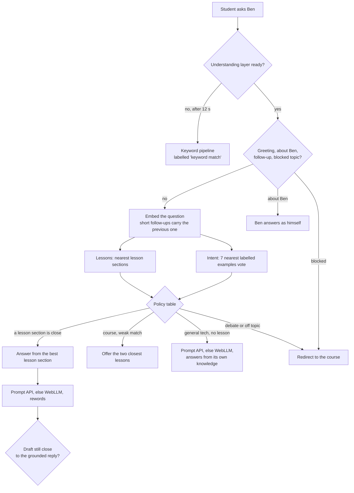

# How Ben is set up

Ben is the chat button on the course site. He runs in the student's browser. GitHub Pages only hosts the static files. Nothing the student types is sent to a model API. The design and its trade-offs are in [ADR 0001](adr/0001-ben-semantic-routing.md). For how this architecture got here — the pivots away from BYOK, a crashing in-browser model, and two competing server-side rewrites — see [ben-history.md](ben-history.md).

Ben has two layers:

- **Understanding** decides what a question is and what to do about it. It uses a small embedding model, [all-MiniLM-L6-v2](https://huggingface.co/Xenova/all-MiniLM-L6-v2) (23 MB, quantized), served by the course site itself. It is ready a few seconds after the chat opens, and every routing decision comes from it.
- **Wording** is optional and 100% on-device, two tiers (`inference.ts`). First choice is the browser's own built-in AI (Chrome's Prompt API, `window.LanguageModel`) — nothing to download from us. If that's unavailable, it falls back to [WebLLM](https://github.com/mlc-ai/web-llm) running a small Qwen2.5-0.5B model on WebGPU, weights cached to IndexedDB after the first download. Neither engine ever decides anything — they only reword a grounded reply. If neither loads, the grounded reply stays.

## What each piece does

| Piece | Where it runs | Job |
|---|---|---|
| Page (`QaWidget.tsx`) | Browser | Takes the question, shows the reply, confidence line, and source links |
| Runtime (`runtime.ts`) | Browser, a lazy chunk of this site | Transformers.js plus the ONNX WASM from `ort/`. Loads one model at a time |
| Embedder + index (`semantic/embedder.ts`) | Browser | Loads `models/all-MiniLM-L6-v2/` and `ben/index.json` from the site |
| Router (`semantic/router.ts`) | Browser | Intent by nearest labelled examples, lessons by nearest sections, then a policy table |
| Turn (`semantic/turn.ts`) | Browser | Turns the decision into Ben's reply, sources, and confidence line |
| Engine (`inference.ts`) | Browser, Prompt API or WebGPU | Rewords a grounded reply, or answers a general tech question from its own trained knowledge when no lesson covers it. Does not pick tools and never fetches anything itself |
| Keyword pipeline (`agent.ts`, `retrieve.ts`) | Browser | Fallback when the embedder cannot load |

Nothing executable comes from a third party: the page CSP is `script-src 'self'` plus `'wasm-unsafe-eval'`, which allows WebAssembly compilation only.

## What happens to one question



The policy table and its thresholds are in `THRESHOLDS` in `src/ai/local/semantic/router.ts`. Change them only with `npm run eval:ben` open.

## Confidence

| Line | Meaning |
|---|---|
| High · I'm Ben | Greeting, small talk, or a question about Ben |
| High · from the lesson *X* | A lesson section is a strong match |
| Medium · closest lesson is *X* | A lesson section matches, less strongly |
| Not sure · closest lessons offered | Ben could not tell which lesson you mean, or whether it is about the course |
| General knowledge overview — not in current lesson plan | General tech no lesson covers. The reply comes from the model's own trained knowledge, not a lesson or a citable source |
| Off topic · outside this course | Debate, opinion, or everyday topics. Ben redirects |
| … · keyword match | The understanding layer was not ready, so the keyword fallback answered |

## Measuring it

```bash
npm run ben:index   # fetch and verify the embedder, copy the ONNX WASM, build the lesson index
npm run eval:ben    # score routing on evals/ben/cases.json and holdout.json
```

`evals/ben/REPORT.md` is the last report. It compares the router with the keyword pipeline on the same questions and lists every miss. CI runs both commands and fails below the gates in `evals/ben/routing.eval.ts`.

When Ben gets something wrong:

1. Add the question to `evals/ben/cases.json` with the right action and lesson.
2. Run `npm run eval:ben` and read why it missed: the intent vote and the lesson scores.
3. Fix the cause. Usually that means more labelled examples of the right kind in `evals/ben/exemplars.json`, worded differently from the case. Sometimes it means a policy change. It never means a regex for that one phrasing.
4. The eval must still pass, including the holdout.

Chat memory is the conversation transcript, persisted to the browser's `localStorage` (`useQaHistory.ts`) so it survives a reload. "New topic" clears it. It is not an account and it is not stored on a server — there is no server.

## Files

```
src/components/qa/QaWidget.tsx        chat UI
src/components/qa/useQaHistory.ts     transcript persisted to localStorage
src/ai/local/inference.ts             Prompt API + WebLLM fallback, load/rewrite
src/ai/local/promptApi.d.ts           ambient types for window.LanguageModel
src/ai/local/runtime.ts               Transformers.js runtime for the embedder (serialized model loads)
src/ai/local/semantic/embedder.ts     embedder + index loading in the browser
src/ai/local/semantic/codec.ts        index decoding, vector math
src/ai/local/semantic/router.ts       intent vote, lesson ranking, policy table
src/ai/local/semantic/turn.ts         decision → reply
src/ai/local/agent.ts                 rule layer and keyword fallback
src/ai/local/web.ts                   confidence labelling (lesson-grounded vs. model's own knowledge)
scripts/ben/embedder.mjs              hash-pinned model fetch, ONNX WASM copy
scripts/ben/chunk-lessons.mjs         lesson MDX → prose sections
scripts/ben/build-index.mjs           sections + examples → public/ben/index.json
evals/ben/                            labelled examples, held-out cases, eval, report
```

To swap the WebLLM fallback model, change the `startsWith('Qwen2.5-0.5B-Instruct')` match in `inference.ts`'s `loadWebLlm` to any model id in `@mlc-ai/web-llm`'s `prebuiltAppConfig.model_list`. To swap the embedder, change the pins in `scripts/ben/embedder.mjs` and the path in `semantic/embedder.ts`, then rerun the eval: every threshold is tuned to this model.
