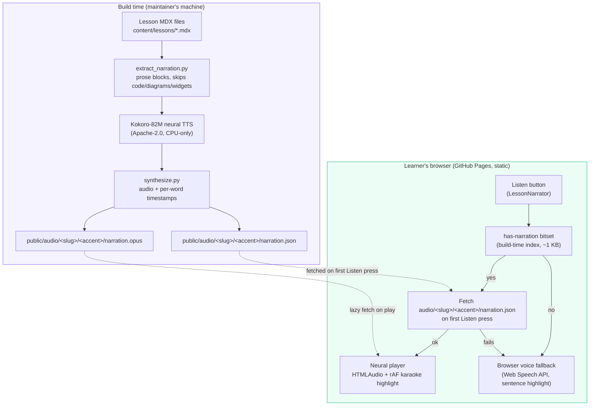

# Listen mode: natural AI narration

Every lesson has a **Listen** button in its header. Press it and the lesson
is read aloud while the word being spoken lights up in the text, so
you can follow along — like karaoke for system design.

## How it works



**Two tiers, zero runtime cost:**

1. **AI narration (primary).** When a lesson has generated audio, you
   hear a natural AI voice and each word highlights as it's spoken. The
   audio and timing files are generated once at build time and served as
   static files — no API keys, no network calls beyond downloading the
   audio itself, no cost per listen. The timing manifest isn't even fetched
   until you press Listen (hovering the button prefetches it); page views
   cost zero narration network calls.
2. **Browser voice (fallback).** If a lesson has no generated audio yet
   (or you choose "Use my browser's voice instead"), your device reads the
   lesson aloud with its built-in voices, highlighting the block — and,
   where supported, the exact sentence — being read.

## Controls

- **Play / pause / resume** — one pill button; nothing ever autoplays.
- **US / UK accent picker** — switches between the two AI voices
  (remembered per device); the next Listen press re-probes the new accent
  and restarts cleanly.
- **Floating pause/play** — a small button fixed to the bottom-right
  corner, always in sync with the main player, so playback stays
  reachable while scrolling.
- **Previous / next paragraph** — buttons in the player and the floating
  control, plus the Left/Right arrow keys while a lesson is playing (they
  are ignored while you type or hold a modifier key). On the compact
  player they live in the popover.
- **Read from here** — hover or focus a paragraph and press the small play
  marker in the margin (tap it on touch screens) to start reading there.
  It never hijacks text selection or links. On a paused player it also
  resumes playback; previous/next move the position but stay paused.
- **Continue where you left off** — the last paragraph you reached is
  remembered per lesson in this browser; the next time you open the
  lesson a "Continue from where you left off" link offers to jump back.
  Finishing the lesson clears it.
- **Progress ring** — a thin ring around the floating play/pause button
  fills as you go (audio time for the AI voice, paragraphs for the
  browser voice); the tooltip shows the percentage.
- **Seek bar** (AI voice, in the player popover) — jump to any point;
  highlighting follows automatically, also while paused.
- **Speed** — 0.9×, 1×, 1.25×, 1.5×. Highlighting stays in sync because
  word timings are measured in audio time.
- **Voice (browser fallback only)** — Auto / US / UK preference for your
  device's voices; the most natural-sounding one is picked first.

### How seeking works

Paragraph skipping rides one shared concept, the **block index** (the order
of `extractLessonBlocks` in `src/lib/listen.ts`), so both engines behave the
same. The pure helpers (clamp, step, resume resolution, manifest-to-block
mapping, key guard) are in `src/lib/listen-seek.ts`; the last position per
lesson is persisted by `src/store/listenPosition.ts` under
`sdm-listen-position` (versioned, sanitized on load).

- **AI voice.** The narration manifest also contains the title and summary
  blocks, which the browser voice never speaks, so manifest blocks are
  mapped onto the shared index through the inverse of `alignBlocks`; blocks
  that did not align to the recording have no time and a seek lands on the
  next aligned block. A seek sets `audio.currentTime` to the block's first
  word and syncs the highlight explicitly, because the animation loop only
  runs while playing.
- **Browser voice.** A seek jumps to the first speech chunk of the target
  block. The in-flight utterance is disposed **before** `speechSynthesis.cancel()`
  so the cancelled utterance's late events and watchdog cannot call `stop()`.
- **Limits.** Seeking is paragraph-level. The manifest has no sentence
  boundaries and speech chunks never start mid-paragraph, so "from here"
  begins at the paragraph start. Real-browser latency of
  `speechSynthesis.cancel()` then `speak()` varies by browser.

## Accessibility

- Highlighting is a visual aid only — the full text is always present and
  the audio is the content itself.
- If you prefer reduced motion, the highlight changes instantly instead of
  fading, and the page doesn't smooth-scroll.
- A screen-reader live region announces play / pause / stop state and
  "Paragraph n of m" after a seek. The floating button's accessible name
  stays constant while the ring fills (the percentage rides in the tooltip),
  so progress updates are not announced.

## For maintainers: regenerating narration

Prerequisites are build-time only (they never ship to learners):

```bash
cd scripts/tts
python3 -m venv .venv && source .venv/bin/activate
# Pinned toolchain; requirements.txt already points pip at the CPU-only
# PyTorch wheel index (see AUDIT.md for the audit record)
pip install -r requirements.txt
```

No system packages are needed: phonemization goes through the bundled
`espeakng-loader`, not a system `espeak-ng` binary. The first run downloads
the Kokoro-82M weights (~330 MB, `hexgrad/Kokoro-82M`) into the git-ignored
`scripts/tts/.cache/hf/` directory.

On machines without network access (or with a broken proxy config), run
synthesis with `HF_HUB_OFFLINE=1` so the build stays hermetic and resolves
the weights from that cache instead of hitting the network:

```bash
HF_HUB_OFFLINE=1 python3 scripts/tts/synthesize.py --only-missing
```

Then:

```bash
# 1. Extract speakable prose from every lesson (skips code, diagrams, quizzes).
#    Wrapped list items are joined into one block; symbols are expanded to
#    their spoken form ("~" -> "about") for natural speech.
python3 scripts/tts/extract_narration.py

# 2. Synthesize audio + word timings (CPU) and write
#    public/audio/<slug>/<accent>/{narration.opus,narration.json} directly.
#    --voice selects the voice and the accent dir (af_heart -> us, bf_emma -> uk).
python3 scripts/tts/synthesize.py --only-missing

# 3. Validate every manifest against the player contract (per accent).
for slug in $(ls public/audio); do
  for accent in us uk; do
    [ -d "public/audio/$slug/$accent" ] || continue
    python3 scripts/tts/validate_manifest.py "$slug" "$accent" || break 2
  done
done

# 4. End-to-end player check in headless Chromium (needs node_modules).
node scripts/tts/verify_player.mjs <lesson-slug> [accent]

# 5. Regenerate the has-narration bitset so the site probes lazily and
#    never probes lessons/accents with no narration at all. Run this
#    after every synthesis batch (UK synthesis is in progress — the UK
#    column of the bitset grows as accents land).
python3 scripts/tts/generate_narration_index.py
#    (or: npm run narration:index)
```

The bitset (`src/lib/narration-index.generated.ts`, a ~1 KB Set of
`"<slug>/<accent>"` keys) is consulted synchronously on lesson mount: the
player fetches the 192 KB manifest only on the first Listen press
(hover/focus prefetches), and lessons without narration never probe the
network at all — no wasted 404s. It is generated, never hand-maintained:
the vitest suite fails if the committed bitset drifts from
`public/audio`.

`synthesize.py` writes each lesson's opus + manifest as it finishes, logs
failures per lesson without aborting the batch, and exits nonzero if any
lesson failed — re-run with `--only-missing` to retry just those. To
re-voice an accent with a different Kokoro voice, pass
`--voice <voice-id>` (see the `VOICES` catalog in `synthesize.py`;
`af_heart` writes to `us/`, `bf_emma` to `uk/`) and re-run
steps 1–2. To smoke-test the pipeline, pass `--slugs <slug> --limit-blocks 3`.

### Read-along alignment

Word highlighting aligns manifest blocks to the rendered article by
normalized text equality (`alignBlocks` in `src/lib/narration.ts`). Two
things keep that alignment honest:

- The extractor's `_speakable_punct` expansions (`~` → "about", `&` →
  "and", …) are mirrored by `speakablePunct` on the DOM side, so
  spoken-form blocks still match their written form.
- Wrapped list items are extracted as a single block, matching the single
  rendered `<li>`.

Blocks that still can't align (or whose words can't be tagged, e.g. after
a spoken expansion) fall back to whole-block highlighting while their
audio plays — the audio never depends on the highlighting.

### Why Kokoro, and why build-time?

- **Natural voice, $0 forever.** Kokoro-82M is an Apache-2.0 open-weight
  model that runs on CPU. Generating once at build time means learners
  never need an API key and the project never pays per character.
- **No backend.** GitHub Pages serves static files only; the player is a
  plain `<audio>` element plus `requestAnimationFrame` — the same stack
  as the rest of the course.
- **Word timestamps for read-along.** Kokoro's duration predictor gives
  per-token timings, which the pipeline maps to per-word timings, so the
  highlight tracks the word being spoken.

### What the fallback still does well

The Web Speech fallback keeps working offline (where the OS ships voices),
costs nothing, and now highlights the sentence being read on browsers that
report speech boundaries. It's also the path for any lesson whose neural
audio hasn't been generated yet — listen mode never breaks.
