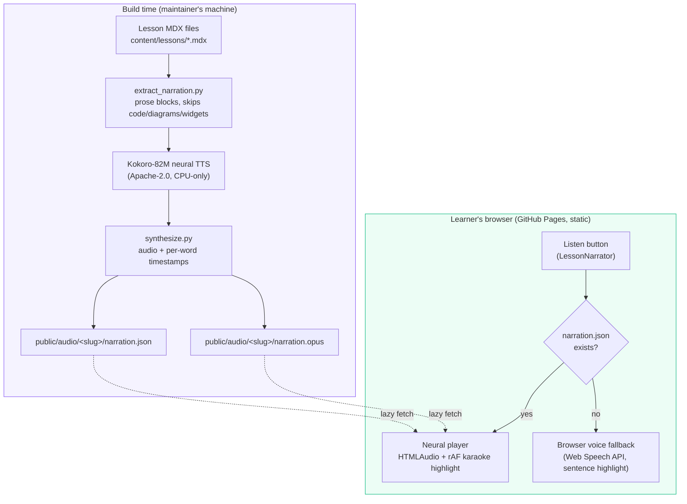

# Listen mode: natural AI narration

Every lesson has a **Listen** button in its header. Press it and the lesson
is read aloud while the exact word being spoken lights up in the text, so
you can follow along — like karaoke for system design.

## How it works



**Two tiers, zero runtime cost:**

1. **Neural narration (primary).** When a lesson has generated audio, you
   hear a natural AI voice and each word highlights as it's spoken. The
   audio and timing files are generated once at build time and served as
   static files — no API keys, no network calls beyond downloading the
   audio itself, no cost per listen.
2. **Browser voice (fallback).** If a lesson has no generated audio yet
   (or you choose "Use my browser's voice instead"), your device reads the
   lesson aloud with its built-in voices, highlighting the block — and,
   where supported, the exact sentence — being read.

## Controls

- **Play / pause / resume** — one pill button; nothing ever autoplays.
- **Seek bar** — jump to any point; highlighting follows automatically.
- **Speed** — 0.9×, 1×, 1.25×, 1.5×. Highlighting stays in sync because
  word timings are measured in audio time.
- **Voice (browser fallback only)** — Auto / US / UK preference for your
  device's voices; the most natural-sounding one is picked first.

## Accessibility

- Highlighting is a visual aid only — the full text is always present and
  the audio is the content itself.
- If you prefer reduced motion, the highlight changes instantly instead of
  fading, and the page doesn't smooth-scroll.
- A screen-reader live region announces play / pause / stop state.

## For maintainers: regenerating narration

Prerequisites are build-time only (they never ship to learners):

```bash
cd scripts/tts
python3 -m venv .venv && source .venv/bin/activate
pip install -r requirements.txt        # kokoro, misaki, soundfile (pinned)
sudo apt-get install espeak-ng        # phonemizer Kokoro was trained with
```

Then:

```bash
# 1. Extract speakable prose from every lesson (skips code, diagrams, quizzes)
python3 scripts/tts/extract_narration.py

# 2. Synthesize audio + word timings (CPU; resumable per lesson)
python3 scripts/tts/synthesize.py --voice af_heart

# 3. Encode + write public/audio/<slug>/{narration.opus,narration.json}
python3 scripts/tts/package.py
```

`synthesize.py` keeps a manifest of finished lessons, so an interrupted
run resumes where it left off. To re-voice the course with a different
Kokoro voice, pass `--voice <id>` (see `VOICES.md` upstream) and re-run
steps 2–3.

### Why Kokoro, and why build-time?

- **Natural voice, $0 forever.** Kokoro-82M is an Apache-2.0 open-weight
  model that runs on CPU. Generating once at build time means learners
  never need an API key and the project never pays per character.
- **No backend.** GitHub Pages serves static files only; the player is a
  plain `<audio>` element plus `requestAnimationFrame` — the same stack
  as the rest of the course.
- **Word timestamps for read-along.** Kokoro's duration predictor gives
  per-token timings, which the pipeline maps to per-word timings, so the
  highlight lands on the exact word being spoken.

### What the fallback still does well

The Web Speech fallback keeps working offline (where the OS ships voices),
costs nothing, and now highlights the sentence being read on browsers that
report speech boundaries. It's also the path for any lesson whose neural
audio hasn't been generated yet — listen mode never breaks.
